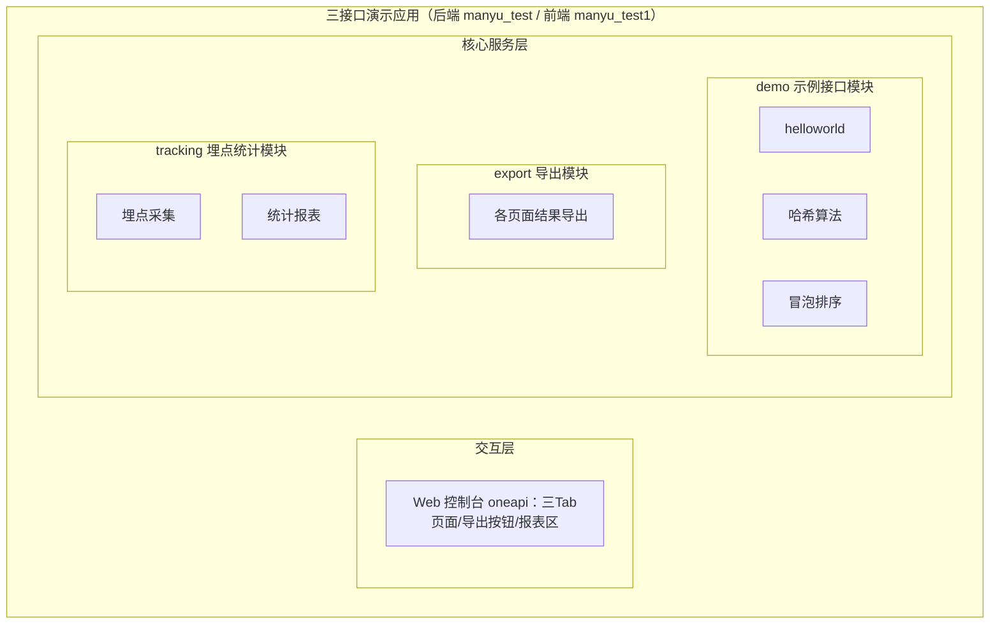
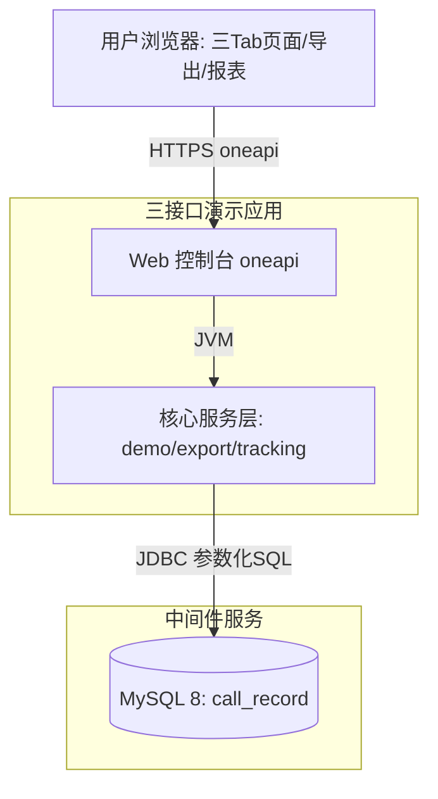
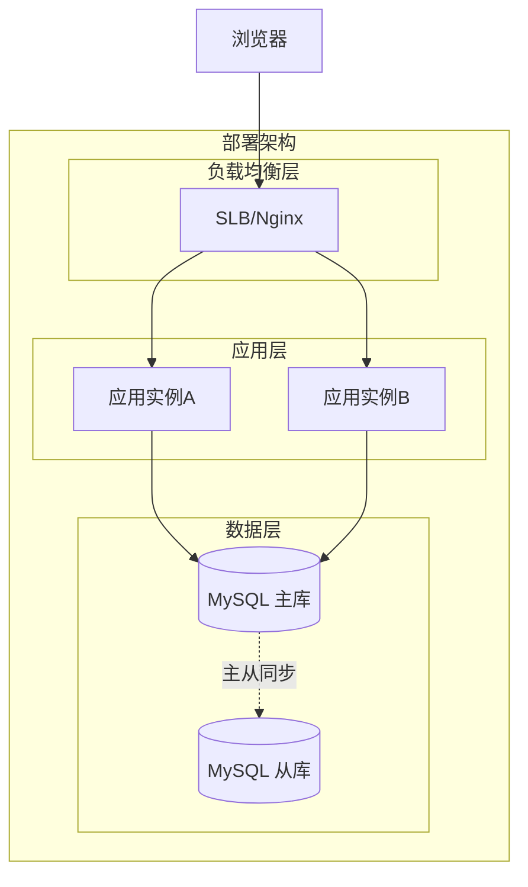
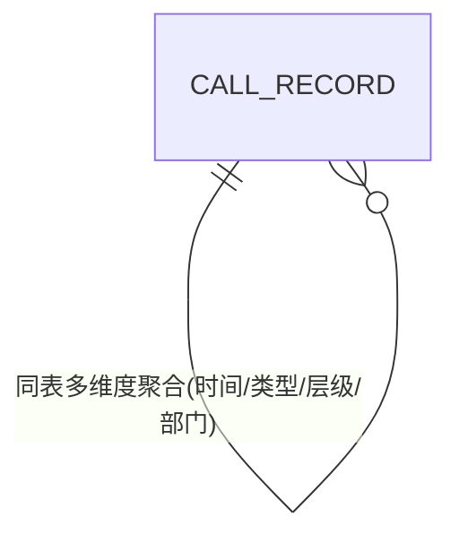
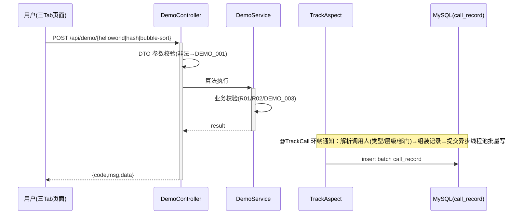
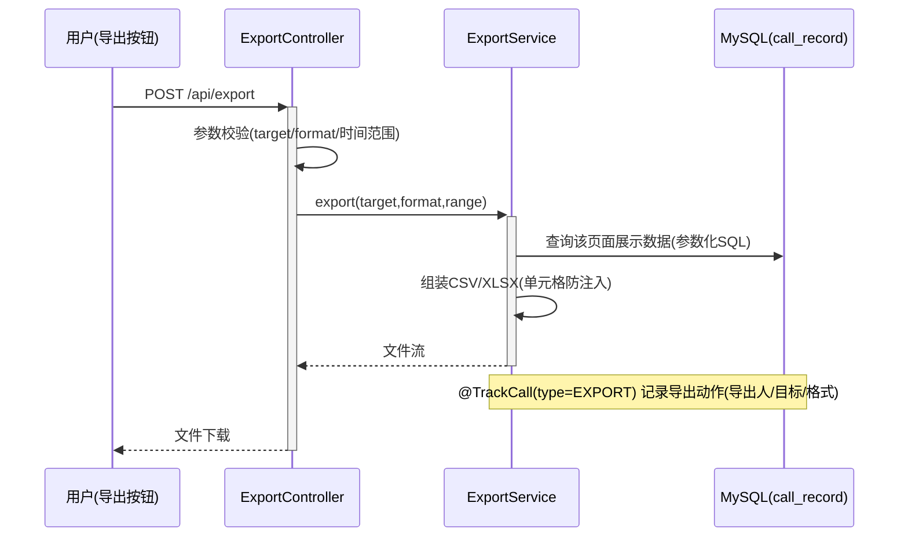
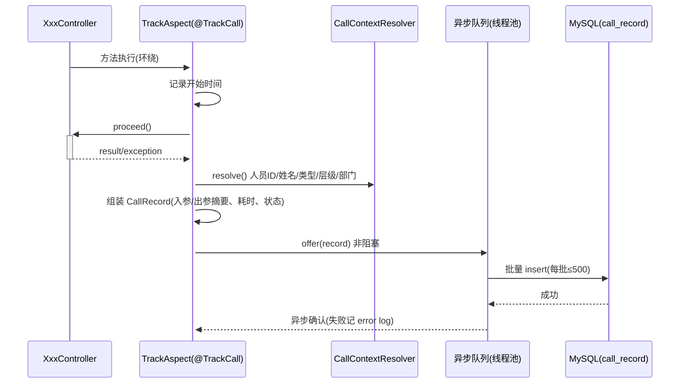
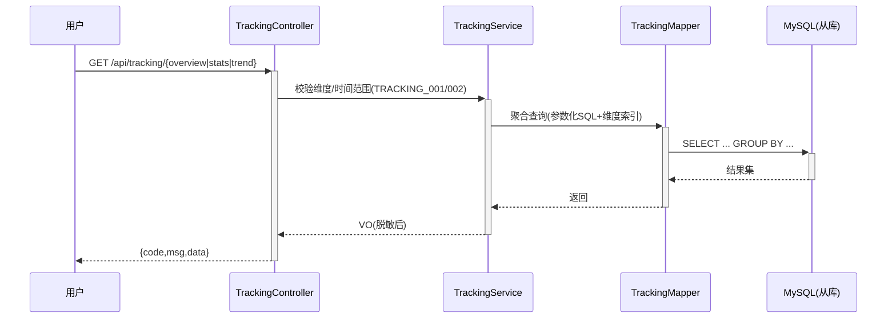
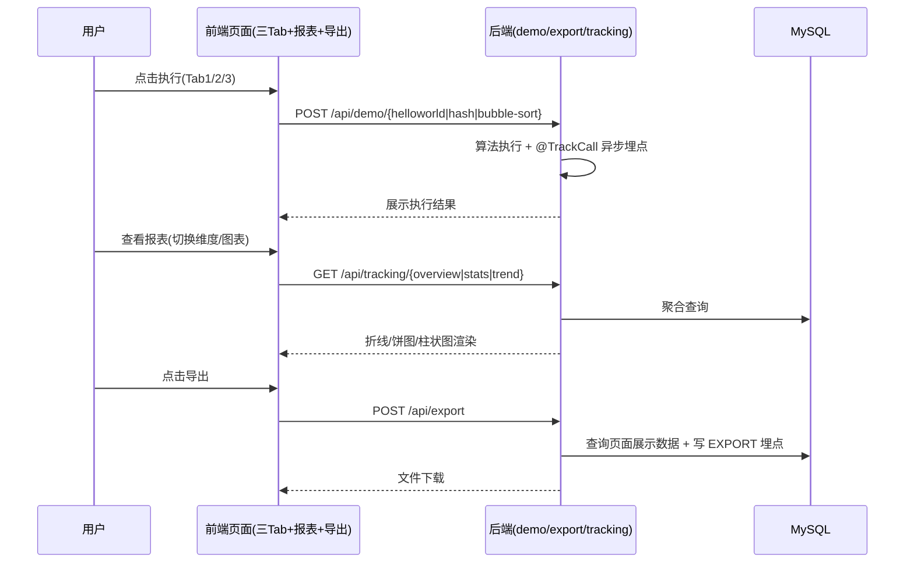

> **文档元信息**
>
> | 项目 | 内容 |
> |------|------|
> | 文档版本 | v1.0 |
> | 作者 | DTCoder |
> | 创建日期 | 2026-08-20 |
> | 需求来源 | 任务需求描述（三接口 + 三 Tab 页面 + 导出 + 埋点统计报表） |
> | 评审状态 | 待评审 |

# 三示例接口（helloworld / 哈希 / 冒泡排序）+ 三 Tab 页面 + 导出 + 埋点统计报表 系分设计

## 1. 需求与范围

### 背景与目标
- **背景**：演示/验证型 Web 应用，需要提供三个示例接口（helloworld、哈希算法、冒泡排序），并在前端以"一页三 Tab"形式展示各接口执行结果；同时提供导出能力与"调用次数/调用人"的埋点统计报表，用于演示与验收。
- **目标**：
  1. 后端提供 helloworld、哈希算法、冒泡排序三个可调用接口；
  2. 前端新增一个页面，三个 Tab 分别展示三类接口的执行结果；
  3. 页面提供导出按钮，后端提供导出接口，支持导出各页面展示结果；
  4. 后端对接口调用做埋点（调用次数、调用人），前端在同一页面可视化报表（人员类型/人员层级/人员部门等维度；折线图、饼图、柱状图三种展示形式）。

### 核心功能
| 编号 | 功能点 | 优先级 | PRD 原始描述/章节 | 备注 |
|------|--------|--------|-------------------|------|
| F01 | helloworld 接口 | P0 | "分别写三个接口helloworld、哈希算法以及冒泡排序" | 返回问候文案与调用信息 |
| F02 | 哈希算法接口 | P0 | "分别写三个接口helloworld、哈希算法以及冒泡排序" | 支持 MD5 / SHA-256 / SM3，默认 SHA-256 |
| F03 | 冒泡排序接口 | P0 | "分别写三个接口helloworld、哈希算法以及冒泡排序" | 逻辑对齐 manyu_test 仓 `bubble_sort.py`（标准/优化/降序） |
| F04 | 前端三 Tab 页面 | P0 | "前端新增一个页面，有三个tab分别展示不同的执行结果" | 每 Tab 展示对应接口的入参/出参/耗时/最近调用记录 |
| F05 | 导出按钮 + 导出接口 | P0 | "新增导出按钮，后台提供导出接口，支持导出各个页面的展示结果" | 按页面（Tab）导出展示结果，CSV 默认、XLSX 可选 |
| F06 | 后端埋点（调用次数、调用人） | P0 | "后端再做个埋点，获取调用次数和调用人" | AOP 注解 + 异步批量写 call_record，含人员类型/层级/部门快照 |
| F07 | 报表可视化 | P1 | "前端在当前页面上可视化出来一个报表查看调用情况（根据不同的维度：人员类型、人员层级、人员部门等），折线图以及饼图和柱状图不同展示形式" | 折线=时间趋势；饼图/柱状图=维度分布 |

### 约束与非功能要求
- 埋点写入不得阻塞、影响主接口成功率（异步降级）。
- 冒泡排序输入需限制规模（O(n²) 复杂度），默认上限 10,000 个元素。
- 前端需在同一页面展示三 Tab 与报表区；图表形式必须覆盖折线图、饼图、柱状图。
- 接口需统一错误码与统一出参结构；参数化 SQL 防注入；导出文件防 CSV 公式注入。

### 排除范围
- 不新建独立用户/账号体系（人员信息来自登录上下文，见假设 A03）。
- 不建设权限管理后台、报表钻取、大屏。
- 不实现实时推送（报表按需/手动刷新）。
- 不提供 OpenAPI 对外接口（无外部业务系统调用方）。

### 需求功能清单与优先级
见上文"核心功能"表（F01–F07）。

### 假设与待确认项
| 编号 | 假设/待确认内容 | 当前假设 | 确认状态 |
|------|-----------------|----------|----------|
| A01 | 技术栈 | 后端 Spring Boot 3.x（Java 17）单体 + MySQL 8；前端 Vue 3 + Element Plus + ECharts | 待确认 |
| A02 | 仓库分工 | manyu_test = 后端服务（接口/算法/埋点/导出/统计）；manyu_test1 = 前端应用（三 Tab 页面/导出/报表） | 待确认 |
| A03 | 人员维度获取 | 从登录请求上下文（统一 userInfo / 请求头）解析 人员ID/姓名/类型/层级/部门，冗余快照进 call_record；演示环境可用测试请求头模拟 | 待确认 |
| A04 | 哈希算法范围 | 支持 MD5 / SHA-256 / SM3，默认 SHA-256 | 待确认 |
| A05 | 导出形态 | 导出各 Tab 页面展示结果（该页面演示结果 + 该页面调用记录），CSV 默认、XLSX 可选 | 待确认 |
| A06 | 埋点写入 | AOP + 异步线程池批量写入，失败静默降级 | 待确认 |
| A07 | 报表统计口径 | 实时聚合 call_record；单表数据量 > 500w 或统计查询 > 1s 后演进为预聚合/归档 | 待确认 |
| A08 | 知识检索 | board-knowledge-search 技能在当前环境不可用，跳过；基于需求文本 + 两仓现状完成设计 | 已确认（环境事实） |

## 2. 架构与模块

### 功能架构


- **交互层说明**：Vue3 单页应用，一页三 Tab（演示执行 / 导出 / 报表区），仅消费 oneapi（/api 前缀）接口。
- **核心服务层说明**：
  - demo 模块：三个示例接口，执行算法并触发埋点（F01–F03）。
  - export 模块：按页面导出展示结果（F05）。
  - tracking 模块：调用记录采集（F06）与多维度统计查询（F07）。
- **扩展/集成层说明**：不引入外部业务系统集成；人员信息依赖统一登录上下文（A03）。

**模块清单**

| 模块 | 职责 | 依赖 |
|------|------|------|
| demo（示例接口模块） | helloworld、哈希、冒泡排序三个接口：入参校验、算法执行、结果组装、触发埋点 | tracking（埋点注解）、登录上下文解析 |
| export（导出模块） | 按页面导出展示结果（CSV/XLSX），导出动作计入埋点 | tracking（call_record 查询）、demo（结果数据） |
| tracking（埋点统计模块） | call_record 写入（AOP + 异步批量）、多维度统计/趋势查询、导出数据源 | MySQL |

依赖方向：demo → tracking；export → tracking/demo；无循环依赖。

### 应用集成架构


**集成关系说明：**

| 调用方 | 被调用方 | 协议 | 接口类型 | 说明 |
|--------|----------|------|----------|------|
| 用户浏览器 | 应用 Web 控制台 | HTTPS | oneapi REST | 三 Tab 执行、导出、报表全部走 /api |
| 应用核心服务层 | MySQL | JDBC | SQL（参数化） | call_record 埋点表读写 |
| 应用（埋点） | 登录上下文（统一 userInfo/请求头） | JVM | 内部解析 | 获取人员类型/层级/部门快照（A03） |

### 部署架构


**部署说明：**
- **负载均衡层**：SLB/Nginx，HTTPS 终结，按会话转发。
- **应用层**：无状态应用 ≥ 2 副本，滚动发布；埋点线程池为 JVM 内异步（失败静默）。
- **数据层**：MySQL 主从（从库承接报表只读查询），InnoDB、RC 隔离级别（db.md 规范）。
- 部署形态假设：公有云默认同城双机房、无单点；私有化默认容器化部署。

### 仓库规划（对齐点 R01）
| 仓库 | 角色 | 承载内容 |
|------|------|----------|
| manyu_test（base: cred-test-20260716022903） | 后端服务 | demo/export/tracking 模块、call_record 表、冒泡排序算法（对齐现有 `bubble_sort.py`） |
| manyu_test1（base: main） | 前端应用 | 三 Tab 页面、导出按钮、ECharts 报表（折线/饼图/柱状图） |

> 仓间对齐点：W01–W07 接口路径与出入参契约为前后端共同基线（见第 4、5 章）；`call_record` 字段为统计报表数据契约。

## 3. 数据模型与存储

### 实体清单

| 实体名称 | 实体说明 | 所属模块 | 与其他实体的关系 |
|----------|----------|----------|-----------------|
| call_record | 接口调用埋点记录：一次受埋点调用（helloworld/哈希/冒泡排序/导出）一行，含调用人维度快照（人员类型/层级/部门）与执行结果 | tracking | 独立实体，无 FK 关联（人员信息为冗余快照） |

> demo 与 export 模块为无状态逻辑，不新增表；报表为对 call_record 的实时聚合查询。

### 实体关系图

> 单实体模型：call_record 仅用于同表多维度聚合查询，无物理外键。

**模型说明：**
- 人员维度（caller_type / caller_level / caller_dept_code）在调用发生时从登录上下文解析并冗余快照入库，保证后续按"人员类型、人员层级、人员部门"任意维度切片统计结果一致（A03/A07）。
- 租户隔离：默认单租户演示场景；如需多租户，表增加 tenant_id（当前不启用）。
- 命名遵循 db.md 规范：全小写下划线；表名+字段名总长 < 26；整数单列主键；含 gmt_create/gmt_modified（datetime）；耗时用 bigint（毫秒）；不使用外键/存储过程/视图。
- 日志类数据不落 MySQL 的建议：call_record 属业务埋点数据、量级小，暂存 MySQL；超阈值后归档到日志/分析存储（见 A07）。

### 缓存/MQ
- 不引入缓存与 MQ：埋点量级小，采用 JVM 异步线程池直写 MySQL；报表实时查询（演进方案见 5.3 章节）。

## 4. 接口设计

### 4.1 oneapi（Web 控制台接口，/api 前缀）

| 编号 | 接口名称 | 方法 | 路径 | 模块 |
|------|----------|------|------|------|
| W01 | helloworld 执行 | POST | /api/demo/helloworld | demo |
| W02 | 哈希算法执行 | POST | /api/demo/hash | demo |
| W03 | 冒泡排序执行 | POST | /api/demo/bubble-sort | demo |
| W04 | 页面结果导出 | POST | /api/export | export |
| W05 | 调用概况查询 | GET | /api/tracking/overview | tracking |
| W06 | 维度统计查询 | GET | /api/tracking/stats | tracking |
| W07 | 时间趋势查询 | GET | /api/tracking/trend | tracking |

### 4.2 OpenAPI（对外接口）
- 本设计不提供 OpenAPI 对外接口，原因：全部能力面向 Web 控制台演示场景，无外部业务系统调用方。

### 4.3 内部接口（Service 层）

| 编号 | 接口名称 | 类 | 方法签名 |
|------|----------|------|----------|
| S01 | helloworld 服务 | DemoService | String hello(DemoContext ctx) |
| S02 | 哈希服务 | DemoService | HashResult hash(String text, HashAlgorithm algorithm, DemoContext ctx) |
| S03 | 冒泡排序服务 | DemoService | SortResult bubbleSort(List&lt;BigDecimal&gt; input, SortOrder order, boolean optimized, DemoContext ctx) |
| S04 | 页面导出服务 | ExportService | ExportFile export(ExportTarget target, ExportFormat format, DateRange range, DemoContext ctx) |
| S05 | 埋点记录服务 | TrackingService | void record(CallRecord record)（异步批量入库） |
| S06 | 概况/维度/趋势统计 | TrackingService | OverviewVO overview(...); StatsVO stats(StatsDimension dim, DateRange range); TrendVO trend(TrendGranularity g, DateRange range) |
| S07 | 调用人上下文解析 | CallContextResolver | CallerInfo resolve()（从登录上下文/请求头解析人员ID/姓名/类型/层级/部门） |

### 4.4 集成接口（Integration 层）

| 编号 | 接口名称 | 类 | 方法签名 | 说明 |
|------|----------|------|----------|------|
| I01 | 登录/人员信息解析 | UserInfoClient | CallerInfo getUserInfo(String token) | 集成统一登录体系（办公网 BUC 等，A03）；演示环境可用请求头模拟解析，属可选集成点 |

## 5. 功能模块设计

### 全局约定
- **错误码格式**：`{MODULE}_{SEQ}`，模块码：DEMO / EXPORT / TRACKING / COMMON。
- **通用出参结构**：`{ code, msg, data }`；业务失败返回非 OK 错误码 + msg；系统异常由全局异常处理器统一转 COMMON_500。
- **人员上下文**：统一从登录上下文解析 CallerInfo（人员ID/姓名/类型/层级/部门），注入各 Service 的 DemoContext / CallRecord（A03）。
- **埋点接入**：受监控方法标注 @TrackCall(type=...)，AOP 环绕通知异步记录调用次数与调用人（F06）。
- **时间约定**：接口时间出入参用 ISO-8601（UTC）；库内 datetime。

### 5.1 demo 模块（F01 / F02 / F03）

本模块无状态、不新增表。错误码：DEMO_001 参数非法；DEMO_002 不支持的哈希算法；DEMO_003 排序数组超上限。

**枚举与常量定义**

| 枚举名称 | 取值 | 含义 | 关联字段 |
|----------|------|------|----------|
| HashAlgorithm | MD5 / SHA256 / SM3 | 哈希算法类型 | W02 入参 algorithm |
| SortOrder | ASC / DESC | 排序方向 | W03 入参 order |
| DemoBizType | HELLO_WORLD / HASH / BUBBLE_SORT | 演示业务标识 | call_record.biz_type |

#### 接口详细设计

##### W01 helloworld 执行

- **URI**: POST /api/demo/helloworld
- **描述**: 返回问候文案与调用信息（F01）
- **入参**:

| 参数名称 | 类型 | 是否必填 | 描述 |
|----------|------|----------|------|
| name | string | 否 | 问候对象，默认 "World"，长度 ≤ 64 |

- **出参**:

| 参数名称 | 类型 | 描述 |
|----------|------|------|
| code | String | 结果 code |
| msg | String | 提示信息 |
| data.message | String | 问候文案，如 "Hello, World!" |
| data.serverTime | String | 服务端时间（ISO-8601） |
| data.requestId | String | 请求链路 ID |

- **错误码**:

| 错误码 | 说明 |
|--------|------|
| DEMO_001 | name 长度 > 64 或含非法字符 |
| COMMON_401 | 未登录 |
| COMMON_500 | 系统异常 |

- **业务规则**: R01 name ≤ 64 字符；R02 非法入参返回 DEMO_001。
- **请求示例**:
```json
{ "name": "Alice" }
```
- **响应示例**:
```json
{
  "code": "OK",
  "msg": "SUCCESS",
  "data": { "message": "Hello, Alice!", "serverTime": "2026-08-20T03:00:00Z", "requestId": "req-20260820-0001" }
}
```

##### W02 哈希算法执行

- **URI**: POST /api/demo/hash
- **描述**: 对文本执行 MD5 / SHA-256 / SM3 哈希（F02）
- **入参**:

| 参数名称 | 类型 | 是否必填 | 描述 |
|----------|------|----------|------|
| text | string | 是 | 待哈希文本，UTF-8 字节 ≤ 4096 |
| algorithm | string(枚举) | 否 | MD5 / SHA256 / SM3，默认 SHA256 |

- **出参**:

| 参数名称 | 类型 | 描述 |
|----------|------|------|
| code | String | 结果 code |
| msg | String | 提示信息 |
| data.algorithm | String | 实际使用的算法 |
| data.hash | String | 哈希值（十六进制） |
| data.inputLength | int | 输入文本 UTF-8 字节数 |
| data.costTimeMs | long | 处理耗时（毫秒） |

- **错误码**:

| 错误码 | 说明 |
|--------|------|
| DEMO_001 | text 为空或超 4096 字节 |
| DEMO_002 | 不支持的 algorithm 枚举值 |
| COMMON_401 | 未登录 |
| COMMON_500 | 系统异常 |

- **业务规则**: R01 text 非空且 UTF-8 字节 ≤ 4096，否则 DEMO_001；R02 algorithm 不在枚举内返回 DEMO_002；R03 明文原文不落库，仅记录字节长度（见 5.3 埋点）。
- **请求示例**:
```json
{ "text": "hello world", "algorithm": "SHA256" }
```
- **响应示例**:
```json
{
  "code": "OK",
  "msg": "SUCCESS",
  "data": { "algorithm": "SHA256", "hash": "b94d27b9934d3e08a52e52d7da7dabfac484efe37a5380ee9088f7ace2efcde9", "inputLength": 11, "costTimeMs": 1 }
}
```

##### W03 冒泡排序执行

- **URI**: POST /api/demo/bubble-sort
- **描述**: 对数值数组执行冒泡排序（F03），逻辑对齐 manyu_test 仓 `bubble_sort.py`（标准版/优化版/降序）
- **入参**:

| 参数名称 | 类型 | 是否必填 | 描述 |
|----------|------|----------|------|
| data | number[] | 是 | 待排序数组，元素为有限 decimal，数量 1..10000 |
| order | string(枚举) | 否 | ASC / DESC，默认 ASC |
| optimized | boolean | 否 | 是否启用优化版（提前终止），默认 true |

- **出参**:

| 参数名称 | 类型 | 描述 |
|----------|------|------|
| code | String | 结果 code |
| msg | String | 提示信息 |
| data.originalSize | int | 入参数组大小 |
| data.sorted | number[] | 排序结果（最多返回前 100 元素，完整结果由导出获取） |
| data.swaps | long | 交换次数 |
| data.costTimeMs | long | 处理耗时（毫秒） |
| data.algorithmVersion | String | 算法版本（如 v1.0-optimized） |

- **错误码**:

| 错误码 | 说明 |
|--------|------|
| DEMO_001 | 数组含非有限数（NaN/Infinity）或元素非法 |
| DEMO_003 | 数组数量超上限 10000 |
| COMMON_401 | 未登录 |
| COMMON_500 | 系统异常 |

- **业务规则**: R01 size 1..10000，否则 DEMO_003（O(n²) 控时）；R02 元素必须为有限 decimal，否则 DEMO_001。
- **请求示例**:
```json
{ "data": [5, 3, 8, 4, 2], "order": "ASC", "optimized": true }
```
- **响应示例**:
```json
{
  "code": "OK",
  "msg": "SUCCESS",
  "data": { "originalSize": 5, "sorted": [2, 3, 4, 5, 8], "swaps": 6, "costTimeMs": 2, "algorithmVersion": "v1.0-optimized" }
}
```

#### 子功能详细设计

##### 5.1.3.1 接口执行 + 埋点拦截（F01/F02/F03）

- 处理时序图


**业务规则：**

| 规则编号 | 规则描述 | 校验时机 | 不满足时的处理 |
|----------|----------|----------|--------------|
| R01 | name ≤ 64 / text ≤ 4096 字节 / 数组 1..10000 | 执行前 | DEMO_001 / DEMO_001 / DEMO_003 |
| R02 | algorithm / order 在枚举内 | 执行前 | DEMO_002 / DEMO_001 |
| R03 | 埋点只落摘要不落原文 | 埋点时 | 落库字段截断/泛化（见 5.3） |

**异常场景：**

| 异常场景 | 处理方式 |
|----------|----------|
| 参数缺失/超限 | 返回对应错误码，不计为 SUCCESS 埋点（记 FAIL + error_code） |
| 哈希算法不可用（JDK 缺 SM3 提供方） | 返回 DEMO_002，日志告警 |
| 埋点线程池写失败 | 静默降级：error log + 计数指标，主流程不受影响 |

**并发控制（如涉及数据写入）：**
- 并发场景：算法执行无共享写状态（纯函数处理局部入参），无并发冲突。
- 控制策略：无并发风险，原因：每个请求独立入参、无共享可变数据；埋点写由单例线程池串行消费。

**状态机设计（如实体存在状态字段）：**
- 本模块无状态字段，状态机不适用。

**技术选型对比：**

*哈希算法*
| 方案 | 优点 | 缺点 |
|------|------|------|
| MD5 | 快、实现简单 | 非安全用途，碰撞风险 |
| SHA-256（推荐默认） | 标准安全散列，JDK 原生 | 略慢于 MD5 |
| SM3 | 国密合规场景 | 依赖额外提供方（BouncyCastle） |

推荐：默认 SHA-256，入参可切换三种；理由：覆盖通用与国密演示需求，一张接口三种能力，无额外成本。

*冒泡排序实现方式*
| 方案 | 优点 | 缺点 |
|------|------|------|
| Java 进程内重写（推荐） | 同进程低延迟、易维护、可测试，逻辑对齐 bubble_sort.py | 与 Python 参考实现需人工对齐 |
| 进程内调用 Python 脚本 | 直接复用 bubble_sort.py | 跨语言进程调用复杂、性能差、不稳定 |
| 独立算法微服务 | 语言无关、可独立演进 | 演示场景过度设计，引入分布式成本 |

推荐：Java 进程内重写；理由：性能与可维护性最优，`bubble_sort.py` 仅作为算法规格参考（标准/优化/降序三变体）。

### 5.2 export 模块（F05）

本模块不新增表：导出数据来自 demo 结果与 call_record；导出动作本身通过 @TrackCall(type=EXPORT) 计入埋点。错误码：EXPORT_001 不支持的导出目标/格式；EXPORT_002 导出数据为空。

**枚举与常量定义**

| 枚举名称 | 取值 | 含义 | 关联字段 |
|----------|------|------|----------|
| ExportTarget | HELLO_WORLD / HASH / BUBBLE_SORT / REPORT | 导出目标（对应各 Tab 页面） | W04 入参 target |
| ExportFormat | CSV / XLSX | 导出格式 | W04 入参 format |
| ExportBizType | EXPORT | 导出动作埋点标识 | call_record.biz_type |

#### 接口详细设计

##### W04 页面结果导出

- **URI**: POST /api/export
- **描述**: 按页面（Tab）导出展示结果；导出动作本身落埋点（F05）
- **入参**:

| 参数名称 | 类型 | 是否必填 | 描述 |
|----------|------|----------|------|
| target | string(枚举) | 是 | HELLO_WORLD / HASH / BUBBLE_SORT / REPORT |
| format | string(枚举) | 否 | CSV / XLSX，默认 CSV |
| startTime | string(datetime) | 否 | 记录时间范围起点 |
| endTime | string(datetime) | 否 | 记录时间范围终点（跨度 ≤ 90 天） |

- **出参**（文件流，Content-Disposition: attachment）：

| 参数名称 | 类型 | 描述 |
|----------|------|------|
| code | String | 结果 code（流式场景以 HTTP 状态表达） |
| fileName | String | 文件名，如 hello_world_page_20260820.csv |
| contentType | String | 如 text/csv;charset=utf-8 或 application/vnd.openxmlformats-officedocument.spreadsheetml.sheet |
| msg | String | 提示信息 |

- **错误码**:

| 错误码 | 说明 |
|--------|------|
| EXPORT_001 | target/format 非法 |
| EXPORT_002 | 该页面导出数据为空 |
| TRACKING_003 | 时间范围非法（跨度 > 90 天） |
| COMMON_401 | 未登录 |
| COMMON_500 | 系统异常 |

- **业务规则**: R01 target 三类页面时导出该 Tab 展示内容 = 该类型最近 N 条调用记录（含调用人维度、入参摘要、出参摘要、耗时、状态）；target=REPORT 时导出统计报表（维度分布 + 趋势）；R02 时间范围跨度 ≤ 90 天；R03 导出行为写一条 biz_type=EXPORT 的 call_record（含导出人、目标、格式）；R04 CSV 以 = + - @ 开头的单元格前置单引号防公式注入；R05 数据为空返回 EXPORT_002。
- **请求示例**:
```json
{ "target": "BUBBLE_SORT", "format": "CSV", "startTime": "2026-08-01T00:00:00Z", "endTime": "2026-08-20T00:00:00Z" }
```
- **响应示例**（HTTP 200 + 文件流，表单不可 JSON 展示，示意头部）:
```
Content-Disposition: attachment; filename="bubble_sort_page_20260820.csv"
Content-Type: text/csv;charset=utf-8
```

#### 子功能详细设计

##### 5.2.3.1 页面结果导出（F05）

- 处理时序图


**业务规则：**

| 规则编号 | 规则描述 | 校验时机 | 不满足时的处理 |
|----------|----------|----------|--------------|
| R01 | target ∈ 枚举 | 执行前 | EXPORT_001 |
| R02 | 时间跨度 ≤ 90 天 | 执行前 | TRACKING_003 |
| R03 | 文件名白名单（target+日期+扩展名） | 生成时 | 统一生成，防路径穿越 |
| R04 | CSV 公式注入防护 | 生成时 | 前置单引号转义 |
| R05 | 导出查询无数据 | 生成前 | EXPORT_002 |

**异常场景：**

| 异常场景 | 处理方式 |
|----------|----------|
| target/format 非法 | EXPORT_001 |
| 时间范围非法 | TRACKING_003 |
| 无数据 | EXPORT_002 |
| 下载中断/流写失败 | 记 FAIL 埋点 + 日志告警，不影响其他功能 |

**并发控制（如涉及数据写入）：**
- 并发场景：多人同时导出大报表，DB 与内存压力。
- 控制策略：导出并发限流（Semaphore ≤ 5），超限提示稍后重试；导出为只读查询，无写冲突；导出文件名含日期+随机串防重名。

**状态机设计（如实体存在状态字段）：**
- 本模块无状态字段，状态机不适用。

**技术选型对比（导出格式）：**
| 方案 | 优点 | 缺点 |
|------|------|------|
| CSV（推荐默认） | 轻量、零依赖、Excel/WPS 直接打开 | 无多 Sheet/样式 |
| XLSX（POI） | 多 Sheet、样式丰富 | 依赖重、实现成本高 |

推荐：CSV 默认 + XLSX 可选；理由：演示场景导出数据量小，CSV 满足验收，XLSX 作为增强项。

### 5.3 tracking 模块（F06 / F07）

#### 5.3.1 表结构设计

##### 5.3.1.1 call_record（调用记录表）

| 字段名 | 数据类型 | 约束 | 默认值 | 说明 |
|--------|----------|------|--------|------|
| id | bigint | PK, 自增 | - | 系统自增主键 |
| biz_type | varchar(32) | NOT NULL | - | 业务类型：HELLO_WORLD/HASH/BUBBLE_SORT/EXPORT |
| caller_id | varchar(64) | NOT NULL | - | 调用人 ID |
| caller_name | varchar(64) | NOT NULL | - | 调用人姓名 |
| caller_type | varchar(32) | NOT NULL | - | 人员类型：EMPLOYEE/OUTSOURCER/VISITOR/SYSTEM |
| caller_level | varchar(32) | NOT NULL | - | 人员层级：P1..P9/M 序列 |
| caller_dept_code | varchar(64) | NOT NULL | - | 人员部门编码 |
| caller_dept_name | varchar(128) | NOT NULL | - | 人员部门名称 |
| req_summary | varchar(512) | NULL | - | 入参摘要（如哈希算法+字节数、排序规模+方向），不含敏感原文 |
| resp_summary | varchar(1024) | NULL | - | 出参摘要（如哈希前 16 位、排序结果前 10 元素） |
| cost_time_ms | bigint | NOT NULL | 0 | 处理耗时（毫秒） |
| result_status | varchar(16) | NOT NULL | SUCCESS | 结果状态：SUCCESS/FAIL |
| error_code | varchar(32) | NULL | - | 失败错误码 |
| gmt_create | datetime | NOT NULL | CURRENT_TIMESTAMP | 创建时间（调用时间） |
| gmt_modified | datetime | NOT NULL | CURRENT_TIMESTAMP | 修改时间 |

**索引：**
- IDX: `idx_call_record_biz_time` (biz_type, gmt_create) — Tab 页最近记录与页面导出查询
- IDX: `idx_call_record_type_time` (caller_type, gmt_create) — 人员类型维度统计
- IDX: `idx_call_record_level_time` (caller_level, gmt_create) — 人员层级维度统计
- IDX: `idx_call_record_dept_time` (caller_dept_code, gmt_create) — 人员部门维度统计
- IDX: `idx_call_record_status` (result_status) — 成功率统计

> 遵循 db.md：被索引列 NOT NULL + 默认值；联合索引按"筛选性更优列在前"；表/字段全小写下划线；主键整数单列自增。

##### 5.3.1.x 枚举与常量定义

| 枚举名称 | 取值 | 含义 | 关联字段 |
|----------|------|------|----------|
| BizType | HELLO_WORLD / HASH / BUBBLE_SORT / EXPORT | 埋点业务类型 | call_record.biz_type |
| CallerType | EMPLOYEE / OUTSOURCER / VISITOR / SYSTEM | 人员类型 | call_record.caller_type |
| ResultStatus | SUCCESS / FAIL | 调用结果 | call_record.result_status |
| StatsDimension | CALLER_TYPE / CALLER_LEVEL / CALLER_DEPT / BIZ_TYPE | 统计维度 | W06 入参 dimension |
| TrendGranularity | HOUR / DAY / MONTH | 趋势粒度 | W07 入参 granularity |

#### 5.3.2 接口详细设计

##### W05 调用概况查询

- **URI**: GET /api/tracking/overview
- **描述**: 报表顶部概况卡片（F07）
- **入参**:

| 参数名称 | 类型 | 是否必填 | 描述 |
|----------|------|----------|------|
| startTime | string(datetime) | 否 | 起始时间，默认近 30 天 |
| endTime | string(datetime) | 否 | 截止时间，默认当前 |

- **出参**:

| 参数名称 | 类型 | 描述 |
|----------|------|------|
| code | String | 结果 code |
| msg | String | 提示信息 |
| data.totalCalls | long | 总调用次数 |
| data.totalCallers | long | 调用人数 |
| data.successRate | decimal | 成功率（0-100，两位小数） |
| data.avgCostTimeMs | long | 平均耗时（毫秒） |
| data.period | Object | {startTime, endTime} |
| data.topCaller | Object | {name, calls} 调用最多的人（姓名脱敏） |

- **错误码**: TRACKING_001 时间范围非法；COMMON_401；COMMON_500。
- **请求示例**: `GET /api/tracking/overview?startTime=2026-07-21T00:00:00Z&endTime=2026-08-20T00:00:00Z`
- **响应示例**:
```json
{
  "code": "OK",
  "msg": "SUCCESS",
  "data": { "totalCalls": 1520, "totalCallers": 38, "successRate": 99.2, "avgCostTimeMs": 35, "period": { "startTime": "2026-07-21T00:00:00Z", "endTime": "2026-08-20T00:00:00Z" }, "topCaller": { "name": "张*", "calls": 210 } }
}
```

##### W06 维度统计查询

- **URI**: GET /api/tracking/stats
- **描述**: 按人员类型/层级/部门/业务类型聚合，供饼图与柱状图（F07）
- **入参**:

| 参数名称 | 类型 | 是否必填 | 描述 |
|----------|------|----------|------|
| dimension | string(枚举) | 是 | CALLER_TYPE / CALLER_LEVEL / CALLER_DEPT / BIZ_TYPE |
| startTime | string(datetime) | 否 | 默认近 30 天 |
| endTime | string(datetime) | 否 | 默认当前 |

- **出参**:

| 参数名称 | 类型 | 描述 |
|----------|------|------|
| code | String | 结果 code |
| msg | String | 提示信息 |
| data.dimension | String | 统计维度 |
| data.items | Object[] | [{name, value, percent}]，如 [{name:"EMPLOYEE", value:1200, percent:78.9}] |

- **错误码**: TRACKING_001 时间范围非法；TRACKING_002 不支持的 dimension；COMMON_401；COMMON_500。
- **请求示例**: `GET /api/tracking/stats?dimension=CALLER_TYPE&startTime=2026-07-21T00:00:00Z&endTime=2026-08-20T00:00:00Z`
- **响应示例**:
```json
{
  "code": "OK",
  "msg": "SUCCESS",
  "data": { "dimension": "CALLER_TYPE", "items": [ { "name": "EMPLOYEE", "value": 1200, "percent": 78.9 }, { "name": "OUTSOURCER", "value": 260, "percent": 17.1 }, { "name": "SYSTEM", "value": 60, "percent": 4.0 } ] }
}
```

##### W07 时间趋势查询

- **URI**: GET /api/tracking/trend
- **描述**: 按时间粒度聚合调用次数/成功率，供折线图（F07）
- **入参**:

| 参数名称 | 类型 | 是否必填 | 描述 |
|----------|------|----------|------|
| granularity | string(枚举) | 否 | HOUR / DAY / MONTH，默认 DAY |
| dimension | string(枚举) | 否 | 可选维度细分（如 CALLER_TYPE=EMPLOYEE 的时间序列） |
| startTime | string(datetime) | 否 | 默认近 30 天 |
| endTime | string(datetime) | 否 | 默认当前 |

- **出参**:

| 参数名称 | 类型 | 描述 |
|----------|------|------|
| code | String | 结果 code |
| msg | String | 提示信息 |
| data.granularity | String | 粒度 |
| data.points | Object[] | [{time, calls, successRate}] |

- **错误码**: TRACKING_001 时间范围非法；COMMON_401；COMMON_500。
- **请求示例**: `GET /api/tracking/trend?granularity=DAY&startTime=2026-07-21T00:00:00Z&endTime=2026-08-20T00:00:00Z`
- **响应示例**:
```json
{
  "code": "OK",
  "msg": "SUCCESS",
  "data": { "granularity": "DAY", "points": [ { "time": "2026-08-19", "calls": 82, "successRate": 100.0 }, { "time": "2026-08-20", "calls": 95, "successRate": 99.0 } ] }
}
```

#### 5.3.3 子功能详细设计

##### 5.3.3.1 埋点采集（F06）—— AOP 注解 + 异步批量写

- 处理时序图


**业务规则：**

| 规则编号 | 规则描述 | 校验时机 | 不满足时的处理 |
|----------|----------|----------|--------------|
| R01 | 埋点异步，主流程不等待 | 调后 | 队列入队即返回 |
| R02 | 队列满/DB 失败降级 | 入队/写库 | error log + 指标，不影响接口结果 |
| R03 | 入参/出参仅落摘要，不落原文与密钥 | 组装时 | 字段截断/泛化（req_summary/resp_summary） |
| R04 | 调用人解析失败兜底 | 解析时 | caller_id="anonymous"、caller_type=SYSTEM |

**异常场景：**

| 异常场景 | 处理方式 |
|----------|----------|
| 线程池拒绝 | 静默降级，记 WARN 日志与指标 |
| 批量写失败 | error log + 计数告警，尝试下批 |
| 调用人信息缺失 | 以 anonymous/SYSTEM 兜底落库 |

**并发控制（如涉及数据写入）：**
- 并发场景：高并发下埋点写入与主流程争用资源；批量写与报表读并发。
- 控制策略：单例线程池（核心 2 / 最大 4 / 队列 10000）串行消费，批量 insert 独立事务，失败不污染主事务；报表读走从库（部署架构），无锁竞争。

##### 5.3.3.2 报表查询（F07）

- 处理时序图


**业务规则：**

| 规则编号 | 规则描述 | 校验时机 | 不满足时的处理 |
|----------|----------|----------|--------------|
| R01 | dimension 合法 | 查询前 | TRACKING_002 |
| R02 | 时间跨度 ≤ 90 天 | 查询前 | TRACKING_001 |
| R03 | 姓名脱敏展示 | 组装时 | 保留姓+首字，其余 * |

**异常场景：**

| 异常场景 | 处理方式 |
|----------|----------|
| 时间范围非法 | TRACKING_001 |
| 维度非法 | TRACKING_002 |
| 聚合查询超时 | 转从库重试/超时返回部分数据，日志告警 |

**并发控制（如涉及数据写入）：**
- 并发场景：多用户同时查询报表。
- 控制策略：只读聚合，无并发风险；大时间窗查询走维度索引避免全表扫描。

**技术选型对比（统计口径）：**
| 方案 | 优点 | 缺点 |
|------|------|------|
| 实时聚合 call_record（推荐） | 数据实时、无额外任务、实现简单 | 大数据量下聚合慢 |
| 预聚合 stats_snapshot 快照表 | 查询快、稳定 | 引入延迟与定时任务维护 |

推荐：实时聚合（当前量级 + 维度索引覆盖）；数据量 > 500w 或查询 > 1s 后演进为预聚合，接口契约不变（A07）。

**状态机设计：**
- call_record.result_status 仅 SUCCESS/FAIL 终态，无业务流转，状态机不适用。

### 5.4 跨模块调用链（F01→F06→F07→F05）



### 5.5 前端页面设计（F04 / F05 / F07，仓库 manyu_test1）

| 区域 | 内容 | 数据来源 |
|------|------|----------|
| Tab1 helloworld | 输入 name → 调用 W01 → 展示 message/serverTime/耗时 | W01 |
| Tab2 哈希算法 | 输入 text、选择 algorithm → 调用 W02 → 展示 hash/字节数/耗时 | W02 |
| Tab3 冒泡排序 | 输入数组、方向、优化开关 → 调用 W03 → 展示排序结果/交换次数/耗时 | W03 |
| 导出按钮（页面上方） | 目标=当前 Tab 或选择目标 + 格式 → 调用 W04 下载 | W04 |
| 报表区（页面下方） | 概况卡片（W05）+ 折线图（W07 趋势）+ 饼图/柱状图（W06 维度：人员类型/层级/部门/业务类型，可切换） | W05/W06/W07 |

- 组件约定：ECharts 折线图（line）、饼图（pie）、柱状图（bar）三 chart 实例；维度与图表形式联动（维度切换后两种图形可选）。
- 交互约定：三 Tab 通过 element-plus el-tabs；同一页面布局（页面 = 三 Tab 卡片 + 下方报表区），满足"在当前页面上可视化报表"。

## 6. 非功能性需求设计

### 6.1 高可用性
- 应用无状态多副本 + SLB，单实例故障自动摘除。
- 埋点链路（核心依赖点）降级：异步线程池满/DB 抖动时埋点静默降级为日志与计数指标，不影响 demo 接口与导出可用性。
- 导出依赖 MySQL：报表/导出查询可切从库；主库故障时降级为"暂不可用"提示，不级联崩溃。

### 6.2 可扩展性
- 应用水平扩缩容（无状态）；新增示例接口只需新增 Controller/Service + 新 BizType，埋点注解自动生效。
- 报表演进：实时聚合 → 预聚合快照表（A07 阈值触发），接口契约不变。

### 6.3 稳定性/可靠性
- 输入边界：helloworld name ≤ 64；hash text ≤ 4096 字节；bubble-sort size 1..10,000（O(n²) 上界控时）。
- 时间范围限制：统计/导出默认近 30 天、最大跨度 ≤ 90 天（防全表扫描）。
- 索引覆盖所有 group by 维度（caller_type / caller_level / caller_dept_code / biz_type）+ gmt_create 左前缀。
- 全局异常处理器统一转码，避免堆栈信息泄露。

### 6.4 安全性设计
#### 6.4.1 账户系统方案
- 依赖统一登录体系（办公网 BUC / 统一网关认证），不自建登录注册（排除范围）。演示环境可用注入的请求头身份模拟（A03）；正式环境禁用该模拟通道。
#### 6.4.2 授权 & 访问控制
- 水平权限：报表/导出为公共演示数据查询，不涉及跨租户私有数据（本项不适用更细粒度水平权限，原因：单租户演示场景；如演进多租户需按 tenant_id 过滤）。
- 垂直权限：当前无管理端角色区分，全部登录用户可见（待确认项：如仅管理员可导出全量报表，追加角色校验，默认不启用）。
- 登录态检查：/api 全部接口经统一拦截器校验登录态（白名单除外），未登录返回 COMMON_401。
#### 6.4.3 数据防护方案
- 敏感数据加密存储：不采集密码/密钥等敏感原文；hash text 仅记录字节长度，不落明文（说明：明文原文不入库）。
- 敏感数据展示脱敏：报表/导出中调用人姓名脱敏（保留姓 + 首字，其余 *）；日志打印脱敏。
- SQL 注入防护：全部参数化 SQL / MyBatis 预编译；导出文件名白名单校验，防路径穿越。

### 6.5 监控/统计/日志/告警
- 指标：接口调用量（按 biz_type）、平均/最大耗时、成功率、埋点队列积压、批量写失败数 → 接入 Prometheus/Grafana 或日志采集告警。
- 日志：requestId 全链路贯穿；埋点降级与导出失败必须 WARN/ERROR 日志。
- 告警：成功率 < 95%、平均耗时 > 1s（排序大数组除外）、埋点写失败连续 10 批、导出并发超限触发告警。

## 7. 变更三板斧

### 7.1 可监控
- 服务埋点（双轨）：业务埋点 call_record（调用次数/调用人，支撑报表）+ 系统监控埋点（调用量、耗时、结果、成功率、队列积压，支撑告警）。
- 关键监控点：demo 三接口调用量/耗时/成功率；导出量/失败率；埋点队列积压；批量写失败计数。

### 7.2 可灰度
- 算法实现灰度：哈希算法与排序实现通过配置（algorithmVersion / feature flag）在实例维度控制，新算法逻辑小流量验证后再全量（当前单套实现，开关预留）。
- 埋点灰度：埋点注解开闭由配置开关控制，先观察主链路稳定再逐步放量。
- 前端报表：维度/图表新增向后兼容；ECharts 不可用时降级为表格展示。

**灰度方案对比：**
| 方案 | 优点 | 缺点 |
|------|------|------|
| 实例级 feature flag（推荐） | 实现简单，按实例逐步放量、可即时回切 | 无请求级精准分流 |
| 按调用人白名单灰度 | 可精确到指定人员体验新逻辑 | 需维护名单，命中率低时验证量小 |
| 按租户尾号分流 | 无侵入、均匀分流 | 需租户标识支持（当前单租户） |

推荐：实例级 feature flag；理由：演示场景实例数少、回切最快，满足小流量验证需求。

### 7.3 可应急
- 开关控制：① tracking.enabled（埋点总开关，关闭后接口零侵入，仅失去统计）；② export.enabled（导出开关）；③ sort.max.size（排序上限热调整）。开关配置即时生效，无需回滚。
- 应急回滚：接口/表为新增式变更（新表 call_record、新接口），回滚发布包不影响旧版本；call_record 无存量数据迁移，删除表即可回收。
- 避免回滚联动：不修改既有接口语义，仅新增接口与表，回滚不产生上下游兼容问题。

## 8. 方案检查与汇总

### 8.1 方案对比汇总

| 决策点 | 推荐方案 | 备选 | 理由 |
|--------|----------|------|------|
| 后端技术栈 | Spring Boot 3.x 单体 + MySQL 8 | 微服务 / FastAPI | 演示规模小，避免过度设计 |
| 哈希算法 | 默认 SHA-256，可切换 MD5/SM3 | 单一算法 | 一张接口覆盖通用与国密演示 |
| 冒泡排序实现 | Java 进程内重写（对齐 bubble_sort.py） | Python 子进程 / 算法微服务 | 性能、可维护性最优 |
| 导出格式 | CSV 默认 + XLSX 可选 | 仅 XLSX / PDF | 轻量零依赖，验收直达 |
| 埋点写入 | AOP 注解 + 异步线程池批量写 | 同步写 / MQ | 不阻塞主流程，免引 MQ |
| 统计口径 | 实时聚合 call_record | 预聚合快照表 | 当前量级足够，演进路径已注明 |
| 接口前缀 | oneapi /api | openapi | 全部为 Web 控制台消费 |

### 8.2 一致性对账（F 编号 ↔ 设计章节）

| F 编号 | 功能点 | 设计章节 |
|--------|--------|----------|
| F01 | helloworld 接口 | 5.1 W01 |
| F02 | 哈希算法接口 | 5.1 W02 |
| F03 | 冒泡排序接口 | 5.1 W03 |
| F04 | 前端三 Tab 页面 | 5.5 |
| F05 | 导出按钮 + 导出接口 | 5.2 W04 |
| F06 | 后端埋点 | 5.3.3.1 + call_record 表 |
| F07 | 报表可视化 | 5.3 W05/W06/W07 + 5.5 |

### 8.3 跨仓 Review 对齐点
1. **[manyu_test] call_record 表结构与索引**：为监控仓唯一数据契约，前端报表字段依赖（biz_type/caller_type/caller_level/caller_dept_code/gmt_create）。
2. **[manyu_test ↔ manyu_test1] W01–W07 接口契约**：路径、入参枚举（algorithm/order/optimized/target/format/dimension/granularity）、出参结构与错误码为前后端共同基线，需评审锁定。
3. **[manyu_test] 人员维度来源（A03）**：请求头模拟 vs 统一登录体系接入，涉及埋点字段取值口径，需产品/安全确认。
4. **[manyu_test1] 图表映射**：折线图←W07 趋势；饼图/柱状图←W06 维度分布；报表区位于三 Tab 页面下方，需 UI 评审。
5. **[manyu_test] 冒泡排序算法对齐**：Java 实现与 `bubble_sort.py` 三变体（标准/优化/降序）行为一致性，需代码评审对照。

### 8.4 假设清单
A01–A07 待确认、A08 已确认（详见第 1 章假设与待确认项表）；所有待确认项不阻塞本期设计推进，作为评审输入。