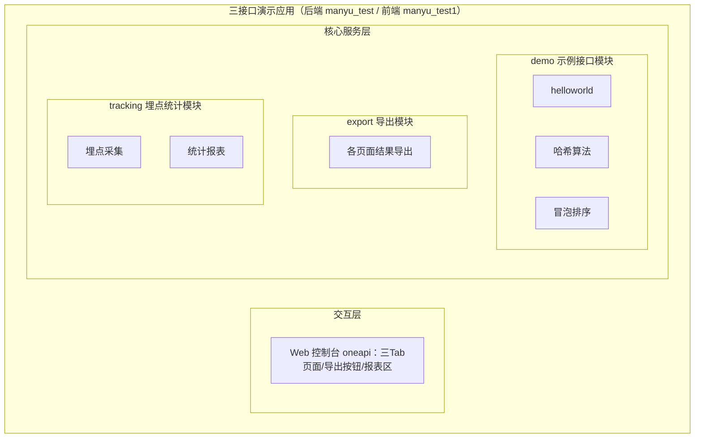
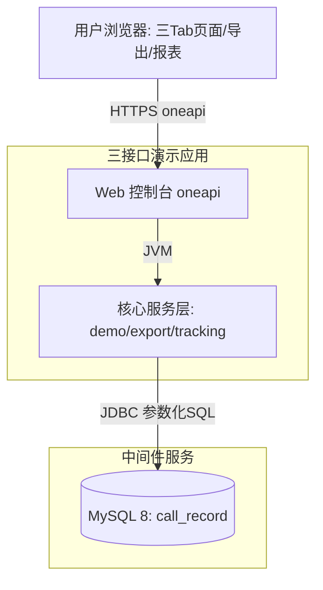
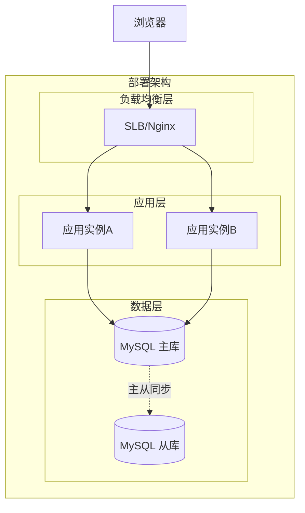

# Step2 架构与模块划分

## 2.1 功能架构

- **交互层说明**：Vue3 单页应用，一页三 Tab（演示/执行、导出按钮、报表区）；仅消费 oneapi（/api 前缀）接口。
- **核心服务层说明**：
  - demo 模块：三个示例接口，执行算法并触发埋点（F01-F03）。
  - export 模块：按页面导出展示结果（F05）。
  - tracking 模块：调用记录采集（F06）与多维度统计查询（F07）。
- **扩展/集成层说明**：本设计不引入外部业务系统集成；登录人员信息依赖统一登录上下文（A03）。

## 2.2 应用集成架构

**集成关系说明：**
| 调用方 | 被调用方 | 协议 | 接口类型 | 说明 |
|--------|----------|------|----------|------|
| 用户浏览器 | 应用 Web控制台 | HTTPS | oneapi REST | 三 Tab 执行、导出、报表全部走 /api |
| 应用核心服务层 | MySQL | JDBC | SQL（参数化） | call_record 埋点表读写 |
| 应用（埋点） | 登录上下文（统一 userInfo/请求头） | JVM | 内部解析 | 获取人员类型/层级/部门快照（A03） |

## 2.3 部署架构

**部署说明：**
- **负载均衡层**：SLB/Nginx，HTTPS 终结，按会话（登录态）转发。
- **应用层**：无状态应用 ≥2 副本，滚动发布；埋点线程池为 JVM 内异步（失败静默）。
- **数据层**：MySQL 主从（从库可承接报表只读查询），默认 InnoDB、RC 隔离级别。
- 公有云默认同城双机房容灾；私有化默认容器化部署（假设：无明确部署环境时按容器化）。

## 2.4 模块清单
| 模块 | 职责 | 依赖 |
|------|------|------|
| demo（示例接口模块） | helloworld、哈希、冒泡排序三个接口，入参校验、算法执行、结果组装、触发埋点 | tracking（埋点注解）、登录上下文解析 |
| export（导出模块） | 按页面导出展示结果（CSV/XLSX），导出动作计入埋点 | tracking（call_record 查询）、demo（结果数据） |
| tracking（埋点统计模块） | call_record 写入（AOP+异步批量）、多维度统计/趋势查询、导出数据源 | MySQL |

依赖方向：demo → tracking；export → tracking/demo；无循环依赖。