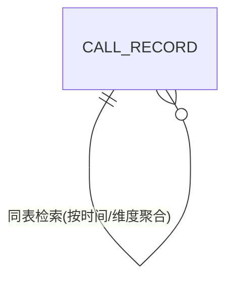

# Step3 数据模型与存储

## 3.1 实体清单
| 实体名称 | 实体说明 | 所属模块 | 与其他实体的关系 |
|----------|----------|----------|-----------------|
| call_record | 接口调用埋点记录：一次受埋点的接口调用（helloworld/哈希/冒泡排序/导出）一行，含调用人维度快照（人员类型/层级/部门）与执行结果 | tracking | 独立实体，无 FK 关联（人员信息为冗余快照） |

> 说明：demo 与 export 模块为无状态逻辑，不新增表；报表为对 call_record 的实时聚合查询。

## 3.2 实体关系图

> 单实体模型：call_record 自引用仅体现在同表多维度聚合查询，无物理关系。

**模型说明：**
- 人员维度（caller_type/caller_level/caller_dept_code）在调用发生时从登录上下文解析并冗余快照入库，保证后续按"人员类型、人员层级、人员部门"任意维度切片统计一致（A03/A07）。
- 租户隔离：本演示默认单租户；若需多租户，表增加 tenant_id（建模规范默认 tenant_id，当前按假设不启用）。
- 命名遵循 references/db.md：全小写下划线、表名/字段名总长 <26、无保留字、整数单列主键、含 gmt_create/gmt_modified、时间用 datetime、金额/耗时用 decimal 或 bigint（毫秒）。

## 3.3 缓存/MQ
- 不引入缓存与 MQ：埋点量级小，采用 JVM 异步线程池直写 MySQL；报表实时查询（A07 描述超阈值后的演进方案）。