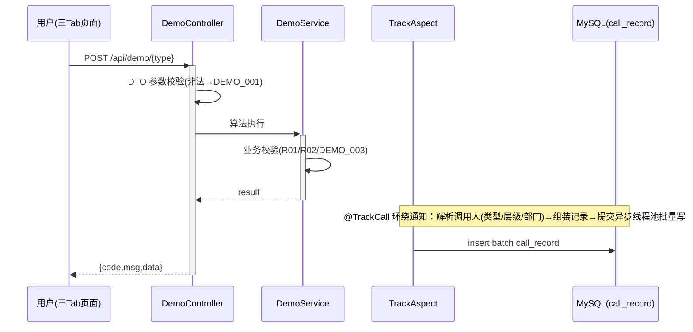

# Step5 demo 模块设计

模块无状态，不新增表。错误码：DEMO_001 参数非法、DEMO_002 不支持的哈希算法、DEMO_003 排序数组超上限。

## 枚举与常量
| 枚举名称 | 取值 | 含义 | 关联字段 |
|----------|------|------|----------|
| HashAlgorithm | MD5 / SHA256 / SM3 | 哈希算法类型 | W02 入参 algorithm |
| SortOrder | ASC / DESC | 排序方向 | W03 入参 order |
| DemoBizType | HELLO_WORLD / HASH / BUBBLE_SORT | 演示业务标识 | tracking.biz_type |

## W01 POST /api/demo/helloworld（F01）
- 入参：name（string，选填，默认"World"）
- 出参 data：{ message: "Hello, {name}!", serverTime, requestId }
- 业务规则 R01：name 长度 ≤ 64；R02：长度非法返回 DEMO_001。
- 时序：Controller 参数校验 → DemoService.hello → 组装返回；AOP @TrackCall(type=HELLO_WORLD) 环绕记录。

## W02 POST /api/demo/hash（F02）
- 入参：text（string，必填）、algorithm（枚举，选填，默认 SHA256）
- 出参 data：{ algorithm, hash, inputLength, costTimeMs }
- 业务规则：text 非空且 UTF-8 字节 ≤ 4096，否则 DEMO_001；不支持的 algorithm 返回 DEMO_002。
- 时序：校验 → 按算法执行 → 返回；@TrackCall(type=HASH) 记录（含 text 字节长度，不落明文原文）。
- 技术选型对比（算法）：MD5（速度快、非安全用途、32 位 hex）；SHA-256（标准安全散列、64 位 hex）；SM3（国密、合规场景、64 位 hex）。推荐默认 SHA-256，同时支持入参切换三种。

## W03 POST /api/demo/bubble-sort（F03）
- 入参：data（number[]，必填，元素 Decimal）、order（枚举，选填默认 ASC）、optimized（boolean，选填默认 true）
- 出参 data：{ originalSize, sorted: number[], swaps, costTimeMs, algorithmVersion }
- 业务规则：size 1..10000 否则 DEMO_003；元素为有限数，否则 DEMO_001。
- 时序：校验 → 冒泡排序（标准/优化，参考 manyu_test 仓 bubble_sort.py 逻辑，Java 侧重写）→ 返回；@TrackCall(type=BUBBLE_SORT)。
- 技术选型对比（实现方式）：① Java 服务内重写（推荐）：同进程、低延迟、易维护，逻辑对齐 bubble_sort.py；② 进程内调用 Python 脚本：跨语言调用复杂、性能差、不可扩展；③ 独立算法微服务：引入分布式成本，演示场景过度设计。

## 子功能详细设计（F01/F02/F03 通用）
- 处理时序图

- 异常场景表：空/超长参数→DEMO_001；非法算法→DEMO_002；数组超限→DEMO_003；线程池写失败→记录 error_log 并静默（不影响主流程）。
- 并发控制：算法执行无共享写状态，无并发风险（原因：纯函数式处理，入参局部变量）。