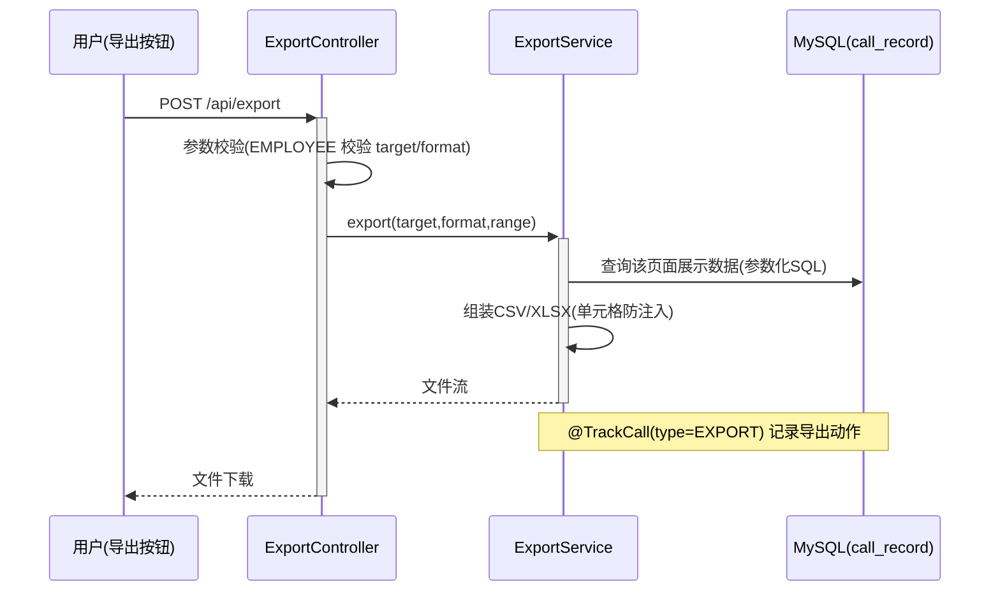

# Step5 export 模块设计

模块不新增表：导出数据来自 demo 结果与 call_record；导出动作本身通过 @TrackCall(type=EXPORT) 计入埋点。

## 枚举与常量
| 枚举名称 | 取值 | 含义 | 关联字段 |
|----------|------|------|----------|
| ExportTarget | HELLO_WORLD / HASH / BUBBLE_SORT / REPORT | 导出目标（对应各 Tab 页面） | W04 入参 target |
| ExportFormat | CSV / XLSX | 导出格式 | W04 入参 format |
| ExportBizType | EXPORT | 导出动作埋点标识 | tracking.biz_type |

错误码：EXPORT_001 不支持的导出目标/格式；EXPORT_002 导出数据为空。

## W04 POST /api/export（F05）
- 入参：target（枚举，必填）、format（枚举，选填默认 CSV）、startTime/endTime（datetime，选填，过滤记录时间范围）
- 出参 data：{ fileName, contentType, downloadUrl }  或直接以流下载（Content-Disposition: attachment）
- 业务规则：
  - R01：target 为 HELLO_WORLD/HASH/BUBBLE_SORT 时，导出该 Tab 页面展示内容 = 该类型最近 N 条调用记录（含调用人维度、入参摘要、出参摘要、耗时、状态）；target 为 REPORT 时导出统计报表（按维度分布 + 趋势）。
  - R02：时间范围跨度 ≤ 90 天。
  - R03：导出行为本身写入一条 biz_type=EXPORT 的 call_record（含导出人、目标、格式）。
  - R04：CSV 文件对以 = + - @ 开头的单元格前置单引号，防公式注入。
  - R05：数据为空返回 EXPORT_002。
- 时序图

- 技术选型对比（格式）：CSV（轻量、零依赖、Excel/WPS 直接打开，推荐默认）；XLSX via POI（多 Sheet、样式丰富，实现成本高，作为可选）。
- 异常场景：target/format 非法→EXPORT_001；查询无数据→EXPORT_002；文件流断开→记录 error 埋点，日志告警。
- 并发控制：导出为读操作，无并发写风险；大导出加并发限流（Semaphore 限制并发导出数 ≤ 5），超限提示稍后重试。
- 状态机：本模块无状态字段，不适用。