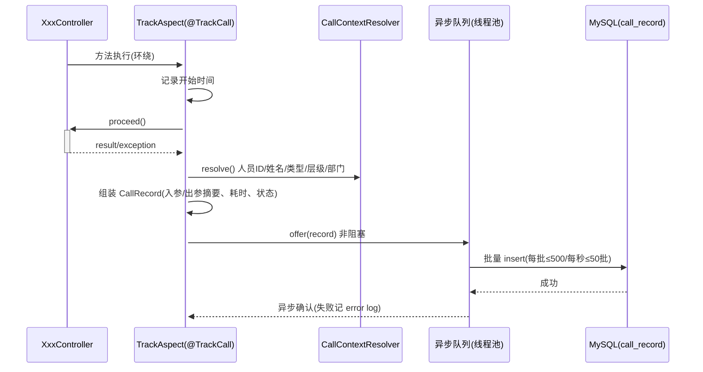
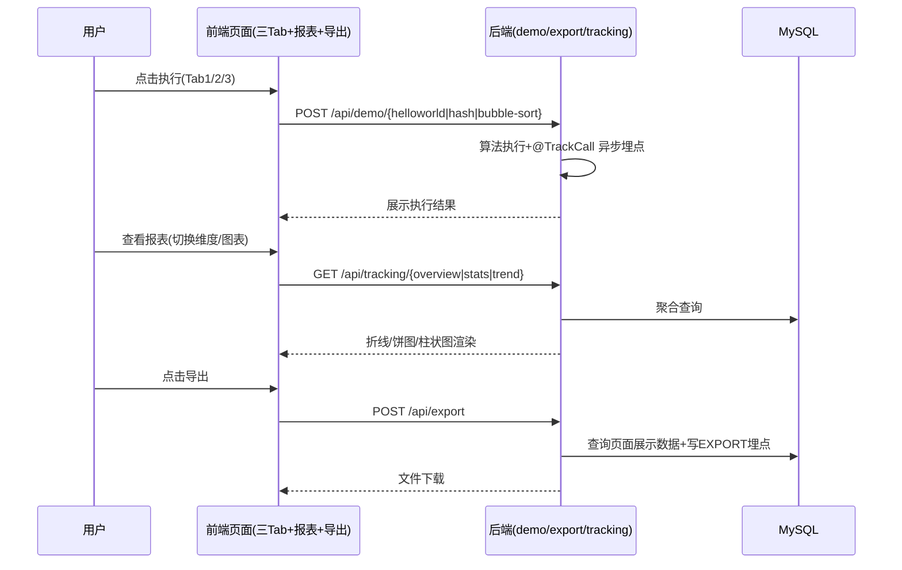

# Step5 tracking 模块设计

## 表结构设计：call_record（调用记录表）
| 字段名 | 数据类型 | 约束 | 默认值 | 说明 |
|--------|----------|------|--------|------|
| id | bigint | PK, 自增 | - | 系统自增主键 |
| biz_type | varchar(32) | NOT NULL | - | 业务类型：HELLO_WORLD/HASH/BUBBLE_SORT/EXPORT |
| caller_id | varchar(64) | NOT NULL | - | 调用人 ID |
| caller_name | varchar(64) | NOT NULL | - | 调用人姓名 |
| caller_type | varchar(32) | NOT NULL | - | 人员类型：EMPLOYEE/OUTSOURCER/VISITOR/SYSTEM |
| caller_level | varchar(32) | NOT NULL | - | 人员层级：P1..P9/M 序列 |
| caller_dept_code | varchar(64) | NOT NULL | - | 人员部门编码 |
| caller_dept_name | varchar(128) | NOT NULL | - | 人员部门名称 |
| req_summary | varchar(512) | NULL | - | 入参摘要（如 hash 算法+字节数、排序规模+方向），不含敏感原文 |
| resp_summary | varchar(1024) | NULL | - | 出参摘要（如哈希前 16 位、排序结果前 10 元素） |
| cost_time_ms | bigint | NOT NULL | 0 | 处理耗时（毫秒） |
| result_status | varchar(16) | NOT NULL | SUCCESS | 结果状态：SUCCESS/FAIL |
| error_code | varchar(32) | NULL | - | 失败错误码 |
| gmt_create | datetime | NOT NULL | CURRENT_TIMESTAMP | 创建时间（调用时间） |
| gmt_modified | datetime | NOT NULL | CURRENT_TIMESTAMP | 修改时间 |

> 满足表命名规范：表名+字段名总长 < 26（如 caller_dept_name 长度合规）。

**索引（被索引列全部 NOT NULL+默认值）：**
- IDX: `idx_call_record_biz_time` (biz_type, gmt_create) — Tab 页最近记录与导出查询
- IDX: `idx_call_record_type_time` (caller_type, gmt_create) — 人员类型维度统计
- IDX: `idx_call_record_level_time` (caller_level, gmt_create) — 人员层级维度统计
- IDX: `idx_call_record_dept_time` (caller_dept_code, gmt_create) — 人员部门维度统计
- IDX: `idx_call_record_status` (result_status) — 成功率统计

## 枚举与常量定义
| 枚举名称 | 取值 | 含义 | 关联字段 |
|----------|------|------|----------|
| BizType | HELLO_WORLD / HASH / BUBBLE_SORT / EXPORT | 埋点业务类型 | call_record.biz_type |
| CallerType | EMPLOYEE / OUTSOURCER / VISITOR / SYSTEM | 人员类型 | call_record.caller_type |
| ResultStatus | SUCCESS / FAIL | 调用结果 | call_record.result_status |
| StatsDimension | CALLER_TYPE / CALLER_LEVEL / CALLER_DEPT / BIZ_TYPE | 统计维度 | W06 入参 dimension |
| TrendGranularity | HOUR / DAY / MONTH | 趋势粒度 | W07 入参 granularity |

## 接口详细设计

### W05 GET /api/tracking/overview（F06/F07）
- 出参 data：{ totalCalls, totalCallers, successRate, avgCostTimeMs, period:{startTime,endTime}, topCaller:{name,calls} }
- 业务规则：无入参（默认近 30 天）；供报表顶部卡片。

### W06 GET /api/tracking/stats（F07）
- 入参：dimension（枚举，必填）、startTime/endTime（选填，默认近 30 天）
- 出参 data：{ dimension, items:[{ name, value, percent }] }
- 业务规则：dimension=CALLER_TYPE/CALLER_LEVEL/CALLER_DEPT 时按对应字段 group by + count(*)，供饼图/柱状图。

### W07 GET /api/tracking/trend（F07）
- 入参：granularity（枚举，选填默认 DAY）、startTime/endTime（选填，默认近 30 天）、dimension（选填，细分为某个维度值的时间序列）
- 出参 data：{ granularity, points:[{ time, calls, successRate }] }
- 业务规则：按粒度聚合调用次数与成功率，供折线图。

## 子功能详细设计

### 5.3.x 埋点采集（F06）—— AOP 注解 + 异步批量写

- 业务规则：R01 埋点异步，主流程不等待；R02 队列满/DB失败→降级为日志记录，不影响接口结果；R03 出参/入参仅落摘要，不落原文与密钥；R04 调用人解析失败时 caller_id 落 "anonymous" 且 caller_type=SYSTEM。
- 异常场景：线程池拒绝→静默降级；批量写失败→error log + 计数告警指标。
- 并发控制：线程池（核心 2/最大 4/队列 10000）单例；批量写用独立事务，失败不影响主事务；无锁竞争（队列消费单线程）。

### 5.3.y 报表查询（F07）
- 时序：Controller → TrackingService.stats/trend → Mapper 聚合（参数化 SQL）→ 返回 VO；报表接口只读，无并发风险。
- 技术选型对比（统计口径）：① 实时聚合 call_record（推荐，当前量级，索引覆盖）；② 预聚合 stats_snapshot 表（定时任务，适合大数据量，引入延迟与任务维护）。推荐①，文档注明 call_record 单表 > 500w 或统计查询 > 1s 时演进为②。
- 状态机：call_record 无业务状态流转（仅 SUCCESS/FAIL 终态），状态机不适用。

## 跨模块调用链（F01→F06→F07→F05）
