> **文档元信息**
>
> | 项目 | 内容 |
> |------|------|
> | 文档版本 | v1.0 |
> | 作者 | DTCoder |
> | 创建日期 | 2026-08-21 |
> | 需求来源 | 用户需求：三个接口（helloworld、哈希、冒泡排序）+ 前端三 Tab 页面 + 导出 + 埋点仪表盘 |
> | 评审状态 | 待评审 |

# 算法演示平台（三接口 + 埋点仪表盘）系分设计

## 1. 需求与范围

### 背景与目标

为算法演示平台构建后端 API 服务与前端展示页面。提供 helloworld、哈希算法、冒泡排序三个接口，前端通过三 Tab 页面展示各接口执行结果，支持导出功能，并通过埋点记录调用数据，在前端仪表盘以折线图、饼图、柱状图可视化展示。

### 核心功能

1. 三个后端 API：helloworld（GET）、哈希计算（POST）、冒泡排序（POST）
2. 前端三 Tab 页面：分别展示三个接口的输入/输出结果
3. 导出功能：后端提供导出接口，前端按钮触发文件下载
4. 埋点记录：记录每次 API 调用的接口名、调用人、人员类型、层级、部门
5. 可视化仪表盘：按多维度（人员类型、层级、部门、接口）聚合，支持折线图/饼图/柱状图切换

### 约束与非功能要求

- 技术栈：Python 3 + FastAPI + uvicorn + SQLite（后端）；原生 HTML/JS + Chart.js CDN（前端）
- 复用已有 `[manyu_test] bubble_sort.py` 中的冒泡排序算法
- 前端零构建工具依赖，CDN 引入 Chart.js
- 开发阶段 CORS 允许 *
- 埋点中间件对业务代码零侵入
- 埋点写入失败不影响业务 API 响应

### 排除范围

- 用户认证/登录系统（开发阶段 Mock Header）
- 生产环境部署方案（仅设计开发阶段）
- 数据迁移/升级策略
- 国际化/多语言
- 移动端适配

### 需求功能清单与优先级

| 编号 | 功能点 | 优先级 | PRD 原始描述/章节 | 备注 |
|------|--------|--------|-------------------|------|
| F01 | GET /api/helloworld 接口 | P0 | "分别写三个接口helloworld" | 返回 Hello, World! 消息 |
| F02 | POST /api/hash 哈希算法接口 | P0 | "分别写三个接口...哈希算法" | 支持 sha256/md5/sha1 |
| F03 | POST /api/bubble_sort 冒泡排序接口 | P0 | "分别写三个接口...冒泡排序" | 复用 bubble_sort.py |
| F04 | 前端三 Tab 页面展示 | P0 | "前端新增一个页面，有三个tab分别展示不同的执行结果" | 每个 Tab 对应一个接口 |
| F05 | 导出按钮 | P1 | "新增导出按钮，后台提供导出接口" | 导出当前 Tab 结果 |
| F06 | 后端导出接口 | P1 | "后台提供导出接口，支持导出各个页面的展示结果" | GET /api/export/{type} |
| F07 | 埋点记录调用次数和调用人 | P0 | "后端再做个埋点，获取调用次数和调用人" | 中间件自动记录 |
| F08 | 前端可视化报表 | P1 | "前端在当前页面上可视化出来一个报表查看调用情况" | Chart.js 仪表盘 |
| F09 | 多维度报表 | P1 | "根据不同的维度：人员类型、人员层级、人员部门等" | 支持切换维度 |
| F10 | 多种图表展示形式 | P1 | "折线图以及饼图和柱状图不同展示形式" | 三种图表可切换 |

### 假设与待确认项

| 编号 | 假设/待确认内容 | 当前假设 | 确认状态 |
|------|-----------------|----------|----------|
| A01 | 用户信息传递方式 | 通过 HTTP Header（X-User-Id/Type/Level/Dept）传递，开发阶段 Mock 固定值 | 待确认 |
| A02 | 数据库选型 | 开发阶段使用 SQLite（WAL 模式），生产可迁移至 PostgreSQL | 待确认 |
| A03 | 前端部署方式 | 静态文件通过 Python http.server 或 Nginx 托管 | 待确认 |
| A04 | 哈希算法支持范围 | sha256、md5、sha1 三种 | 待确认 |
| A05 | 冒泡排序输入规模限制 | 最大 10000 元素 | 待确认 |
| A06 | 埋点存储周期 | 无自动清理策略，需后续补充 | 待确认 |
| A07 | 导出格式 | JSON 格式，Content-Disposition: attachment | 待确认 |

---

## 2. 架构与模块

### 功能架构

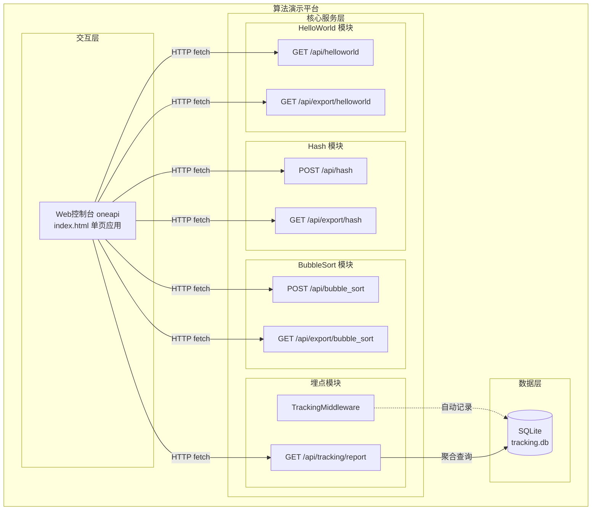
```mermaid
graph TB
    subgraph appName[算法演示平台]
        subgraph interactionLayer[交互层]
            WebConsole[Web控制台 oneapi<br/>index.html 单页应用]
        end

        subgraph coreServiceLayer[核心服务层]
            subgraph helloworldModule[HelloWorld 模块]
                FuncHello[GET /api/helloworld]
                FuncExportHello[GET /api/export/helloworld]
            end

            subgraph hashModule[Hash 模块]
                FuncHash[POST /api/hash]
                FuncExportHash[GET /api/export/hash]
            end

            subgraph bubbleSortModule[BubbleSort 模块]
                FuncSort[POST /api/bubble_sort]
                FuncExportSort[GET /api/export/bubble_sort]
            end

            subgraph trackingModule[埋点模块]
                FuncMiddleware[TrackingMiddleware]
                FuncReport[GET /api/tracking/report]
            end
        end

        subgraph dataLayer[数据层]
            SQLiteDB[(SQLite<br/>tracking.db)]
        end
    end

    WebConsole -->|HTTP fetch| FuncHello
    WebConsole -->|HTTP fetch| FuncHash
    WebConsole -->|HTTP fetch| FuncSort
    WebConsole -->|HTTP fetch| FuncExportHello
    WebConsole -->|HTTP fetch| FuncExportHash
    WebConsole -->|HTTP fetch| FuncExportSort
    WebConsole -->|HTTP fetch| FuncReport

    FuncMiddleware -.->|自动记录| SQLiteDB
    FuncReport -->|聚合查询| SQLiteDB
```

- 交互层说明：前端为原生 HTML/JS 单页应用，通过 CORS 跨域请求后端 API，使用 Chart.js CDN 渲染图表。
- 核心服务层说明：四个模块——HelloWorld（简单返回消息）、Hash（哈希计算+导出）、BubbleSort（排序+导出）、Tracking（埋点中间件+报表查询）。
- 数据层说明：SQLite 数据库，仅存储埋点日志 tracking_logs 表，WAL 模式。

**模块清单**

| 模块 | 职责 | 依赖 |
|------|------|------|
| HelloWorld 模块 | 提供 helloworld 接口及导出 | 无 |
| Hash 模块 | 提供哈希计算接口及导出 | 无 |
| BubbleSort 模块 | 提供冒泡排序接口及导出 | bubble_sort.py（算法复用） |
| 埋点模块 | 自动记录 API 调用日志，提供聚合报表查询 | SQLite |
| 前端页面模块 | 三 Tab 展示、导出按钮、Chart.js 仪表盘 | 后端 API、Chart.js CDN |

### 应用集成架构

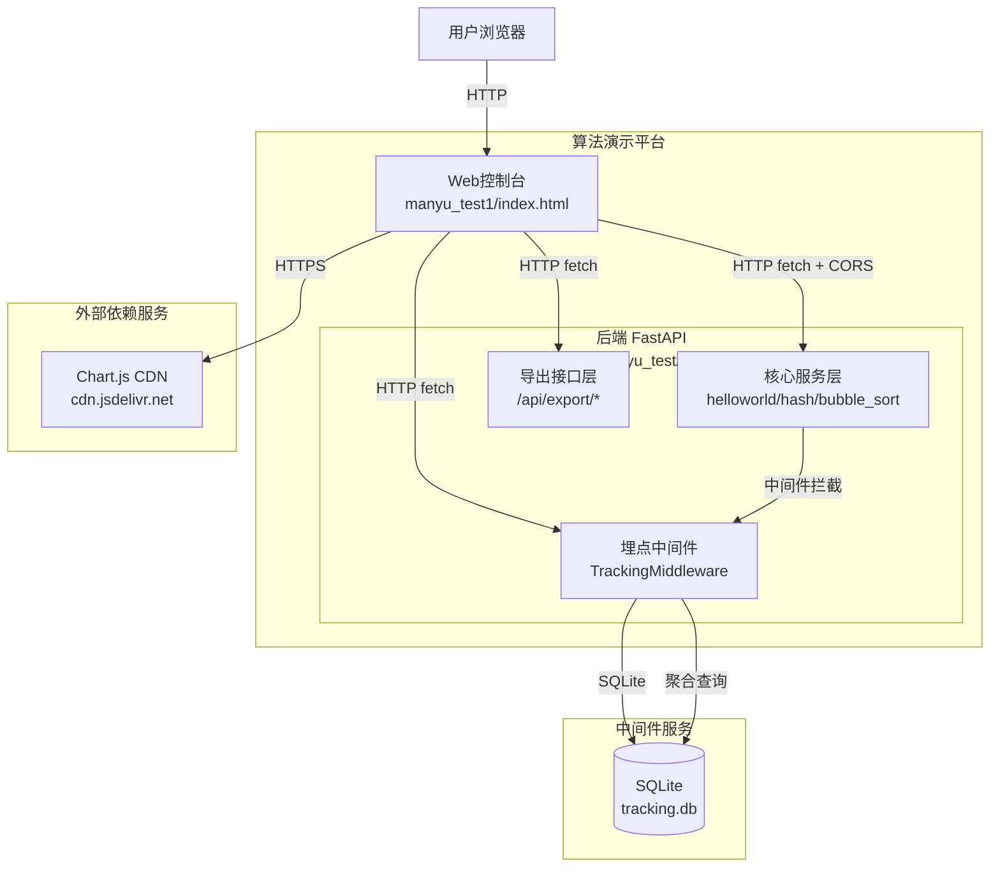
```mermaid
flowchart TB
    user[用户浏览器]

    subgraph app[算法演示平台]
        WebConsole[Web控制台<br/>manyu_test1/index.html]
        subgraph backend[后端 FastAPI<br/>manyu_test/]
            CoreServices[核心服务层<br/>helloworld/hash/bubble_sort]
            TrackingLayer[埋点中间件<br/>TrackingMiddleware]
            ExportLayer[导出接口层<br/>/api/export/*]
        end
    end

    subgraph middleware[中间件服务]
        DB[(SQLite<br/>tracking.db)]
    end

    subgraph extService[外部依赖服务]
        CDN[Chart.js CDN<br/>cdn.jsdelivr.net]
    end

    user -->|HTTP| WebConsole
    WebConsole -->|HTTP fetch + CORS| CoreServices
    WebConsole -->|HTTP fetch| ExportLayer
    WebConsole -->|HTTP fetch| TrackingLayer
    WebConsole -->|HTTPS| CDN

    CoreServices -->|中间件拦截| TrackingLayer
    TrackingLayer -->|SQLite| DB
    TrackingLayer -->|聚合查询| DB
```

**集成关系说明：**

| 调用方 | 被调用方 | 协议 | 接口类型 | 说明 |
|--------|----------|------|----------|------|
| 用户浏览器 | Web控制台 | HTTP | 静态文件 | 浏览器加载 index.html |
| Web控制台 | 后端核心服务层 | HTTP | oneapi REST | fetch 调用三个业务接口 |
| Web控制台 | 后端导出接口层 | HTTP | oneapi REST | 触发文件下载 |
| Web控制台 | 后端埋点报表 | HTTP | oneapi REST | 获取聚合统计数据 |
| Web控制台 | Chart.js CDN | HTTPS | 外部静态资源 | 加载图表库 |
| 埋点中间件 | SQLite 数据库 | 本地文件 | SQL | 写入调用日志 |
| 埋点报表查询 | SQLite 数据库 | 本地文件 | SQL | 聚合查询 |

### 部署架构

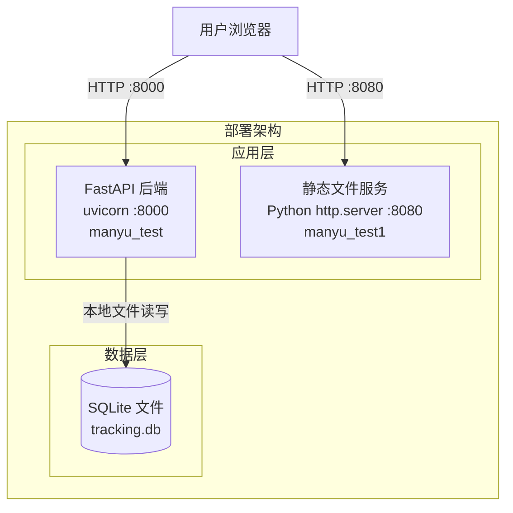
```mermaid
graph TB
    subgraph deployment[部署架构]
        subgraph appLayer[应用层]
            Backend[FastAPI 后端<br/>uvicorn :8000<br/>manyu_test]
            Frontend[静态文件服务<br/>Python http.server :8080<br/>manyu_test1]
        end

        subgraph dataLayer[数据层]
            SQLiteFile[(SQLite 文件<br/>tracking.db)]
        end
    end

    Browser[用户浏览器] -->|HTTP :8080| Frontend
    Browser -->|HTTP :8000| Backend
    Backend -->|本地文件读写| SQLiteFile
```

**部署说明：**
- **负载均衡层**：开发阶段不涉及，单实例部署。
- **应用层**：后端 uvicorn 单进程（开发阶段），前端 Python http.server 或 Nginx 托管静态文件。
- **数据层**：SQLite 文件存储，与后端同机部署，WAL 模式支持并发读。

假设：部署形态为开发阶段单机部署，公有云/容器化部署不在本次设计范围。

---

## 3. 数据模型与存储

### 实体清单

| 实体名称 | 实体说明 | 所属模块 | 与其他实体的关系 |
|----------|----------|----------|-----------------|
| tracking_logs | 埋点调用日志，记录每次 API 调用的元信息 | 埋点模块 | 无关联实体（独立日志表） |

### 实体关系图

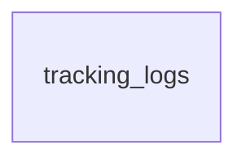
```mermaid
erDiagram
    tracking_logs {
    }
```

本系统仅一个实体 tracking_logs，无实体间关联关系。

**模型说明：**
- tracking_logs 为日志型数据表，以追加写入为主，无更新/删除操作。
- 按 api_name、user_type、user_level、user_dept 分别建立索引，支撑多维度聚合查询。
- 不涉及缓存/MQ。

### 缓存/MQ 说明

本项不适用，原因：系统为轻量级演示平台，API 调用量低，无需缓存或消息队列。埋点日志直接同步写入 SQLite（WAL 模式），写入失败不影响业务响应。

---

## 4. 接口设计

### 4.1 oneapi（Web 控制台接口）

| 编号 | 接口名称 | 方法 | 路径 | 模块 |
|------|----------|------|------|------|
| W01 | HelloWorld | GET | /api/helloworld | HelloWorld 模块 |
| W02 | 哈希计算 | POST | /api/hash | Hash 模块 |
| W03 | 冒泡排序 | POST | /api/bubble_sort | BubbleSort 模块 |
| W04 | 导出 HelloWorld | GET | /api/export/helloworld | HelloWorld 模块 |
| W05 | 导出 Hash | GET | /api/export/hash | Hash 模块 |
| W06 | 导出 BubbleSort | GET | /api/export/bubble_sort | BubbleSort 模块 |
| W07 | 埋点统计报表 | GET | /api/tracking/report | 埋点模块 |

### 4.2 OpenAPI（对外接口）

本项不适用，原因：当前无外部系统集成需求，所有接口均为 Web 控制台 oneapi。

### 4.3 内部接口（Service 层）

| 编号 | 接口名称 | 类 | 方法签名 |
|------|----------|------|----------|
| S01 | 冒泡排序算法 | bubble_sort（模块） | bubble_sort(arr: List) -> List |
| S02 | 数据库初始化 | tracking（模块） | init_db() -> None |
| S03 | 埋点报表查询 | tracking（模块） | get_report(dimension: str) -> dict |

### 4.4 集成接口（Integration 层）

本项不适用，原因：无外部系统集成，前端通过 HTTP 直接调用后端 API。

---

## 5. 功能模块设计

### 全局约定

**错误码体系**：本系统接口数量少（7 个），采用 HTTP 状态码 + error 字段直接区分错误类型，不设统一错误码体系。

| HTTP 状态码 | 场景 | 说明 |
|-------------|------|------|
| 200 | 成功 | 正常返回业务数据 |
| 400 | 参数错误 | 不支持的哈希算法等 |
| 413 | 请求体过大 | 输入超过长度限制 |
| 422 | 参数校验失败 | Pydantic 自动校验 |
| 500 | 服务器内部错误 | 全局异常捕获 |
| 503 | 服务不可用 | 数据库不可用 |

**通用出参结构**：
- 成功响应：直接返回业务数据（如 `{"message": "Hello, World!"}`、`{"hash": "...", "algorithm": "sha256"}`）
- 错误响应：`{"error": "错误描述", ...附加字段}` + HTTP 错误状态码

**模块与仓库映射**：

| 模块 | 仓库 | 文件 |
|------|------|------|
| HelloWorld 模块 | [manyu_test] | main.py |
| Hash 模块 | [manyu_test] | main.py |
| BubbleSort 模块 | [manyu_test] | main.py（+ bubble_sort.py 复用） |
| 埋点模块 | [manyu_test] | tracking.py |
| 前端页面模块 | [manyu_test1] | index.html |

---

### 5.1 HelloWorld 模块

#### 5.1.1 表结构设计

本模块不涉及数据库表，为纯计算/返回接口。

#### 5.1.2 接口详细设计

##### W01 HelloWorld

- **URI**: GET /api/helloworld
- **描述**: 返回 Hello, World! 消息，用于验证服务可用性。
- **入参**: 无

- **出参**:

| 参数名称 | 类型 | 描述 |
|----------|------|------|
| message | String | 固定返回 "Hello, World!" |

- **错误码**: 无（该接口无业务错误场景，仅可能触发 500 全局异常）

- **业务规则**: 无特殊规则。

- **请求示例**: 无请求体（GET 请求）

- **响应示例**:
```json
{
  "message": "Hello, World!"
}
```

##### W04 导出 HelloWorld

- **URI**: GET /api/export/helloworld
- **描述**: 导出 HelloWorld 结果为 JSON 文件下载。
- **入参**: 无

- **出参**: StreamingResponse（JSON 文件流）

| 参数名称 | 类型 | 描述 |
|----------|------|------|
| message | String | "Hello, World!" |
| exported_at | String | ISO 8601 导出时间戳 |

- **Content-Disposition**: `attachment; filename=helloworld_export.json`

- **错误码**:

| 错误码 | 说明 |
|--------|------|
| 500 | 服务器内部错误 |

- **业务规则**: 直接构建 JSON 并返回文件流，无额外校验。

- **请求示例**: 无请求体

- **响应示例**:
```json
{
  "message": "Hello, World!",
  "exported_at": "2026-08-21T12:00:00+00:00"
}
```

#### 5.1.3 子功能详细设计

##### 5.1.3.1 HelloWorld 接口调用（F01）

- 处理时序图

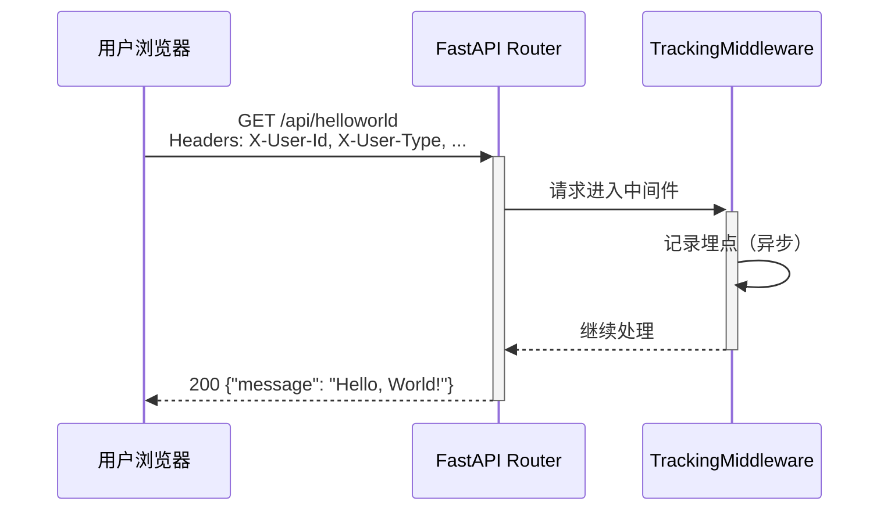
```mermaid
sequenceDiagram
    participant C as 用户浏览器
    participant Ctrl as FastAPI Router
    participant MW as TrackingMiddleware

    C->>+Ctrl: GET /api/helloworld<br/>Headers: X-User-Id, X-User-Type, ...
    Ctrl->>+MW: 请求进入中间件
    MW->>MW: 记录埋点（异步）
    MW-->>-Ctrl: 继续处理
    Ctrl-->>-C: 200 {"message": "Hello, World!"}
```

**业务规则：**

| 规则编号 | 规则描述 | 校验时机 | 不满足时的处理 |
|----------|----------|----------|--------------|
| R01 | 无业务规则 | — | — |

**异常场景：**

| 异常场景 | 处理方式 |
|----------|----------|
| 服务内部异常 | 全局异常处理器捕获，返回 500 + request_id |

**并发控制：**
无并发风险，原因：该接口为纯读操作，无数据写入。

##### 5.1.3.2 HelloWorld 导出（F05/F06）

- 处理时序图

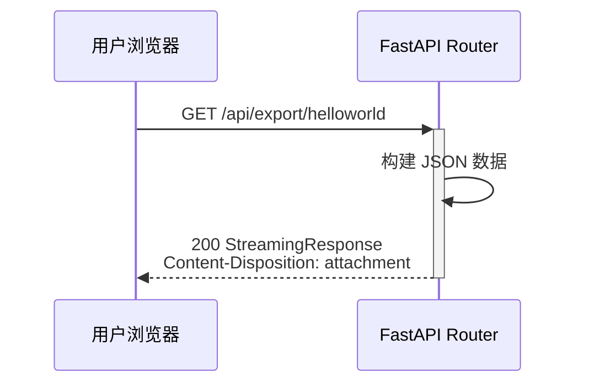
```mermaid
sequenceDiagram
    participant C as 用户浏览器
    participant Ctrl as FastAPI Router

    C->>+Ctrl: GET /api/export/helloworld
    Ctrl->>Ctrl: 构建 JSON 数据
    Ctrl-->>-C: 200 StreamingResponse<br/>Content-Disposition: attachment
```

**业务规则：**

| 规则编号 | 规则描述 | 校验时机 | 不满足时的处理 |
|----------|----------|----------|--------------|
| R02 | 导出数据始终可用 | 导出时 | 无失败场景（纯内存构建） |

**异常场景：**

| 异常场景 | 处理方式 |
|----------|----------|
| 内存不足 | 全局异常处理器捕获，返回 500 |

**并发控制：**
无并发风险，原因：纯内存操作，不涉及共享状态。

**模块自检：**

| 检查项 | 结果 |
|--------|------|
| F01 覆盖 | ✅ W01 接口 |
| F05 覆盖 | ✅ W04 接口 |
| F06 覆盖 | ✅ W04 接口 |
| 过度设计检查 | ✅ 无冗余设计 |

---

### 5.2 Hash 模块

#### 5.2.1 表结构设计

本模块不涉及数据库表，为纯计算接口。

#### 5.2.2 接口详细设计

##### W02 哈希计算

- **URI**: POST /api/hash
- **描述**: 对输入文本进行哈希计算，支持 sha256/md5/sha1 三种算法。
- **入参**:

| 参数名称 | 类型 | 是否必填 | 描述 |
|----------|------|----------|------|
| input | String | 是 | 待哈希的文本，最大 1MB |
| algorithm | String | 否 | 哈希算法，默认 "sha256"，可选 sha256/md5/sha1 |

- **出参**:

| 参数名称 | 类型 | 描述 |
|----------|------|------|
| hash | String | 十六进制哈希值 |
| algorithm | String | 使用的算法名称 |

- **错误码**:

| 错误码 | 说明 |
|--------|------|
| 400 | 不支持的算法，返回 supported 列表 |
| 413 | 输入超过 1MB 限制 |
| 422 | 请求体格式错误（Pydantic 自动校验） |

- **业务规则**:
  - 支持的算法：sha256、md5、sha1
  - 输入长度上限：1,048,576 字节（1MB）
  - 算法参数不区分大小写

- **请求示例**:
```json
{
  "input": "hello",
  "algorithm": "sha256"
}
```

- **响应示例**:
```json
{
  "hash": "2cf24dba5fb0a30e26e83b2ac5b9e29e1b161e5c1fa7425e73043362938b9824",
  "algorithm": "sha256"
}
```

##### W05 导出 Hash

- **URI**: GET /api/export/hash
- **描述**: 导出哈希计算结果为 JSON 文件下载。
- **入参**:

| 参数名称 | 类型 | 是否必填 | 描述 |
|----------|------|----------|------|
| input | String | 是 | 待哈希的文本（Query 参数） |
| algorithm | String | 否 | 哈希算法，默认 "sha256" |

- **出参**: StreamingResponse（JSON 文件流）

| 参数名称 | 类型 | 描述 |
|----------|------|------|
| input | String | 原始输入 |
| algorithm | String | 使用的算法 |
| hash | String | 十六进制哈希值 |
| exported_at | String | ISO 8601 导出时间戳 |

- **Content-Disposition**: `attachment; filename=hash_export.json`

- **错误码**:

| 错误码 | 说明 |
|--------|------|
| 400 | 不支持的算法 |
| 500 | 服务器内部错误 |

- **业务规则**: 与 W02 哈希计算接口一致，复用相同校验逻辑。

- **请求示例**:
```
GET /api/export/hash?input=hello&algorithm=sha256
```

- **响应示例**:
```json
{
  "input": "hello",
  "algorithm": "sha256",
  "hash": "2cf24dba5fb0a30e26e83b2ac5b9e29e1b161e5c1fa7425e73043362938b9824",
  "exported_at": "2026-08-21T12:00:00+00:00"
}
```

#### 5.2.3 子功能详细设计

##### 5.2.3.1 哈希计算（F02）

- 处理时序图

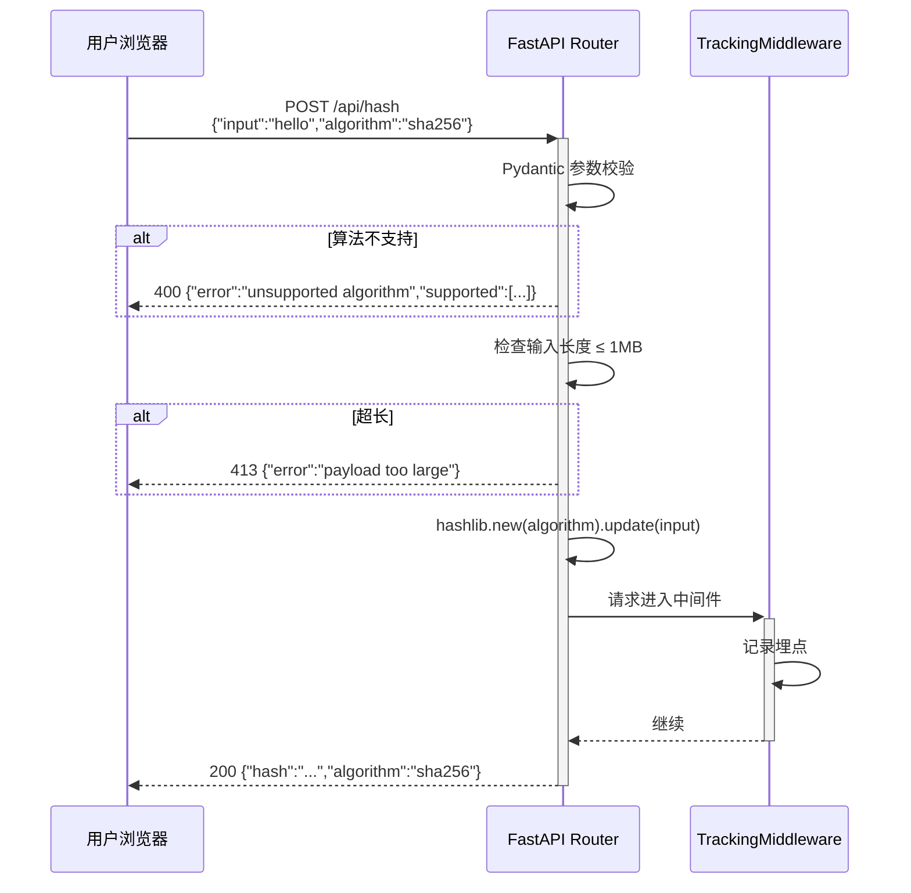
```mermaid
sequenceDiagram
    participant C as 用户浏览器
    participant Ctrl as FastAPI Router
    participant MW as TrackingMiddleware

    C->>+Ctrl: POST /api/hash<br/>{"input":"hello","algorithm":"sha256"}
    Ctrl->>Ctrl: Pydantic 参数校验
    alt 算法不支持
        Ctrl-->>C: 400 {"error":"unsupported algorithm","supported":[...]}
    end
    Ctrl->>Ctrl: 检查输入长度 ≤ 1MB
    alt 超长
        Ctrl-->>C: 413 {"error":"payload too large"}
    end
    Ctrl->>Ctrl: hashlib.new(algorithm).update(input)
    Ctrl->>+MW: 请求进入中间件
    MW->>MW: 记录埋点
    MW-->>-Ctrl: 继续
    Ctrl-->>-C: 200 {"hash":"...","algorithm":"sha256"}
```

**业务规则：**

| 规则编号 | 规则描述 | 校验时机 | 不满足时的处理 |
|----------|----------|----------|--------------|
| R03 | algorithm 必须在 {sha256, md5, sha1} 中 | 请求到达时 | 返回 400 + supported 列表 |
| R04 | input 长度 ≤ 1,048,576 字节 | 请求到达时 | 返回 413 + limit 值 |

**异常场景：**

| 异常场景 | 处理方式 |
|----------|----------|
| 算法不支持 | 返回 400 + 支持的算法列表 |
| 输入超长 | 返回 413 + 长度限制 |
| Python hashlib 内部异常 | 全局异常处理器捕获，返回 500 |

**并发控制：**
无并发风险，原因：纯计算操作，无共享状态。

##### 5.2.3.2 Hash 导出（F05/F06）

- 处理时序图

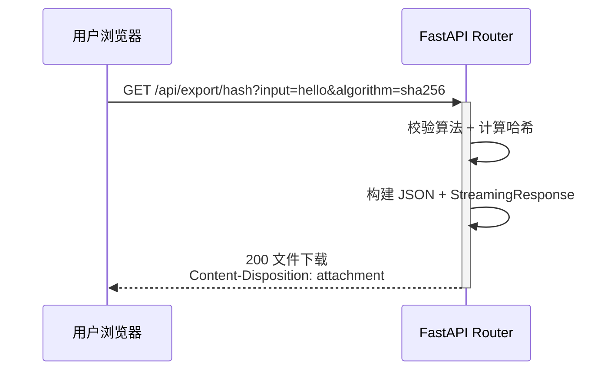
```mermaid
sequenceDiagram
    participant C as 用户浏览器
    participant Ctrl as FastAPI Router

    C->>+Ctrl: GET /api/export/hash?input=hello&algorithm=sha256
    Ctrl->>Ctrl: 校验算法 + 计算哈希
    Ctrl->>Ctrl: 构建 JSON + StreamingResponse
    Ctrl-->>-C: 200 文件下载<br/>Content-Disposition: attachment
```

**业务规则：**
同 W02 哈希计算接口，规则 R03/R04。

**异常场景：**
同 W02 哈希计算接口。

**并发控制：**
无并发风险，原因：纯内存操作。

**模块自检：**

| 检查项 | 结果 |
|--------|------|
| F02 覆盖 | ✅ W02 接口 |
| F05 覆盖 | ✅ W05 接口 |
| F06 覆盖 | ✅ W05 接口 |
| 过度设计检查 | ✅ 无冗余设计 |

---

### 5.3 BubbleSort 模块

#### 5.3.1 表结构设计

本模块不涉及数据库表，为纯计算接口。复用已有 `[manyu_test] bubble_sort.py` 模块中的冒泡排序算法。

#### 5.3.2 接口详细设计

##### W03 冒泡排序

- **URI**: POST /api/bubble_sort
- **描述**: 对输入数组进行冒泡排序，返回排序结果和比较次数。
- **入参**:

| 参数名称 | 类型 | 是否必填 | 描述 |
|----------|------|----------|------|
| array | List[int\|float] | 是 | 待排序数组，长度 0~10000 |

- **出参**:

| 参数名称 | 类型 | 描述 |
|----------|------|------|
| sorted | List[int\|float] | 升序排序后的数组 |
| steps | int | 比较次数（算法执行步数） |

- **错误码**:

| 错误码 | 说明 |
|--------|------|
| 413 | 数组长度超过 10000 |
| 422 | 请求体格式错误（Pydantic 自动校验） |

- **业务规则**:
  - 数组长度上限：10,000 元素
  - 空数组返回 `{"sorted": [], "steps": 0}`
  - 支持整数和浮点数混合排序

- **请求示例**:
```json
{
  "array": [5, 2, 8, 1, 3]
}
```

- **响应示例**:
```json
{
  "sorted": [1, 2, 3, 5, 8],
  "steps": 10
}
```

##### W06 导出 BubbleSort

- **URI**: GET /api/export/bubble_sort
- **描述**: 导出冒泡排序结果为 JSON 文件下载。
- **入参**:

| 参数名称 | 类型 | 是否必填 | 描述 |
|----------|------|----------|------|
| array | String | 是 | 逗号分隔的数字字符串，如 "5,2,8,1,3" |

- **出参**: StreamingResponse（JSON 文件流）

| 参数名称 | 类型 | 描述 |
|----------|------|------|
| original | List[float] | 原始输入数组 |
| sorted | List[float] | 排序后数组 |
| steps | int | 比较次数 |
| exported_at | String | ISO 8601 导出时间戳 |

- **Content-Disposition**: `attachment; filename=bubble_sort_export.json`

- **错误码**:

| 错误码 | 说明 |
|--------|------|
| 413 | 数组长度超过 10000 |
| 422 | 数组格式错误（非逗号分隔数字） |

- **业务规则**: 与 W03 冒泡排序接口一致，入参格式不同（Query 字符串 vs JSON 数组）。

- **请求示例**:
```
GET /api/export/bubble_sort?array=5,2,8,1,3
```

- **响应示例**:
```json
{
  "original": [5.0, 2.0, 8.0, 1.0, 3.0],
  "sorted": [1.0, 2.0, 3.0, 5.0, 8.0],
  "steps": 10,
  "exported_at": "2026-08-21T12:00:00+00:00"
}
```

#### 5.3.3 子功能详细设计

##### 5.3.3.1 冒泡排序（F03）

- 处理时序图

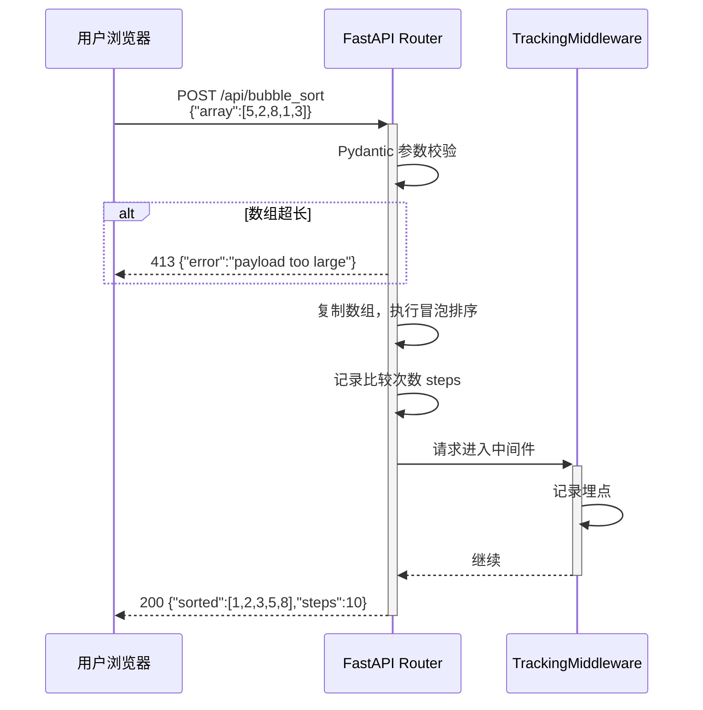
```mermaid
sequenceDiagram
    participant C as 用户浏览器
    participant Ctrl as FastAPI Router
    participant MW as TrackingMiddleware

    C->>+Ctrl: POST /api/bubble_sort<br/>{"array":[5,2,8,1,3]}
    Ctrl->>Ctrl: Pydantic 参数校验
    alt 数组超长
        Ctrl-->>C: 413 {"error":"payload too large"}
    end
    Ctrl->>Ctrl: 复制数组，执行冒泡排序
    Ctrl->>Ctrl: 记录比较次数 steps
    Ctrl->>+MW: 请求进入中间件
    MW->>MW: 记录埋点
    MW-->>-Ctrl: 继续
    Ctrl-->>-C: 200 {"sorted":[1,2,3,5,8],"steps":10}
```

**业务规则：**

| 规则编号 | 规则描述 | 校验时机 | 不满足时的处理 |
|----------|----------|----------|--------------|
| R05 | array 长度 ≤ 10,000 | 请求到达时 | 返回 413 + limit 值 |
| R06 | 空数组合法，返回 {"sorted":[],"steps":0} | 排序时 | 直接返回空结果 |

**异常场景：**

| 异常场景 | 处理方式 |
|----------|----------|
| 数组超长 | 返回 413 + 长度限制 |
| 数组包含非数字元素 | Pydantic 自动校验，返回 422 |
| 排序过程异常 | 全局异常处理器捕获，返回 500 |

**并发控制：**
无并发风险，原因：对输入数组做 copy 后原地排序，不共享状态。

##### 5.3.3.2 BubbleSort 导出（F05/F06）

- 处理时序图

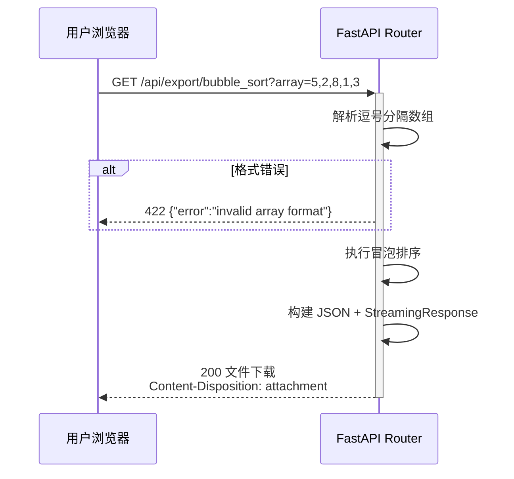
```mermaid
sequenceDiagram
    participant C as 用户浏览器
    participant Ctrl as FastAPI Router

    C->>+Ctrl: GET /api/export/bubble_sort?array=5,2,8,1,3
    Ctrl->>Ctrl: 解析逗号分隔数组
    alt 格式错误
        Ctrl-->>C: 422 {"error":"invalid array format"}
    end
    Ctrl->>Ctrl: 执行冒泡排序
    Ctrl->>Ctrl: 构建 JSON + StreamingResponse
    Ctrl-->>-C: 200 文件下载<br/>Content-Disposition: attachment
```

**业务规则：**
同 W03 冒泡排序接口，规则 R05/R06。

**异常场景：**
同 W03 冒泡排序接口，额外增加数组解析失败场景。

**并发控制：**
无并发风险，原因：纯内存操作。

**模块自检：**

| 检查项 | 结果 |
|--------|------|
| F03 覆盖 | ✅ W03 接口 |
| F05 覆盖 | ✅ W06 接口 |
| F06 覆盖 | ✅ W06 接口 |
| 过度设计检查 | ✅ 无冗余设计 |

---

### 5.4 埋点模块

#### 5.4.1 表结构设计

##### 5.4.1.1 tracking_logs（埋点调用日志表）

| 字段名 | 数据类型 | 约束 | 默认值 | 说明 |
|--------|----------|------|--------|------|
| id | INTEGER | PK, 自增 | — | 系统自增主键 |
| api_name | TEXT | NOT NULL | — | 被调用的接口名：helloworld/hash/bubble_sort |
| user_id | TEXT | NOT NULL | — | 调用人标识，Header 缺失时默认 "anonymous" |
| user_type | TEXT | — | 'unknown' | 人员类型：正式/外包/实习生 |
| user_level | TEXT | — | 'unknown' | 人员层级：P5/P6/P7/P8 |
| user_dept | TEXT | — | 'unknown' | 人员部门：技术/产品/运营 |
| created_at | TIMESTAMP | — | CURRENT_TIMESTAMP | 记录创建时间 |

**索引：**
- IDX: `idx_api_name` (api_name)
- IDX: `idx_user_type` (user_type)
- IDX: `idx_user_level` (user_level)
- IDX: `idx_user_dept` (user_dept)

##### 5.4.1.x 枚举与常量定义

| 枚举名称 | 取值 | 含义 | 关联字段 |
|----------|------|------|----------|
| TRACKED_PATHS | {"/api/helloworld", "/api/hash", "/api/bubble_sort"} | 需要埋点的 API 路径集合 | tracking_logs.api_name |
| VALID_DIMENSIONS | {"user_type", "user_level", "user_dept", "api_name"} | 报表聚合支持的维度 | 报表查询参数 |
| SUPPORTED_ALGORITHMS | {"sha256", "md5", "sha1"} | 支持的哈希算法 | （Hash 模块） |

#### 5.4.2 接口详细设计

##### W07 埋点统计报表

- **URI**: GET /api/tracking/report
- **描述**: 按指定维度聚合查询调用次数，返回 labels 和 values 供前端图表渲染。
- **入参**:

| 参数名称 | 类型 | 是否必填 | 描述 |
|----------|------|----------|------|
| dimension | String | 否 | 聚合维度，默认 "user_type"，支持逗号分隔二维交叉，如 "user_type,api_name" |

- **出参**:

| 参数名称 | 类型 | 描述 |
|----------|------|------|
| labels | List[String] | 维度值标签列表 |
| values | List[int] | 对应调用次数列表 |

- **错误码**:

| 错误码 | 说明 |
|--------|------|
| 503 | 数据库不可用 |

- **业务规则**:
  - 支持的维度：user_type、user_level、user_dept、api_name
  - 支持逗号分隔的二维交叉维度（如 "user_type,api_name"）
  - 无效维度参数返回 error 字段
  - 结果按调用次数降序排列

- **请求示例**:
```
GET /api/tracking/report?dimension=user_type
```

- **响应示例**:
```json
{
  "labels": ["正式", "外包", "实习生"],
  "values": [15, 8, 3]
}
```

#### 5.4.3 子功能详细设计

##### 5.4.3.1 埋点中间件自动记录（F07）

- 处理时序图

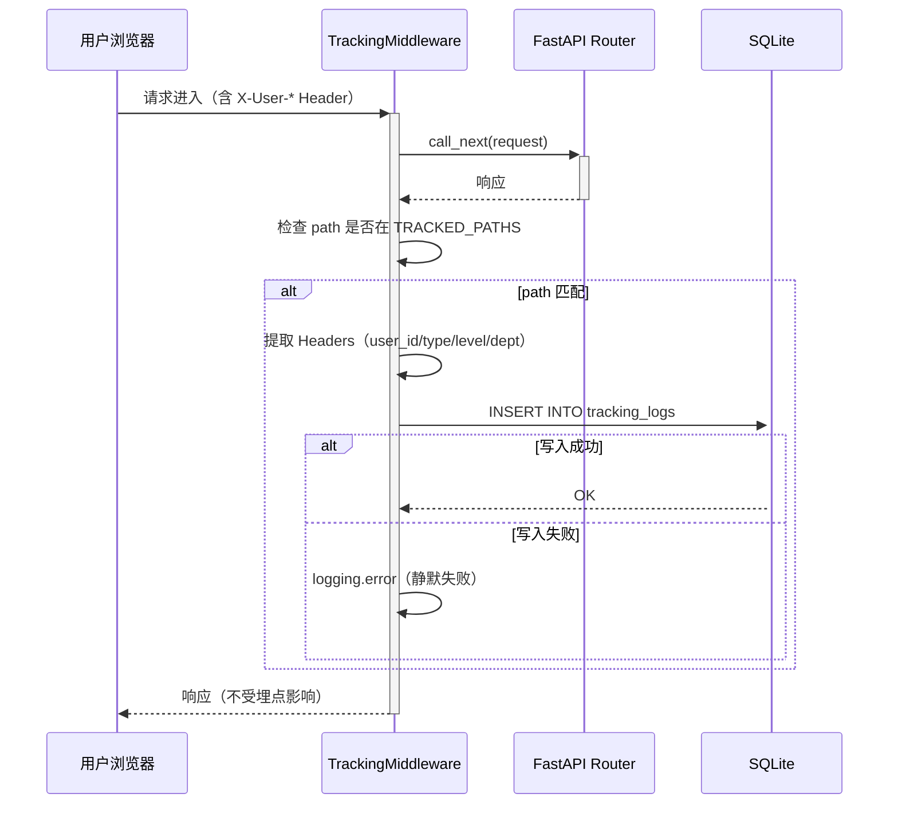
```mermaid
sequenceDiagram
    participant C as 用户浏览器
    participant MW as TrackingMiddleware
    participant Ctrl as FastAPI Router
    participant DB as SQLite

    C->>+MW: 请求进入（含 X-User-* Header）
    MW->>+Ctrl: call_next(request)
    Ctrl-->>-MW: 响应
    MW->>MW: 检查 path 是否在 TRACKED_PATHS
    alt path 匹配
        MW->>MW: 提取 Headers（user_id/type/level/dept）
        MW->>+DB: INSERT INTO tracking_logs
        alt 写入成功
            DB-->>MW: OK
        else 写入失败
            MW->>MW: logging.error（静默失败）
        end
    end
    MW-->>-C: 响应（不受埋点影响）
```

**业务规则：**

| 规则编号 | 规则描述 | 校验时机 | 不满足时的处理 |
|----------|----------|----------|--------------|
| R07 | 仅对 TRACKED_PATHS 中的路径记录埋点 | 响应后 | 跳过不记录 |
| R08 | Header 缺失时使用默认值 | 提取 Header 时 | user_id="anonymous"，其余="unknown" |
| R09 | 埋点写入失败不影响业务响应 | 写入时 | logging.error 记录，响应正常返回 |

**异常场景：**

| 异常场景 | 处理方式 |
|----------|----------|
| SQLite 写入失败（磁盘满/权限） | logging.error 记录，不阻塞业务响应 |
| Header 缺失 | 使用默认值填充 |
| 数据库文件不存在 | 首次启动时 init_db() 自动创建 |

**并发控制：**
- 并发场景：多个请求同时写入 tracking_logs 表
- 控制策略：SQLite WAL 模式 + 短事务，避免锁冲突。WAL 模式下读写不互斥，满足低并发场景需求。

##### 5.4.3.2 报表聚合查询（F08/F09/F10）

- 处理时序图

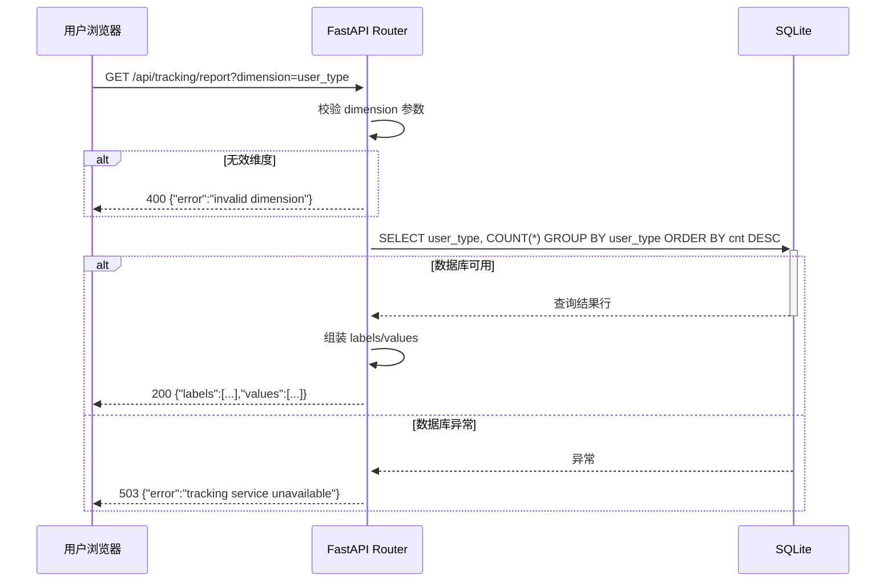
```mermaid
sequenceDiagram
    participant C as 用户浏览器
    participant Ctrl as FastAPI Router
    participant DB as SQLite

    C->>+Ctrl: GET /api/tracking/report?dimension=user_type
    Ctrl->>Ctrl: 校验 dimension 参数
    alt 无效维度
        Ctrl-->>C: 400 {"error":"invalid dimension"}
    end
    Ctrl->>+DB: SELECT user_type, COUNT(*) GROUP BY user_type ORDER BY cnt DESC
    alt 数据库可用
        DB-->>-Ctrl: 查询结果行
        Ctrl->>Ctrl: 组装 labels/values
        Ctrl-->>C: 200 {"labels":[...],"values":[...]}
    else 数据库异常
        DB-->>Ctrl: 异常
        Ctrl-->>C: 503 {"error":"tracking service unavailable"}
    end
```

**业务规则：**

| 规则编号 | 规则描述 | 校验时机 | 不满足时的处理 |
|----------|----------|----------|--------------|
| R10 | dimension 必须在 VALID_DIMENSIONS 中 | 查询前 | 返回 error |
| R11 | 支持逗号分隔二维交叉（如 "user_type,api_name"） | 查询前 | 按多列 GROUP BY |
| R12 | 结果按 cnt 降序排列 | 查询时 | — |

**异常场景：**

| 异常场景 | 处理方式 |
|----------|----------|
| 无效维度参数 | 返回 error 字段 |
| 数据库不可用 | 返回 503 |
| 查询结果为空 | 返回 {"labels":[], "values":[]} |

**并发控制：**
无并发风险，原因：纯读操作，SQLite WAL 模式支持并发读。

**模块自检：**

| 检查项 | 结果 |
|--------|------|
| F07 覆盖 | ✅ 埋点中间件 |
| F08 覆盖 | ✅ W07 接口 |
| F09 覆盖 | ✅ W07 支持多维度 |
| F10 覆盖 | ✅ 前端 Chart.js 三种图表（前端实现） |
| 过度设计检查 | ✅ 无冗余设计 |

---

### 5.5 前端页面模块

#### 5.5.1 表结构设计

本模块不涉及数据库表，为纯前端展示。

#### 5.5.2 接口详细设计

前端作为接口消费方，不提供服务接口。消费的后端接口清单见第 4 章。

#### 5.5.3 子功能详细设计

##### 5.5.3.1 三 Tab 页面展示（F04）

- 处理时序图

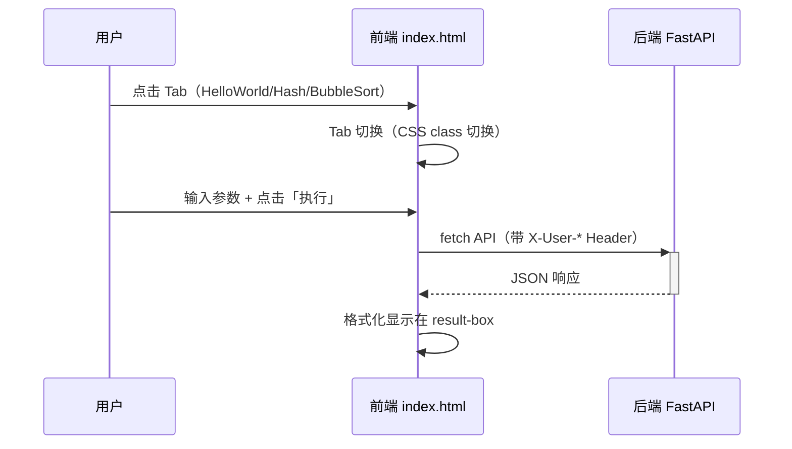
```mermaid
sequenceDiagram
    participant U as 用户
    participant FE as 前端 index.html
    participant BE as 后端 FastAPI

    U->>FE: 点击 Tab（HelloWorld/Hash/BubbleSort）
    FE->>FE: Tab 切换（CSS class 切换）
    U->>FE: 输入参数 + 点击「执行」
    FE->>+BE: fetch API（带 X-User-* Header）
    BE-->>-FE: JSON 响应
    FE->>FE: 格式化显示在 result-box
```

**业务规则：**

| 规则编号 | 规则描述 | 校验时机 | 不满足时的处理 |
|----------|----------|----------|--------------|
| R13 | Tab 切换不影响已加载结果 | 切换时 | 保留各 Tab 独立状态 |
| R14 | 前端输入校验：数组解析失败时提示 | 点击执行前 | 显示 Toast 警告 |

**异常场景：**

| 异常场景 | 处理方式 |
|----------|----------|
| 网络不可达 | 5s 超时 + Toast 错误提示 |
| HTTP 4xx/5xx | 解析 error 字段展示 |
| 响应非 JSON | 兜底展示原始文本（截断 500 字符） |
| Chart.js CDN 加载失败 | 仪表盘区域显示错误提示 |

**并发控制：**
无并发风险，原因：前端为单用户操作，各 Tab 独立状态。

##### 5.5.3.2 导出功能（F05）

- 处理时序图

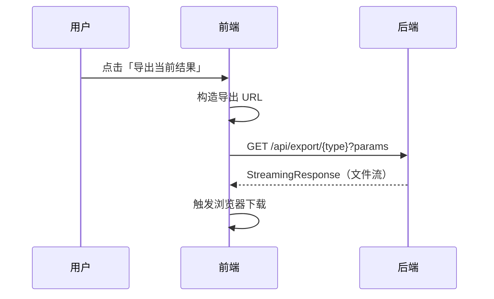
```mermaid
sequenceDiagram
    participant U as 用户
    participant FE as 前端
    participant BE as 后端

    U->>FE: 点击「导出当前结果」
    FE->>FE: 构造导出 URL
    FE->>BE: GET /api/export/{type}?params
    BE-->>FE: StreamingResponse（文件流）
    FE->>FE: 触发浏览器下载
```

**业务规则：**

| 规则编号 | 规则描述 | 校验时机 | 不满足时的处理 |
|----------|----------|----------|--------------|
| R15 | 导出 URL 参数从当前 Tab 输入框获取 | 点击导出时 | 直接构造 URL |

**异常场景：**

| 异常场景 | 处理方式 |
|----------|----------|
| 导出请求超时 | Toast 提示「导出失败，请重试」 |

##### 5.5.3.3 可视化仪表盘（F08/F09/F10）

- 处理时序图

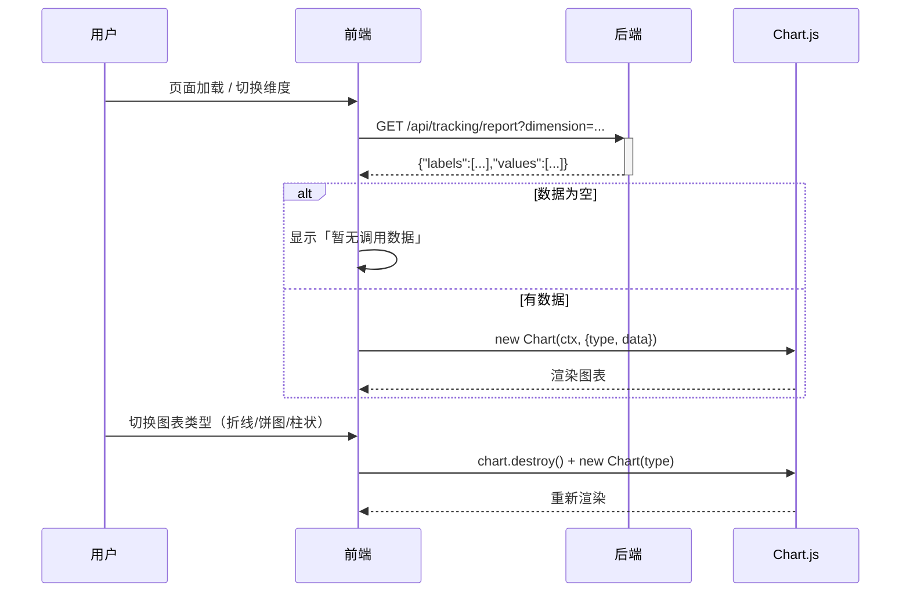
```mermaid
sequenceDiagram
    participant U as 用户
    participant FE as 前端
    participant BE as 后端
    participant Chart as Chart.js

    U->>FE: 页面加载 / 切换维度
    FE->>+BE: GET /api/tracking/report?dimension=...
    BE-->>-FE: {"labels":[...],"values":[...]}
    alt 数据为空
        FE->>FE: 显示「暂无调用数据」
    else 有数据
        FE->>Chart: new Chart(ctx, {type, data})
        Chart-->>FE: 渲染图表
    end
    U->>FE: 切换图表类型（折线/饼图/柱状）
    FE->>Chart: chart.destroy() + new Chart(type)
    Chart-->>FE: 重新渲染
```

**业务规则：**

| 规则编号 | 规则描述 | 校验时机 | 不满足时的处理 |
|----------|----------|----------|--------------|
| R16 | 维度值 >20 时饼图自动切换为柱状图 | 渲染前 | 自动切换 + Toast 提示 |
| R17 | 切换维度时请求失败保留上次数据 | 请求失败时 | Toast 提示刷新失败 |
| R18 | 单维度数据全为 0 仍渲染图表 | 渲染时 | Y 轴从 0 开始 |

**异常场景：**

| 异常场景 | 处理方式 |
|----------|----------|
| 报表数据为空 | 显示「暂无调用数据，请先使用上方接口」 |
| 报表加载失败 | 保留上次图表 + Toast 提示 |
| Chart.js 未加载 | 显示「图表组件加载失败，请刷新页面」 |

**并发控制：**
无并发风险，原因：前端单线程，Chart.js 实例在切换前先 destroy。

**模块自检：**

| 检查项 | 结果 |
|--------|------|
| F04 覆盖 | ✅ 三 Tab 页面 |
| F05 覆盖 | ✅ 导出按钮 |
| F08 覆盖 | ✅ 仪表盘 |
| F09 覆盖 | ✅ 维度切换 |
| F10 覆盖 | ✅ 三种图表类型切换 |
| 过度设计检查 | ✅ 无冗余设计 |

---

### 5.6 跨模块调用链

#### 5.6.1 完整业务流程（端到端）

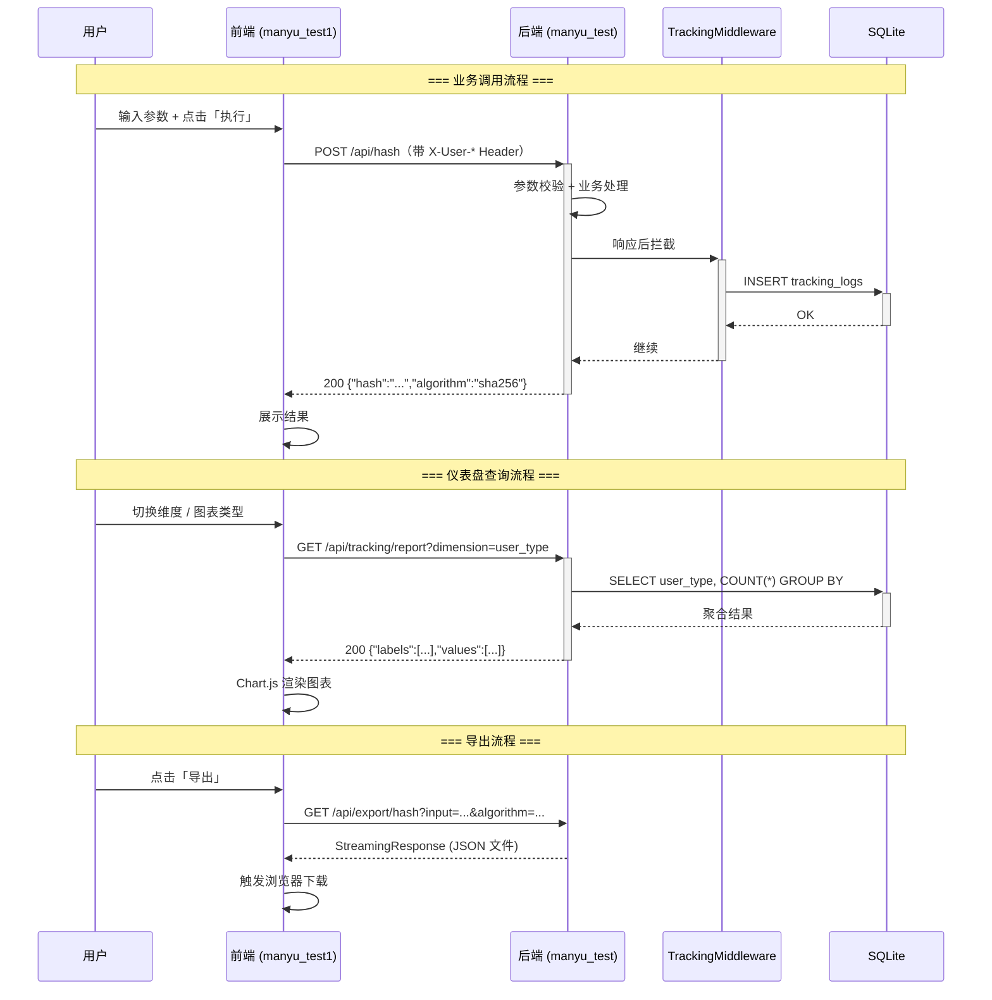
```mermaid
sequenceDiagram
    participant U as 用户
    participant FE as 前端 (manyu_test1)
    participant BE as 后端 (manyu_test)
    participant MW as TrackingMiddleware
    participant DB as SQLite

    Note over U,DB: === 业务调用流程 ===
    U->>FE: 输入参数 + 点击「执行」
    FE->>+BE: POST /api/hash（带 X-User-* Header）
    BE->>BE: 参数校验 + 业务处理
    BE->>+MW: 响应后拦截
    MW->>+DB: INSERT tracking_logs
    DB-->>-MW: OK
    MW-->>-BE: 继续
    BE-->>-FE: 200 {"hash":"...","algorithm":"sha256"}
    FE->>FE: 展示结果

    Note over U,DB: === 仪表盘查询流程 ===
    U->>FE: 切换维度 / 图表类型
    FE->>+BE: GET /api/tracking/report?dimension=user_type
    BE->>+DB: SELECT user_type, COUNT(*) GROUP BY
    DB-->>-BE: 聚合结果
    BE-->>-FE: 200 {"labels":[...],"values":[...]}
    FE->>FE: Chart.js 渲染图表

    Note over U,DB: === 导出流程 ===
    U->>FE: 点击「导出」
    FE->>BE: GET /api/export/hash?input=...&algorithm=...
    BE-->>FE: StreamingResponse (JSON 文件)
    FE->>FE: 触发浏览器下载
```

---

## 6. 非功能性需求设计

### 6.1 高可用性

本系统为开发阶段演示平台，高可用要求较低：

- **服务不可用场景**：后端 uvicorn 单进程，若进程崩溃需手动重启。开发阶段可接受。
- **数据库不可用**：SQLite 文件损坏或磁盘满时，埋点中间件静默失败（try/except + logging），业务 API 不受影响；报表接口返回 503。
- **第三方依赖不可用**：Chart.js CDN 加载失败时，前端仪表盘区域显示错误提示，不影响 Tab 功能使用。

### 6.2 可扩展性

- **水平扩展**：后端 FastAPI 为无状态服务（除 SQLite 文件外），可部署多实例 + 负载均衡。SQLite 需替换为 PostgreSQL/MySQL 以支持多实例写入。
- **垂直扩展**：uvicorn 支持多 worker 模式（`--workers N`），可充分利用多核 CPU。
- **前端扩展**：当前为单页应用，后续可拆分为独立路由页面；Chart.js 支持按需加载更多图表类型。
- **埋点扩展**：中间件模式支持灵活扩展，可通过配置增加 TRACKED_PATHS。

### 6.3 稳定性/可靠性

- **边界场景**：空数组、超长输入、不支持算法等均有明确处理（见各模块异常场景表）。
- **Header 缺失**：埋点中间件使用默认值填充，不拒绝请求。
- **并发写入**：SQLite WAL 模式 + 短事务，避免锁冲突。
- **输入校验**：Pydantic 自动校验 + 业务层二次校验，防止非法输入。

### 6.4 安全性设计

#### 6.4.1 账户系统方案

本项不适用，原因：开发阶段无用户认证系统，通过 Mock Header 传递用户信息。生产环境需接入统一认证（SSO/JWT）。

#### 6.4.2 授权&访问控制

##### 6.4.2.1 是否实现水平权限检查

本项不适用，原因：当前无多租户场景，所有数据为公共数据。

##### 6.4.2.2 是否实现垂直权限检查

本项不适用，原因：无角色区分，所有接口为公开访问。

##### 6.4.2.3 是否检查登录态

本项不适用，原因：开发阶段不检查登录态，CORS 允许所有来源。

#### 6.4.3 数据防护方案

##### 6.4.3.1 是否对敏感数据加密存储

本项不适用，原因：不存储用户敏感数据（密码、身份证等），仅存储调用日志元信息。

##### 6.4.3.2 是否对敏感数据展示进行脱敏

本项不适用，原因：前端展示的均为公开算法结果和统计数据，无敏感信息。

### 6.5 监控/统计/日志/告警

- **服务埋点**：通过 TrackingMiddleware 自动记录所有 API 调用（接口名、用户信息、时间戳），前端仪表盘可视化展示。
- **异常日志**：全局异常处理器记录完整堆栈（logging.error），含 request_id 便于追踪。
- **埋点写入失败**：logging.error 记录，不阻塞业务。
- **告警**：开发阶段不涉及，生产环境可接入监控系统（如 Prometheus + Grafana）。

---

## 7. 变更三板斧

### 7.1 可监控

- **业务接口埋点**：TrackingMiddleware 自动记录每次 API 调用的接口名、调用人、人员类型/层级/部门、时间戳。可通过 `/api/tracking/report` 查询聚合数据。
- **前端仪表盘**：Chart.js 实时可视化调用统计，支持按维度（人员类型/层级/部门/接口）切换，折线图/饼图/柱状图三种展示形式。
- **异常监控**：全局异常处理器记录 request_id + 完整堆栈，便于问题追踪。
- **埋点写入失败监控**：logging.error 记录失败日志，可接入日志采集系统。

### 7.2 可灰度

本项不适用，原因：当前为开发阶段，无多租户/多环境部署需求。若后续需要灰度发布，可按以下方案设计：

| 方案 | 描述 | 优劣 |
|------|------|------|
| 租户尾号灰度 | 按 user_id 尾号分流到新版/旧版服务 | 粒度可控，但需路由层支持 |
| 功能开关 | 通过配置中心控制新功能启用 | 灵活，但需额外基础设施 |
| 金丝雀部署 | 少量实例部署新版，观察后全量 | 简单，但粒度较粗 |

推荐方案：租户尾号灰度（如后续接入多租户体系）。

### 7.3 可应急

- **埋点中间件开关**：埋点中间件为 FastAPI add_middleware 注册，可通过移除注册或条件判断快速关闭埋点，不影响业务 API。
- **数据库应急**：SQLite 不可用时，埋点自动降级（静默失败），业务 API 正常响应。报表接口返回 503。
- **回滚方案**：代码回滚到上一版本即可，无数据兼容性问题（tracking_logs 表仅追加写入，回滚后旧数据仍可读）。注意：回滚时 tracking_logs 表结构若变更需兼容。
- **前端应急**：Chart.js CDN 加载失败时自动降级提示，不影响 Tab 功能使用。如遇严重前端问题，可直接回滚 index.html 文件。

---

## 附录 A: 仓库与文件清单

| 仓库 | 文件 | 操作 | 说明 |
|------|------|------|------|
| [manyu_test] | main.py | 创建 | FastAPI 入口：CORS、路由、全局异常处理 |
| [manyu_test] | tracking.py | 创建 | 埋点模块：数据库初始化、中间件、报表查询 |
| [manyu_test] | bubble_sort.py | 已有（复用） | 冒泡排序核心算法 |
| [manyu_test] | requirements.txt | 创建 | Python 依赖：fastapi、uvicorn、aiosqlite |
| [manyu_test1] | index.html | 创建 | 完整单页应用：三 Tab + 导出 + Chart.js 仪表盘 |

## 附录 B: 仓间对齐检查表

| 对齐项 | [manyu_test] 后端 | [manyu_test1] 前端 | 状态 |
|--------|-------------------|---------------------|------|
| CORS 源 | allow_origins=["*"] | API_BASE指向后端地址 | ✅ |
| API 路径前缀 | /api/ | 请求路径硬编码 /api/... | ✅ |
| 导出格式 | JSON 文件流 + Content-Disposition | <a> download 触发浏览器下载 | ✅ |
| 埋点维度枚举 | VALID_DIMENSIONS = {user_type, user_level, user_dept, api_name} | <select> 下拉选项一致 | ✅ |
| 用户信息传递 | 读取 Header: X-User-Id/Type/Level/Dept | getTrackingHeaders() 附加 Header | ✅ |
| 埋点路径匹配 | TRACKED_PATHS = {/api/helloworld, /api/hash, /api/bubble_sort} | fetch 路径一致 | ✅ |
| 导出 URL 模式 | /api/export/{type}?params | 前端构造 URL 一致 | ✅ |

---

*本文档由 DTCoder 在系分生成阶段自动生成，基于需求澄清阶段 design.md 和实施计划阶段 plan.md 深化设计。*