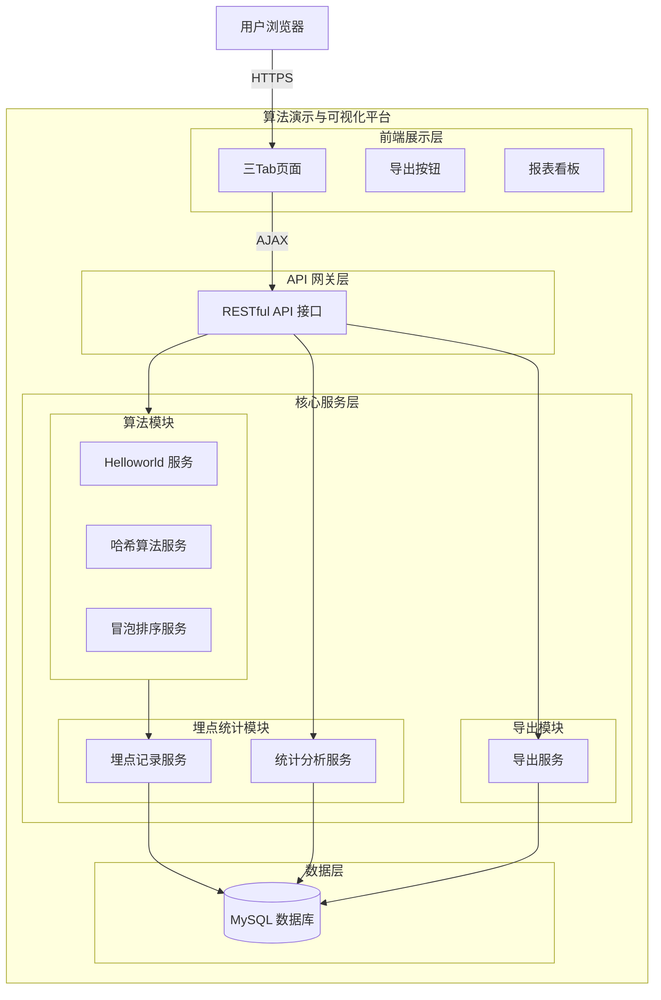
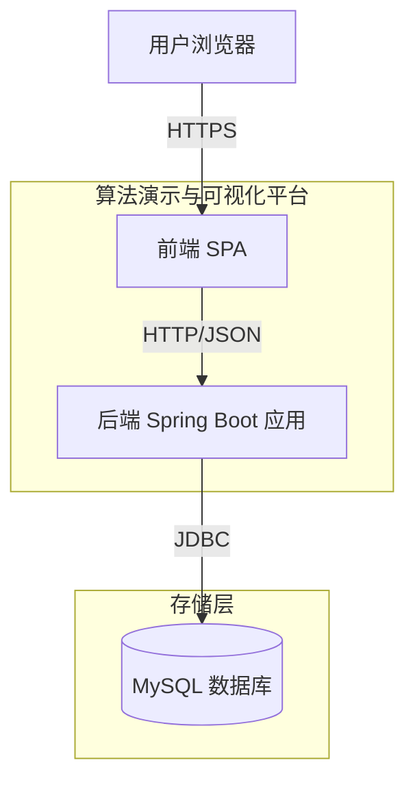
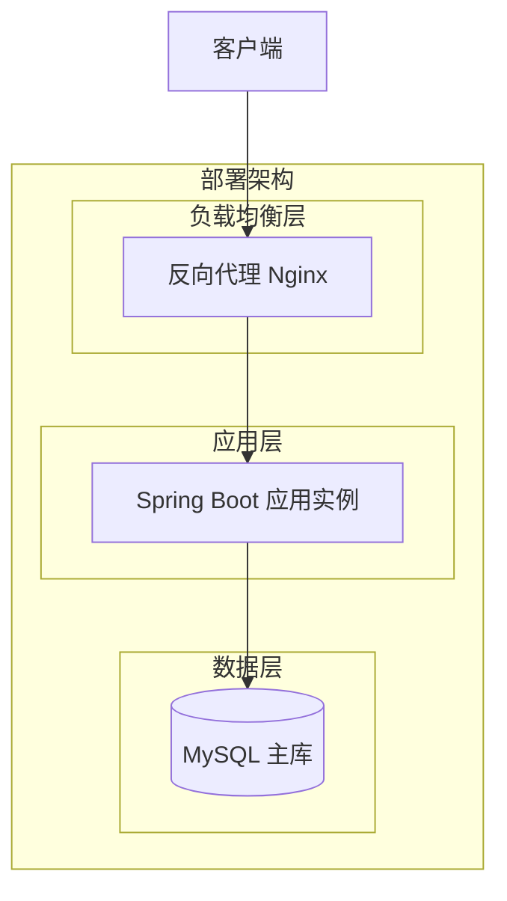
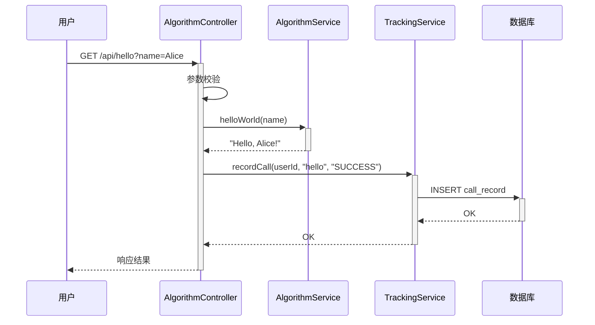
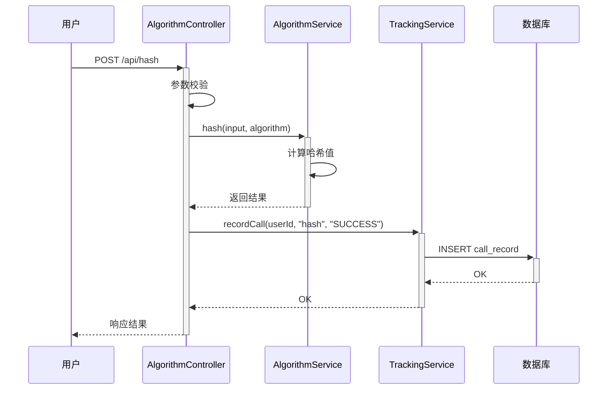
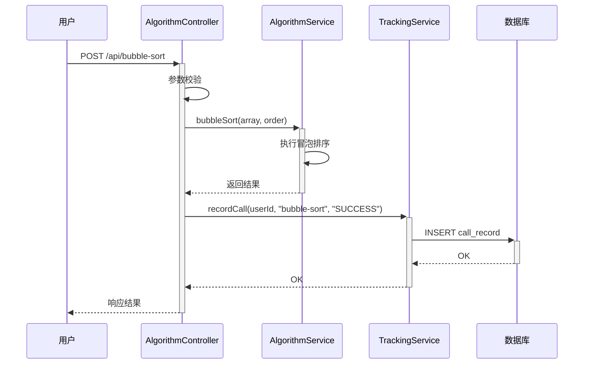
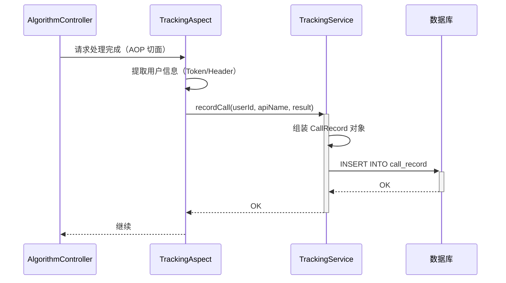
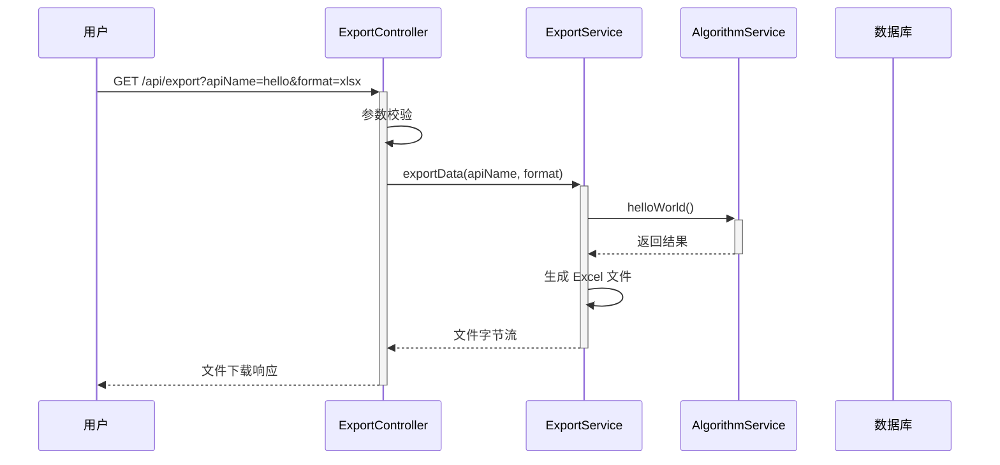

> **文档元信息**
>
> | 项目 | 内容 |
> |------|------|
> | 文档版本 | v1.0 |
> | 作者 | DTCoder |
> | 创建日期 | 2026-08-24 |
> | 需求来源 | 需求描述：分别写三个接口helloworld、哈希算法以及冒泡排序；前端新增页面，三Tab展示；导出按钮；埋点与可视化报表 |
> | 评审状态 | 待评审 |

# 算法演示与可视化平台 系分设计

## 1. 需求与范围
### 背景与目标
本系统旨在提供一个多功能的算法演示与可视化平台。用户可通过前端页面调用三个不同的后端接口（helloworld、哈希算法、冒泡排序），并在三个 Tab 页中分别查看执行结果。同时，系统提供导出功能、调用埋点与可视化报表分析能力，帮助用户直观了解接口调用情况。

### 核心功能
1. 三个后端接口：helloworld（返回问候信息）、哈希算法（计算并返回哈希值）、冒泡排序（对输入数组排序）
2. 前端页面：三个 Tab 分别展示三个接口的执行结果
3. 导出功能：导出各页面展示结果
4. 埋点功能：记录每次接口调用的调用人和调用次数
5. 报表可视化：按人员类型、人员层级、人员部门等维度，以折线图、饼图、柱状图展示调用情况

### 约束与非功能要求
- 后端接口需支持 RESTful 风格
- 前端需支持多 Tab 切换展示
- 导出支持 Excel 格式
- 图表需支持至少三种展示形式（折线图、饼图、柱状图）
- 埋点数据需支持多维度分析

### 排除范围
- 不涉及用户认证与权限管理系统（假设已有统一登录系统）
- 不涉及分布式部署（假设单体应用）
- 不涉及大规模数据存储

### 需求功能清单与优先级

| 编号 | 功能点 | 优先级 | PRD 原始描述 | 备注 |
|------|--------|--------|-------------|------|
| F01 | helloworld 接口 | P0 | 写一个 helloworld 接口 | 后端接口，返回问候语 |
| F02 | 哈希算法接口 | P0 | 写一个哈希算法接口 | 后端接口，计算并返回哈希值 |
| F03 | 冒泡排序接口 | P0 | 写一个冒泡排序接口 | 后端接口，对输入数组排序 |
| F04 | 前端三 Tab 页面 | P0 | 前端新增页面，三个 tab 分别展示不同执行结果 | 前端页面展示 |
| F05 | 导出功能 | P0 | 新增导出按钮，后台提供导出接口，支持导出各页面展示结果 | 前端按钮 + 后端导出接口 |
| F06 | 后端埋点 | P0 | 后端做埋点，获取调用次数和调用人 | 记录调用信息 |
| F07 | 前端报表可视化 | P0 | 前端可视化报表，按人员类型/层级/部门等维度用折线图/饼图/柱状图展示 | 图表展示埋点统计 |

### 假设与待确认项

| 编号 | 假设/待确认内容 | 当前假设 | 确认状态 |
|------|-----------------|----------|----------|
| A01 | 后端技术栈为 Java Spring Boot | 假设使用 Spring Boot 框架 | 待确认 |
| A02 | 前端技术栈为 React/Vue | 假设使用通用 SPA 框架 | 待确认 |
| A03 | 调用人信息通过请求头或 Token 获取 | 假设由统一登录中间件提供 | 待确认 |
| A04 | 人员类型/层级/部门信息从用户信息中获取 | 假设用户信息中包含这些字段 | 待确认 |
| A05 | 冒泡排序接口输入为整数数组 | 假设输入格式为 JSON 数组 | 待确认 |
| A06 | 哈希算法使用 SHA-256 | 假设使用 SHA-256 算法 | 待确认 |

## 2. 架构与模块
### 功能架构


**模块清单**

| 模块 | 职责 | 依赖 |
|------|------|------|
| 算法模块（Algorithm） | 提供 helloworld、哈希、冒泡排序三个接口实现 | 无 |
| 埋点统计模块（Tracking） | 记录接口调用次数/调用人，提供多维度统计查询 | 数据库 |
| 导出模块（Export） | 提供各页面展示结果的 Excel 导出功能 | 算法模块、埋点统计模块 |
| 前端展示模块（Frontend） | 三 Tab 页面展示、图表可视化、导出触发 | 所有后端 API |

### 应用集成架构


**集成关系说明：**

| 调用方 | 被调用方 | 协议 | 接口类型 | 说明 |
|--------|----------|------|----------|------|
| 用户浏览器 | 前端 SPA | HTTPS | 静态资源 | 页面加载 |
| 前端 SPA | 后端 Spring Boot | HTTP | REST API | 业务数据交互 |
| 后端 Spring Boot | MySQL 数据库 | JDBC | SQL | 埋点数据存储与查询 |

### 部署架构


**部署说明：**
- **负载均衡层**：Nginx 反向代理，提供静态资源托管和 API 路由转发
- **应用层**：单实例 Spring Boot 应用，集成了前后端
- **数据层**：单节点 MySQL 数据库，存储埋点统计信息

## 3. 数据模型与存储
### 实体清单

| 实体名称 | 实体说明 | 所属模块 | 与其他实体的关系 |
|----------|----------|----------|-----------------|
| CallRecord | 接口调用记录 | 埋点统计模块 | 多对一关联 UserInfo |
| Department | 部门信息 | 埋点统计模块 | 一对多关联 UserInfo |

### 实体关系图


**模型说明：**
- **CallRecord**：记录每次接口调用的详细信息，包括调用接口、调用时间、调用人、调用结果等
- **Department**：部门层级结构，支持按部门维度统计分析

## 4. 接口设计

### 4.1 oneapi（Web 控制台接口）

| 编号 | 接口名称 | 方法 | 路径 | 模块 |
|------|----------|------|------|------|
| W01 | helloworld 接口 | GET | /api/hello | 算法模块 |
| W02 | 哈希算法接口 | POST | /api/hash | 算法模块 |
| W03 | 冒泡排序接口 | POST | /api/bubble-sort | 算法模块 |
| W04 | 导出接口 | GET | /api/export | 导出模块 |
| W05 | 调用统计报表接口 | GET | /api/tracking/statistics | 埋点统计模块 |
| W06 | 调用记录明细接口 | GET | /api/tracking/records | 埋点统计模块 |

### 4.2 OpenAPI（对外接口）

本项不适用，原因：当前系统仅面向内部用户通过 Web 控制台使用，无需对外暴露 OpenAPI 接口。

### 4.3 内部接口（Service 层）

| 编号 | 接口名称 | 类 | 方法签名 |
|------|----------|------|----------|
| S01 | 记录调用埋点 | TrackingService | recordCall(String userId, String apiName, String result) |
| S02 | 查询调用统计 | TrackingService | getStatistics(StatisticsQuery query) |
| S03 | 导出数据查询 | ExportService | getExportData(ExportRequest request) |
| S04 | HelloWorld 服务 | AlgorithmService | helloWorld(String name) |
| S05 | 哈希计算服务 | AlgorithmService | hash(String input, String algorithm) |
| S06 | 冒泡排序服务 | AlgorithmService | bubbleSort(int[] array, String order) |

### 4.4 集成接口（Integration 层）

本项不适用，原因：当前系统无外部系统集成需求。

## 5. 功能模块设计

### 全局约定

**错误码格式：** `{MODULE}_{SEQ}`，如 `ALGO_001`、`TRACK_001`

**通用错误码：**

| 错误码 | 说明 |
|--------|------|
| SUCCESS | 成功 |
| SYS_001 | 系统内部错误 |
| PARAM_001 | 参数校验失败 |

**通用出参结构：**
```json
{
  "code": "SUCCESS",
  "msg": "操作成功",
  "data": {}
}
```

---

### 5.1 算法模块（Algorithm Module）

#### 5.1.1 表结构设计

本模块为纯计算逻辑，无状态数据存储，不涉及表结构设计。

#### 5.1.2 接口详细设计

##### W01 helloworld 接口

- **URI**: GET /api/hello
- **描述**: 返回问候信息
- **入参**:

| 参数名称 | 类型 | 是否必填 | 描述 |
|----------|------|----------|------|
| name | String | 否 | 用户名称，默认为 "World" |

- **出参**:

| 参数名称 | 类型 | 描述 |
|----------|------|------|
| code | String | 结果码 |
| msg | String | 提示信息 |
| data | Object | 业务数据 |

- **data 结构**:

| 参数名称 | 类型 | 描述 |
|----------|------|------|
| message | String | 问候语 |
| timestamp | String | 服务器时间戳 |

- **错误码**:

| 错误码 | 说明 |
|--------|------|
| SUCCESS | 成功 |

- **业务规则**: 无特殊业务规则，直接返回问候语
- **请求示例**: GET /api/hello?name=Alice
- **响应示例**:
```json
{
  "code": "SUCCESS",
  "msg": "操作成功",
  "data": {
    "message": "Hello, Alice!",
    "timestamp": "2026-08-24T12:00:00Z"
  }
}
```

##### W02 哈希算法接口

- **URI**: POST /api/hash
- **描述**: 计算输入字符串的哈希值
- **入参**:

| 参数名称 | 类型 | 是否必填 | 描述 |
|----------|------|----------|------|
| input | String | 是 | 待计算哈希的输入字符串 |
| algorithm | String | 否 | 哈希算法，默认 SHA-256，支持 MD5/SHA-256/SHA-512 |

- **出参**:

| 参数名称 | 类型 | 描述 |
|----------|------|------|
| code | String | 结果码 |
| msg | String | 提示信息 |
| data | Object | 业务数据 |

- **data 结构**:

| 参数名称 | 类型 | 描述 |
|----------|------|------|
| input | String | 原始输入 |
| algorithm | String | 使用的哈希算法 |
| hashValue | String | 哈希值（十六进制） |
| timestamp | String | 服务器时间戳 |

- **错误码**:

| 错误码 | 说明 |
|--------|------|
| SUCCESS | 成功 |
| ALGO_001 | 不支持的哈希算法 |

- **业务规则**: 仅支持 MD5、SHA-256、SHA-512 三种算法
- **请求示例**:
```json
{
  "input": "Hello World",
  "algorithm": "SHA-256"
}
```
- **响应示例**:
```json
{
  "code": "SUCCESS",
  "msg": "操作成功",
  "data": {
    "input": "Hello World",
    "algorithm": "SHA-256",
    "hashValue": "a591a6d40bf420404a011733cfb7b190d62c65bf0bcda32b57b277d9ad9f146e",
    "timestamp": "2026-08-24T12:00:00Z"
  }
}
```

##### W03 冒泡排序接口

- **URI**: POST /api/bubble-sort
- **描述**: 对输入数组进行冒泡排序
- **入参**:

| 参数名称 | 类型 | 是否必填 | 描述 |
|----------|------|----------|------|
| array | int[] | 是 | 待排序的整数数组 |
| order | String | 否 | 排序顺序，默认 "asc"，支持 asc/desc |

- **出参**:

| 参数名称 | 类型 | 描述 |
|----------|------|------|
| code | String | 结果码 |
| msg | String | 提示信息 |
| data | Object | 业务数据 |

- **data 结构**:

| 参数名称 | 类型 | 描述 |
|----------|------|------|
| originalArray | int[] | 原始数组 |
| sortedArray | int[] | 排序后数组 |
| order | String | 排序顺序 |
| sortTime | long | 排序耗时（毫秒） |
| timestamp | String | 服务器时间戳 |

- **错误码**:

| 错误码 | 说明 |
|--------|------|
| SUCCESS | 成功 |
| PARAM_001 | 数组为空或参数无效 |

- **业务规则**: 输入数组长度不超过 1000
- **请求示例**:
```json
{
  "array": [5, 3, 8, 4, 2],
  "order": "asc"
}
```
- **响应示例**:
```json
{
  "code": "SUCCESS",
  "msg": "操作成功",
  "data": {
    "originalArray": [5, 3, 8, 4, 2],
    "sortedArray": [2, 3, 4, 5, 8],
    "order": "asc",
    "sortTime": 0,
    "timestamp": "2026-08-24T12:00:00Z"
  }
}
```

#### 5.1.3 子功能详细设计

##### 5.1.3.1 Helloworld 功能（F01）

**处理时序图：**


**业务规则：**
| 规则编号 | 规则描述 | 校验时机 | 不满足时的处理 |
|----------|----------|----------|--------------|
| R01 | name 参数长度不超过 100 字符 | 请求时 | 返回 PARAM_001 |

**异常场景：**
| 异常场景 | 处理方式 |
|----------|----------|
| 埋点写入失败 | 不影响主流程，记录日志后继续返回结果 |

##### 5.1.3.2 哈希算法功能（F02）

**处理时序图：**


**业务规则：**
| 规则编号 | 规则描述 | 校验时机 | 不满足时的处理 |
|----------|----------|----------|--------------|
| R02 | input 不可为空 | 请求时 | 返回 PARAM_001 |
| R03 | algorithm 仅支持 MD5/SHA-256/SHA-512 | 请求时 | 返回 ALGO_001 |

**异常场景：**
| 异常场景 | 处理方式 |
|----------|----------|
| 不支持的哈希算法 | 返回 ALGO_001 错误码 |
| 输入字符串过长（>10KB） | 截断处理或返回 PARAM_001 |

##### 5.1.3.3 冒泡排序功能（F03）

**处理时序图：**


**业务规则：**
| 规则编号 | 规则描述 | 校验时机 | 不满足时的处理 |
|----------|----------|----------|--------------|
| R04 | array 不可为空且长度 ≥ 1 | 请求时 | 返回 PARAM_001 |
| R05 | array 长度 ≤ 1000 | 请求时 | 返回 PARAM_001 |
| R06 | order 仅支持 asc/desc | 请求时 | 默认为 asc |

**异常场景：**
| 异常场景 | 处理方式 |
|----------|----------|
| 数组为空 | 返回 PARAM_001 |
| 数组包含非数字元素 | 类型校验失败，返回 PARAM_001 |

---

### 5.2 埋点统计模块（Tracking Module）

#### 5.2.1 表结构设计

##### 5.2.1.1 调用记录表（call_record）

| 字段名 | 数据类型 | 约束 | 默认值 | 说明 |
|--------|----------|------|--------|------|
| id | bigint | PK, 自增 | - | 系统自增主键 |
| user_id | varchar(64) | NOT NULL | - | 调用人用户ID |
| user_name | varchar(100) | NOT NULL | - | 调用人姓名 |
| user_type | varchar(32) | NOT NULL | - | 人员类型（如：正式/实习/外包） |
| user_level | varchar(32) | NOT NULL | - | 人员层级（如：P5/P6/P7/M1） |
| user_dept_id | bigint | NOT NULL | - | 人员所属部门ID |
| api_name | varchar(64) | NOT NULL | - | 调用的接口名称（hello/hash/bubble-sort） |
| call_result | varchar(16) | NOT NULL | - | 调用结果（SUCCESS/FAIL） |
| call_time | datetime | NOT NULL | CURRENT_TIMESTAMP | 调用时间 |
| gmt_create | datetime | NOT NULL | CURRENT_TIMESTAMP | 创建时间 |
| gmt_modified | datetime | NOT NULL | CURRENT_TIMESTAMP | 修改时间 |

**索引：**
- PK: `pk_call_record_id` (id)
- IDX: `idx_call_record_api_name` (api_name)
- IDX: `idx_call_record_user_id` (user_id)
- IDX: `idx_call_record_call_time` (call_time)
- IDX: `idx_call_record_user_type` (user_type)
- IDX: `idx_call_record_user_level` (user_level)
- IDX: `idx_call_record_dept_id` (user_dept_id)

##### 5.2.1.2 部门信息表（department）

| 字段名 | 数据类型 | 约束 | 默认值 | 说明 |
|--------|----------|------|--------|------|
| id | bigint | PK, 自增 | - | 系统自增主键 |
| dept_name | varchar(100) | NOT NULL | - | 部门名称 |
| parent_id | bigint | NOT NULL | 0 | 父部门ID，0表示根部门 |
| dept_level | int | NOT NULL | 1 | 部门层级 |
| gmt_create | datetime | NOT NULL | CURRENT_TIMESTAMP | 创建时间 |
| gmt_modified | datetime | NOT NULL | CURRENT_TIMESTAMP | 修改时间 |

**索引：**
- PK: `pk_department_id` (id)
- IDX: `idx_department_parent_id` (parent_id)

##### 5.2.1.3 枚举与常量定义

| 枚举名称 | 取值 | 含义 | 关联字段 |
|----------|------|------|----------|
| ApiNameEnum | hello | helloworld 接口 | call_record.api_name |
| ApiNameEnum | hash | 哈希算法接口 | call_record.api_name |
| ApiNameEnum | bubble-sort | 冒泡排序接口 | call_record.api_name |
| CallResultEnum | SUCCESS | 调用成功 | call_record.call_result |
| CallResultEnum | FAIL | 调用失败 | call_record.call_result |

#### 5.2.2 接口详细设计

##### W05 调用统计报表接口

- **URI**: GET /api/tracking/statistics
- **描述**: 获取调用统计报表数据，支持多维度聚合
- **入参**:

| 参数名称 | 类型 | 是否必填 | 描述 |
|----------|------|----------|------|
| dimension | String | 是 | 统计维度：user_type（人员类型）/ user_level（人员层级）/ user_dept（部门） |
| chartType | String | 否 | 图表类型：line（折线图）/ pie（饼图）/ bar（柱状图），默认 bar |
| startTime | String | 否 | 开始时间，格式 yyyy-MM-dd |
| endTime | String | 否 | 结束时间，格式 yyyy-MM-dd |

- **出参**:

| 参数名称 | 类型 | 描述 |
|----------|------|------|
| code | String | 结果码 |
| msg | String | 提示信息 |
| data | Object | 业务数据 |

- **data 结构**:

| 参数名称 | 类型 | 描述 |
|----------|------|------|
| dimension | String | 统计维度 |
| chartType | String | 图表类型 |
| series | Array | 图表数据系列 |
| labels | Array | 维度标签 |

- **错误码**:

| 错误码 | 说明 |
|--------|------|
| SUCCESS | 成功 |
| TRACK_001 | 不支持的统计维度 |

- **业务规则**: 
  - 按指定维度 GROUP BY 统计调用次数
  - 折线图按时间维度展示趋势
  - 饼图按占比展示分布
  - 柱状图按数量对比展示

- **请求示例**: GET /api/tracking/statistics?dimension=user_type&chartType=bar
- **响应示例**:
```json
{
  "code": "SUCCESS",
  "msg": "操作成功",
  "data": {
    "dimension": "user_type",
    "chartType": "bar",
    "labels": ["正式", "实习", "外包"],
    "series": [
      {
        "name": "调用次数",
        "data": [150, 45, 30]
      }
    ]
  }
}
```

##### W06 调用记录明细接口

- **URI**: GET /api/tracking/records
- **描述**: 获取调用记录明细列表
- **入参**:

| 参数名称 | 类型 | 是否必填 | 描述 |
|----------|------|----------|------|
| page | int | 否 | 页码，默认 1 |
| size | int | 否 | 每页条数，默认 20 |
| apiName | String | 否 | 接口名称过滤 |
| startTime | String | 否 | 开始时间 |
| endTime | String | 否 | 结束时间 |

- **出参**: 分页列表 + 统计信息

#### 5.2.3 子功能详细设计

##### 5.2.3.1 埋点记录功能（F06）

**处理时序图：**


**埋点触发方式方案对比：**

| 方案 | 实现方式 | 优点 | 缺点 |
|------|----------|------|------|
| 方案A：AOP拦截器（推荐） | 使用 Spring AOP 对 Controller 方法进行切面拦截 | 无侵入、统一管理、便于扩展 | 需要额外配置切面 |
| 方案B：手动埋点 | 在每个接口方法中手动调用 TrackingService | 控制精确 | 代码侵入性强、易遗漏 |
| 方案C：过滤器 | 使用 Servlet Filter 统一拦截 | 粒度最粗、覆盖最全 | 难以获取业务层面的上下文 |

**推荐方案**：方案A（AOP拦截器），理由：与业务代码解耦，统一管理埋点逻辑，便于后续扩展其他维度。

**业务规则：**
| 规则编号 | 规则描述 | 校验时机 | 不满足时的处理 |
|----------|----------|----------|--------------|
| R07 | 埋点采用异步方式写入，不影响主流程响应时间 | 调用时 | 异步线程池满时降级，日志记录 |
| R08 | 调用人信息从请求上下文获取 | 调用时 | 无法获取时记录为"anonymous" |

**异常场景：**
| 异常场景 | 处理方式 |
|----------|----------|
| 数据库写入失败 | 异步降级，记录日志，不影响主流程 |
| 用户信息获取失败 | 使用默认值 "anonymous" 作为调用人 |

---

### 5.3 导出模块（Export Module）

#### 5.3.1 表结构设计

本模块为导出功能，无独立数据存储，依赖其他模块数据。

#### 5.3.2 接口详细设计

##### W04 导出接口

- **URI**: GET /api/export
- **描述**: 导出各页面展示结果，支持按接口和格式导出
- **入参**:

| 参数名称 | 类型 | 是否必填 | 描述 |
|----------|------|----------|------|
| apiName | String | 是 | 导出的接口名称：hello/hash/bubble-sort/all |
| format | String | 否 | 导出格式，默认 "xlsx"，支持 xlsx/csv |

- **出参**: 文件流（application/octet-stream）

| 参数名称 | 类型 | 描述 |
|----------|------|------|
| Content-Type | String | application/octet-stream |
| Content-Disposition | String | attachment; filename=export_{apiName}_{timestamp}.xlsx |

- **错误码**:

| 错误码 | 说明 |
|--------|------|
| SUCCESS | 成功 |
| EXPORT_001 | 导出数据为空 |
| EXPORT_002 | 不支持的导出格式 |

- **业务规则**: 
  - 导出内容包含接口名称、输入参数、执行结果、调用时间等
  - 导出文件名格式：export_{apiName}_{timestamp}.xlsx
  - 使用 Apache POI 生成 Excel 文件

- **请求示例**: GET /api/export?apiName=hello&format=xlsx
- **响应**: 直接返回文件字节流

#### 5.3.3 子功能详细设计

##### 5.3.3.1 导出功能（F05）

**处理时序图：**


**业务规则：**
| 规则编号 | 规则描述 | 校验时机 | 不满足时的处理 |
|----------|----------|----------|--------------|
| R09 | apiName 为 all 时导出所有接口结果 | 请求时 | 正常执行 |
| R10 | 导出文件大小不超过 10MB | 生成时 | 超过时分片导出 |

**异常场景：**
| 异常场景 | 处理方式 |
|----------|----------|
| 数据为空 | 返回 EXPORT_001 |
| 文件生成失败 | 返回 SYS_001 |
| 不支持的格式 | 返回 EXPORT_002 |

---

### 5.4 前端展示模块（Frontend Module）

#### 5.4.1 页面结构设计

**页面布局：**
```
+-------------------------------------------------------+
|  算法演示与可视化平台                                    |
+-------------------------------------------------------+
|  [Tab: HelloWorld]  [Tab: 哈希算法]  [Tab: 冒泡排序]   |
+-------------------------------------------------------+
|                                                        |
|  (Tab 内容区域 - 根据选中 Tab 展示对应接口的调用结果)     |
|                                                        |
|  [输入参数] [执行按钮]                                  |
|  [结果展示区]                                          |
|                                                        |
+-------------------------------------------------------+
|  [导出按钮]                                            |
+-------------------------------------------------------+
|  报表看板                                               |
|  [折线图] [饼图] [柱状图] 切换按钮                       |
|  [图表展示区]                                          |
|  维度选择：[人员类型] [人员层级] [人员部门]               |
+-------------------------------------------------------+
```

#### 5.4.2 子功能详细设计

##### 5.4.2.1 Tab 页面展示功能（F04）

**业务规则：**
| 规则编号 | 规则描述 | 校验时机 | 不满足时的处理 |
|----------|----------|----------|--------------|
| R11 | 切换 Tab 时保留其他 Tab 的已加载结果 | 切换时 | 缓存处理 |
| R12 | 首次加载时默认选中第一个 Tab | 页面加载时 | 默认选中 HelloWorld |

##### 5.4.2.2 图表可视化功能（F07）

**图表类型切换：**
- 折线图：展示调用次数随时间变化趋势（按天/周聚合）
- 饼图：展示各维度下调用次数占比分布
- 柱状图：展示各维度下调用次数对比

**维度选择：**
- 人员类型（user_type）：正式员工、实习生、外包人员
- 人员层级（user_level）：P5、P6、P7、M1、M2 等
- 人员部门（user_dept）：各部门调用次数统计

**处理时序图：**
```mermaid
sequenceDiagram
    participant C as 用户
    participant FE as 前端页面
    participant Ctrl as TrackingController
    participant Svc as TrackingService
    participant DB as 数据库

    C->>FE: 选择维度 + 图表类型
    FE->>+Ctrl: GET /api/tracking/statistics?dimension=user_type&chartType=bar
    Ctrl->>+Svc: getStatistics(query)
    Svc->>+DB: SELECT COUNT(*), user_type FROM call_record GROUP BY user_type
    DB-->>-Svc: 统计数据
    Svc-->>-Ctrl: 返回统计结果
    Ctrl-->>-FE: 返回 JSON 数据
    FE->>FE: 使用 ECharts 渲染图表
    FE-->>-C: 展示图表
```

**业务规则：**
| 规则编号 | 规则描述 | 校验时机 | 不满足时的处理 |
|----------|----------|----------|--------------|
| R13 | 无数据时展示空状态提示 | 查询后 | 展示"暂无调用数据" |
| R14 | 图表类型切换时保留当前维度 | 切换时 | 自动刷新图表 |
| R15 | 维度切换时保留当前图表类型 | 切换时 | 自动刷新图表 |

---

### 跨模块时序图

```mermaid
sequenceDiagram
    participant C as 用户浏览器
    participant FE as 前端
    participant Algo as 算法模块
    participant Track as 埋点统计模块
    participant Export as 导出模块
    participant DB as 数据库

    Note over C,DB: 用户操作流程

    C->>FE: 访问页面
    FE->>FE: 渲染三 Tab 页面

    Note over C,DB: 调用接口示例
    C->>FE: 点击执行按钮（如 HelloWorld）
    FE->>+Algo: GET /api/hello
    Algo->>Algo: 执行算法
    Algo->>+Track: 异步记录埋点
    Track->>+DB: INSERT call_record
    DB-->>-Track: OK
    Track-->>-Algo: OK
    Algo-->>-FE: 返回结果
    FE-->>-C: 展示结果

    Note over C,DB: 导出操作
    C->>FE: 点击导出按钮
    FE->>+Export: GET /api/export
    Export->>Export: 生成 Excel
    Export-->>-FE: 文件流
    FE-->>-C: 下载文件

    Note over C,DB: 查看报表
    C->>FE: 选择维度/图表类型
    FE->>+Track: GET /api/tracking/statistics
    Track->>+DB: SELECT 统计查询
    DB-->>-Track: 结果
    Track-->>-FE: 统计数据
    FE->>FE: 渲染图表（ECharts）
    FE-->>-C: 展示图表
```

## 6. 非功能性需求设计
### 6.1 高可用性
- 本系统为演示型应用，服务可用性要求为 99.9%
- 单实例部署，Nginx 反向代理提供故障转移
- 埋点写入采用异步方式，数据库不可用时不影响主流程

### 6.2 可扩展性
- 后端采用 Spring Boot 分层架构，新增接口只需新增 Controller + Service
- 前端采用组件化设计，新增 Tab 只需新增页面组件
- 图表维度可扩展，新增维度只需在数据库增加字段和前端维度选项
- 导出格式可扩展，支持增加 CSV/PDF 等格式

### 6.3 稳定性/可靠性
- 冒泡排序接口限制输入数组长度 ≤ 1000，防止耗时过长
- 哈希算法接口限制输入字符串长度 ≤ 10KB
- 所有接口统一异常处理，返回规范的错误码
- 埋点数据写入使用异步线程池，线程池满时降级写入日志

### 6.4 安全性设计
#### 6.4.1 账户系统方案
本项不适用，原因：假设已有统一登录系统，本系统不涉及账户注册/登录功能。

#### 6.4.2 授权&访问控制
##### 6.4.2.1 是否实现水平权限检查
本项不适用，原因：系统为演示型应用，所有用户共享同一数据视图，无需水平权限检查。

##### 6.4.2.2 是否实现垂直权限检查
本项不适用，原因：系统功能对所有用户开放，无角色权限区分。

##### 6.4.2.3 是否检查登录态
- 假设已有统一登录中间件，通过请求头或 Token 传递用户信息
- 后端接口通过拦截器统一解析用户信息

#### 6.4.3 数据防护方案
##### 6.4.3.1 是否对敏感数据加密存储
本项不适用，原因：系统不涉及身份证、手机号等敏感个人信息。

##### 6.4.3.2 是否对敏感数据展示进行脱敏
本项不适用，原因：系统展示的仅为算法执行结果和调用统计，不含敏感信息。

### 6.5 监控/统计/日志/告警
- 使用 Spring Boot Actuator 提供健康检查端点
- 接口调用日志记录：请求路径、参数、耗时、结果
- 埋点统计日志：记录每次埋点写入成功/失败
- 异步线程池监控：队列积压告警

## 7. 变更三板斧
### 7.1 可监控
- **接口调用监控**：通过 AOP 拦截器记录每个接口的调用次数、耗时、成功/失败状态
- **埋点写入监控**：监控异步线程池的队列大小、任务执行状态、失败次数
- **数据库监控**：使用 Druid 连接池监控，跟踪慢查询
- **业务监控**：统计各接口的调用量趋势、各维度调用分布

### 7.2 可灰度
- 新增接口可通过 URL 前缀或参数控制灰度范围
- 前端功能可通过 Feature Flag 控制是否展示
- 假设：灰度方案使用 Nginx 按比例分流或 Header 匹配

### 7.3 可应急
- **开关控制**：埋点功能提供开关配置，可在配置中心关闭埋点采集
- **导出功能降级**：导出数据量过大时，限制导出条数或分片导出
- **回滚方案**：如新增功能出现异常，可通过回滚发布版本恢复
- **兼容性**：新增表通过 flyway 或 liquibase 管理，回滚时同步回滚表结构