> **文档元信息**
>
> | 项目 | 内容 |
> |------|------|
> | 文档版本 | v1.0 |
> | 作者 | DTCoder |
> | 创建日期 | 2026-08-24 |
> | 需求来源 | 需求描述：分别写三个接口helloworld、哈希算法以及冒泡排序 + 前端页面 + 导出 + 埋点可视化 |
> | 评审状态 | 待评审 |

# 三接口演示系统 — 系分设计

## 1. 需求与范围

### 背景与目标

构建一个前后端分离的全链路演示应用，包含：
- **后端（manyu_test 仓 / Python FastAPI）**：提供三个核心 API 接口（helloworld、哈希算法、冒泡排序），导出接口，以及调用埋点记录与统计接口
- **前端（manyu_test1 仓 / Vue 3 + Vite）**：Tab 页面展示各接口结果，导出按钮，以及埋点数据的可视化报表（折线图、饼图、柱状图）

### 核心功能

1. 后端三个核心接口：GET /api/helloworld、GET /api/hash、POST /api/bubble-sort
2. 后端导出接口：GET /api/export?tab=X&format=csv
3. 后端埋点记录：POST /api/track/event
4. 后端统计接口：GET /api/track/stats?dimension=X
5. 前端三个 Tab 页面（Helloworld、哈希、冒泡排序）
6. 前端导出按钮
7. 前端报表面板（折线图、饼图、柱状图）

### 约束与非功能要求

- 后端端口：8000，前端开发服务器端口：5173
- 所有 API 路径以 /api/ 开头
- 统一错误响应格式：`{"success": false, "error_code": "ERR_xxxxx", "message": "...", "detail": null}`
- 冒泡排序复用已有 bubble_sort.py 中的 bubble_sort 函数
- 前端使用 Vue 3 Composition API + `<script setup>` 语法，不使用 TypeScript
- 图表库仅使用 ECharts

### 排除范围

- 不涉及用户认证与登录系统（调用人通过请求头模拟）
- 不涉及数据持久化到 MySQL 等重型数据库（使用 SQLite）
- 不涉及部署运维（仅开发环境运行）
- 不涉及单元测试与集成测试自动化

### 需求功能清单与优先级

| 编号 | 功能点 | 优先级 | PRD 原始描述 | 备注 |
|------|--------|--------|-------------|------|
| F01 | 后端 helloworld 接口 | P0 | 分别写三个接口helloworld | GET /api/helloworld |
| F02 | 后端哈希算法接口 | P0 | 分别写三个接口哈希算法 | GET /api/hash?text=xxx |
| F03 | 后端冒泡排序接口 | P0 | 分别写三个接口冒泡排序 | POST /api/bubble-sort，复用已有 bubble_sort.py |
| F04 | 前端三个 Tab 页面 | P0 | 前端新增一个页面，有三个tab分别展示不同的执行结果 | Helloworld/哈希/冒泡排序 |
| F05 | 导出按钮 + 后端导出接口 | P0 | 新增导出按钮，后台提供导出接口，支持导出各个页面的展示结果 | GET /api/export?tab=X&format=csv |
| F06 | 后端埋点记录 | P0 | 后端再做个埋点，获取调用次数和调用人 | POST /api/track/event |
| F07 | 后端统计接口 | P0 | 获取调用情况（根据不同的维度） | GET /api/track/stats?dimension=X |
| F08 | 前端折线图（时间趋势） | P0 | 折线图展示形式 | 调用次数/时间趋势 |
| F09 | 前端饼图（人员类型/部门） | P0 | 饼图展示形式 | 人员类型分布、部门分布 |
| F10 | 前端柱状图（人员层级） | P0 | 柱状图展示形式 | 人员层级分布 |

### 假设与待确认项

| 编号 | 假设/待确认内容 | 当前假设 | 确认状态 |
|------|-----------------|----------|----------|
| A01 | 调用人信息通过请求头 X-Caller-Info 传入 | 已确认 | 已确认 |
| A02 | 技术栈选型（FastAPI/Vue3/ECharts/SQLite） | 已确认 | 已确认 |
| A03 | 导出格式使用 CSV | 已确认 | 已确认 |
| A04 | 埋点数据存储使用 SQLite | 已确认 | 已确认 |
| A05 | 冒泡排序复用已有 bubble_sort.py | 已确认 | 已确认 |

## 2. 架构与模块

### 功能架构

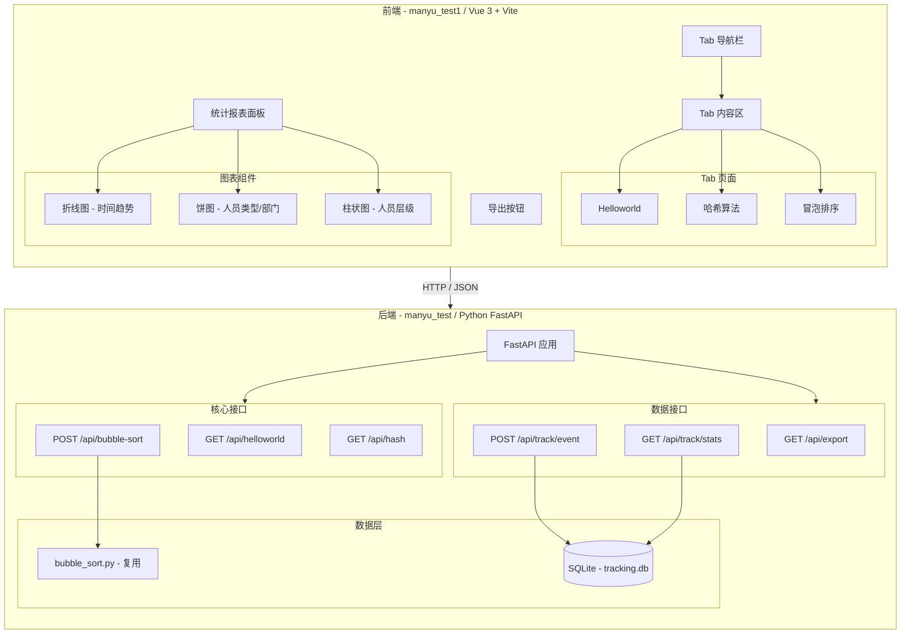

**模块清单**

| 模块 | 职责 | 仓库 | 依赖 |
|------|------|------|------|
| 核心接口模块 | 提供 helloworld、哈希、冒泡排序三个 API | manyu_test | bubble_sort.py |
| 埋点统计模块 | 记录调用事件、按维度聚合统计 | manyu_test | SQLite |
| 导出模块 | 按 Tab 导出 CSV 数据 | manyu_test | 核心接口模块 |
| Tab 页面模块 | 三个 Tab 展示各自接口结果 | manyu_test1 | 后端 API |
| 导出按钮模块 | 触发导出操作 | manyu_test1 | 后端导出接口 |
| 图表报表模块 | 折线图/饼图/柱状图展示统计 | manyu_test1 | 后端统计接口 |

### 应用集成架构

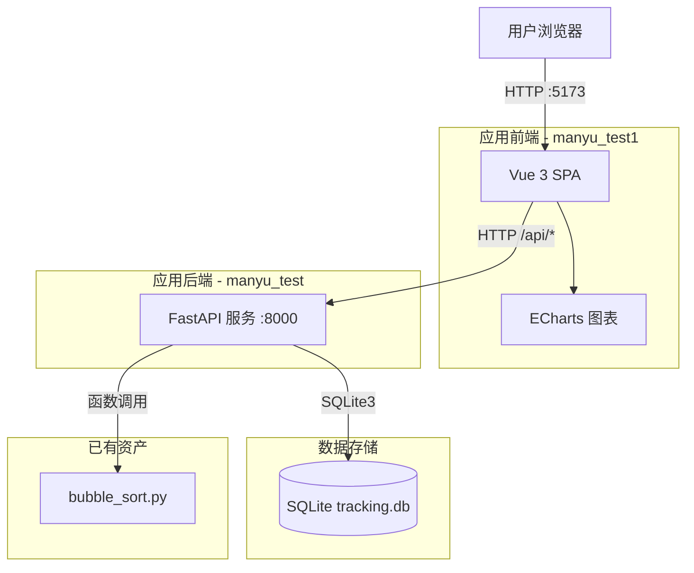

**集成关系说明：**

| 调用方 | 被调用方 | 协议 | 接口类型 | 说明 |
|--------|----------|------|----------|------|
| 用户浏览器 | Vue 3 SPA | HTTP | 页面访问 | 开发环境 localhost:5173 |
| Vue 3 SPA | FastAPI 后端 | HTTP | REST API | 前端通过 /api/* 代理调用后端 |
| FastAPI 后端 | bubble_sort.py | Python 函数调用 | 内部调用 | 冒泡排序算法复用已有实现 |
| FastAPI 后端 | SQLite | SQLite3 | 数据库 | 埋点事件持久化存储 |

### 部署架构

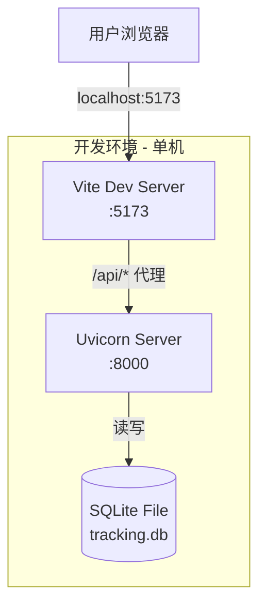

**部署说明：**
- 开发环境单机部署，前端 Vite dev server 反向代理 /api 到后端
- 后端使用 uvicorn 运行单进程 FastAPI 应用
- SQLite 作为嵌入式数据库，无需额外安装

## 3. 数据模型与存储

### 实体清单

| 实体名称 | 实体说明 | 所属模块 | 与其他实体的关系 |
|----------|----------|----------|-----------------|
| TrackEvent | 调用埋点事件记录 | 埋点统计模块 | 无关联实体（独立日志表） |

### 实体关系图

本系统仅有一个独立实体 TrackEvent，不存在实体间关联关系。

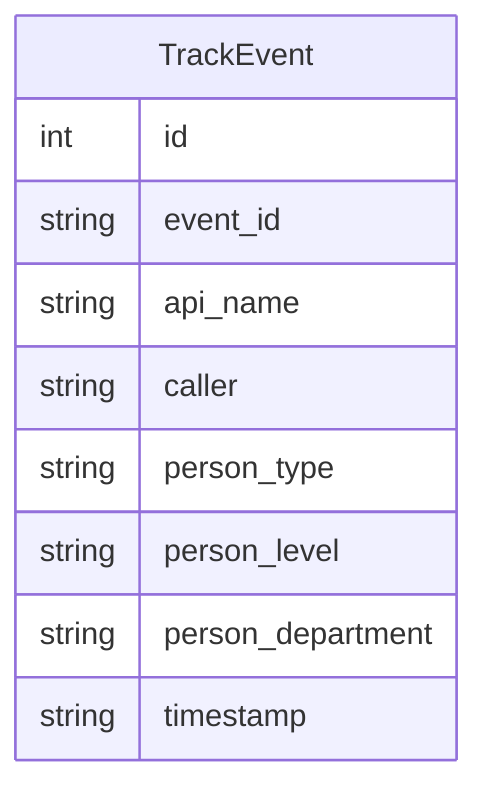

### 存储方案

| 存储类型 | 用途 | 方案 |
|----------|------|------|
| 关系型存储 | 埋点事件数据持久化 | SQLite（tracking.db） |
| 文件导出 | 导出 CSV 文件 | 后端内存生成后直接流式返回，不持久化到磁盘 |

### 模型说明

- TrackEvent 为无关联的独立实体，记录每次 API 调用事件的元数据
- 通过 api_name 区分不同接口的调用
- 通过 person_type/person_level/person_department 支持多维度统计分析
- timestamp 存储 ISO8601 格式时间戳，支持按时间维度聚合查询

## 4. 接口设计

### 4.1 oneapi（Web 控制台接口）

| 编号 | 接口名称 | 方法 | 路径 | 所属模块 |
|------|----------|------|------|----------|
| W01 | Helloworld | GET | /api/helloworld | 核心接口模块 |
| W02 | 哈希算法 | GET | /api/hash?text=xxx | 核心接口模块 |
| W03 | 冒泡排序 | POST | /api/bubble-sort | 核心接口模块 |
| W04 | 导出数据 | GET | /api/export?tab=X&format=csv | 导出模块 |
| W05 | 上报埋点事件 | POST | /api/track/event | 埋点统计模块 |
| W06 | 获取统计数据 | GET | /api/track/stats?dimension=X | 埋点统计模块 |

### 4.2 OpenAPI（对外接口）

本系统不涉及 OpenAPI 对外接口，全部接口为 Web 控制台 oneapi 类型。

### 4.3 内部接口（Service 层）

本系统为单文件 FastAPI 应用，无独立 Service 层，内部逻辑直接在路由处理函数中实现。

### 4.4 集成接口（Integration 层）

| 编号 | 接口名称 | 调用方 | 被调用方 | 说明 |
|------|----------|--------|----------|------|
| I01 | bubble_sort 函数 | POST /api/bubble-sort | bubble_sort.py | 直接函数调用，复用已有实现 |

## 5. 功能模块设计

### 5.0 全局约定

**错误码格式：** `{MODULE}_{SEQ}`，如 ERR_HELLO_001、ERR_HASH_001

**通用出参结构：**
```json
{
  "success": true,
  "data": { ... }
}
```

**错误响应结构：**
```json
{
  "success": false,
  "error_code": "ERR_xxxxx",
  "message": "用户可读的兜底文案",
  "detail": null
}
```

**模块与错误码映射表：**

| 模块 | 错误码前缀 | 说明 |
|------|-----------|------|
| 核心接口模块 - Helloworld | ERR_HELLO | helloworld 接口异常 |
| 核心接口模块 - Hash | ERR_HASH | 哈希算法接口异常 |
| 核心接口模块 - 冒泡排序 | ERR_SORT | 冒泡排序接口异常 |
| 导出模块 | ERR_EXP | 导出接口异常 |
| 埋点统计模块 | ERR_TRK | 埋点统计接口异常 |
| 全局 | ERR_SYS | 系统级异常 |

### 5.1 核心接口模块（manyu_test）

#### 5.1.1 表结构设计

本模块不涉及数据库表，核心接口均为无状态计算接口，不存储数据。

#### 5.1.2 接口详细设计

##### W01 — GET /api/helloworld

- **URI**: GET /api/helloworld
- **描述**: 返回欢迎信息及当前时间戳
- **入参**: 无

- **出参**:

| 参数名称 | 类型 | 描述 |
|----------|------|------|
| success | boolean | 是否成功 |
| data.message | string | 欢迎消息 |
| data.timestamp | string | ISO8601 时间戳 |

- **错误码**:

| 错误码 | HTTP 状态码 | 说明 |
|--------|-------------|------|
| ERR_HELLO_001 | 500 | 问候服务内部异常 |

- **请求示例**:
```
GET /api/helloworld
```

- **响应示例**:
```json
{
  "success": true,
  "data": {
    "message": "Hello World!",
    "timestamp": "2026-08-24T12:00:00Z"
  }
}
```

##### W02 — GET /api/hash

- **URI**: GET /api/hash?text=xxx
- **描述**: 计算输入文本的 SHA256 哈希值
- **入参**:

| 参数名称 | 类型 | 是否必填 | 描述 |
|----------|------|----------|------|
| text | string | 是 | 待计算哈希的文本（Query 参数） |

- **出参**:

| 参数名称 | 类型 | 描述 |
|----------|------|------|
| success | boolean | 是否成功 |
| data.algorithm | string | 哈希算法名称（SHA256） |
| data.input | string | 原始输入文本 |
| data.hash | string | 计算得到的哈希值 |

- **错误码**:

| 错误码 | HTTP 状态码 | 说明 |
|--------|-------------|------|
| ERR_HASH_001 | 400 | 缺少 text 参数 |
| ERR_HASH_002 | 500 | 哈希计算执行异常 |

- **请求示例**:
```
GET /api/hash?text=Hello%20World
```

- **响应示例**:
```json
{
  "success": true,
  "data": {
    "algorithm": "SHA256",
    "input": "Hello World",
    "hash": "a591a6d40bf420404a011733cfb7b190d62c65bf0bcda32b57b277d9ad9f146e"
  }
}
```

##### W03 — POST /api/bubble-sort

- **URI**: POST /api/bubble-sort
- **描述**: 对输入的数值数组执行冒泡排序
- **入参**:

| 参数名称 | 类型 | 是否必填 | 描述 |
|----------|------|----------|------|
| array | number[] | 是 | 待排序的数值数组（JSON Body） |

- **出参**:

| 参数名称 | 类型 | 描述 |
|----------|------|------|
| success | boolean | 是否成功 |
| data.original | number[] | 原始数组 |
| data.sorted | number[] | 排序后的数组 |

- **错误码**:

| 错误码 | HTTP 状态码 | 说明 |
|--------|-------------|------|
| ERR_SORT_001 | 400 | 请求体非合法数组 |
| ERR_SORT_002 | 500 | 排序执行异常 |

- **请求示例**:
```json
POST /api/bubble-sort
Content-Type: application/json

{
  "array": [3, 1, 4, 1, 5]
}
```

- **响应示例**:
```json
{
  "success": true,
  "data": {
    "original": [3, 1, 4, 1, 5],
    "sorted": [1, 1, 3, 4, 5]
  }
}
```

#### 5.1.3 子功能详细设计

##### 5.1.3.1 Helloworld（F01）

- **处理时序图**:
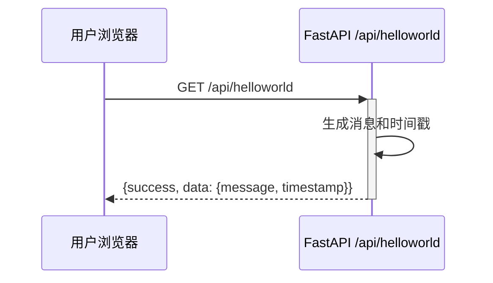

**业务规则：** 无特殊业务规则，纯静态返回。

**异常场景：**

| 异常场景 | 处理方式 |
|----------|----------|
| 服务内部异常 | 返回 HTTP 500 + ERR_HELLO_001 错误码 |

**并发控制：** 无并发风险（只读接口，无数据写入）。

##### 5.1.3.2 哈希算法（F02）

- **处理时序图**:
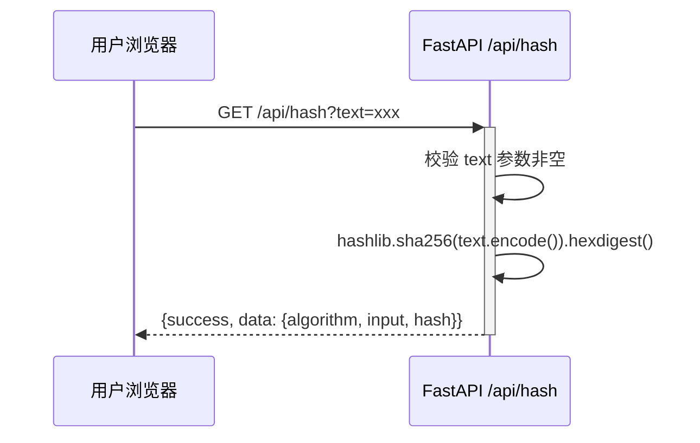

**业务规则：**

| 规则编号 | 规则描述 | 校验时机 | 不满足时的处理 |
|----------|----------|----------|--------------|
| R01 | text 参数不能为空 | 请求时 | 返回 ERR_HASH_001 |

**异常场景：**

| 异常场景 | 处理方式 |
|----------|----------|
| 缺少 text 参数 | 返回 HTTP 400 + ERR_HASH_001 |
| 哈希计算异常 | 返回 HTTP 500 + ERR_HASH_002 |

**并发控制：** 无并发风险（只读接口，无数据写入）。

##### 5.1.3.3 冒泡排序（F03）

- **处理时序图**:
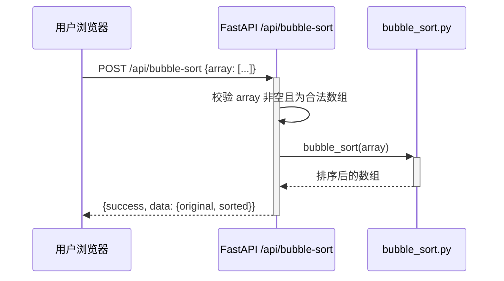

**业务规则：**

| 规则编号 | 规则描述 | 校验时机 | 不满足时的处理 |
|----------|----------|----------|--------------|
| R02 | array 不能为空 | 请求时 | 返回 ERR_SORT_001 |
| R03 | array 元素必须为数值类型 | 请求时 | 由 Pydantic 模型自动校验 |

**异常场景：**

| 异常场景 | 处理方式 |
|----------|----------|
| 请求体非合法数组 | 返回 HTTP 400 + ERR_SORT_001 |
| 排序执行异常 | 返回 HTTP 500 + ERR_SORT_002 |

**并发控制：** 无并发风险（无状态计算，每次请求独立处理）。

### 5.2 埋点统计模块（manyu_test）

#### 5.2.1 表结构设计

##### 5.2.1.1 track_events

| 字段名 | 数据类型 | 约束 | 默认值 | 说明 |
|--------|----------|------|--------|------|
| id | INTEGER | PK, AUTOINCREMENT | - | 系统自增主键 |
| event_id | TEXT | UNIQUE, NOT NULL | - | 事件唯一标识（UUID） |
| api_name | TEXT | NOT NULL | - | 被调用的接口名称（helloworld/hash/bubble-sort/export） |
| caller | TEXT | NOT NULL | - | 调用人标识 |
| person_type | TEXT | NOT NULL | - | 人员类型 |
| person_level | TEXT | NOT NULL | - | 人员层级 |
| person_department | TEXT | NOT NULL | - | 人员部门 |
| timestamp | TEXT | NOT NULL | - | 事件发生时间（ISO8601） |

**索引：**
- PK: `id`（主键自增）
- UK: `event_id`（事件唯一标识）

##### 5.2.1.2 枚举与常量定义

| 枚举名称 | 取值 | 含义 | 关联字段 |
|----------|------|------|----------|
| api_name | helloworld | Helloworld 接口 | track_events.api_name |
| api_name | hash | 哈希算法接口 | track_events.api_name |
| api_name | bubble-sort | 冒泡排序接口 | track_events.api_name |
| api_name | export | 导出接口 | track_events.api_name |

#### 5.2.2 接口详细设计

##### W05 — POST /api/track/event

- **URI**: POST /api/track/event
- **描述**: 上报调用埋点事件，记录调用人、人员维度、时间戳等信息
- **入参**:

| 参数名称 | 类型 | 是否必填 | 描述 |
|----------|------|----------|------|
| api_name | string | 是 | 接口名称 |
| caller | string | 否（默认 "anonymous"） | 调用人标识 |
| person_type | string | 否（默认 "unknown"） | 人员类型 |
| person_level | string | 否（默认 "unknown"） | 人员层级 |
| person_department | string | 否（默认 "unknown"） | 人员部门 |

- **出参**:

| 参数名称 | 类型 | 描述 |
|----------|------|------|
| success | boolean | 是否成功 |
| data.event_id | string | 生成的事件 UUID |
| data.timestamp | string | 事件时间戳 |

- **错误码**:

| 错误码 | HTTP 状态码 | 说明 |
|--------|-------------|------|
| ERR_TRK_001 | 400 | 缺少 api_name |
| ERR_TRK_001 | 500 | 写入数据库异常 |

- **请求示例**:
```json
POST /api/track/event
Content-Type: application/json

{
  "api_name": "helloworld",
  "caller": "demo_user",
  "person_type": "developer",
  "person_level": "senior",
  "person_department": "engineering"
}
```

- **响应示例**:
```json
{
  "success": true,
  "data": {
    "event_id": "a1b2c3d4-e5f6-7890-abcd-ef1234567890",
    "timestamp": "2026-08-24T12:00:00Z"
  }
}
```

##### W06 — GET /api/track/stats

- **URI**: GET /api/track/stats?dimension=X
- **描述**: 按指定维度聚合统计调用数据
- **入参**:

| 参数名称 | 类型 | 是否必填 | 描述 |
|----------|------|----------|------|
| dimension | string | 否（默认 "type"） | 聚合维度：type/level/department/time |

- **出参**:

| 参数名称 | 类型 | 描述 |
|----------|------|------|
| success | boolean | 是否成功 |
| data.dimension | string | 聚合维度 |
| data.entries | object[] | 聚合结果列表，每项含 name 和 count |

- **错误码**:

| 错误码 | HTTP 状态码 | 说明 |
|--------|-------------|------|
| ERR_TRK_002 | 500 | 统计查询异常 |

- **维度映射表**:

| dimension 参数值 | 聚合字段 | 图表类型 | 说明 |
|-----------------|----------|----------|------|
| type | person_type | 饼图 | 人员类型分布 |
| level | person_level | 柱状图 | 人员层级分布 |
| department | person_department | 饼图 | 人员部门分布 |
| time | DATE(timestamp) | 折线图 | 按天统计调用趋势 |

- **请求示例**:
```
GET /api/track/stats?dimension=type
```

- **响应示例**:
```json
{
  "success": true,
  "data": {
    "dimension": "type",
    "entries": [
      {"name": "developer", "count": 15},
      {"name": "manager", "count": 8},
      {"name": "tester", "count": 5}
    ]
  }
}
```

#### 5.2.3 子功能详细设计

##### 5.2.3.1 上报埋点事件（F06）

- **处理时序图**:
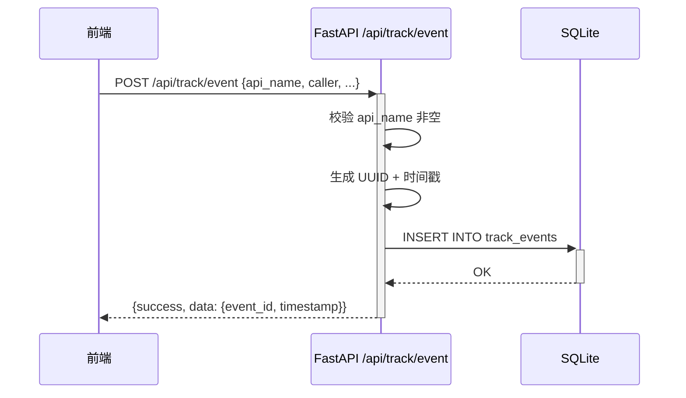

**业务规则：**

| 规则编号 | 规则描述 | 校验时机 | 不满足时的处理 |
|----------|----------|----------|--------------|
| R04 | api_name 不能为空 | 请求时 | 返回 ERR_TRK_001 |

**异常场景：**

| 异常场景 | 处理方式 |
|----------|----------|
| 请求体不完整 | 返回 HTTP 400 + ERR_TRK_001 |
| 数据库写入失败 | 返回 HTTP 500 + ERR_TRK_001 |

**并发控制：** SQLite 写操作由数据库锁保证串行化，无需额外并发控制。

##### 5.2.3.2 获取统计数据（F07）

- **处理时序图**:
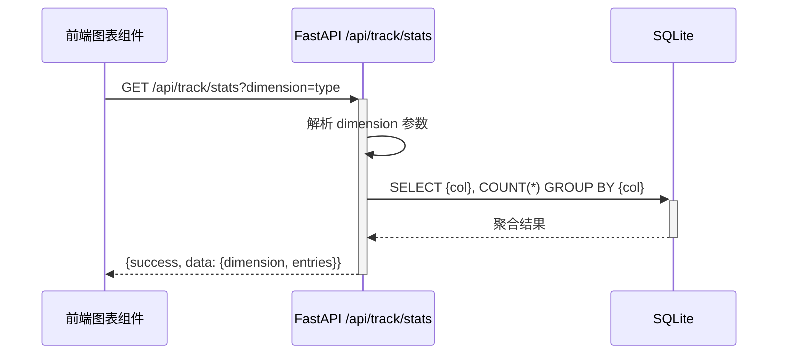

**业务规则：**

| 规则编号 | 规则描述 | 校验时机 | 不满足时的处理 |
|----------|----------|----------|--------------|
| R05 | dimension 参数映射到对应数据库列 | 查询时 | 未知维度返回空列表 |

**异常场景：**

| 异常场景 | 处理方式 |
|----------|----------|
| 数据库查询异常 | 返回 HTTP 500 + ERR_TRK_002 |

**并发控制：** 只读查询，无并发风险。

### 5.3 导出模块（manyu_test）

#### 5.3.1 表结构设计

本模块不涉及数据库表，导出数据从内存动态生成。

#### 5.3.2 接口详细设计

##### W04 — GET /api/export

- **URI**: GET /api/export?tab=X&format=csv
- **描述**: 导出指定 Tab 页面的展示结果为 CSV 文件
- **入参**:

| 参数名称 | 类型 | 是否必填 | 描述 |
|----------|------|----------|------|
| tab | string | 是 | 导出页面：helloworld/hash/bubble-sort |
| format | string | 否（默认 "csv"） | 导出格式（当前仅支持 csv） |

- **出参**: CSV 文件流（StreamingResponse）
- **Content-Type**: text/csv
- **Content-Disposition**: attachment; filename={tab}_export_{timestamp}.csv

- **错误码**:

| 错误码 | HTTP 状态码 | 说明 |
|--------|-------------|------|
| ERR_EXP_001 | 400 | 缺少 tab 参数或 tab 值无效 |
| ERR_EXP_002 | 500 | 数据为空（当前返回演示数据，此错误码预留） |
| ERR_EXP_003 | 500 | 导出文件生成失败 |

- **各 Tab 导出 CSV 格式**:

**helloworld:**
```
接口,消息,时间戳
helloworld,Hello World!,2026-08-24T12:00:00Z
```

**hash:**
```
接口,算法,输入,哈希值
hash,SHA256,示例文本,a591a6d40bf420404a011733cfb7b190d62c65bf0bcda32b57b277d9ad9f146e
```

**bubble-sort:**
```
接口,原始数组,排序后数组
bubble-sort,"[3, 1, 4, 1, 5]","[1, 1, 3, 4, 5]"
```

#### 5.3.3 子功能详细设计

##### 5.3.3.1 导出数据（F05）

- **处理时序图**:
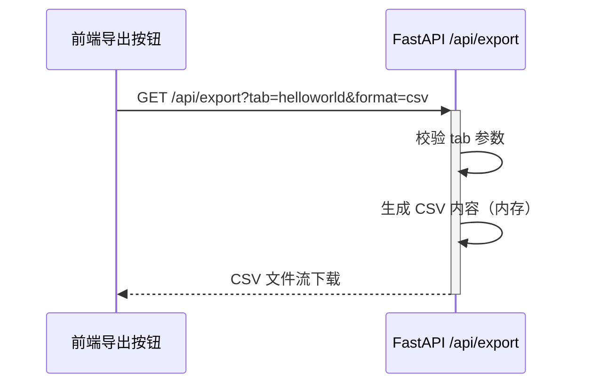

**业务规则：**

| 规则编号 | 规则描述 | 校验时机 | 不满足时的处理 |
|----------|----------|----------|--------------|
| R06 | tab 参数必填且为合法值 | 请求时 | 返回 ERR_EXP_001 |

**异常场景：**

| 异常场景 | 处理方式 |
|----------|----------|
| 缺少 tab 参数 | 返回 HTTP 400 + ERR_EXP_001 |
| 无效的 tab 值 | 返回 HTTP 400 + ERR_EXP_001 |
| CSV 生成异常 | 返回 HTTP 500 + ERR_EXP_003 |

**并发控制：** 无并发风险（无状态读取，不写入持久化存储）。

### 5.4 前端 Tab 页面模块（manyu_test1）

#### 5.4.1 接口详细设计

本模块为前端组件，不涉及后端接口。引用后端接口 W01/W02/W03。

#### 5.4.2 子功能详细设计

##### 5.4.2.1 Tab 导航与切换（F04）

- **组件结构**: App.vue 管理 activeTab 状态，通过 v-if 切换三个 Tab 组件
- **Tab 列表**:

| Tab 键 | 标签 | 对应组件 | 对应后端接口 |
|--------|------|----------|-------------|
| helloworld | Helloworld | TabHelloWorld.vue | GET /api/helloworld |
| hash | 哈希算法 | TabHash.vue | GET /api/hash?text=xxx |
| bubble-sort | 冒泡排序 | TabBubbleSort.vue | POST /api/bubble-sort |

- **调用时序**:
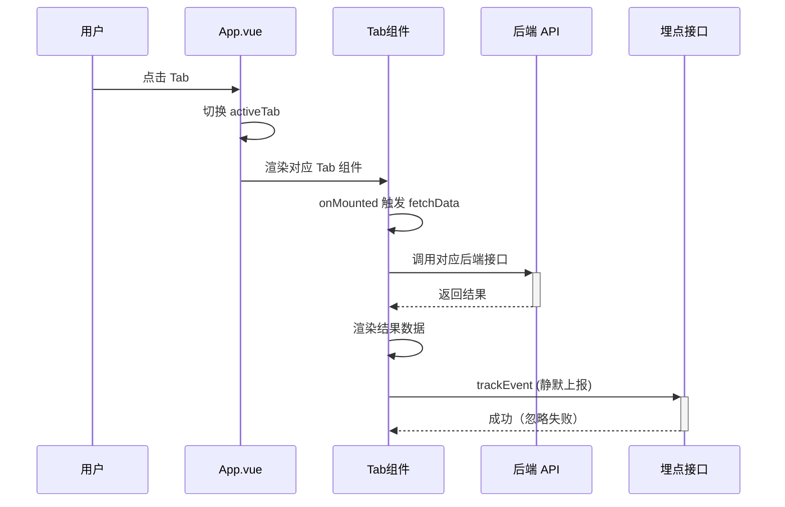

**异常场景：**

| 异常场景 | 处理方式 |
|----------|----------|
| 接口调用失败 | 展示错误提示 + 重新加载按钮 |
| 网络断开 | 展示"当前网络已断开" |
| 请求超时 | 展示"请求超时" + 重新请求按钮 |

### 5.5 前端导出按钮模块（manyu_test1）

#### 5.5.1 接口详细设计

引用后端接口 W04（GET /api/export）。

#### 5.5.2 子功能详细设计

##### 5.5.2.1 导出操作（F05）

- **组件**: ExportButton.vue
- **Props**: activeTab（当前激活的 Tab 键）
- **行为**: 点击后通过动态创建 `<a>` 标签触发下载
- **导出 URL**: /api/export?tab={activeTab}&format=csv

**异常场景：**

| 异常场景 | 处理方式 |
|----------|----------|
| 导出接口异常 | 弹窗提示"导出失败，请稍后重试" |
| 当前 Tab 无数据 | 弹窗提示"当前页面暂无数据可导出" |

### 5.6 前端图表报表模块（manyu_test1）

#### 5.6.1 接口详细设计

引用后端接口 W06（GET /api/track/stats?dimension=X）。

#### 5.6.2 子功能详细设计

##### 5.6.2.1 折线图 - 时间趋势（F08）

- **组件**: StatsLineChart.vue
- **调用接口**: GET /api/track/stats?dimension=time
- **图表类型**: ECharts 折线图（smooth line）
- **X 轴**: 日期（按天）
- **Y 轴**: 调用次数

##### 5.6.2.2 饼图 - 人员类型分布（F09）

- **组件**: StatsPieChart.vue
- **调用接口**: GET /api/track/stats?dimension=type
- **图表类型**: ECharts 饼图（环形图风格，radius: ['40%', '70%']）
- **数据项**: 人员类型名称 + 调用次数

**扩展说明：** 人员部门（department）维度也可使用饼图展示，当前默认展示人员类型维度；如需切换可在后续增加维度选择器。

##### 5.6.2.3 柱状图 - 人员层级分布（F10）

- **组件**: StatsBarChart.vue
- **调用接口**: GET /api/track/stats?dimension=level
- **图表类型**: ECharts 柱状图
- **X 轴**: 人员层级名称
- **Y 轴**: 调用次数
- **样式**: 圆角柱状图，主题色 #3498db

**图表布局：**
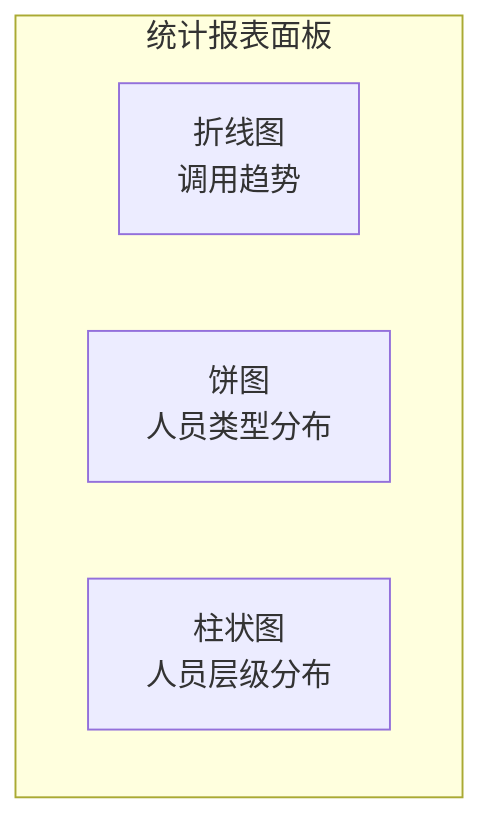

**各图表异常处理：**

| 场景 | 折线图 | 饼图 | 柱状图 |
|------|--------|------|--------|
| 数据为空 | 展示"暂无统计数据" | 展示"暂无统计数据" | 展示"暂无统计数据" |
| 接口异常 | 错误提示 + 重试按钮 | 错误提示 + 重试按钮 | 错误提示 + 重试按钮 |
| 渲染异常 | 图表区域错误提示 | 图表区域错误提示 | 图表区域错误提示 |

## 6. 非功能性需求设计

### 6.1 高可用性

本系统为开发环境演示应用，单机部署，不涉及高可用要求。

**假设：** 当前仅用于开发/演示环境，生产环境部署时可升级为多副本 + Nginx 负载均衡。

### 6.2 可扩展性

- **后端横向扩展**：FastAPI 为无状态应用，可通过 Nginx 负载均衡横向扩展多 uvicorn 进程
- **前端横向扩展**：Vue 3 SPA 为静态资源，可通过 CDN 或 Nginx 多副本部署
- **存储扩展**：SQLite 仅适用于单机场景，后续可替换为 MySQL/PostgreSQL 等关系型数据库
- **图表扩展**：ECharts 图表组件设计为独立组件，新增图表类型只需新增组件并注册到报表面板

### 6.3 稳定性/可靠性

- **接口统一错误处理**：全局异常处理器捕获所有未预期异常，返回统一格式的错误响应
- **前端错误隔离**：每个 Tab 组件独立异常处理，单个 Tab 崩溃不影响其他 Tab
- **图表组件错误隔离**：每个图表组件独立异常处理，单个图表渲染失败不影响其他图表
- **埋点失败静默**：前端埋点上报使用 `.catch(() => {})` 忽略失败，不影响主业务

### 6.4 安全性设计

#### 6.4.1 账户系统方案

本系统不涉及账户系统。调用人信息通过请求头 `X-Caller-Info` 模拟传入，用于埋点统计演示。

#### 6.4.2 授权 & 访问控制

##### 6.4.2.1 是否实现水平权限检查

不涉及数据库查询或为公共数据查询。本系统为演示应用，无租户或资源隔离需求。

##### 6.4.2.2 是否实现垂直权限检查

不涉及。本系统为演示应用，无角色权限区分。

##### 6.4.2.3 是否检查登录态

不涉及。本系统为演示应用，无登录态检查。

#### 6.4.3 数据防护方案

##### 6.4.3.1 是否对敏感数据加密存储

不涉及敏感数据。埋点数据仅包含调用人标识和人员维度信息，均为演示数据。

##### 6.4.3.2 是否对敏感数据展示进行脱敏

不涉及敏感数据展示。

### 6.5 监控/统计/日志/告警

- **接口调用埋点**：通过 POST /api/track/event 记录每次接口调用
- **统计聚合**：通过 GET /api/track/stats 按维度聚合查询
- **前端可视化**：通过 ECharts 图表展示统计结果
- **错误日志**：FastAPI 自动输出请求日志到 stderr

### 6.6 性能设计

本项不适用，原因：系统为单机开发/演示应用，无性能指标要求。核心接口均为轻量级计算（字符串拼接、哈希计算、冒泡排序），响应时间预计在毫秒级。

## 7. 变更三板斧

### 7.1 可监控

关键监控埋点：

| 监控点 | 埋点方式 | 监控指标 |
|--------|----------|----------|
| 接口调用次数 | POST /api/track/event | 按接口名、时间维度聚合调用次数 |
| 接口调用人 | POST /api/track/event | 按人员维度统计调用分布 |
| 接口错误 | FastAPI 全局异常处理器 | 日志输出错误次数和错误码 |
| 前端请求超时 | axios timeout=10s | 前端捕获超时并展示兜底文案 |

### 7.2 可灰度

本项不适用，原因：
- 系统为演示应用，无灰度发布需求
- 单机部署环境不支持灰度引流
- 前端 SPA 页面可通过路由参数控制功能展示，但当前无此需求

### 7.3 可应急

| 应急场景 | 应急方案 | 说明 |
|----------|----------|------|
| 后端接口异常 | 重启 uvicorn 服务 | 单进程服务，重启即可恢复 |
| 前端页面异常 | 刷新浏览器 | SPA 应用，刷新后重新加载 |
| 埋点数据丢失 | 重启应用自动重建 track_events 表 | SQLite 文件存在则复用，不存在则新建 |
| 数据库损坏 | 删除 tracking.db 重启 | 自动重新创建空表（演示数据可重新生成） |

## 8. 异常兜底文案逻辑

### 8.1 后端异常兜底

#### 8.1.1 全局异常处理器

所有未在路由处理函数中显式捕获的异常，统一由 FastAPI 全局异常处理器捕获，返回以下兜底响应：

```json
{
  "success": false,
  "error_code": "ERR_SYS_001",
  "message": "服务内部异常，请稍后重试",
  "detail": null
}
```

**触发条件：**
- 路由处理函数抛出未预期的 Exception
- Python 标准库异常（如 ValueError、KeyError 等）
- 第三方库异常（如 hashlib 异常、SQLite 连接异常等）

**兜底策略：** 返回 HTTP 500，日志记录完整异常堆栈，前端根据 `success: false` 统一展示错误提示。

#### 8.1.2 接口级异常兜底

| 接口 | 异常场景 | 兜底响应 | 兜底文案 |
|------|----------|----------|----------|
| GET /api/helloworld | 消息生成异常 | HTTP 500 + ERR_HELLO_001 | "问候服务异常，请稍后重试" |
| GET /api/hash | 缺少 text 参数 | HTTP 400 + ERR_HASH_001 | "缺少 text 参数，请检查输入" |
| GET /api/hash | 哈希计算异常 | HTTP 500 + ERR_HASH_002 | "哈希计算异常，请稍后重试" |
| POST /api/bubble-sort | 请求体非合法数组 | HTTP 400 + ERR_SORT_001 | "请求数据格式错误，请输入有效的数值数组" |
| POST /api/bubble-sort | 排序执行异常 | HTTP 500 + ERR_SORT_002 | "排序服务异常，请稍后重试" |
| GET /api/export | 缺少 tab 参数 | HTTP 400 + ERR_EXP_001 | "缺少导出参数，请选择要导出的页面" |
| GET /api/export | tab 值无效 | HTTP 400 + ERR_EXP_001 | "无效的导出页面，请选择有效的页面" |
| GET /api/export | CSV 生成异常 | HTTP 500 + ERR_EXP_003 | "导出文件生成失败，请稍后重试" |
| POST /api/track/event | 缺少 api_name | HTTP 400 + ERR_TRK_001 | "缺少接口名称参数" |
| POST /api/track/event | 数据库写入异常 | HTTP 500 + ERR_TRK_001 | "埋点记录失败，不影响主流程" |
| GET /api/track/stats | 统计查询异常 | HTTP 500 + ERR_TRK_002 | "统计数据获取失败，请稍后重试" |

#### 8.1.3 数据库异常兜底

| 异常场景 | 兜底策略 | 兜底文案 |
|----------|----------|----------|
| SQLite 数据库文件不存在 | 首次写入前自动创建空表，不使用 init 脚本 | 不产生用户可见文案 |
| 数据库连接失败 | 捕获异常后返回 HTTP 500，日志记录错误堆栈 | "数据服务异常，请稍后重试" |
| 数据库表结构不匹配 | 异常引发 HTTP 500，日志记录错误堆栈 | "数据服务异常，请稍后重试" |
| 并发写入冲突 | SQLite 自带的文件锁机制，等待后自动重试 | 不产生用户可见文案 |

#### 8.1.4 外部依赖异常兜底

| 依赖 | 异常场景 | 兜底策略 | 兜底文案 |
|------|----------|----------|----------|
| bubble_sort.py | 导入失败 | 捕获 ImportError，返回 HTTP 500 | "排序服务初始化失败，请稍后重试" |
| bubble_sort.py | 函数执行异常 | 捕获通用 Exception，返回 HTTP 500 + ERR_SORT_002 | "排序服务异常，请稍后重试" |

### 8.2 前端异常兜底

#### 8.2.1 全局错误兜底

| 异常场景 | 兜底策略 | 兜底文案 | 展示方式 |
|----------|----------|----------|----------|
| 网络断开（navigator.onLine === false） | 检测到离线后展示全局提示 | "当前网络已断开，请检查网络连接" | 页面顶部固定横幅（黄色警告） |
| 请求超时（axios timeout > 10s） | axios 拦截器统一捕获超时异常 | "请求超时，请稍后重试" | 弹窗 Toast 提示 |
| 500 服务端错误 | axios 响应拦截器检查 `success` 字段 | 从后端返回的 `message` 字段取值 | 组件内错误提示区域 |
| 400 请求参数错误 | axios 响应拦截器检查 `success` 字段 | 从后端返回的 `message` 字段取值 | 组件内错误提示区域 |
| 接口返回非 JSON 格式 | JSON.parse 异常捕获 | "数据格式异常，请联系管理员" | 弹窗 Toast 提示 |

#### 8.2.2 Tab 页面异常兜底（F04）

**组件：TabHelloWorld.vue / TabHash.vue / TabBubbleSort.vue**

| 异常场景 | 兜底策略 | 兜底文案 | 展示方式 |
|----------|----------|----------|----------|
| 接口调用失败 | 组件内 setError 状态，展示错误区域 | "数据加载失败"，优先使用后端返回的 message | 结果区域显示红色错误框 + 重试按钮 |
| 超时 | 同上 | "请求超时，请稍后重试" | 同上 |
| 切换 Tab 时取消前一个请求 | 使用 AbortController 取消正在请求，避免状态错乱 | 无（静默取消） | 无 |
| 后端返回 success: false | 组件内检查响应字段 | 使用后端返回的 message | 结果区域显示黄色警告框 |

**展示效果：**
```
┌─────────────────────────────┐
│  ⚠️ 数据加载失败            │
│  服务内部异常，请稍后重试    │
│  [重新加载]                  │
└─────────────────────────────┘
```

#### 8.2.3 导出按钮异常兜底（F05）

**组件：ExportButton.vue**

| 异常场景 | 兜底策略 | 兜底文案 | 展示方式 |
|----------|----------|----------|----------|
| 导出接口返回非 200 | 捕获异常后弹窗提示 | "导出失败，请稍后重试" | 弹窗 Modal |
| 当前 Tab 已加载但数据为空（无调用） | 点击导出前检查 lastResult 状态 | "当前页面暂无数据可导出" | 弹窗提示 |
| 浏览器不支持 Blob 下载 | 回退到直接打开新窗口 | 无（静默降级） | 新标签页打开 |
| 下载文件名乱码 | 使用 encodeURIComponent 处理中文文件名 | 无（静默处理） | 无 |

#### 8.2.4 图表组件异常兜底（F08/F09/F10）

**组件：StatsLineChart.vue / StatsPieChart.vue / StatsBarChart.vue**

| 异常场景 | 兜底策略 | 兜底文案 | 展示方式 |
|----------|----------|----------|----------|
| 接口返回空数据（entries === []） | 展示空数据占位 | "暂无统计数据" | 图表区域居中灰色文字 |
| 接口调用失败 | 组件内 setError，展示错误区域 | "统计数据加载失败，请稍后重试" | 图表区域显示红色错误框 + 重试按钮 |
| ECharts 实例化失败（DOM 未挂载） | 使用 nextTick 延迟初始化，watch 监听 DOM 变化 | 无（静默重试） | 无 |
| 图表数据格式错误 | catch 异常后 fallback 到空数据展示 | "数据格式异常" | 图表区域居中灰色文字 |
| 窗口 resize 导致图表变形 | 绑定 window resize 事件，触发 chart.resize() | 无（静默处理） | 无 |

**展示效果：**
```
┌─────────────────────────────┐
│                             │
│      📊 暂无统计数据         │
│                             │
└─────────────────────────────┘

┌─────────────────────────────┐
│  ⚠️ 统计数据加载失败         │
│  请稍后重试                  │
│  [重新加载]                  │
└─────────────────────────────┘
```

#### 8.2.5 埋点上报异常兜底（F06）

| 异常场景 | 兜底策略 | 兜底文案 | 展示方式 |
|----------|----------|----------|----------|
| 埋点上报接口失败 | 使用 `.catch(() => {})` 静默忽略 | 无（不展示任何提示） | 无 |
| 埋点上报超时 | 使用 `.catch(() => {})` 静默忽略 | 无（不展示任何提示） | 无 |
| 连续多次埋点失败 | 不做重试，避免阻塞主流程 | 无（不展示任何提示） | 无 |

**原则：** 埋点上报属于非核心主流程，任何异常均静默处理，**不允许**影响用户正常使用。

### 8.3 异常兜底优先级

当同一操作可能触发多个异常时，按以下优先级展示兜底文案：

```
1. 网络断开（最高优先级，阻断所有请求）
2. 请求超时（次高优先级，接口级）
3. 后端返回业务错误码（接口级）
4. 数据为空（业务逻辑级）
5. 渲染异常（UI 级，最低优先级）
```