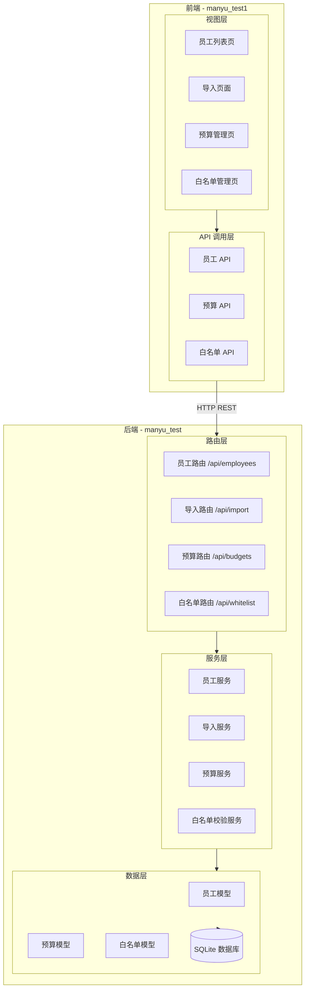
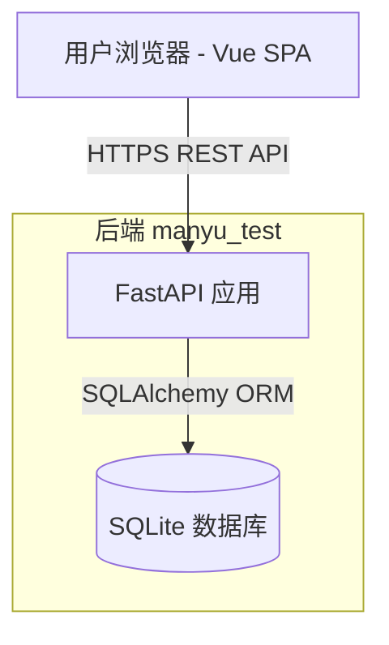
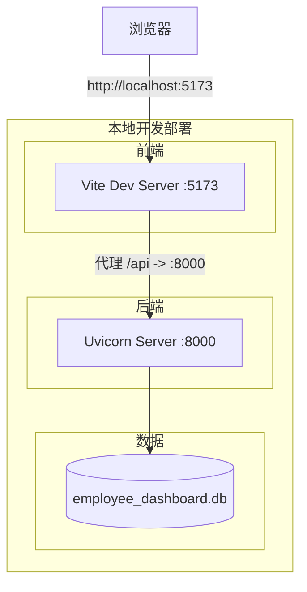
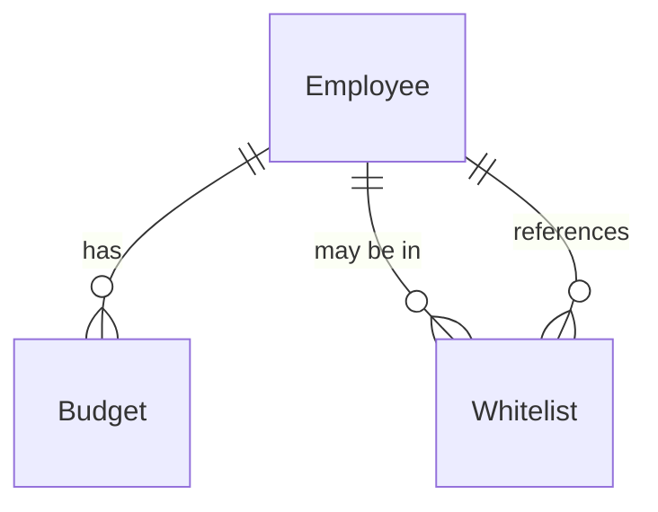
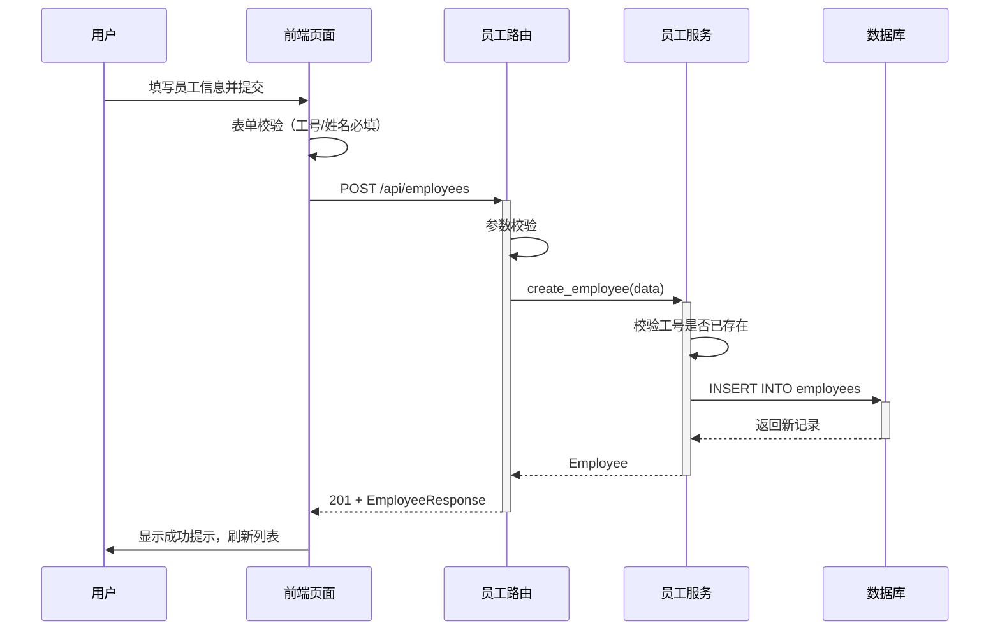
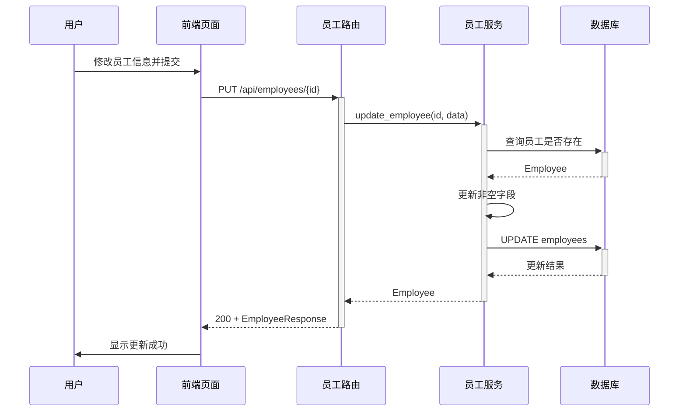
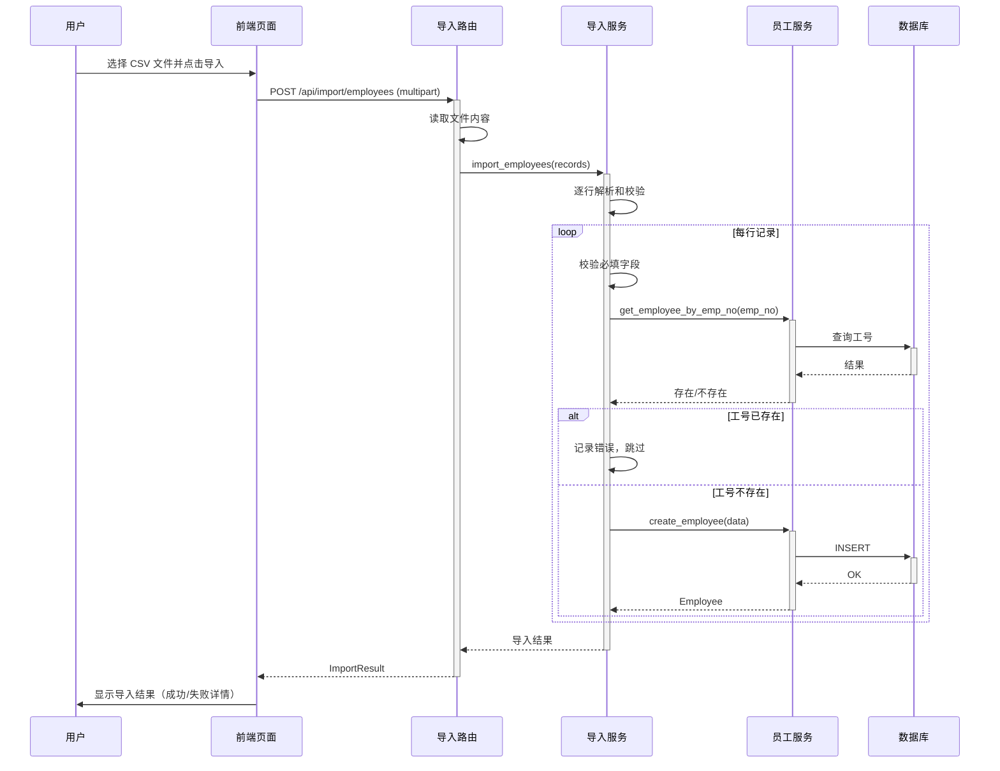
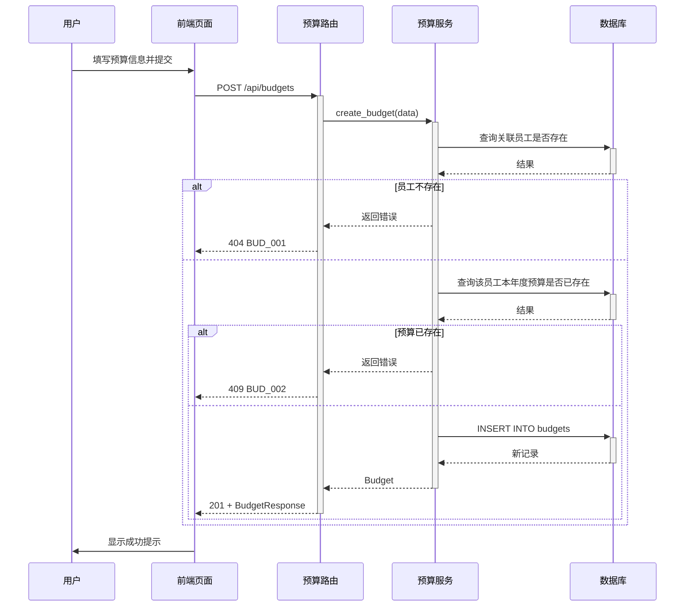
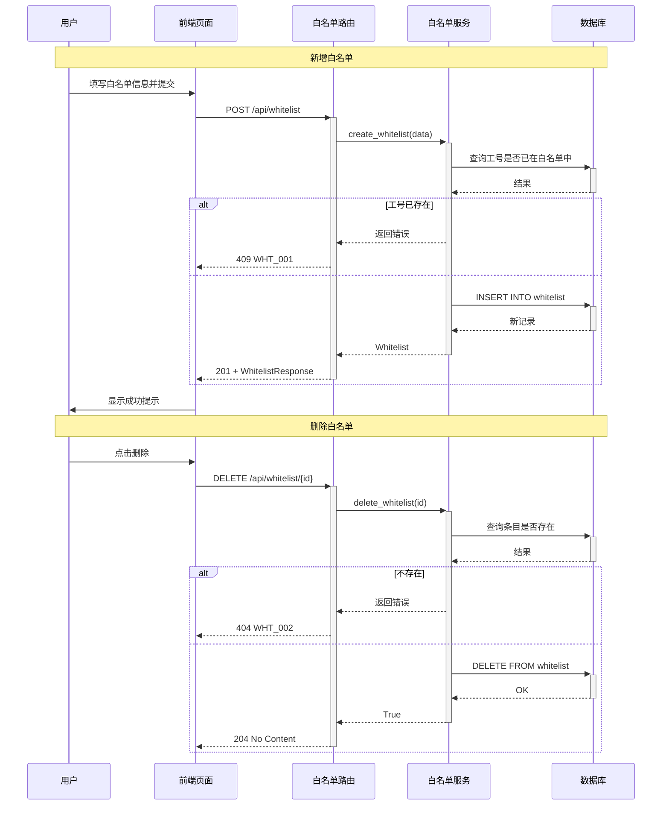
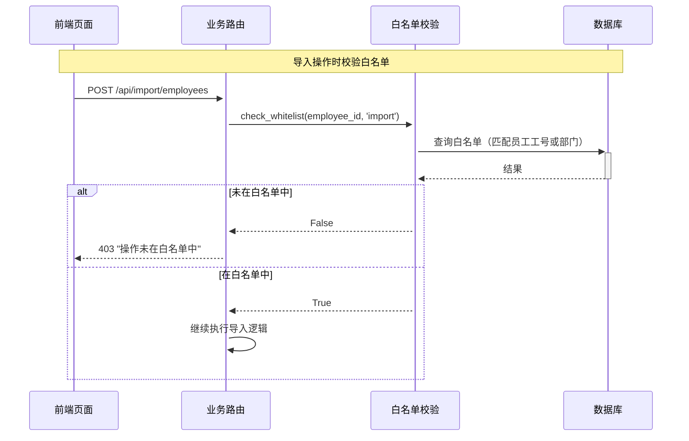

> **文档元信息**
>
> | 项目 | 内容 |
> |------|------|
> | 文档版本 | v1.0 |
> | 作者 | DTCoder |
> | 创建日期 | 2026-08-24 |
> | 需求来源 | .agents/20260824-开发一个人员看板_有入口记录员工的基本信/dima.md |
> | 评审状态 | 待评审 |

# 人员看板系统 系分设计

## 1. 需求与范围

### 背景与目标
开发一个人员看板系统，提供员工基本信息管理入口，支持增删改查（CRUD）、数据导入（单条/批量）、成本预算管理及白名单机制。系统采用前后端分离架构，后端（manyu_test）提供 RESTful API，前端（manyu_test1）构建独立 SPA。

### 核心功能
1. **员工基本信息管理**：录入员工工号、姓名、部门、职位、手机号、邮箱、入职日期、状态等基本字段，支持 CRUD
2. **数据导入**：支持单条录入和批量导入（CSV 格式）
3. **成本预算管理**：记录每位员工的年度预算金额和实际支出
4. **白名单机制**：控制哪些员工/部门可进行导入或预算操作，支持 import/budget/all 三种类型

### 约束与非功能要求
- 前后端分离，HTTP REST API 通信
- 后端 Python（FastAPI）+ SQLAlchemy + SQLite
- 前端 Vue 3（Composition API）+ Vite + Element Plus
- CSV 导入编码统一为 UTF-8，支持 BOM 头
- 白名单校验在 API 层统一拦截
- 禁止使用外键、存储过程、触发器、视图、ENUM 类型

### 排除范围
- 成本预算的审批流程（当前为直接 CRUD，无审批环节）
- 白名单多层权限（当前为简单启用/禁用）
- 前端 UI 风格定制（默认 Element Plus 风格）
- 用户认证与登录（当前无账户系统）

### 需求功能清单与优先级

| 编号 | 功能点 | 优先级 | 原始描述/章节 | 备注 |
|------|--------|--------|-------------|------|
| F01 | 员工列表查询（分页+搜索） | P0 | dima.md §4 | 支持按工号/姓名/部门搜索 |
| F02 | 新增员工 | P0 | dima.md §4 | 必填：工号、姓名 |
| F03 | 编辑员工 | P0 | dima.md §4 | 可修改除工号外所有字段 |
| F04 | 删除员工 | P0 | dima.md §4 | 假设：不级联删除关联预算 |
| F05 | 查看员工详情 | P0 | dima.md §4 | - |
| F06 | 单条录入员工 | P1 | dima.md §1 | 复用新增员工接口 |
| F07 | 批量导入员工（CSV） | P1 | dima.md §1 | 上传 CSV 文件解析入库 |
| F08 | 下载导入模板 | P1 | dima.md §4 | 包含表头字段说明 |
| F09 | 预算列表查询（分页+筛选） | P0 | dima.md §4 | 支持按员工工号/年份筛选 |
| F10 | 新增成本预算 | P0 | dima.md §4 | 关联员工工号 |
| F11 | 编辑成本预算 | P0 | dima.md §4 | 修改预算金额/实际支出 |
| F12 | 删除成本预算 | P0 | dima.md §4 | - |
| F13 | 白名单列表查询 | P0 | dima.md §4 | - |
| F14 | 新增白名单条目 | P0 | dima.md §4 | 支持员工级/部门级 |
| F15 | 删除白名单条目 | P0 | dima.md §4 | - |
| F16 | 白名单校验拦截 | P0 | dima.md §1 | API 层统一拦截 |

### 假设与待确认项

| 编号 | 假设/待确认内容 | 当前假设 | 确认状态 |
|------|-----------------|----------|----------|
| A01 | 导入文件格式 | CSV 为主，前端可扩展支持 .xlsx | 待确认 |
| A02 | 成本预算审批流程 | 当前为直接 CRUD，无审批环节 | 待确认 |
| A03 | 白名单权限层级 | 当前为简单启用/禁用，无多层权限 | 待确认 |
| A04 | 前端 UI 风格偏好 | 默认使用 Element Plus 风格 | 待确认 |
| A05 | 删除员工时预算处理 | 员工删除时，关联预算记录不自动删除 | 假设 |
| A06 | 预算金额精度 | DECIMAL(12,2)，支持最大 9999999999.99 | 假设 |

## 2. 架构与模块

### 功能架构



**交互层说明**：前端 Vue 3 SPA 提供用户界面，通过 Axios 调用后端 REST API。

**核心服务层说明**：后端 FastAPI 按模块划分路由-服务-数据三层，每个模块职责单一。

**扩展/集成层说明**：本系统不涉及外部系统集成，暂无扩展层。

### 模块清单

| 模块 | 职责 | 依赖 |
|------|------|------|
| 员工管理模块 | 员工信息 CRUD、列表查询（分页+搜索） | 无 |
| 数据导入模块 | 单条录入、批量 CSV 导入、模板下载 | 员工管理模块 |
| 成本预算模块 | 预算 CRUD、按员工/年份筛选 | 员工管理模块（外键关联） |
| 白名单模块 | 白名单 CRUD、导入/预算操作校验 | 无（作为中间件被其他模块依赖） |

### 应用集成架构



**集成关系说明：**

| 调用方 | 被调用方 | 协议 | 接口类型 | 说明 |
|--------|----------|------|----------|------|
| 用户浏览器 | FastAPI 应用 | HTTP | oneapi REST | 前端通过 Axios 调用后端 API |
| FastAPI 路由层 | 服务层 | Python 方法调用 | 内部接口 | 模块内方法调用 |
| 服务层 | 数据层 | SQLAlchemy ORM | SQL | 通过 ORM 操作数据库 |

### 部署架构



**部署说明：**
- **开发环境**：前后端分离启动，前端 Vite 开发服务器代理 API 到后端
- **生产环境**：前端构建为静态文件，由 Nginx 托管并反向代理到后端 Uvicorn 进程
- **数据层**：SQLite 单文件数据库，适合小规模部署，后续可迁移至 MySQL

## 3. 数据模型与存储

### 实体清单

| 实体名称 | 实体说明 | 所属模块 | 与其他实体的关系 |
|----------|----------|----------|-----------------|
| Employee | 员工基本信息 | 员工管理模块 | 一对多关联 Budget（通过 employee_id） |
| Budget | 员工年度成本预算 | 成本预算模块 | 多对一关联 Employee（通过 employee_id） |
| Whitelist | 白名单条目 | 白名单模块 | 与 Employee 弱关联（通过 employee_id 引用，无外键约束） |

### 实体关系图



**模型说明：**
- Employee 与 Budget 通过 employee_id 建立一对多关系，一个员工可有多条年度预算记录
- Whitelist 通过 employee_id 引用员工，employee_id 可为 NULL（表示部门级白名单）
- 根据数据库规范，禁止使用外键，关联关系通过应用层维护

### 存储方案
- 数据库：SQLite（单文件 `employee_dashboard.db`）
- ORM：SQLAlchemy 2.0
- 主键策略：自增整数主键
- 时间字段：使用 DATETIME 类型（禁止 TIMESTAMP）
- 小数金额：使用 DECIMAL(12, 2) 类型（禁止 FLOAT/DOUBLE）

## 4. 接口设计

### 4.1 oneapi（Web 控制台接口）

| 编号 | 接口名称 | 方法 | 路径 | 模块 |
|------|----------|------|------|------|
| E01 | 员工列表查询 | GET | /api/employees | 员工管理 |
| E02 | 员工详情查询 | GET | /api/employees/{id} | 员工管理 |
| E03 | 新增员工 | POST | /api/employees | 员工管理 |
| E04 | 编辑员工 | PUT | /api/employees/{id} | 员工管理 |
| E05 | 删除员工 | DELETE | /api/employees/{id} | 员工管理 |
| I01 | 批量导入员工 | POST | /api/import/employees | 数据导入 |
| I02 | 下载导入模板 | GET | /api/import/template | 数据导入 |
| B01 | 预算列表查询 | GET | /api/budgets | 成本预算 |
| B02 | 新增预算 | POST | /api/budgets | 成本预算 |
| B03 | 编辑预算 | PUT | /api/budgets/{id} | 成本预算 |
| B04 | 删除预算 | DELETE | /api/budgets/{id} | 成本预算 |
| W01 | 白名单列表查询 | GET | /api/whitelist | 白名单管理 |
| W02 | 新增白名单 | POST | /api/whitelist | 白名单管理 |
| W03 | 删除白名单 | DELETE | /api/whitelist/{id} | 白名单管理 |
| H01 | 健康检查 | GET | /api/health | 系统 |

### 4.2 OpenAPI（对外接口）
本项不适用，原因：当前系统为内部管理工具，不提供对外 OpenAPI。

### 4.3 内部接口（Service 层）

| 编号 | 接口名称 | 类 | 方法签名 |
|------|----------|------|----------|
| S01 | 员工列表查询 | employee_service | list_employees(db, page, page_size, search, department, status) -> (List[Employee], int) |
| S02 | 员工详情查询 | employee_service | get_employee(db, employee_id) -> Optional[Employee] |
| S03 | 按工号查询 | employee_service | get_employee_by_emp_no(db, emp_no) -> Optional[Employee] |
| S04 | 新增员工 | employee_service | create_employee(db, data) -> Employee |
| S05 | 编辑员工 | employee_service | update_employee(db, employee_id, data) -> Optional[Employee] |
| S06 | 删除员工 | employee_service | delete_employee(db, employee_id) -> bool |
| S07 | 解析 CSV | import_service | parse_csv(content) -> List[Dict] |
| S08 | 批量导入 | import_service | import_employees(db, records) -> (success, error, errors) |
| S09 | 生成模板 | import_service | generate_template() -> str |
| S10 | 预算列表查询 | budget_service | list_budgets(db, page, page_size, employee_id, budget_year) -> (List[Budget], int) |
| S11 | 预算详情查询 | budget_service | get_budget(db, budget_id) -> Optional[Budget] |
| S12 | 新增预算 | budget_service | create_budget(db, data) -> Budget |
| S13 | 编辑预算 | budget_service | update_budget(db, budget_id, data) -> Optional[Budget] |
| S14 | 删除预算 | budget_service | delete_budget(db, budget_id) -> bool |
| S15 | 白名单列表查询 | whitelist_service | list_whitelist(db) -> List[Whitelist] |
| S16 | 新增白名单 | whitelist_service | create_whitelist(db, data) -> Whitelist |
| S17 | 删除白名单 | whitelist_service | delete_whitelist(db, whitelist_id) -> bool |
| S18 | 校验白名单 | whitelist_service | check_whitelist(db, employee_id, action_type) -> bool |

### 4.4 集成接口（Integration 层）
本项不适用，原因：当前系统不涉及外部系统集成。

## 5. 功能模块设计

### 5.1 员工管理模块

#### 5.1.1 表结构设计

##### 5.1.1.1 employees 表

| 字段名 | 数据类型 | 约束 | 默认值 | 说明 |
|--------|----------|------|--------|------|
| id | INTEGER | PK, 自增 | - | 系统自增主键 |
| employee_id | VARCHAR(32) | UNIQUE, NOT NULL | - | 员工工号 |
| name | VARCHAR(64) | NOT NULL | - | 姓名 |
| department | VARCHAR(128) | NULLABLE | - | 部门 |
| position | VARCHAR(128) | NULLABLE | - | 职位 |
| phone | VARCHAR(20) | NULLABLE | - | 手机号 |
| email | VARCHAR(128) | NULLABLE | - | 邮箱 |
| hire_date | DATE | NULLABLE | - | 入职日期 |
| status | VARCHAR(16) | NOT NULL | '在职' | 在职/离职 |
| created_at | DATETIME | NOT NULL | CURRENT_TIMESTAMP | 创建时间 |
| updated_at | DATETIME | NOT NULL | CURRENT_TIMESTAMP | 更新时间 |

**索引：**
- PK: `pk_employees` (id)
- UK: `uk_employees_employee_id` (employee_id)
- IDX: `idx_employees_department` (department)
- IDX: `idx_employees_status` (status)

##### 5.1.1.2 枚举与常量定义

| 枚举名称 | 取值 | 含义 | 关联字段 |
|----------|------|------|----------|
| 员工状态 | 在职 | 员工在职 | employees.status |
| 员工状态 | 离职 | 员工离职 | employees.status |

#### 5.1.2 接口详细设计

##### E01 员工列表查询

- **URI**: GET /api/employees
- **描述**: 分页查询员工列表，支持搜索和筛选
- **入参**:

| 参数名称 | 类型 | 是否必填 | 描述 |
|----------|------|----------|------|
| page | Integer | 否 | 页码，默认1 |
| page_size | Integer | 否 | 每页条数，默认20，最大100 |
| search | String | 否 | 搜索关键词（匹配工号/姓名/部门） |
| department | String | 否 | 按部门筛选 |
| status | String | 否 | 按状态筛选 |

- **出参**:

| 参数名称 | 类型 | 描述 |
|----------|------|------|
| total | Integer | 总记录数 |
| items | Array | 员工列表 |
| page | Integer | 当前页码 |
| page_size | Integer | 每页条数 |

- **错误码**: 无（正常返回空列表）
- **业务规则**: 支持模糊搜索，分页排序按 ID 倒序

##### E02 员工详情查询

- **URI**: GET /api/employees/{id}
- **描述**: 查询单个员工完整信息
- **入参**: id (Path, Integer)
- **出参**: EmployeeResponse 对象
- **错误码**: EMP_001 (员工不存在)

##### E03 新增员工

- **URI**: POST /api/employees
- **描述**: 新增员工记录
- **入参**: EmployeeCreate { employee_id, name, department, position, phone, email, hire_date, status }
- **出参**: EmployeeResponse 对象（含 id/created_at/updated_at）
- **错误码**: EMP_002 (员工工号已存在)
- **业务规则**: 工号唯一校验

##### E04 编辑员工

- **URI**: PUT /api/employees/{id}
- **描述**: 编辑员工信息，只传需要修改的字段
- **入参**: EmployeeUpdate（全部可选字段）
- **出参**: EmployeeResponse 对象
- **错误码**: EMP_001 (员工不存在)

##### E05 删除员工

- **URI**: DELETE /api/employees/{id}
- **描述**: 删除员工记录
- **出参**: 204 No Content
- **错误码**: EMP_001 (员工不存在)
- **业务规则**: 删除员工不影响关联预算记录（假设：预算记录需手动清理）

#### 5.1.3 子功能详细设计

##### 5.1.3.1 新增员工（F02）

**处理时序图：**


**业务规则：**

| 规则编号 | 规则描述 | 校验时机 | 不满足时的处理 |
|----------|----------|----------|--------------|
| R01 | 工号必填 | 创建时 | 返回 EMP_003，提示"工号不能为空" |
| R02 | 姓名必填 | 创建时 | 返回 EMP_004，提示"姓名不能为空" |
| R03 | 工号唯一 | 创建时 | 返回 EMP_002，提示"员工工号已存在" |

**异常场景：**

| 异常场景 | 处理方式 |
|----------|----------|
| 工号重复提交 | 返回 409 Conflict，提示工号已存在 |
| 必填字段缺失 | 返回 422 Validation Error |

**并发控制：**
- 并发场景：无高频并发写入场景
- 控制策略：工号唯一约束（数据库级别 + 应用层双重校验）

##### 5.1.3.2 编辑员工（F03）

**处理时序图：**


**异常场景：**

| 异常场景 | 处理方式 |
|----------|----------|
| 员工不存在 | 返回 404，提示"员工不存在" |

**并发控制：** 无并发风险，低频率写入操作。

##### 5.1.3.3 删除员工（F04）

**异常场景：**

| 异常场景 | 处理方式 |
|----------|----------|
| 员工不存在 | 返回 404，提示"员工不存在" |

**并发控制：** 无并发风险，删除操作原子性由数据库事务保证。

### 5.2 数据导入模块

#### 5.2.1 表结构设计
本模块不涉及新增表，复用 employees 表。

#### 5.2.2 接口详细设计

##### I01 批量导入员工

- **URI**: POST /api/import/employees
- **描述**: 上传 CSV 文件批量导入员工数据
- **入参**:

| 参数名称 | 类型 | 是否必填 | 描述 |
|----------|------|----------|------|
| file | File (multipart) | 是 | CSV 文件，UTF-8 编码 |

- **出参**:

| 参数名称 | 类型 | 描述 |
|----------|------|------|
| success_count | Integer | 成功导入条数 |
| error_count | Integer | 失败条数 |
| errors | Array[String] | 错误详情列表 |

- **错误码**: IMP_001 (文件解析失败), IMP_002 (文件为空)
- **业务规则**:
  - 支持 CSV 格式，UTF-8 with BOM 编码
  - 逐行解析，一行失败不影响其他行
  - 自动校验必填字段（工号/姓名）
  - 工号重复则跳过该行并记录错误

##### I02 下载导入模板

- **URI**: GET /api/import/template
- **描述**: 下载 CSV 格式导入模板
- **出参**: CSV 文件（Content-Type: text/csv）
- **模板内容**: employee_id, name, department, position, phone, email, status

#### 5.2.3 子功能详细设计

##### 5.2.3.1 批量导入（F07）

**处理时序图：**


**业务规则：**

| 规则编号 | 规则描述 | 校验时机 | 不满足时的处理 |
|----------|----------|----------|--------------|
| R01 | 文件必须为 CSV 格式 | 导入时 | 返回 IMP_001 |
| R02 | 每行必须有工号和姓名 | 导入时 | 跳过该行，记录错误 |
| R03 | 工号不能与已存在记录重复 | 导入时 | 跳过该行，记录错误 |

**异常场景：**

| 异常场景 | 处理方式 |
|----------|----------|
| 上传文件为空 | 返回 IMP_002，提示"文件为空" |
| 文件编码错误 | 返回 IMP_001，提示"文件解析失败，请使用 UTF-8 编码" |
| 部分行数据不合法 | 合法行导入，不合法行记录错误返回，不中断整体流程 |

**并发控制：** 无并发风险，批量导入操作在同一事务中顺序执行。

### 5.3 成本预算模块

#### 5.3.1 表结构设计

##### 5.3.1.1 budgets 表

| 字段名 | 数据类型 | 约束 | 默认值 | 说明 |
|--------|----------|------|--------|------|
| id | INTEGER | PK, 自增 | - | 系统自增主键 |
| employee_id | VARCHAR(32) | NOT NULL | - | 关联员工工号 |
| budget_year | INTEGER | NOT NULL | - | 预算年份 |
| budget_amount | DECIMAL(12,2) | NOT NULL | - | 预算金额 |
| actual_amount | DECIMAL(12,2) | NOT NULL | 0.00 | 实际支出 |
| description | TEXT | NULLABLE | - | 预算说明 |
| created_at | DATETIME | NOT NULL | CURRENT_TIMESTAMP | 创建时间 |

**索引：**
- PK: `pk_budgets` (id)
- IDX: `idx_budgets_employee_id` (employee_id)
- IDX: `idx_budgets_budget_year` (budget_year)
- IDX: `idx_budgets_employee_year` (employee_id, budget_year)

##### 5.3.1.2 枚举与常量定义
本模块无枚举/常量定义。

#### 5.3.2 接口详细设计

##### B01 预算列表查询

- **URI**: GET /api/budgets
- **描述**: 分页查询预算列表，支持按员工工号和年份筛选
- **入参**:

| 参数名称 | 类型 | 是否必填 | 描述 |
|----------|------|----------|------|
| page | Integer | 否 | 页码，默认1 |
| page_size | Integer | 否 | 每页条数，默认20，最大100 |
| employee_id | String | 否 | 按员工工号筛选 |
| budget_year | Integer | 否 | 按预算年份筛选 |

- **出参**: { total, items, page, page_size }

##### B02 新增预算

- **URI**: POST /api/budgets
- **描述**: 新增预算记录
- **入参**: BudgetCreate { employee_id, budget_year, budget_amount, actual_amount, description }
- **出参**: BudgetResponse 对象
- **错误码**: BUD_001 (员工不存在), BUD_002 (该员工本年度预算已存在)

##### B03 编辑预算

- **URI**: PUT /api/budgets/{id}
- **描述**: 编辑预算信息
- **入参**: BudgetUpdate { budget_amount, actual_amount, description }
- **出参**: BudgetResponse 对象
- **错误码**: BUD_003 (预算记录不存在)

##### B04 删除预算

- **URI**: DELETE /api/budgets/{id}
- **描述**: 删除预算记录
- **出参**: 204 No Content
- **错误码**: BUD_003 (预算记录不存在)

#### 5.3.3 子功能详细设计

##### 5.3.3.1 新增预算（F10）

**处理时序图：**


**业务规则：**

| 规则编号 | 规则描述 | 校验时机 | 不满足时的处理 |
|----------|----------|----------|--------------|
| R01 | 关联员工工号必须存在 | 创建时 | 返回 BUD_001 |
| R02 | 同一员工同一年度只能有一条预算 | 创建时 | 返回 BUD_002 |
| R03 | 预算金额必须 >= 0 | 创建/更新时 | 返回 BUD_004 |

**异常场景：**

| 异常场景 | 处理方式 |
|----------|----------|
| 关联员工不存在 | 返回 404，提示"员工不存在" |
| 同年度预算重复 | 返回 409，提示"该员工本年度预算已存在" |
| 金额格式错误 | 返回 422 Validation Error |

**并发控制：** 无并发风险，低频率写入操作。

### 5.4 白名单管理模块

#### 5.4.1 表结构设计

##### 5.4.1.1 whitelist 表

| 字段名 | 数据类型 | 约束 | 默认值 | 说明 |
|--------|----------|------|--------|------|
| id | INTEGER | PK, 自增 | - | 系统自增主键 |
| employee_id | VARCHAR(32) | UNIQUE, NULLABLE | - | 员工工号（NULL 表示部门级白名单） |
| department | VARCHAR(128) | NULLABLE | - | 部门名 |
| whitelist_type | VARCHAR(16) | NOT NULL | 'all' | import / budget / all |
| enabled | BOOLEAN | NOT NULL | TRUE | 是否启用 |
| created_at | DATETIME | NOT NULL | CURRENT_TIMESTAMP | 创建时间 |

**索引：**
- PK: `pk_whitelist` (id)
- UK: `uk_whitelist_employee_id` (employee_id)

##### 5.4.1.2 枚举与常量定义

| 枚举名称 | 取值 | 含义 | 关联字段 |
|----------|------|------|----------|
| 白名单类型 | import | 仅导入操作 | whitelist.whitelist_type |
| 白名单类型 | budget | 仅预算操作 | whitelist.whitelist_type |
| 白名单类型 | all | 全部操作 | whitelist.whitelist_type |

#### 5.4.2 接口详细设计

##### W01 白名单列表查询

- **URI**: GET /api/whitelist
- **描述**: 查询所有白名单条目
- **出参**: { total, items }

##### W02 新增白名单

- **URI**: POST /api/whitelist
- **描述**: 新增白名单条目
- **入参**: WhitelistCreate { employee_id, department, whitelist_type, enabled }
- **出参**: WhitelistResponse 对象
- **错误码**: WHT_001 (该员工工号白名单已存在)

##### W03 删除白名单

- **URI**: DELETE /api/whitelist/{id}
- **描述**: 删除白名单条目
- **出参**: 204 No Content
- **错误码**: WHT_002 (白名单条目不存在)

#### 5.4.3 子功能详细设计

##### 5.4.3.1 白名单管理（F13/F14/F15）

**处理时序图：**


##### 5.4.3.2 白名单校验拦截（F16）

**处理时序图：**


**业务规则：**

| 规则编号 | 规则描述 | 校验时机 | 不满足时的处理 |
|----------|----------|----------|--------------|
| R01 | 导入操作需检查 import 或 all 类型白名单 | 导入前 | 返回 403，提示"操作未在白名单中" |
| R02 | 预算操作需检查 budget 或 all 类型白名单 | 预算操作前 | 返回 403，提示"操作未在白名单中" |
| R03 | 先匹配员工工号，再匹配部门 | 校验时 | 均不匹配则拒绝 |

**异常场景：**

| 异常场景 | 处理方式 |
|----------|----------|
| 白名单校验失败 | 返回 403，提示"当前操作未在白名单中" |
| 白名单条目不存在 | 正常拒绝，不报错 |

**并发控制：** 无并发风险，白名单读取操作。

## 6. 非功能性需求设计

### 6.1 高可用性
本项不适用，原因：系统为内部管理工具，无高可用要求。SQLite 单文件模式，后端服务单实例运行即可满足需求。

### 6.2 可扩展性
- **水平扩展**：后端无状态设计，可多实例部署，前端通过负载均衡分发
- **垂直扩展**：SQLite 可迁移至 MySQL/PostgreSQL 以支持更大数据量
- **功能扩展**：模块化设计，新增功能只需新增路由/服务/模型文件

### 6.3 稳定性/可靠性
- 输入校验：所有 API 入参通过 Pydantic 模型校验，类型安全
- 事务管理：写入操作在 Service 层统一提交，确保数据一致性
- 错误隔离：批量导入逐行处理，单行失败不影响其他行

### 6.4 安全性设计

#### 6.4.1 账户系统方案
本项不适用，原因：当前系统为内部管理工具，暂不涉及账户系统。

#### 6.4.2 授权与访问控制
- **水平权限检查**：本项不适用，当前系统无多租户场景
- **垂直权限检查**：本项不适用，当前系统无角色区分
- **登录态检查**：本项不适用，当前系统暂不涉及登录态校验

#### 6.4.3 数据防护方案
- **敏感数据加密存储**：假设：员工手机号、邮箱属于敏感信息，当前阶段暂不加密存储
- **敏感数据脱敏展示**：假设：当前阶段暂不对手机号、邮箱进行脱敏处理

### 6.5 监控/统计/日志/告警
- API 请求日志：FastAPI 内置日志记录请求方法和路径
- 错误日志：通过 Python logging 模块记录异常堆栈
- 导入操作日志：批量导入结果返回给前端展示

## 7. 变更三板斧

### 7.1 可监控
- 服务健康检查：`GET /api/health` 端点检查服务运行状态
- API 调用监控：每个 API 请求的响应时间可通过 FastAPI 中间件记录
- 导入操作监控：批量导入的成功/失败计数

### 7.2 可灰度
本项不适用，原因：系统为内部管理工具，单实例部署，无需灰度分流。

### 7.3 可应急
- **功能开关**：白名单机制可作为功能开关，关闭白名单校验则所有操作放行
- **回滚策略**：全量发布包回滚，SQLite 数据库文件备份恢复
- **兼容性**：所有新增字段均为 NULLABLE 或有默认值，向后兼容

## 8. 全局约定

| 约定项 | 约定值 |
|--------|--------|
| 错误码格式 | MODULE_SEQ，如 EMP_001、BUD_001、WHT_001 |
| 通用出参结构 | { "code": "OK", "msg": "SUCCESS", "data": {} } |
| 分页入参 | page (int, >=1), page_size (int, 1-100) |
| 分页出参 | { total, items, page, page_size } |
| 时间格式 | ISO 8601: yyyy-MM-ddTHH:mm:ss |
| 日期格式 | yyyy-MM-dd |
| 数据库命名规范 | 表名、字段名全小写，下划线分隔 |
| 时间字段 | 使用 DATETIME 类型，禁止 TIMESTAMP |
| 金额字段 | 使用 DECIMAL(12,2)，禁止 FLOAT/DOUBLE |
| 禁止使用 | 外键、存储过程、触发器、视图、ENUM 类型 |

## 9. 决策记录

| 决策项 | 决策结果 | 备选方案 | 决策原因 |
|--------|----------|----------|----------|
| 技术栈选型 | FastAPI + SQLAlchemy + SQLite + Vue 3 + Element Plus | 方案A: FastAPI+SQLite+Vue3; 方案B: SpringBoot+MySQL+React; 方案C: Django+PostgreSQL+Vue3 | 方案A 轻量快速，符合快速原型目标 |
| 数据库选型 | SQLite（初期） | SQLite/MySQL/PostgreSQL | 需求阶段默认轻量方案，后续可迁移 |
| 导入格式 | CSV 为主 | CSV only / CSV+Excel | CSV 通用性最强，解析成本最低 |
| 白名单类型 | import / budget / all 三种 | 简单布尔 / 三层枚举 | 覆盖核心场景 |
| 错误码格式 | MODULE_SEQ 格式 | 无统一格式/自定义 | 便于问题定位 |
| 通用出参结构 | {code, msg, data} | 仅返回 data | 统一风格便于前端统一处理 |

## 10. 跨仓对齐点

| 对齐点 | 后端 (manyu_test) | 前端 (manyu_test1) |
|--------|------------------|-------------------|
| 员工 CRUD | `GET/POST/PUT/DELETE /api/employees` | EmployeeList.vue, EmployeeForm.vue |
| 批量导入 | `POST /api/import/employees` + `GET /api/import/template` | EmployeeImport.vue, ImportDialog.vue |
| 成本预算 | `GET/POST/PUT/DELETE /api/budgets` | BudgetList.vue, BudgetForm.vue |
| 白名单 | `GET/POST/DELETE /api/whitelist` | WhitelistManager.vue |
| 响应格式 | { total, items, page, page_size } | 统一解析格式 |
| 错误处理 | HTTP 状态码 + 错误详情 | 统一错误拦截 |

## 11. 前端路由与组件树

### 11.1 路由表

| 路径 | 组件 | 说明 | 模式 |
|------|------|------|------|
| / | Layout.vue | 主布局（侧边栏+顶栏） | 静态布局 |
| /employees | EmployeeList.vue | 员工列表页 | 默认首页 |
| /employees/new | EmployeeForm.vue | 新增员工 | 表单模式 |
| /employees/:id/edit | EmployeeForm.vue | 编辑员工 | 表单模式（回填） |
| /employees/:id | EmployeeDetail.vue | 员工详情 | 展示模式 |
| /import | EmployeeImport.vue | 批量导入页面 | 文件上传模式 |
| /budgets | BudgetList.vue | 预算列表页 | 列表页 |
| /budgets/new | BudgetForm.vue | 新增预算 | 表单模式 |
| /budgets/:id/edit | BudgetForm.vue | 编辑预算 | 表单模式（回填） |
| /whitelist | WhitelistManager.vue | 白名单管理页 | 列表+操作模式 |

### 11.2 组件依赖树

```
App.vue
└── Layout.vue (Element Plus Container)
    ├── SidebarMenu.vue (侧边栏导航)
    ├── HeaderBar.vue (顶栏)
    └── RouterView
        ├── EmployeeList.vue
        │   ├── EmployeeSearchBar.vue (搜索/筛选)
        │   ├── EmployeeTable.vue (表格展示)
        │   └── Pagination.vue (Element Plus 分页)
        ├── EmployeeForm.vue (新增/编辑)
        ├── EmployeeDetail.vue
        ├── EmployeeImport.vue
        │   ├── ImportTemplateDownload.vue (模板下载)
        │   ├── FileUpload.vue (CSV 上传)
        │   └── ImportResultTable.vue (导入结果)
        ├── BudgetList.vue
        │   ├── BudgetSearchBar.vue
        │   ├── BudgetTable.vue
        │   └── Pagination.vue
        ├── BudgetForm.vue (新增/编辑)
        ├── WhitelistManager.vue
        │   ├── WhitelistTable.vue
        │   └── WhitelistForm.vue (新增弹窗)
        └── Common
            ├── ConfirmDialog.vue (删除确认)
            └── StatusTag.vue (在职/离职状态标签)
```

### 11.3 状态管理 (Pinia Store)

| Store 名称 | 状态 | 操作 |
|-----------|------|------|
| useEmployeeStore | employees, loading, pagination | fetchEmployees, createEmployee, updateEmployee, deleteEmployee |
| useBudgetStore | budgets, loading, pagination | fetchBudgets, createBudget, updateBudget, deleteBudget |
| useWhitelistStore | whitelist, loading | fetchWhitelist, createWhitelist, deleteWhitelist |

## 12. 接口 DTO 字段明细

### 12.1 员工管理模块

#### EmployeeCreate（新增员工入参）

| 字段名 | 类型 | 必填 | 默认值 | 约束 | 示例值 |
|--------|------|------|--------|------|--------|
| employee_id | string | 是 | - | 1-32字符，字母/数字/下划线 | "EMP001" |
| name | string | 是 | - | 1-64字符 | "张三" |
| department | string | 否 | null | 1-128字符 | "技术部" |
| position | string | 否 | null | 1-128字符 | "高级工程师" |
| phone | string | 否 | null | 5-20字符，数字/横线 | "13800138000" |
| email | string | 否 | null | 邮箱格式 | "zhangsan@example.com" |
| hire_date | string | 否 | null | yyyy-MM-dd | "2026-01-15" |
| status | string | 否 | "在职" | "在职" / "离职" | "在职" |

#### EmployeeResponse（员工出参）

| 字段名 | 类型 | 必含 | 说明 |
|--------|------|------|------|
| id | integer | 是 | 系统自增 ID |
| employee_id | string | 是 | 员工工号 |
| name | string | 是 | 姓名 |
| department | string | 否 | 部门 |
| position | string | 否 | 职位 |
| phone | string | 否 | 手机号 |
| email | string | 否 | 邮箱 |
| hire_date | string | 否 | 入职日期 |
| status | string | 是 | 在职/离职 |
| created_at | string | 是 | ISO 8601 时间 |
| updated_at | string | 是 | ISO 8601 时间 |

#### EmployeeUpdate（编辑员工入参，全部可选）

| 字段名 | 类型 | 必填 | 说明 |
|--------|------|------|------|
| name | string | 否 | 姓名 |
| department | string | 否 | 部门 |
| position | string | 否 | 职位 |
| phone | string | 否 | 手机号 |
| email | string | 否 | 邮箱 |
| hire_date | string | 否 | 入职日期 |
| status | string | 否 | 在职/离职 |

### 12.2 成本预算模块

#### BudgetCreate（新增预算入参）

| 字段名 | 类型 | 必填 | 默认值 | 约束 | 示例值 |
|--------|------|------|--------|------|--------|
| employee_id | string | 是 | - | 关联员工工号 | "EMP001" |
| budget_year | integer | 是 | - | 1900-2100 | 2026 |
| budget_amount | number | 是 | - | >= 0，两位小数 | 500000.00 |
| actual_amount | number | 否 | 0.00 | >= 0，两位小数 | 120000.00 |
| description | string | 否 | null | 0-500字符 | "年度研发预算" |

#### BudgetResponse（预算出参）

| 字段名 | 类型 | 必含 | 说明 |
|--------|------|------|------|
| id | integer | 是 | 预算 ID |
| employee_id | string | 是 | 关联员工工号 |
| budget_year | integer | 是 | 预算年份 |
| budget_amount | number | 是 | 预算金额 |
| actual_amount | number | 是 | 实际支出 |
| description | string | 否 | 预算说明 |
| created_at | string | 是 | 创建时间 |

### 12.3 白名单模块

#### WhitelistCreate（新增白名单入参）

| 字段名 | 类型 | 必填 | 默认值 | 约束 | 示例值 |
|--------|------|------|--------|------|--------|
| employee_id | string | 否 | null | 员工工号或 NULL | "EMP001" |
| department | string | 否 | null | 部门名 | "技术部" |
| whitelist_type | string | 是 | "all" | "import"/"budget"/"all" | "all" |
| enabled | boolean | 否 | true | true/false | true |

#### WhitelistResponse（白名单出参）

| 字段名 | 类型 | 必含 | 说明 |
|--------|------|------|------|
| id | integer | 是 | 白名单 ID |
| employee_id | string | 否 | 员工工号（可为 NULL） |
| department | string | 否 | 部门名 |
| whitelist_type | string | 是 | 白名单类型 |
| enabled | boolean | 是 | 是否启用 |
| created_at | string | 是 | 创建时间 |

### 12.4 通用分页出参结构

| 字段名 | 类型 | 必含 | 说明 |
|--------|------|------|------|
| total | integer | 是 | 总记录数 |
| items | array | 是 | 当前页数据列表 |
| page | integer | 是 | 当前页码 |
| page_size | integer | 是 | 每页条数 |

### 12.5 通用响应结构

```json
{
  "code": "OK",
  "msg": "SUCCESS",
  "data": {}
}
```

## 13. 全局错误码清单

| 错误码 | HTTP 状态码 | 模块 | 消息 | 说明 |
|--------|-----------|------|------|------|
| EMP_001 | 404 | 员工管理 | 员工不存在 | 查询/编辑/删除不存在的员工 |
| EMP_002 | 409 | 员工管理 | 员工工号已存在 | 新增时工号重复 |
| EMP_003 | 422 | 员工管理 | 工号不能为空 | 必填字段校验 |
| EMP_004 | 422 | 员工管理 | 姓名不能为空 | 必填字段校验 |
| BUD_001 | 404 | 成本预算 | 关联员工不存在 | 新增预算时员工工号无效 |
| BUD_002 | 409 | 成本预算 | 该员工本年度预算已存在 | 同员工同年度重复 |
| BUD_003 | 404 | 成本预算 | 预算记录不存在 | 编辑/删除不存在的预算 |
| BUD_004 | 422 | 成本预算 | 预算金额不能为负数 | 金额校验 |
| IMP_001 | 400 | 数据导入 | 文件解析失败 | CSV 格式/编码错误 |
| IMP_002 | 400 | 数据导入 | 文件为空 | 上传空文件 |
| WHT_001 | 409 | 白名单管理 | 该员工工号白名单已存在 | 新增白名单重复 |
| WHT_002 | 404 | 白名单管理 | 白名单条目不存在 | 删除不存在的条目 |
| WHT_403 | 403 | 白名单管理 | 操作未在白名单中 | 白名单校验拦截 |
| SYS_500 | 500 | 系统 | 服务器内部错误 | 未预期异常 |

## 14. CSV 导入模板规范

### 14.1 模板文件格式

**文件名**: `employee_import_template.csv`

**编码**: UTF-8 with BOM

**表头定义**:
```
employee_id,name,department,position,phone,email,status
```

### 14.2 示例数据

```csv
employee_id,name,department,position,phone,email,status
EMP001,张三,技术部,高级工程师,13800138000,zhangsan@example.com,在职
EMP002,李四,市场部,市场经理,13900139000,lisi@example.com,在职
EMP003,王五,财务部,会计,13700137000,wangwu@example.com,离职
```

### 14.3 字段说明

| 字段名 | 必填 | 说明 | 示例值 |
|--------|------|------|--------|
| employee_id | 是 | 员工工号，唯一标识 | EMP001 |
| name | 是 | 员工姓名 | 张三 |
| department | 否 | 所属部门 | 技术部 |
| position | 否 | 职位名称 | 高级工程师 |
| phone | 否 | 手机号 | 13800138000 |
| email | 否 | 电子邮箱 | zhangsan@example.com |
| status | 否 | 在职/离职，默认"在职" | 在职 |

### 14.4 导入规则

- 每行一条记录，首行为表头
- 表头字段名必须与模板一致（大小写敏感）
- 列顺序可调整，程序按表头名称匹配
- 字段值包含逗号时，需用双引号包裹（如 `"技术部,核心组"`）
- 空行自动跳过
- 导入失败的行记录错误信息，不中断导入过程