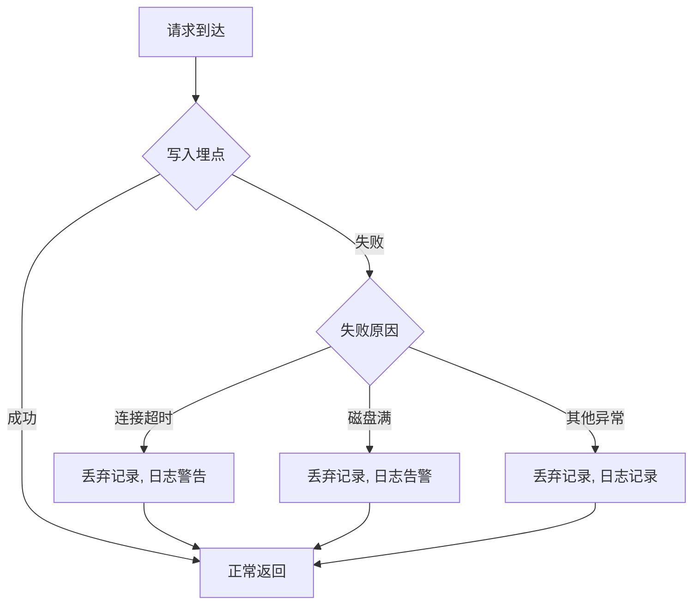

# 异常兜底逻辑方案

## 一、总览

本方案覆盖 **manyu_test（后端）** 与 **manyu_test1（前端）** 两仓的异常处理与降级策略，确保系统在异常发生时提供有意义的反馈、数据不丢失、主流程可降级运行。

---

## 二、统一错误响应格式

### 2.1 后端统一错误体

所有 API 异常统一返回以下格式：

```json
{
  "code": "ERROR_CODE",
  "message": "人类可读的错误描述",
  "detail": {} | null,
  "request_id": "uuid"
}
```

### 2.2 错误码定义

| 错误码 | HTTP 状态码 | 说明 |
|--------|------------|------|
| `INVALID_INPUT` | 400 | 请求参数校验失败 |
| `EMPTY_INPUT` | 400 | 输入为空 |
| `INVALID_NUMBER_ARRAY` | 400 | 冒泡排序入参非整数数组 |
| `HASH_ERROR` | 500 | 哈希计算异常 |
| `SORT_ERROR` | 500 | 排序执行异常 |
| `EXPORT_ERROR` | 500 | 导出文件生成失败 |
| `EXPORT_FORMAT_UNSUPPORTED` | 400 | 不支持的导出格式 |
| `STATS_QUERY_ERROR` | 500 | 统计数据查询失败 |
| `TRACKING_WRITE_FAILED` | 200（静默降级） | 埋点写入失败，不影响主流程 |
| `RATE_LIMIT` | 429 | 频率限制触发 |
| `INTERNAL_ERROR` | 500 | 未捕获的服务器内部错误 |
| `NOT_FOUND` | 404 | 资源不存在 |

---

## 三、后端异常分类与兜底策略

### 3.1 API 层异常（FastAPI Exception Handlers）

| 异常类型 | 捕获方式 | 兜底行为 |
|---------|---------|---------|
| `RequestValidationError` | 全局 `@app.exception_handler` | 返回 400 + 字段级校验详情 |
| `HTTPException` | 全局 `@app.exception_handler` | 按原状态码转发 |
| 未捕获 `Exception` | 全局 `@app.exception_handler` | 返回 500 + 通用错误信息，日志记录完整堆栈 |

### 3.2 业务接口异常

#### 3.2.1 HelloWorld 接口（GET `/api/hello`）

| 异常场景 | 兜底策略 |
|---------|---------|
| 时间戳生成失败 | 降级返回固定时间字符串 `"1970-01-01T00:00:00Z"`，日志告警 |
| 埋点写入失败 | 埋点静默降级（见第 3.5 节），正常返回问候语 |

#### 3.2.2 SHA256 哈希接口（POST `/api/hash`）

| 异常场景 | 兜底策略 |
|---------|---------|
| `text` 字段为空 | 返回 400 `EMPTY_INPUT` |
| `text` 类型非字符串 | 返回 400 `INVALID_INPUT`，尝试 `str()` 转换后仍失败才拒绝 |
| 哈希计算异常 | 捕获 `ValueError`/`TypeError`，返回 500 `HASH_ERROR` |
| 输入超长 (>1MB) | 截断至 1MB 后计算，返回时标记 `"truncated": true` |

#### 3.2.3 冒泡排序接口（POST `/api/bubble-sort`）

| 异常场景 | 兜底策略 |
|---------|---------|
| `numbers` 为空数组 | 返回 400 `INVALID_INPUT`，提示"数组不能为空" |
| `numbers` 含非数字元素 | 返回 400 `INVALID_NUMBER_ARRAY`，列出异常元素索引 |
| `numbers` 元素数量 > 10000 | 返回 400，提示"数组过大，最大支持 10000 个元素" |
| 排序执行异常 | 捕获排序模块异常，返回 500 `SORT_ERROR` |
| 原 `bubble_sort.py` 模块异常 | 若模块抛异常，降级使用 Python 内置 `sorted()` 兜底，返回结果并标记 `"fallback": true` |

#### 3.2.4 导出接口（GET `/api/export`）

| 异常场景 | 兜底策略 |
|---------|---------|
| `tab` 参数无效 | 返回 400，列出有效 tab 值：`hello`/`hash`/`bubble` |
| `format` 非 csv/xlsx | 返回 400 `EXPORT_FORMAT_UNSUPPORTED` |
| 查询结果为空 | 返回空文件（仅含表头），不视为错误 |
| Excel 生成依赖缺失 | 降级为 CSV 输出，响应头标记 `X-Fallback: csv` |
| 文件流写出异常 | 捕获 `IOError`，返回 500 `EXPORT_ERROR` |

#### 3.2.5 统计接口（GET `/api/stats`）

| 异常场景 | 兜底策略 |
|---------|---------|
| `dimension` 参数无效 | 返回 400，列出有效维度：`user_type`/`user_level`/`user_department` |
| 统计数据为空 | 返回空数组 `[]`，不视为错误 |
| 数据库查询超时（>5s） | 返回部分数据 + 标记 `"partial": true`，或返回缓存数据 |
| 数据库连接失败 | 返回空数据 + 标记 `"cache_hit": false`，日志告警 |

### 3.3 数据层异常

| 异常场景 | 兜底策略 |
|---------|---------|
| SQLite 数据库连接失败 | 重试 3 次（间隔 1s），失败后所有写入操作静默降级，读取返回空数据 |
| 数据库写入超时 | 异步写入，超时 2s，超时后丢弃该条记录并日志记录 |
| 数据库表不存在 | 启动时自动建表（`CREATE TABLE IF NOT EXISTS`） |

### 3.4 埋点降级策略（关键兜底）

> **原则：埋点决不影响主流程。**



- 埋点使用异步写入（后台任务），不阻塞请求响应
- 写入失败仅记录日志，不向客户端报错
- 日志级别：WARNING（首次）→ ERROR（连续 5 次失败）
- 连续失败 10 次后，埋点暂停 60s 后自动重试

### 3.5 全局兜底中间件

```python
@app.middleware("http")
async def global_fallback_middleware(request: Request, call_next):
    try:
        response = await call_next(request)
    except Exception as e:
        # 捕获所有未处理异常
        logger.exception("Unhandled exception: %s", e)
        return JSONResponse(
            status_code=500,
            content={
                "code": "INTERNAL_ERROR",
                "message": "服务器内部错误，请稍后重试",
                "detail": None,
                "request_id": str(uuid4())
            }
        )
    return response
```

---

## 四、前端异常分类与兜底策略

### 4.1 网络请求异常

| 异常场景 | 兜底行为 |
|---------|---------|
| 请求超时（>10s） | 弹窗提示"请求超时，请检查网络后重试"，提供「重试」按钮 |
| 网络断开 | 全局 axios 拦截器捕获，显示 Toast "网络连接已断开" |
| 服务器 5xx 错误 | 显示 Toast "服务器繁忙，请稍后重试" + 自动重试 1 次（间隔 3s） |
| 服务器 4xx 错误 | 按错误码显示具体提示（如"输入参数无效"） |
| 429 限流 | 显示 Toast "请求过于频繁，请稍后再试" + 展示倒计时 |

### 4.2 请求重试策略

```
首次失败 → 3s 后自动重试 1 次 → 仍失败 → 展示错误提示 + 手动重试按钮
```

- 读接口（GET）：最多自动重试 2 次，间隔递增（3s → 6s）
- 写接口（POST）：不自动重试，直接展示错误提示

### 4.3 Tab 页面异常

| 异常场景 | 兜底行为 |
|---------|---------|
| 单个 Tab 接口加载失败 | 仅该 Tab 显示错误状态，不影响其他 Tab |
| 所有 Tab 均加载失败 | 展示全局错误页面 +「重新加载」按钮 |
| Tab 切换时接口返回慢 | 保持当前 Tab 内容，展示加载骨架屏，不阻塞切换 |

### 4.4 图表渲染异常

| 异常场景 | 兜底行为 |
|---------|---------|
| 数据为空 | 渲染空状态图（"暂无数据"占位图） |
| 数据格式异常 | 捕获 ECharts/Chart.js 渲染异常，降级为表格展示原始数据 |
| Canvas 渲染失败 | 降级为纯文本表格 |
| 浏览器不支持 SVG/Canvas | 降级为纯文本表格 |

### 4.5 导出下载异常

| 异常场景 | 兜底行为 |
|---------|---------|
| 导出请求超时 | 提示"导出超时，请缩小数据范围后重试" |
| 导出文件过大 | 前端限制最大导出行数（10000 行），超出时提示分批导出 |
| 下载被浏览器拦截 | 提示"请允许弹窗下载，或手动点击下载链接" |
| 导出接口返回错误 | 展示具体错误信息，不清除已选导出参数 |

### 4.6 前端全局异常边界

```vue
<!-- App.vue 或根组件 -->
<ErrorBoundary>
  <router-view />
  <template #fallback="{ error }">
    <div class="error-boundary">
      <h2>页面出现异常</h2>
      <p>{{ error.message }}</p>
      <button @click="reload">重新加载</button>
    </div>
  </template>
</ErrorBoundary>
```

---

## 五、跨仓异常对齐点

| 对齐项 | 后端 | 前端 |
|-------|------|------|
| 错误码 | 统一 `code` 字段 | 统一错误码映射表，展示对应文案 |
| 请求 ID | 每个响应返回 `request_id` | 控制台日志输出 `request_id`，便于排查 |
| 超时配置 | 接口超时 30s，埋点超时 2s | axios timeout 10s |
| 重试语义 | 幂等接口标注（GET 幂等，POST 非幂等） | 仅 GET 自动重试 |
| 降级标记 | `"fallback": true` 或 `"partial": true` | 前端检测到降级标记后展示"⚠️ 部分数据"提示 |

---

## 六、日志与监控告警

### 6.1 日志级别

| 级别 | 场景 | 输出目标 |
|------|------|---------|
| ERROR | 未捕获异常、数据库连接失败、连续埋点失败 | 日志文件 + 控制台 |
| WARNING | 单次埋点失败、请求超时、降级触发 | 日志文件 |
| INFO | 正常请求、降级恢复 | 日志文件 |
| DEBUG | 调试用 | 仅开发环境 |

### 6.2 告警阈值（待接入）

| 指标 | 阈值 | 建议动作 |
|------|------|---------|
| 5xx 错误率 | >5% 持续 5 分钟 | 检查服务状态 |
| 埋点写入失败率 | >10% 持续 5 分钟 | 检查数据库/磁盘 |
| 请求平均响应时间 | >5s 持续 5 分钟 | 检查接口性能 |
| 降级触发次数 | >50 次/小时 | 排查异常根因 |

---

## 七、方案小结

| 层级 | 异常类型 | 兜底策略 |
|------|---------|---------|
| 后端 API | 校验异常 | 400 + 字段级错误 |
| 后端 API | 未捕获异常 | 500 + 统一错误体 + 日志堆栈 |
| 后端业务 | 哈希计算异常 | 兜底捕获 + 明确错误码 |
| 后端业务 | 排序异常 | 降级 `sorted()` 内置函数 + `fallback` 标记 |
| 后端业务 | 埋点失败 | 异步丢弃 + 静默降级，不影响主流程 |
| 后端数据 | 数据库异常 | 重试 + 空数据 + 日志告警 |
| 前端网络 | 请求失败 | 自动重试(GET) + Toast 提示 |
| 前端渲染 | Tab 加载失败 | 单 Tab 隔离，不影响其他 |
| 前端渲染 | 图表异常 | 降级表格展示 |
| 前端导出 | 下载异常 | 友好提示 + 保留参数 |