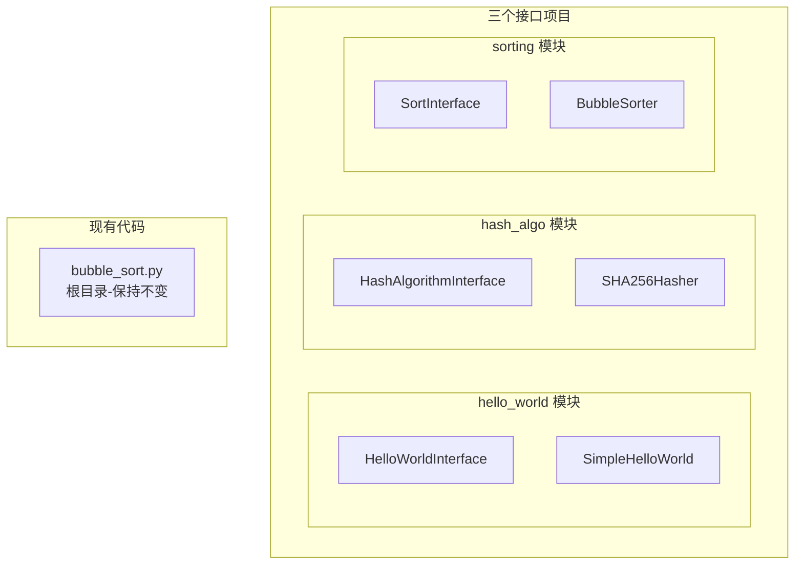
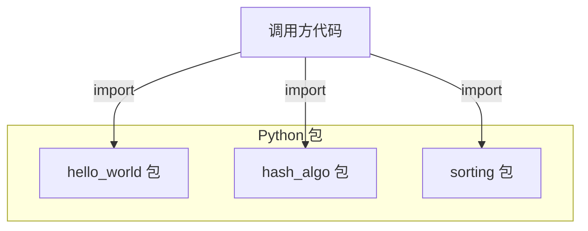
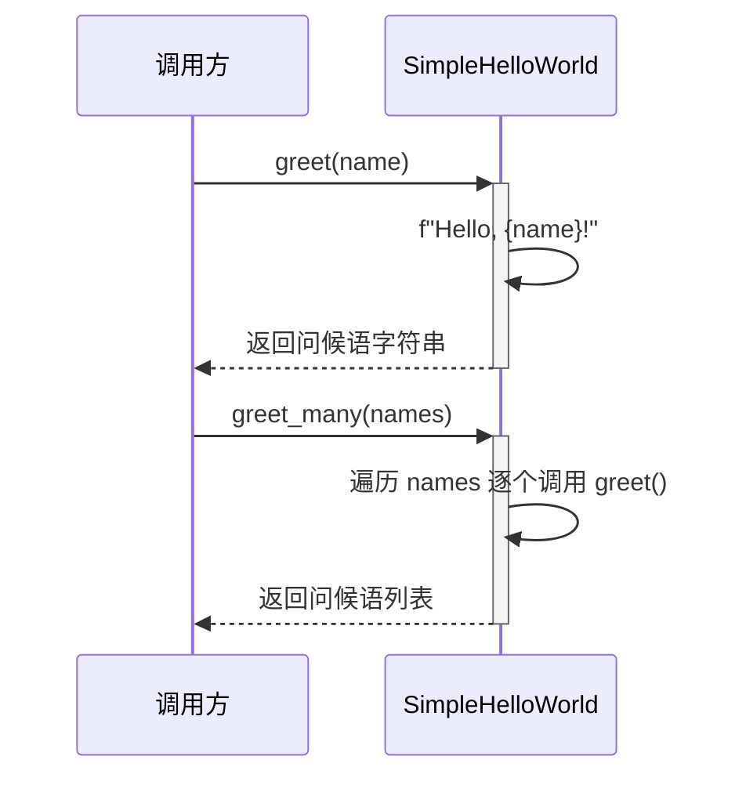
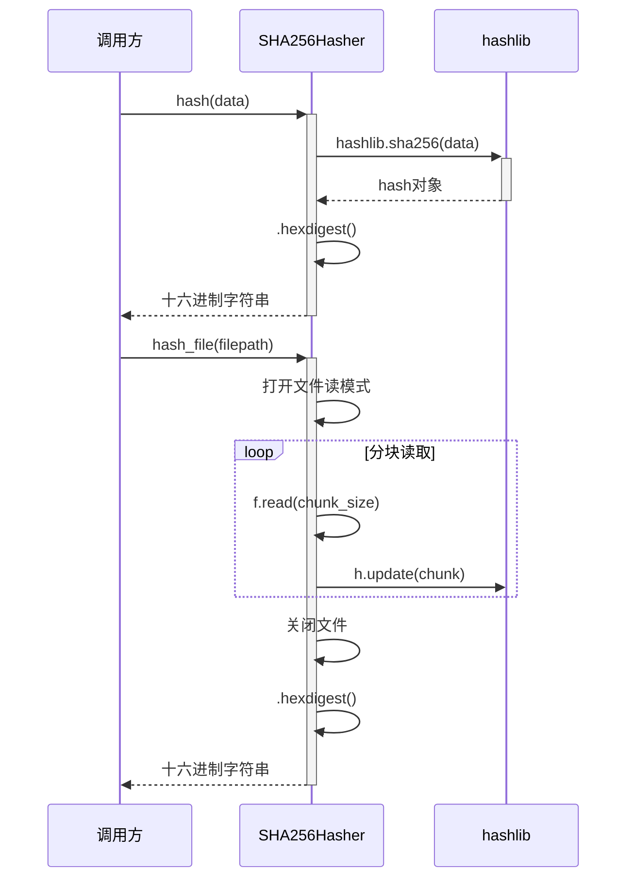
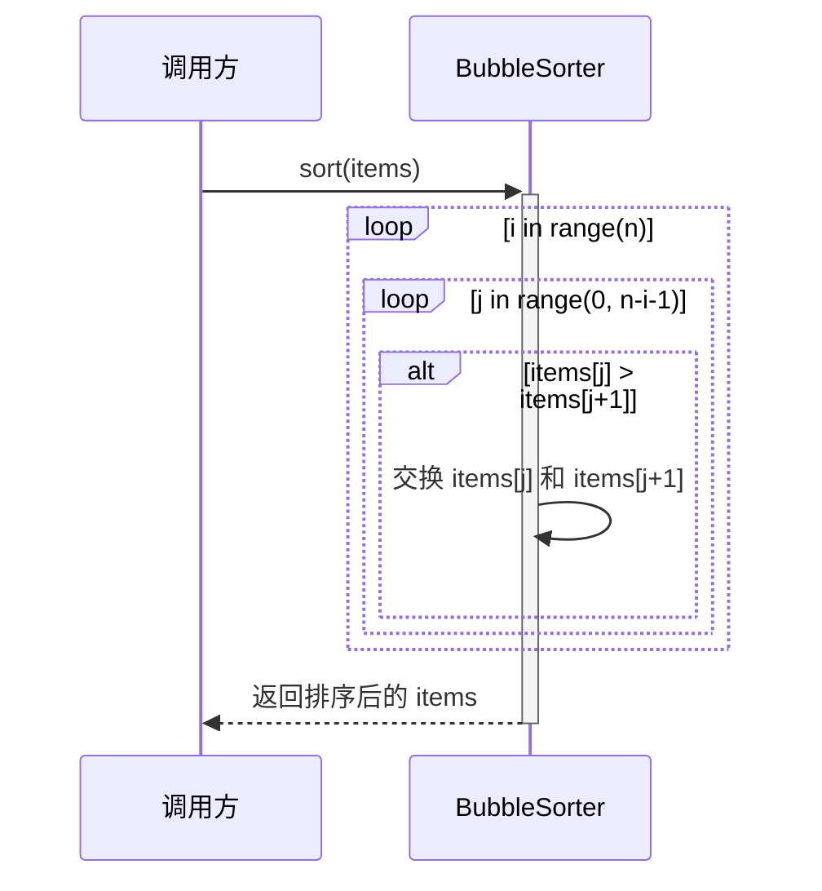

> **文档元信息**
>
> | 项目 | 内容 |
> |------|------|
> | 文档版本 | v1.0 |
> | 作者 | AiWork 系分助手 |
> | 创建日期 | 2026-09-01 |
> | 需求来源 | 需求：分别写三个接口 helloworld、哈希算法以及冒泡排序 |
> | 评审状态 | 待评审 |

# 三接口（HelloWorld / 哈希算法 / 冒泡排序）系分设计

## 1. 需求与范围

### 背景与目标

本项目旨在为三个基础功能模块——HelloWorld（问候）、哈希算法、冒泡排序——定义统一的接口契约。目标是将这些功能模块化、接口化，使其具备良好的可扩展性和可测试性，同时保持与现有代码的兼容性。

### 核心功能

1. **HelloWorld 问候功能**：提供单人和批量问候语生成能力
2. **哈希算法功能**：提供数据哈希计算和文件哈希计算能力，返回十六进制哈希值
3. **冒泡排序功能**：提供列表排序能力，支持原地排序

### 约束与非功能要求

- 使用 Python 3.10+ 语法
- 使用 `typing.Protocol` 定义接口（结构性子类型），不使用 ABC
- 所有接口方法必须包含完整文档字符串和 doctest 示例
- 现有根目录 `bubble_sort.py` 不得修改
- 每个包必须包含 `__init__.py`
- 类型标注必须完整，通过 mypy --strict 检查

### 排除范围

- 不涉及 Web 服务/HTTP 接口
- 不涉及数据库存储
- 不涉及用户界面
- 不涉及外部系统集成
- 不涉及分布式部署

### 需求功能清单与优先级

| 编号 | 功能点 | 优先级 | PRD 原始描述/章节 | 备注 |
|------|--------|--------|-------------------|------|
| F01 | HelloWorld 接口定义 | P0 | "分别写三个接口helloworld" | 包含 greet() 和 greet_many() 方法 |
| F02 | HelloWorld 接口实现 | P0 | "分别写三个接口helloworld" | 至少一个实现类 SimpleHelloWorld |
| F03 | 哈希算法接口定义 | P0 | "分别写三个接口helloworld、哈希算法" | 包含 hash()、hash_file()、algorithm_name |
| F04 | 哈希算法接口实现 | P0 | "分别写三个接口helloworld、哈希算法" | 至少一个实现类 SHA256Hasher |
| F05 | 冒泡排序接口定义 | P0 | "分别写三个接口helloworld、哈希算法以及冒泡排序" | 包含 sort()、algorithm_name、time_complexity、space_complexity |
| F06 | 冒泡排序接口实现 | P0 | "分别写三个接口helloworld、哈希算法以及冒泡排序" | 至少一个实现类 BubbleSorter |
| F07 | 现有代码兼容 | P1 | 保持现有 bubble_sort.py 不变 | 根目录文件不被修改 |
| F08 | 类型检查 | P1 | 需通过 mypy --strict 检查 | 确保类型安全 |

### 假设与待确认项

| 编号 | 假设/待确认内容 | 当前假设 | 确认状态 |
|------|-----------------|----------|----------|
| A01 | 使用 Python 3.10+ 语法 | 假设用户项目使用 Python 3.10+ | 待确认 |
| A02 | 接口方式采用 typing.Protocol | 符合结构性子类型最佳实践 | 已确认 |
| A03 | 哈希算法选用 SHA-256 | 标准库内置，安全性适中 | 已确认 |
| A04 | 不涉及 Web 框架/HTTP 接口 | 纯 Python 接口定义，非 Web 应用 | 已确认 |
| A05 | 现有 bubble_sort.py 保持根目录不动 | 假设用户不需要修改 | 已确认 |

## 2. 架构与模块

### 功能架构

本项目为纯 Python 库模块，各模块之间无运行时依赖，独立可调用。

**模块清单**

| 模块 | 职责 | 依赖 |
|------|------|------|
| hello_world | HelloWorld 问候接口定义与实现 | 无（纯 Python 标准库） |
| hash_algo | 哈希算法接口定义与 SHA-256 实现 | 无（hashlib 标准库） |
| sorting | 排序算法接口定义与冒泡排序实现 | 无（纯 Python 标准库） |

### 应用集成架构

本模块为纯 Python 库，不涉及 Web 服务、外部系统集成或中间件。各模块以 Python 包形式提供，通过 import 直接使用。

**集成关系说明：**

| 调用方 | 被调用方 | 协议 | 接口类型 | 说明 |
|--------|----------|------|----------|------|
| 用户代码 | hello_world 包 | Python import | typing.Protocol | 问候功能 |
| 用户代码 | hash_algo 包 | Python import | typing.Protocol | 哈希计算 |
| 用户代码 | sorting 包 | Python import | typing.Protocol | 排序功能 |

### 部署架构

本项不适用，原因：本项目为纯 Python 库模块，非服务化应用，无需部署架构。作为标准 Python 包发布，用户通过 pip install 或直接 import 使用。

## 3. 数据模型与存储

### 实体清单

本项不适用，原因：本项目为纯算法/工具库模块，不涉及业务实体数据，无需数据库存储。所有数据均为调用方传入的临时数据（字符串、字节数组、列表），在内存中处理，不持久化。

### 实体关系图

本项不适用，原因：无持久化实体，无需实体关系图。

### 模型说明

本项不适用，原因：无持久化数据模型。

## 4. 接口设计

本项目为纯 Python 库模块，不涉及 HTTP/Web 接口。以下为 Python 方法级接口（内部接口）。

### 4.1 内部接口（Python 类方法）

| 编号 | 接口名称 | 类/模块 | 方法签名 | 所属模块 |
|------|----------|---------|----------|----------|
| I01 | 生成问候语 | HelloWorldInterface | greet(name: str) -> str | hello_world |
| I02 | 批量生成问候语 | HelloWorldInterface | greet_many(names: list[str]) -> list[str] | hello_world |
| I03 | 计算哈希值 | HashAlgorithmInterface | hash(data: bytes) -> str | hash_algo |
| I04 | 计算文件哈希 | HashAlgorithmInterface | hash_file(filepath: str, chunk_size: int = 8192) -> str | hash_algo |
| I05 | 获取算法名称 | HashAlgorithmInterface | algorithm_name -> str（property） | hash_algo |
| I06 | 排序 | SortInterface | sort(items: list[T]) -> list[T] | sorting |
| I07 | 获取算法名称 | SortInterface | algorithm_name -> str（property） | sorting |
| I08 | 获取时间复杂度 | SortInterface | time_complexity -> str（property） | sorting |
| I09 | 获取空间复杂度 | SortInterface | space_complexity -> str（property） | sorting |

### 4.2 接口分类说明

- **对外接口（OpenAPI）**：本项不适用，原因：本项目为纯 Python 库，无 HTTP 对外接口。
- **oneapi（Web 控制台接口）**：本项不适用，原因：本项目不涉及 Web 控制台。
- **集成接口（外部系统）**：本项不适用，原因：本项目无外部系统集成。

## 5. 功能模块设计

### 5.1 hello_world 模块

#### 5.1.1 表结构设计

本项不适用，原因：hello_world 模块为纯算法/工具模块，无数据库持久化需求。

#### 5.1.2 枚举与常量定义

本模块无枚举/常量定义。

#### 5.1.3 接口详细设计

##### I01 生成问候语（greet）

- **方法签名**: `greet(name: str) -> str`
- **描述**: 为指定名字生成问候语字符串
- **入参**:

| 参数名称 | 类型 | 是否必填 | 描述 |
|----------|------|----------|------|
| name | str | 是 | 被问候者的名字 |

- **出参**:

| 参数名称 | 类型 | 描述 |
|----------|------|------|
| result | str | 问候语字符串 |

- **业务规则**: 无特殊业务规则，直接拼接字符串

##### I02 批量生成问候语（greet_many）

- **方法签名**: `greet_many(names: list[str]) -> list[str]`
- **描述**: 为多个名字批量生成问候语
- **入参**:

| 参数名称 | 类型 | 是否必填 | 描述 |
|----------|------|----------|------|
| names | list[str] | 是 | 名字列表 |

- **出参**:

| 参数名称 | 类型 | 描述 |
|----------|------|------|
| result | list[str] | 问候语列表 |

- **业务规则**: 遍历调用 greet() 生成每个问候语

#### 5.1.4 子功能详细设计

##### 5.1.4.1 HelloWorld 问候功能（F01/F02）

- **处理时序图**

**业务规则：**

| 规则编号 | 规则描述 | 校验时机 | 不满足时的处理 |
|----------|----------|----------|--------------|
| R01 | name 参数应为字符串类型 | 调用时 | Python 类型检查（mypy）或运行时 TypeError |

**异常场景：**

| 异常场景 | 处理方式 |
|----------|----------|
| 传入空字符串 name="" | 正常返回 "Hello, !" |
| 传入空列表 names=[] | 返回空列表 [] |
| name 类型非字符串 | mypy 静态检查拦截；运行时可能抛出 TypeError |

**并发控制：** 本项不适用，原因：无状态函数，无共享数据写入，无并发风险。

**状态机设计：** 本项不适用，原因：无状态字段。

### 5.2 hash_algo 模块

#### 5.2.1 表结构设计

本项不适用，原因：hash_algo 模块为纯算法/工具模块，无数据库持久化需求。

#### 5.2.2 枚举与常量定义

本模块无枚举/常量定义。

#### 5.2.3 接口详细设计

##### I03 计算哈希值（hash）

- **方法签名**: `hash(data: bytes) -> str`
- **描述**: 计算输入字节数据的哈希值，返回十六进制字符串
- **入参**:

| 参数名称 | 类型 | 是否必填 | 描述 |
|----------|------|----------|------|
| data | bytes | 是 | 输入字节数据 |

- **出参**:

| 参数名称 | 类型 | 描述 |
|----------|------|------|
| result | str | 十六进制哈希字符串（SHA-256 为 64 字符） |

- **业务规则**: 使用 hashlib 标准库中的 SHA-256 算法

##### I04 计算文件哈希（hash_file）

- **方法签名**: `hash_file(filepath: str, chunk_size: int = 8192) -> str`
- **描述**: 计算文件的 SHA-256 哈希值，分块读取避免大文件内存溢出
- **入参**:

| 参数名称 | 类型 | 是否必填 | 描述 |
|----------|------|----------|------|
| filepath | str | 是 | 文件路径 |
| chunk_size | int | 否（默认 8192） | 读取块大小（字节） |

- **出参**:

| 参数名称 | 类型 | 描述 |
|----------|------|------|
| result | str | 十六进制哈希字符串 |

- **业务规则**: 分块读取文件内容，逐块更新哈希对象

##### I05 获取算法名称（algorithm_name）

- **方法签名**: `algorithm_name -> str`（property）
- **描述**: 返回当前哈希算法名称
- **出参**:

| 参数名称 | 类型 | 描述 |
|----------|------|------|
| result | str | 算法名称，如 'sha256' |

#### 5.2.4 子功能详细设计

##### 5.2.4.1 哈希计算功能（F03/F04）

- **处理时序图**

**业务规则：**

| 规则编号 | 规则描述 | 校验时机 | 不满足时的处理 |
|----------|----------|----------|--------------|
| R02 | data 参数应为 bytes 类型 | 调用时 | Python 类型检查（mypy）或运行时 TypeError |
| R03 | filepath 对应的文件必须存在且可读 | 调用时 | 抛出 FileNotFoundError |
| R04 | chunk_size 应为正整数 | 调用时 | 默认值 8192，非法值由 hashlib 内部校验 |

**异常场景：**

| 异常场景 | 处理方式 |
|----------|----------|
| 传入空字节 b"" | 正常返回空数据的 SHA-256 哈希值 |
| 文件路径不存在 | 抛出 FileNotFoundError |
| 文件无读取权限 | 抛出 PermissionError |
| 超大文件（>2GB） | 分块读取，不加载到内存，安全处理 |

**并发控制：** 本项不适用，原因：无状态函数，无共享数据写入，无并发风险。

**状态机设计：** 本项不适用，原因：无状态字段。

**技术选型方案对比：**

| 方案 | 算法 | 优势 | 劣势 |
|------|------|------|------|
| 方案A（推荐） | SHA-256 | 标准库 hashlib 内置、安全性高、无外部依赖 | 性能略低于 MD5 |
| 方案B | MD5 | 计算速度快 | 安全性低，已不推荐用于安全场景 |
| 方案C | SHA-3 | 最新的 SHA 标准 | Python 标准库支持有限，需额外依赖 |

**推荐方案：** 方案A（SHA-256）
**推荐理由：** Python 标准库 hashlib 直接支持，安全性和性能均衡，无需额外依赖，适合通用场景。

### 5.3 sorting 模块

#### 5.3.1 表结构设计

本项不适用，原因：sorting 模块为纯算法/工具模块，无数据库持久化需求。

#### 5.3.2 枚举与常量定义

本模块无枚举/常量定义。

#### 5.3.3 接口详细设计

##### I06 排序（sort）

- **方法签名**: `sort(items: list[T]) -> list[T]`
- **描述**: 对列表进行原地冒泡排序，返回排序后的列表（同一引用）
- **入参**:

| 参数名称 | 类型 | 是否必填 | 描述 |
|----------|------|----------|------|
| items | list[T] | 是 | 待排序列表，T 为可比较类型 |

- **出参**:

| 参数名称 | 类型 | 描述 |
|----------|------|------|
| result | list[T] | 排序后的列表（原地排序，同时返回引用） |

- **业务规则**: 标准冒泡排序算法，每次遍历将最大元素"冒泡"到末尾

##### I07 获取算法名称（algorithm_name）

- **方法签名**: `algorithm_name -> str`（property）
- **描述**: 返回排序算法名称
- **出参**:

| 参数名称 | 类型 | 描述 |
|----------|------|------|
| result | str | 算法名称，如 'bubble_sort' |

##### I08 获取时间复杂度（time_complexity）

- **方法签名**: `time_complexity -> str`（property）
- **描述**: 返回时间复杂度描述
- **出参**:

| 参数名称 | 类型 | 描述 |
|----------|------|------|
| result | str | 时间复杂度，如 'O(n²)' |

##### I09 获取空间复杂度（space_complexity）

- **方法签名**: `space_complexity -> str`（property）
- **描述**: 返回空间复杂度描述
- **出参**:

| 参数名称 | 类型 | 描述 |
|----------|------|------|
| result | str | 空间复杂度，如 'O(1)' |

#### 5.3.4 子功能详细设计

##### 5.3.4.1 冒泡排序功能（F05/F06）

- **处理时序图**

**业务规则：**

| 规则编号 | 规则描述 | 校验时机 | 不满足时的处理 |
|----------|----------|----------|--------------|
| R05 | items 参数应为 list 类型 | 调用时 | Python 类型检查（mypy）或运行时 TypeError |
| R06 | 列表元素应支持比较运算符 > | 排序时 | 运行时抛出 TypeError（如混合类型） |

**异常场景：**

| 异常场景 | 处理方式 |
|----------|----------|
| 传入空列表 [] | 正常返回 [] |
| 传入单元素列表 [42] | 正常返回 [42] |
| 元素类型不支持比较 | 运行时抛出 TypeError |
| 列表元素为混合类型 | 运行时抛出 TypeError |

**并发控制：** 本项不适用，原因：无并发风险。sort 方法修改调用方传入的列表，由调用方负责并发控制。

**状态机设计：** 本项不适用，原因：无状态字段。

**技术选型方案对比：**

| 方案 | 算法 | 优势 | 劣势 |
|------|------|------|------|
| 方案A（推荐） | 标准冒泡排序 | 实现简单、直观易懂、稳定排序 | 时间复杂度 O(n²) |
| 方案B | 优化版冒泡排序（带交换标志） | 已排序列表可提前终止 | 实现略复杂 |
| 方案C | 鸡尾酒排序（双向冒泡） | 对"乌龟"数据效率略高 | 实现复杂，收益有限 |

**推荐方案：** 方案A（标准冒泡排序）
**推荐理由：** 需求明确要求"冒泡排序"，标准冒泡排序是最直接、最符合需求的实现，且明确标注了 O(n²) 的时间复杂度。

## 6. 非功能性需求设计

### 6.1 高可用性

本项不适用，原因：本项目为纯 Python 库模块，非服务化应用，无部署高可用需求。

### 6.2 可扩展性

- **架构可扩展性**：通过 `typing.Protocol` 实现接口与实现分离，新增算法实现无需修改接口定义。例如：
  - 新增哈希算法（如 MD5、SHA-3）只需新增实现类，无需修改 `HashAlgorithmInterface`
  - 新增排序算法（如快速排序、归并排序）只需新增实现类，无需修改 `SortInterface`

### 6.3 稳定性/可靠性

- 所有接口方法包含完整的类型标注，通过 mypy --strict 静态类型检查，在编译时发现类型错误
- 所有接口方法包含 doctest 示例，可通过 pytest/doctest 自动化测试验证
- 实现类使用标准库，无需外部依赖，降低依赖风险

### 6.4 安全性设计

#### 6.4.1 账户系统方案

本项不适用，原因：本项目为纯库模块，无用户账户系统。

#### 6.4.2 授权与访问控制

本项不适用，原因：本项目为纯库模块，无用户访问控制需求。

#### 6.4.3 数据防护方案

- 哈希算法模块本身提供数据完整性校验能力，调用方可根据需要选择使用
- 不涉及敏感数据存储或传输

### 6.5 监控/统计/日志/告警

本项不适用，原因：本项目为纯库模块，无运行时监控需求。调用方可根据需要自行添加日志。

### 6.6 性能

- 冒泡排序：O(n²) 时间复杂度，适用于小规模数据（<1000 元素）
- SHA-256 哈希：标准库 hashlib 实现，性能经过充分优化
- HelloWorld：O(n) 时间复杂度的字符串拼接，性能可忽略

## 7. 变更三板斧

### 7.1 可监控

本项不适用，原因：本项目为纯 Python 库模块，非服务化应用，无运行时监控埋点需求。调用方可根据需要在调用处自行添加日志或监控。

### 7.2 可灰度

本项不适用，原因：本项目为纯库模块，非服务化应用，无灰度发布需求。新增接口/实现类通过版本号（Python 包版本）管理，调用方通过指定版本号控制使用范围。

### 7.3 可应急

本项不适用，原因：本项目为纯库模块，非服务化应用，无运行时应急开关需求。如出现兼容性问题，调用方可通过降级到旧版本包快速恢复。