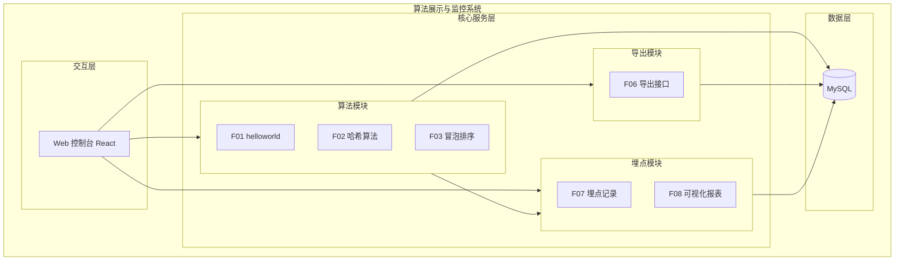
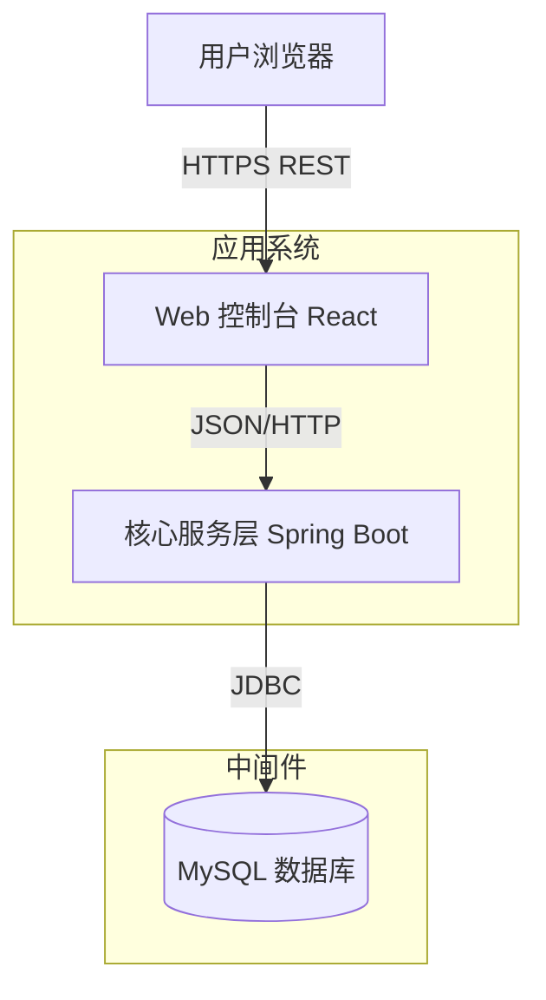
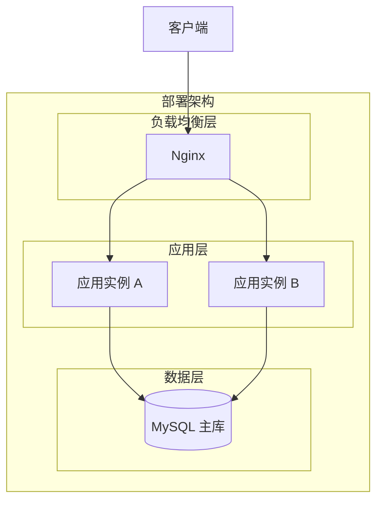
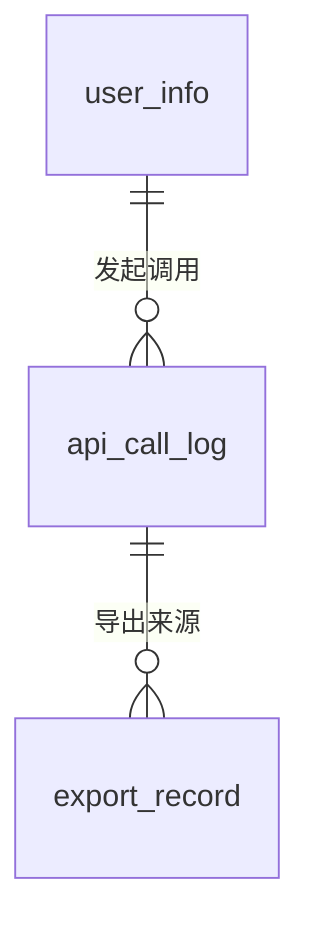
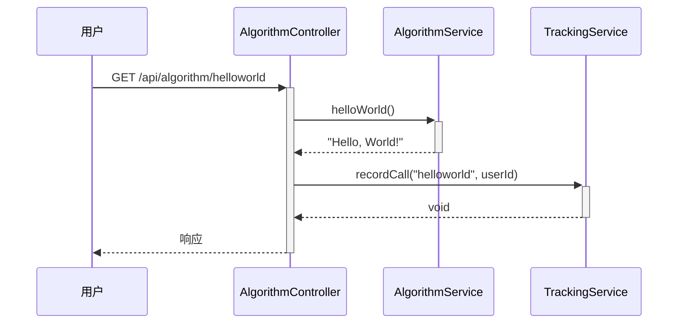
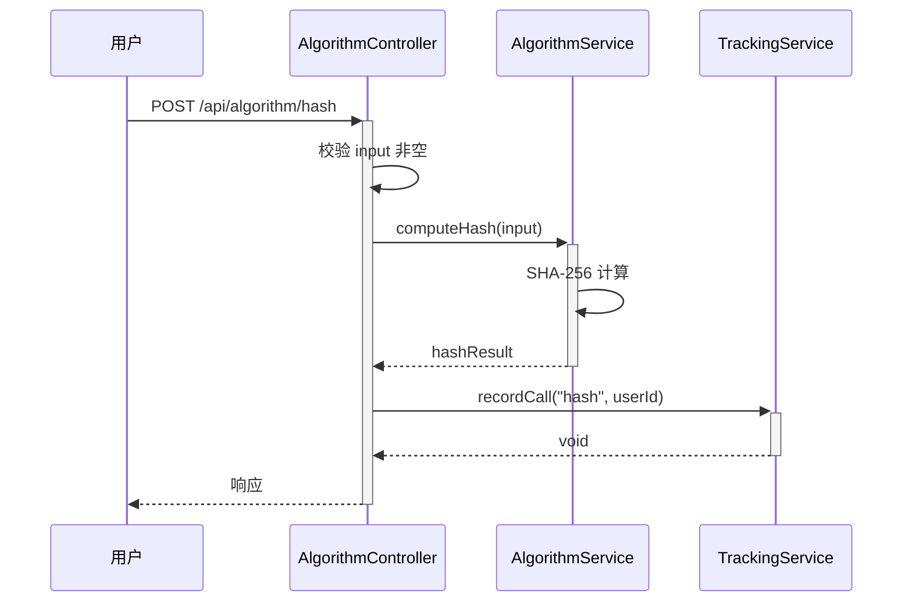
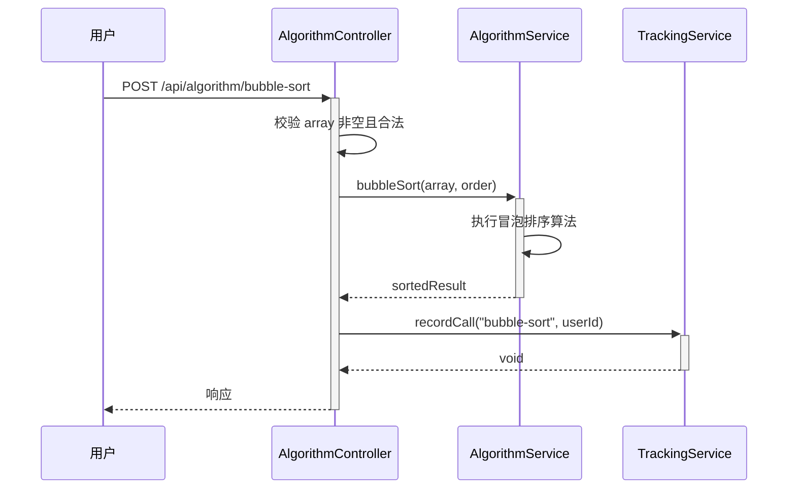
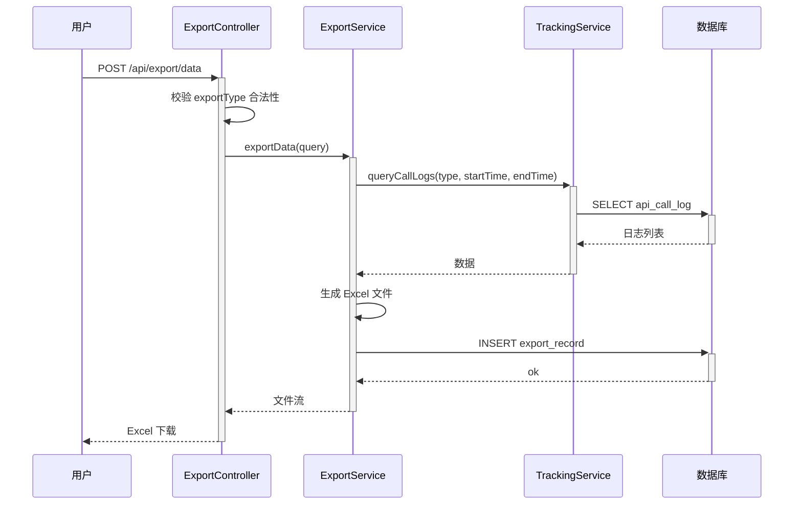
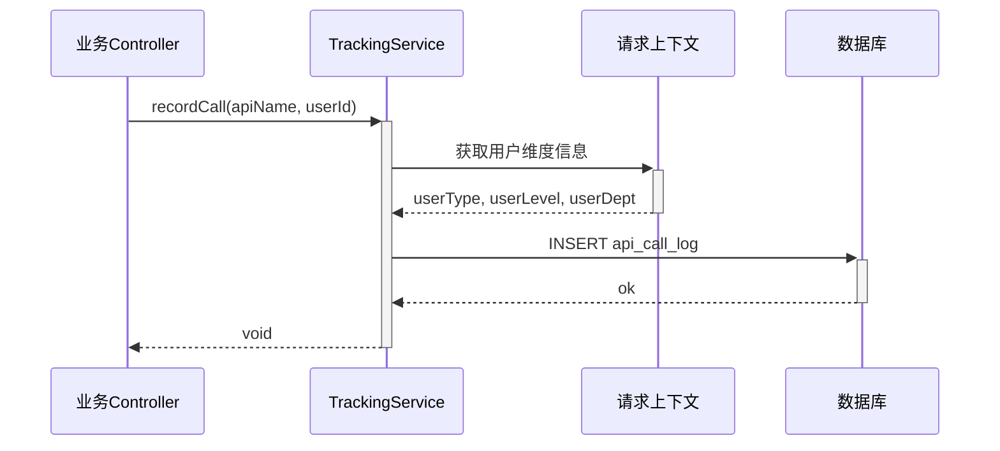
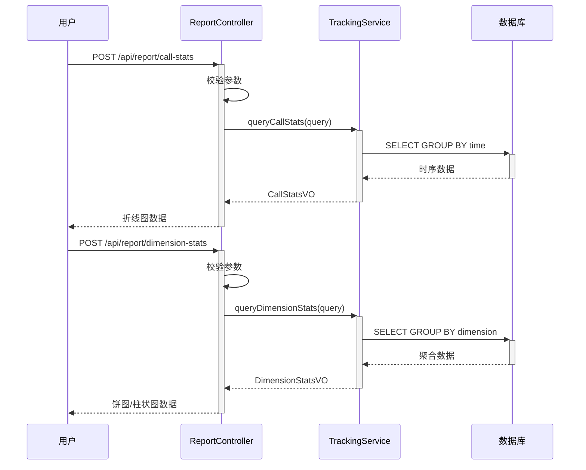

> **文档元信息**
>
> | 项目 | 内容 |
> |------|------|
> | 文档版本 | v1.0 |
> | 作者 | AiWork |
> | 创建日期 | 2026-09-01 |
> | 需求来源 | 算法展示与监控子系统需求 |
> | 评审状态 | 待评审 |

# 算法展示与监控子系统 系分设计

## 1. 需求与范围

### 背景与目标

为演示平台新增三个算法接口（helloworld、哈希算法、冒泡排序）及配套的前端展示、导出、埋点监控功能，构建完整的"算法展示与监控"子系统。

### 核心功能

1. 提供三个后端接口：helloworld、哈希算法、冒泡排序
2. 前端新增页面，三个 Tab 分别展示不同接口的执行结果
3. 导出功能：前端导出按钮 + 后端导出接口，支持导出各页面展示结果
4. 埋点监控：记录调用次数和调用人
5. 可视化报表：前端在当前页面上展示调用情况报表（按人员类型/层级/部门维度，折线图/饼图/柱状图）

### 约束与非功能要求

- 假设：后端采用 Java + Spring Boot 单体架构
- 假设：前端采用 React 框架
- 假设：埋点数据存储于关系型数据库（MySQL）
- 假设：导出格式为 Excel（.xlsx）
- 假设：用户认证已由现有 SSO 体系提供

### 排除范围

- 用户登录/认证体系（假设已有）
- 国际化/多语言
- 移动端适配

### 需求功能清单与优先级

| 编号 | 功能点 | 优先级 | PRD 原始描述 | 备注 |
|------|--------|--------|-------------|------|
| F01 | helloworld 接口 | P0 | 写三个接口 helloworld | 返回问候语 |
| F02 | 哈希算法接口 | P0 | 写三个接口 哈希算法 | 输入字符串，返回 SHA-256 哈希值 |
| F03 | 冒泡排序接口 | P0 | 写三个接口 冒泡排序 | 输入数组，返回排序结果 |
| F04 | 前端三 Tab 展示页 | P0 | 前端新增一个页面，有三个 tab 分别展示不同的执行结果 | 每个 Tab 对应一个接口 |
| F05 | 导出按钮 | P1 | 新增导出按钮 | 前端触发 |
| F06 | 后端导出接口 | P1 | 后台提供导出接口，支持导出各个页面的展示结果 | 导出为 Excel |
| F07 | 埋点记录 | P0 | 后端再做个埋点，获取调用次数和调用人 | 记录每次接口调用 |
| F08 | 可视化报表-维度筛选 | P1 | 根据不同的维度：人员类型、人员层级、人员部门等 | 多维度切换 |
| F09 | 可视化报表-折线图 | P1 | 折线图展示形式 | 调用趋势 |
| F10 | 可视化报表-饼图 | P1 | 饼图展示形式 | 占比分布 |
| F11 | 可视化报表-柱状图 | P1 | 柱状图展示形式 | 对比分析 |

### 假设与待确认项

| 编号 | 假设/待确认内容 | 当前假设 | 确认状态 |
|------|-----------------|----------|----------|
| A01 | 调用人信息获取方式 | 从请求上下文（如 Header token）中解析用户 ID | 待确认 |
| A02 | 人员类型/层级/部门信息来源 | 假设存在用户信息表 user_info | 待确认 |
| A03 | 导出格式 | Excel (.xlsx) | 待确认 |
| A04 | 前端技术栈 | React + Ant Design | 待确认 |
| A05 | 哈希算法类型 | SHA-256 | 待确认 |
| A06 | 冒泡排序输入格式 | JSON 数组 [1,3,2] | 待确认 |

---

## 2. 架构与模块

### 功能架构



- **交互层**：Web 控制台，前端 React 页面，通过 REST API 与后端交互
- **核心服务层**：分为算法模块、导出模块、埋点模块，职责单一
- **数据层**：MySQL 关系型数据库

**模块清单**

| 模块 | 职责 | 依赖 | 仓库 |
|------|------|------|------|
| 算法模块 | 提供 helloworld、哈希算法、冒泡排序三个接口 | 埋点模块（记录调用） | manyu_test |
| 导出模块 | 提供 Excel 导出接口，支持导出各 Tab 数据 | 算法模块、埋点模块 | manyu_test |
| 埋点模块 | 记录接口调用日志，提供多维统计报表查询 | 无 | manyu_test |
| 前端展示 | 三 Tab 页面、导出按钮、可视化报表图表 | 算法模块、导出模块、埋点模块 | manyu_test1 |

### 应用集成架构



**集成关系说明：**

| 调用方 | 被调用方 | 协议 | 接口类型 | 说明 |
|--------|----------|------|----------|------|
| 用户浏览器 | Web 控制台 | HTTPS | oneapi REST | 前端页面请求 |
| Web 控制台 | 核心服务层 | HTTP | JSON REST | 前后端分离架构 |
| 核心服务层 | MySQL | JDBC | SQL | 数据持久化 |

### 部署架构



**部署说明：**
- **负载均衡层**：Nginx 反向代理，分发请求到多实例
- **应用层**：Spring Boot 服务双实例部署，无状态，支持横向扩展
- **数据层**：MySQL 单库（当前阶段），后续可扩展为主从架构

---

## 3. 数据模型与存储

### 实体清单

| 实体名称 | 实体说明 | 所属模块 | 与其他实体的关系 |
|----------|----------|----------|-----------------|
| api_call_log | 接口调用日志（埋点记录） | 埋点模块 | 多对一关联 user_info |
| user_info | 用户信息（人员类型/层级/部门） | 埋点模块 | 一对多关联 api_call_log |
| export_record | 导出记录 | 导出模块 | 独立实体 |

### 实体关系图



**模型说明：**
- `api_call_log` 记录每次接口调用的元数据，关联调用人信息（冗余存储 user_type/user_level/user_department 以供快速查询）
- `user_info` 存储用户维度信息，供报表多维度筛选
- `export_record` 记录导出操作，关联被导出数据的类型

### 缓存/存储说明

- 本系统不涉及缓存或 MQ
- 埋点数据直接写入 MySQL，通过聚合查询生成报表
- 租户隔离：假设单租户场景，暂不涉及 tenant_id

---

## 4. 接口设计

### 4.1 oneapi（Web 控制台接口）

| 编号 | 接口名称 | 方法 | 路径 | 模块 |
|------|----------|------|------|------|
| W01 | helloworld | GET | /api/algorithm/helloworld | 算法模块 |
| W02 | 哈希算法 | POST | /api/algorithm/hash | 算法模块 |
| W03 | 冒泡排序 | POST | /api/algorithm/bubble-sort | 算法模块 |
| W04 | 导出 Excel | POST | /api/export/data | 导出模块 |
| W05 | 报表-调用统计 | POST | /api/report/call-stats | 埋点模块 |
| W06 | 报表-维度统计 | POST | /api/report/dimension-stats | 埋点模块 |

### 4.2 OpenAPI（对外接口）

本系统不涉及对外 OpenAPI，此项不适用，原因：系统仅面向内部 Web 控制台用户。

### 4.3 内部接口（Service 层）

| 编号 | 接口名称 | 类 | 方法签名 |
|------|----------|------|----------|
| S01 | 记录调用日志 | TrackingService | void recordCall(String apiName, String userId) |
| S02 | 查询调用统计 | TrackingService | CallStatsVO queryCallStats(StatsQuery query) |
| S03 | 查询维度统计 | TrackingService | DimensionStatsVO queryDimensionStats(DimensionQuery query) |
| S04 | 导出数据 | ExportService | byte[] exportData(ExportQuery query) |

### 4.4 集成接口（Integration 层）

本系统无外部系统集成，此项不适用，原因：系统为独立服务，不依赖外部系统。

---

## 5. 功能模块设计

### 全局约定

**错误码格式：** `{MODULE}_{SEQ}`

| 模块 | 错误码前缀 |
|------|-----------|
| 算法模块 | ALG |
| 导出模块 | EXP |
| 埋点模块 | TRK |

**通用出参结构：**

```json
{
  "code": "string",
  "msg": "string",
  "data": {}
}
```

---

### 5.1 算法模块

#### 5.1.1 表结构设计

算法模块无持久化表，仅使用已有算法逻辑。

#### 5.1.2 接口详细设计

##### W01 helloworld

- **URI**: GET /api/algorithm/helloworld
- **描述**: 返回 hello world 问候语
- **入参**: 无

- **出参**:

| 参数名称 | 类型 | 描述 |
|----------|------|------|
| code | String | 结果码 |
| msg | String | 提示信息 |
| data.message | String | "Hello, World!" |

- **错误码**:

| 错误码 | 说明 |
|--------|------|
| ALG_001 | 系统内部错误 |

- **请求示例**:

```
GET /api/algorithm/helloworld
```

- **响应示例**:

```json
{
  "code": "OK",
  "msg": "SUCCESS",
  "data": {
    "message": "Hello, World!"
  }
}
```

---

##### W02 哈希算法

- **URI**: POST /api/algorithm/hash
- **描述**: 对输入字符串计算 SHA-256 哈希值
- **入参**:

| 参数名称 | 类型 | 是否必填 | 描述 |
|----------|------|----------|------|
| input | String | 是 | 待哈希的原始字符串 |

- **出参**:

| 参数名称 | 类型 | 描述 |
|----------|------|------|
| code | String | 结果码 |
| msg | String | 提示信息 |
| data.input | String | 原始输入 |
| data.algorithm | String | 算法类型 "SHA-256" |
| data.hash | String | 哈希值（十六进制） |

- **错误码**:

| 错误码 | 说明 |
|--------|------|
| ALG_001 | 系统内部错误 |
| ALG_002 | 输入参数为空 |

- **请求示例**:

```json
{
  "input": "hello"
}
```

- **响应示例**:

```json
{
  "code": "OK",
  "msg": "SUCCESS",
  "data": {
    "input": "hello",
    "algorithm": "SHA-256",
    "hash": "2cf24dba5fb0a30e26e83b2ac5b9e29e1b161e5c1fa7425e73043362938b9824"
  }
}
```

---

##### W03 冒泡排序

- **URI**: POST /api/algorithm/bubble-sort
- **描述**: 对输入数组进行冒泡排序，返回排序结果及执行耗时
- **入参**:

| 参数名称 | 类型 | 是否必填 | 描述 |
|----------|------|----------|------|
| array | Array[Number] | 是 | 待排序的整数数组 |
| order | String | 否 | 排序方向："asc"（默认升序）/ "desc"（降序） |

- **出参**:

| 参数名称 | 类型 | 描述 |
|----------|------|------|
| code | String | 结果码 |
| msg | String | 提示信息 |
| data.original | Array[Number] | 原始数组 |
| data.sorted | Array[Number] | 排序后数组 |
| data.order | String | 排序方向 |
| data.duration_ms | Long | 执行耗时（毫秒） |

- **错误码**:

| 错误码 | 说明 |
|--------|------|
| ALG_001 | 系统内部错误 |
| ALG_003 | 输入数组为空或非法 |
| ALG_004 | 排序方向参数非法 |

- **请求示例**:

```json
{
  "array": [5, 3, 8, 4, 2],
  "order": "asc"
}
```

- **响应示例**:

```json
{
  "code": "OK",
  "msg": "SUCCESS",
  "data": {
    "original": [5, 3, 8, 4, 2],
    "sorted": [2, 3, 4, 5, 8],
    "order": "asc",
    "duration_ms": 0
  }
}
```

#### 5.1.3 子功能详细设计

##### 5.1.3.1 helloworld 接口调用（F01）

- 处理时序图



**业务规则：**

| 规则编号 | 规则描述 | 校验时机 | 不满足时的处理 |
|----------|----------|----------|--------------|
| R01 | 无业务规则，直接返回 | - | - |

**异常场景：**

| 异常场景 | 处理方式 |
|----------|----------|
| 系统内部异常 | 返回 ALG_001，记录日志 |

**并发控制：** 无并发风险，纯读操作。

---

##### 5.1.3.2 哈希算法接口调用（F02）

- 处理时序图



**业务规则：**

| 规则编号 | 规则描述 | 校验时机 | 不满足时的处理 |
|----------|----------|----------|--------------|
| R02 | input 参数不能为空 | 请求时 | 返回 ALG_002，提示"输入不能为空" |

**异常场景：**

| 异常场景 | 处理方式 |
|----------|----------|
| 输入为空或 null | 返回 ALG_002 |
| 系统内部异常 | 返回 ALG_001，记录日志 |

**并发控制：** 无并发风险，无状态计算。

---

##### 5.1.3.3 冒泡排序接口调用（F03）

- 处理时序图



**业务规则：**

| 规则编号 | 规则描述 | 校验时机 | 不满足时的处理 |
|----------|----------|----------|--------------|
| R03 | array 不能为空或 null | 请求时 | 返回 ALG_003，提示"数组不能为空" |
| R04 | order 只能是 "asc" 或 "desc" | 请求时 | 返回 ALG_004，提示"排序方向非法" |

**异常场景：**

| 异常场景 | 处理方式 |
|----------|----------|
| 数组为空 | 返回 ALG_003 |
| order 参数非法 | 返回 ALG_004 |
| 系统内部异常 | 返回 ALG_001，记录日志 |

**并发控制：** 无并发风险，无状态计算。

##### 技术选型：哈希算法

| 方案 | 优势 | 劣势 | 推荐 |
|------|------|------|------|
| SHA-256 | 安全、标准、无碰撞 | 较慢 | ✅ 推荐 |
| MD5 | 快 | 已不安全，存在碰撞 | 不推荐 |
| SHA-1 | 较 SHA-256 快 | 已不安全 | 不推荐 |

**推荐理由：** SHA-256 是当前业界标准安全哈希算法，满足一般业务需求。

##### 模块自检

| 功能点编号 | 是否已设计 | 是否完整 |
|-----------|-----------|----------|
| F01 | 是 | 是 |
| F02 | 是 | 是 |
| F03 | 是 | 是 |

---

### 5.2 导出模块

#### 5.2.1 表结构设计

##### export_record（导出记录表）

| 字段名 | 数据类型 | 约束 | 默认值 | 说明 |
|--------|----------|------|--------|------|
| id | bigint | PK, 自增 | - | 系统自增主键 |
| export_type | varchar(32) | NOT NULL | - | 导出类型：helloworld/hash/bubble_sort |
| user_id | varchar(64) | NOT NULL | - | 导出人 |
| file_name | varchar(128) | NOT NULL | - | 导出文件名 |
| record_count | int | NOT NULL | 0 | 导出记录数 |
| gmt_create | datetime | NOT NULL | CURRENT_TIMESTAMP | 创建时间 |
| gmt_modified | datetime | NOT NULL | CURRENT_TIMESTAMP | 修改时间 |

**索引：**
- PK: `pk_export_record` (id)
- IDX: `idx_export_record_user` (user_id)
- IDX: `idx_export_record_gmt_create` (gmt_create)

##### 枚举与常量定义

| 枚举名称 | 取值 | 含义 | 关联字段 |
|----------|------|------|----------|
| export_type | helloworld | 导出 helloworld 结果 | export_record.export_type |
| export_type | hash | 导出哈希结果 | export_record.export_type |
| export_type | bubble_sort | 导出冒泡排序结果 | export_record.export_type |

#### 5.2.2 接口详细设计

##### W04 导出 Excel

- **URI**: POST /api/export/data
- **描述**: 根据导出类型和筛选条件，导出对应数据为 Excel 文件
- **入参**:

| 参数名称 | 类型 | 是否必填 | 描述 |
|----------|------|----------|------|
| exportType | String | 是 | 导出类型：helloworld/hash/bubble_sort |
| startTime | String | 否 | 开始时间（yyyy-MM-dd HH:mm:ss） |
| endTime | String | 否 | 结束时间（yyyy-MM-dd HH:mm:ss） |

- **出参**: 二进制流（Content-Type: application/vnd.openxmlformats-officedocument.spreadsheetml.sheet）

- **错误码**:

| 错误码 | 说明 |
|--------|------|
| EXP_001 | 导出类型非法 |
| EXP_002 | 时间范围参数非法 |
| EXP_003 | 系统内部错误 |

- **请求示例**:

```json
{
  "exportType": "bubble_sort",
  "startTime": "2026-08-01 00:00:00",
  "endTime": "2026-09-01 23:59:59"
}
```

- **响应**: 二进制 Excel 文件流

#### 5.2.3 子功能详细设计

##### 5.2.3.1 导出功能（F06）

- 处理时序图



**业务规则：**

| 规则编号 | 规则描述 | 校验时机 | 不满足时的处理 |
|----------|----------|----------|--------------|
| R05 | exportType 必须为 helloworld/hash/bubble_sort | 请求时 | 返回 EXP_001 |
| R06 | startTime 不能晚于 endTime | 请求时 | 返回 EXP_002 |
| R07 | 导出数据为空时返回空 Excel（含表头） | 导出时 | 不视为错误，正常返回 |

**异常场景：**

| 异常场景 | 处理方式 |
|----------|----------|
| 导出类型非法 | 返回 EXP_001 |
| 时间范围非法 | 返回 EXP_002 |
| 无数据可导出 | 返回含表头的空 Excel |
| 系统内部异常 | 返回 EXP_003，记录日志 |

**并发控制：** 无并发风险，导出为只读操作。

##### 技术选型：Excel 生成

| 方案 | 优势 | 劣势 | 推荐 |
|------|------|------|------|
| Apache POI | 功能全面，Java 生态成熟 | 内存占用较高 | ✅ 推荐 |
| EasyExcel | 内存友好，大文件支持好 | 依赖额外库 | 备选 |

**推荐理由：** Apache POI 是 Java 生态标准 Excel 库，对于中小数据量场景足够使用。

##### 模块自检

| 功能点编号 | 是否已设计 | 是否完整 |
|-----------|-----------|----------|
| F06 | 是 | 是 |

---

### 5.3 埋点模块

#### 5.3.1 表结构设计

##### api_call_log（接口调用日志表）

| 字段名 | 数据类型 | 约束 | 默认值 | 说明 |
|--------|----------|------|--------|------|
| id | bigint | PK, 自增 | - | 系统自增主键 |
| api_name | varchar(64) | NOT NULL | - | 接口名称：helloworld/hash/bubble_sort |
| user_id | varchar(64) | NOT NULL | - | 调用人 ID |
| user_name | varchar(64) | NOT NULL | - | 调用人姓名 |
| user_type | varchar(32) | NOT NULL | - | 人员类型：staff/contractor/partner |
| user_level | varchar(32) | NOT NULL | - | 人员层级：P6/P7/P8/P9/M1/M2 |
| user_department | varchar(64) | NOT NULL | - | 人员部门 |
| request_params | text | NULL | - | 请求参数摘要（JSON） |
| response_code | varchar(16) | NOT NULL | - | 响应码 |
| duration_ms | int | NOT NULL | 0 | 处理耗时（毫秒） |
| gmt_create | datetime | NOT NULL | CURRENT_TIMESTAMP | 创建时间 |
| gmt_modified | datetime | NOT NULL | CURRENT_TIMESTAMP | 修改时间 |

**索引：**
- PK: `pk_api_call_log` (id)
- IDX: `idx_api_call_log_api` (api_name)
- IDX: `idx_api_call_log_user` (user_id)
- IDX: `idx_api_call_log_gmt_create` (gmt_create)
- IDX: `idx_api_call_log_type` (user_type)
- IDX: `idx_api_call_log_dept` (user_department)
- IDX: `idx_api_call_log_level` (user_level)

##### user_info（用户信息表）

| 字段名 | 数据类型 | 约束 | 默认值 | 说明 |
|--------|----------|------|--------|------|
| id | bigint | PK, 自增 | - | 系统自增主键 |
| user_id | varchar(64) | UK, NOT NULL | - | 用户唯一标识 |
| user_name | varchar(64) | NOT NULL | - | 用户姓名 |
| user_type | varchar(32) | NOT NULL | - | 人员类型 |
| user_level | varchar(32) | NOT NULL | - | 人员层级 |
| user_department | varchar(64) | NOT NULL | - | 人员部门 |
| gmt_create | datetime | NOT NULL | CURRENT_TIMESTAMP | 创建时间 |
| gmt_modified | datetime | NOT NULL | CURRENT_TIMESTAMP | 修改时间 |

**索引：**
- PK: `pk_user_info` (id)
- UK: `uk_user_info_user_id` (user_id)

##### 枚举与常量定义

| 枚举名称 | 取值 | 含义 | 关联字段 |
|----------|------|------|----------|
| api_name | helloworld | helloworld 接口 | api_call_log.api_name |
| api_name | hash | 哈希算法接口 | api_call_log.api_name |
| api_name | bubble_sort | 冒泡排序接口 | api_call_log.api_name |
| user_type | staff | 正式员工 | user_info.user_type / api_call_log.user_type |
| user_type | contractor | 外包人员 | user_info.user_type |
| user_type | partner | 合作伙伴 | user_info.user_type |
| user_level | P6 | 初级工程师 | user_info.user_level |
| user_level | P7 | 高级工程师 | user_info.user_level |
| user_level | P8 | 资深工程师 | user_info.user_level |
| user_level | P9 | 技术专家 | user_info.user_level |
| user_level | M1 | 一线经理 | user_info.user_level |
| user_level | M2 | 部门经理 | user_info.user_level |

#### 5.3.2 接口详细设计

##### W05 报表-调用统计

- **URI**: POST /api/report/call-stats
- **描述**: 查询接口调用统计，支持时间范围和维度筛选，返回调用次数时序数据（用于折线图）
- **入参**:

| 参数名称 | 类型 | 是否必填 | 描述 |
|----------|------|----------|------|
| startTime | String | 是 | 开始时间（yyyy-MM-dd） |
| endTime | String | 是 | 结束时间（yyyy-MM-dd） |
| granularity | String | 否 | 粒度：day（默认）/hour |
| dimension | String | 否 | 筛选维度：user_type/user_level/user_department |
| dimensionValue | String | 否 | 维度值（如 "P7"） |

- **出参**:

| 参数名称 | 类型 | 描述 |
|----------|------|------|
| code | String | 结果码 |
| msg | String | 提示信息 |
| data.series | Array | 时序数据点 [{time, count}] |
| data.total | Long | 总调用次数 |

- **错误码**:

| 错误码 | 说明 |
|--------|------|
| TRK_001 | 时间范围参数非法 |
| TRK_002 | 维度参数非法 |

- **请求示例**:

```json
{
  "startTime": "2026-08-01",
  "endTime": "2026-09-01",
  "granularity": "day",
  "dimension": "user_type",
  "dimensionValue": "staff"
}
```

- **响应示例**:

```json
{
  "code": "OK",
  "msg": "SUCCESS",
  "data": {
    "series": [
      {"time": "2026-08-01", "count": 15},
      {"time": "2026-08-02", "count": 23}
    ],
    "total": 520
  }
}
```

---

##### W06 报表-维度统计

- **URI**: POST /api/report/dimension-stats
- **描述**: 按指定维度（人员类型/层级/部门）聚合统计调用次数（用于饼图和柱状图）
- **入参**:

| 参数名称 | 类型 | 是否必填 | 描述 |
|----------|------|----------|------|
| startTime | String | 是 | 开始时间 |
| endTime | String | 是 | 结束时间 |
| dimension | String | 是 | 聚合维度：user_type/user_level/user_department |
| chartType | String | 否 | 图表类型：pie（默认）/bar |

- **出参**:

| 参数名称 | 类型 | 描述 |
|----------|------|------|
| code | String | 结果码 |
| msg | String | 提示信息 |
| data.items | Array | [{label, count, percentage}] |

- **错误码**:

| 错误码 | 说明 |
|--------|------|
| TRK_001 | 时间范围参数非法 |
| TRK_002 | 维度参数非法 |

- **请求示例**:

```json
{
  "startTime": "2026-08-01",
  "endTime": "2026-09-01",
  "dimension": "user_department",
  "chartType": "pie"
}
```

- **响应示例**:

```json
{
  "code": "OK",
  "msg": "SUCCESS",
  "data": {
    "items": [
      {"label": "技术部", "count": 200, "percentage": 38.5},
      {"label": "产品部", "count": 150, "percentage": 28.8},
      {"label": "运营部", "count": 170, "percentage": 32.7}
    ]
  }
}
```

#### 5.3.3 子功能详细设计

##### 5.3.3.1 埋点记录（F07）

- 处理时序图



**业务规则：**

| 规则编号 | 规则描述 | 校验时机 | 不满足时的处理 |
|----------|----------|----------|--------------|
| R08 | 每次接口调用必须记录埋点 | 调用后 | 埋点失败不影响主流程，异步记录日志告警 |
| R09 | 用户维度信息从请求上下文获取 | 记录时 | 维度信息缺失时使用默认值 "unknown" |

**异常场景：**

| 异常场景 | 处理方式 |
|----------|----------|
| 数据库写入失败 | 异步重试 + 日志告警，不影响主流程 |
| 用户维度信息缺失 | 使用默认值 "unknown" |

**并发控制：** 无并发风险，每次调用独立写入。

---

##### 5.3.3.2 可视化报表（F08/F09/F10/F11）

- 处理时序图



**业务规则：**

| 规则编号 | 规则描述 | 校验时机 | 不满足时的处理 |
|----------|----------|----------|--------------|
| R10 | 时间范围不能超过 90 天 | 请求时 | 返回 TRK_001，提示"时间范围不能超过90天" |
| R11 | dimension 参数必须合法 | 请求时 | 返回 TRK_002，提示"维度参数非法" |

**异常场景：**

| 异常场景 | 处理方式 |
|----------|----------|
| 时间范围超限 | 返回 TRK_001 |
| 维度参数非法 | 返回 TRK_002 |
| 查询结果为空 | 返回空数组，正常响应 |

**并发控制：** 无并发风险，纯查询操作。

##### 技术选型：报表数据存储与查询

| 方案 | 优势 | 劣势 | 推荐 |
|------|------|------|------|
| 数据库直接聚合查询 | 简单、无额外依赖 | 大表性能下降 | ✅ 推荐（初期） |
| 定时任务预聚合 + 结果表 | 查询快、支持大表 | 实时性差、复杂度高 | 备选（后期） |
| Elasticsearch 存储日志 | 查询快、聚合强 | 引入额外组件 | 备选 |

**推荐理由：** 初期数据量小，直接数据库聚合查询简单可靠；后续数据量增长后可平滑升级为预聚合或 ES 方案。

##### 模块自检

| 功能点编号 | 是否已设计 | 是否完整 |
|-----------|-----------|----------|
| F07 | 是 | 是 |
| F08 | 是 | 是 |
| F09 | 是 | 是 |
| F10 | 是 | 是 |
| F11 | 是 | 是 |

---

### 5.4 前端展示模块（manyu_test1）

#### 5.4.1 页面设计

##### 整体布局

新增页面路由 `/algorithm-dashboard`，包含以下区域：

1. **顶部操作区**：导出按钮 + 维度筛选下拉框
2. **中间 Tab 区**：三个 Tab（Hello World / 哈希算法 / 冒泡排序），每个 Tab 内包含输入区和结果展示区
3. **底部报表区**：可视化报表，包含维度切换、折线图、饼图、柱状图

##### 组件树

```
AlgorithmDashboard
├── ExportButton
├── DimensionFilter
├── Tabs
│   ├── Tab: HelloWorld
│   │   ├── InputArea
│   │   └── ResultDisplay
│   ├── Tab: Hash
│   │   ├── InputArea
│   │   └── ResultDisplay
│   └── Tab: BubbleSort
│       ├── InputArea
│       └── ResultDisplay
└── ReportPanel
    ├── DimensionSelector
    ├── LineChart (折线图)
    ├── PieChart (饼图)
    └── BarChart (柱状图)
```

##### 子功能设计

**5.4.1.1 三 Tab 展示页（F04）**

- 三个 Tab 分别对应三个算法接口
- 每个 Tab 包含输入区域（表单）和执行按钮
- 结果展示区域显示接口返回的数据
- 前端调用对应后端接口，展示结果

**5.4.1.2 导出按钮（F05）**

- 导出按钮位于页面顶部
- 点击后调用 W04 导出接口，下载 Excel 文件
- 导出当前激活 Tab 对应的数据

**5.4.1.3 可视化报表（F08/F09/F10/F11）**

- 维度筛选下拉框：人员类型 / 人员层级 / 人员部门
- 图表类型切换：折线图 / 饼图 / 柱状图
- 折线图：调用 W05 接口，展示调用次数时序趋势
- 饼图：调用 W06 接口（chartType=pie），展示各维度占比
- 柱状图：调用 W06 接口（chartType=bar），展示各维度对比

##### 技术选型：前端图表库

| 方案 | 优势 | 劣势 | 推荐 |
|------|------|------|------|
| ECharts | 功能全面、中文文档好、图表类型丰富 | 包体积较大 | ✅ 推荐 |
| Recharts | React 原生、轻量 | 图表类型较少 | 备选 |
| AntV G2 | 蚂蚁出品、可视化能力强 | 学习曲线陡峭 | 备选 |

**推荐理由：** ECharts 内置折线图、饼图、柱状图，配置简单，社区活跃，适合快速实现需求中的三种图表类型。

---

## 6. 非功能性需求设计

### 6.1 高可用性

- 服务多副本部署（≥2 实例），通过 Nginx 负载均衡，单实例故障不影响整体服务
- 埋点写入失败：异步重试 + 日志告警，不影响业务主流程
- 数据库不可用：
  - 算法接口正常返回（不依赖埋点数据库）
  - 埋点查询接口返回降级提示："服务暂时不可用"

### 6.2 可扩展性

- 应用层无状态，支持横向扩展
- 算法模块可插件式扩展新算法接口
- 埋点存储：初期 MySQL 直查，数据量增长后可平滑迁移至预聚合表或 ES
- 前端图表组件化，支持新增图表类型

### 6.3 稳定性/可靠性

- 接口幂等：GET 接口天然幂等；POST 接口（哈希/排序）为无状态计算，重复调用无副作用
- 埋点写入采用异步方式，不阻塞主流程
- 导出接口：限制单次导出数据量 ≤ 10000 条，防止内存溢出

### 6.4 安全性设计

#### 6.4.1 账户系统方案

假设：已有统一登录认证体系（如 SSO），本系统复用现有认证，不单独实现登录/注册。

#### 6.4.2 授权与访问控制

##### 水平权限检查
本系统涉及的数据（调用日志）均为公共可查数据，不涉及水平权限检查。

##### 垂直权限检查
假设：通过统一拦截器校验登录态，所有接口需登录后访问。

##### 登录态检查
全局统一拦截器校验登录态，未登录请求返回 401。

#### 6.4.3 数据防护方案

##### 敏感数据加密存储
本项不适用，原因：仅存储接口调用日志，不包含身份证、银行卡等敏感个人数据。

##### 敏感数据脱敏
本项不适用，原因：展示内容为接口调用统计和算法结果，不含敏感信息。

### 6.5 监控/统计/日志/告警

- 接口调用埋点：记录每次调用的 API 名称、调用人、耗时、响应码
- 关键指标监控：接口 QPS、P99 延迟、错误率
- 告警规则：错误率 > 1% 触发告警；P99 延迟 > 500ms 触发告警

---

## 7. 变更三板斧

### 7.1 可监控

#### 服务埋点设计

| 埋点位置 | 埋点内容 | 指标 |
|----------|----------|------|
| 算法接口调用 | api_name, user_id, duration_ms, response_code | 调用次数、成功率、耗时 |
| 导出接口调用 | export_type, user_id, record_count | 导出次数、导出量 |
| 报表查询接口 | dimension, time_range | 查询频率 |

#### 关键监控指标

| 指标 | 统计维度 | 告警阈值 |
|------|----------|----------|
| 接口 QPS | 按 api_name 分组 | 不设硬限 |
| 接口成功率 | 按 api_name 分组 | < 99% |
| P99 延迟 | 按 api_name 分组 | > 500ms |
| 埋点写入失败率 | 全局 | > 1% |

### 7.2 可灰度

当前需求为全新功能，无旧逻辑，灰度策略如下：

- **前端页面**：通过路由配置灰度，先对内部用户开放，验证无问题后全量放开
- **后端接口**：接口为新增，不影响现有功能，无需灰度切换

结论：本功能为全新建设，灰度压力较小，可通过前端路由控制逐步放量。

### 7.3 可应急

#### 应急开关设计

| 开关名称 | 控制范围 | 默认状态 | 应急操作 |
|----------|----------|----------|----------|
| track.enabled | 埋点写入 | ON | 关闭后停止写入埋点，业务接口不受影响 |
| export.enabled | 导出功能 | ON | 关闭后导出接口返回 "维护中" 提示 |

#### 回滚方案

- 前端：回滚前端发布包，移除新页面路由
- 后端：发布旧版本 Jar 包回滚
- 数据库：新增表不影响现有功能，回滚时保留表数据（不删除），后续清理
- 回滚依赖：前端与后端无强耦合，可独立回滚

---

## 附录：跨仓依赖与对齐点

| 仓库 | 模块 | 产物 | 关键对齐点 |
|------|------|------|-----------|
| manyu_test | 算法模块 | AlgorithmController + Service | 接口路径与出参格式需与前端约定一致 |
| manyu_test | 导出模块 | ExportController + Service | 导出格式 (Excel) 需与前端下载逻辑对齐 |
| manyu_test | 埋点模块 | TrackingService + ReportController | 报表数据格式需与前端图表组件对接 |
| manyu_test1 | 前端展示 | AlgorithmDashboard 页面 | API 路径、请求/响应格式对齐后端 |
| manyu_test1 | 前端图表 | ECharts 组件 | 折线图/饼图/柱状图数据格式对齐 W05/W06 |