> **文档元信息**
>
> | 项目 | 内容 |
> |------|------|
> | 文档版本 | v1.0 |
> | 作者 | AiWork |
> | 创建日期 | 2026-09-01 |
> | 需求来源 | 需求描述：分别写三个接口helloworld、哈希算法以及冒泡排序；前端新增页面，有三个tab分别展示不同的执行结果；新增导出按钮，后台提供导出接口；后端埋点，获取调用次数和调用人，前端可视化报表 |
> | 评审状态 | 待评审 |

# 三接口演示平台 系分设计

## 1. 需求与范围

### 背景与目标

基于需求"分别写三个接口 helloworld、哈希算法以及冒泡排序；前端新增页面，三个 Tab 展示；导出功能；埋点统计与可视化报表"进行系统分析设计。

**目标：** 实现一个后端三接口服务 + 前端单页应用，支持 API 调用、结果展示、数据导出、调用埋点及可视化报表。

### 核心功能

- F01: HelloWorld 接口 — 返回问候消息和时间戳
- F02: 哈希算法接口 — 支持 SHA256/MD5 双算法，输入文本返回哈希值
- F03: 冒泡排序接口 — 复用已有 bubble_sort.py，输入数组返回排序结果
- F04: 前端三 Tab 页面 — 分别展示三个接口的执行结果
- F05: 导出功能 — 导出按钮 + 后端导出接口，支持导出各页面展示结果
- F06: 后端埋点 — 记录调用次数和调用人信息（人员类型、层级、部门）
- F07: 前端可视化报表 — 折线图、饼图、柱状图，按人员类型/层级/部门维度展示

### 约束与非功能要求

- 技术栈：Python Flask + 原生 HTML/JS/CSS
- 跨域支持：Flask-CORS
- 可视化库：ECharts 5.x CDN
- 存储：内存存储（重启丢失可接受）
- 导出格式：CSV
- 调用人识别：页面输入用户名（无登录认证）
- 两个独立仓库：manyu_test（后端）、manyu_test1（前端）

### 排除范围

- 用户登录/认证系统
- 数据库持久化存储
- 权限管理
- 分布式部署
- 单元测试/集成测试自动化（非本次系分范围）

### 需求功能清单与优先级

| 编号 | 功能点 | 优先级 | 原始描述 | 备注 |
|------|--------|--------|----------|------|
| F01 | HelloWorld 接口 | P0 | 写一个 helloworld 接口 | 基础接口 |
| F02 | 哈希算法接口 | P0 | 写一个哈希算法接口 | 支持 SHA256 + MD5 |
| F03 | 冒泡排序接口 | P0 | 写一个冒泡排序接口 | 复用已有 bubble_sort.py |
| F04 | 前端三 Tab 页面 | P0 | 前端新增页面，三个 Tab 分别展示不同执行结果 | 单页面应用 |
| F05 | 导出功能 | P1 | 新增导出按钮，后台提供导出接口 | 后端导出埋点数据 CSV |
| F06 | 后端埋点 | P1 | 埋点获取调用次数和调用人 | 人员类型/层级/部门维度 |
| F07 | 前端可视化报表 | P1 | 折线图/饼图/柱状图展示调用情况 | 按维度切换 |

### 假设与待确认项

| 编号 | 假设/待确认内容 | 当前假设 | 确认状态 |
|------|-----------------|----------|----------|
| A01 | 技术栈选择 | Python Flask + 原生HTML/JS/CSS | 已确认 |
| A02 | 仓库分配 | manyu_test=后端, manyu_test1=前端 | 已确认 |
| A03 | 哈希算法种类 | SHA256 + MD5 双算法 | 已确认 |
| A04 | 导出方案 | 方案 C：前端导出 API 结果 + 后端导出埋点数据 CSV | 已确认 |
| A05 | 存储方式 | 内存存储 | 已确认 |
| A06 | 调用人识别 | 页面输入用户名 | 已确认 |
| A07 | 可视化库 | ECharts 5.x CDN | 已确认 |
| A08 | 冒泡排序复用 | 复用已有 bubble_sort.py 的 bubble_sort 函数 | 已确认 |
| A09 | 维度字段取值 | 人员类型: developer/manager/tester/admin; 层级: junior/mid/senior/principal; 部门: engineering/product/qa/operations | 假设：按常见角色划分 |

## 2. 架构与模块

### 功能架构

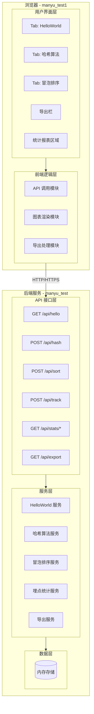

- **交互层说明**：浏览器前端页面提供三个 Tab 的交互界面、导出按钮和统计报表区域
- **核心服务层说明**：Flask 后端提供 RESTful API，包含 HelloWorld、哈希算法、冒泡排序、埋点统计和导出服务
- **数据层说明**：埋点数据存储于内存（Python list/dict），无持久化数据库

**模块清单**

| 模块 | 职责 | 依赖 |
|------|------|------|
| HelloWorld 模块 | 实现 GET /api/hello 接口，返回问候消息和时间戳 | 无 |
| 哈希算法模块 | 实现 POST /api/hash 接口，支持 SHA256/MD5 哈希计算 | 无 |
| 冒泡排序模块 | 实现 POST /api/sort 接口，包装已有 bubble_sort.py | bubble_sort.py |
| 埋点统计模块 | 记录 API 调用埋点，提供统计聚合和图表数据查询 | 无 |
| 导出模块 | 提供埋点数据 CSV 导出 | 埋点统计模块 |
| 前端页面模块 | 三 Tab 页面布局、用户信息输入、导出按钮 | 所有后端 API |
| 前端图表模块 | ECharts 折线图/饼图/柱状图渲染 | 埋点统计模块 API |

### 应用集成架构

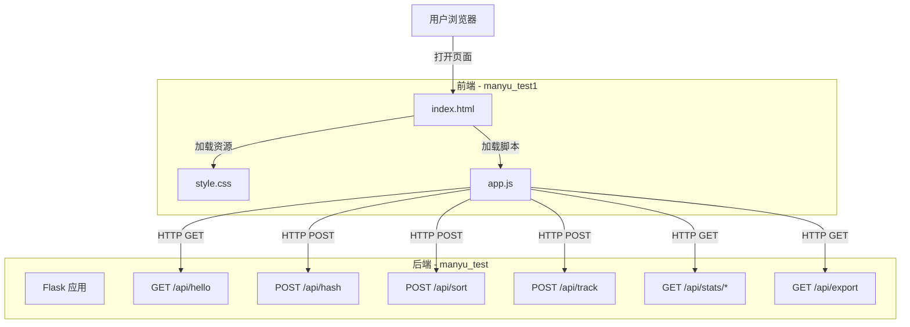

**集成关系说明：**

| 调用方 | 被调用方 | 协议 | 接口类型 | 说明 |
|--------|----------|------|----------|------|
| 用户浏览器 | 前端页面 | HTTP | 静态资源 | 加载 HTML/CSS/JS |
| 前端 JS | 后端 API | HTTP | RESTful JSON | 跨域调用后端接口 |
| 后端 API | 内存存储 | 进程内 | Python 数据结构 | 埋点数据读写 |

### 部署架构

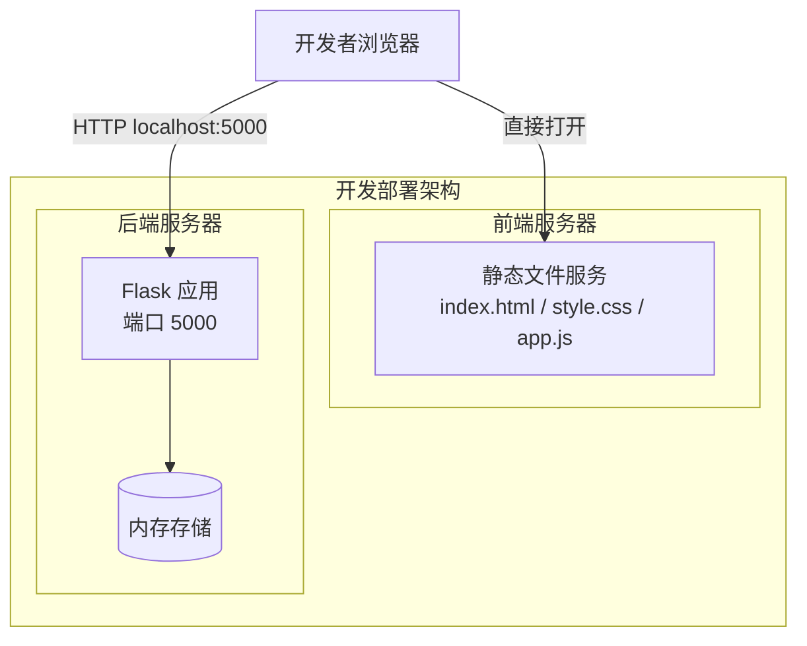

**部署说明：**
- 开发阶段：前端直接浏览器打开 index.html，后端 Flask 运行在 localhost:5000
- 部署方式：前端静态文件由 Nginx/Apache 托管或直接浏览器打开，后端 Flask 服务独立运行
- 数据层：内存存储，无需数据库
- 跨域：Flask-CORS 全开（开发阶段）

## 3. 数据模型与存储

### 实体清单

| 实体名称 | 实体说明 | 所属模块 | 与其他实体的关系 |
|----------|----------|----------|-----------------|
| TrackingRecord | 埋点调用记录 | 埋点统计模块 | 无关联实体，独立存储 |
| StatisticsAggregation | 统计聚合结果（动态计算） | 埋点统计模块 | 由 TrackingRecord 实时聚合生成 |

### 实体关系图

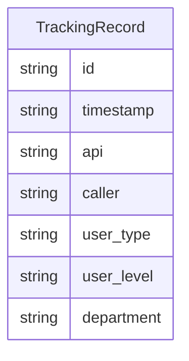

**模型说明：**
- 系统仅有一个实体 TrackingRecord，统计聚合结果由内存中实时计算得出，不作为独立持久化实体
- 数据存储于 Python 全局列表 `_tracking_records` 中
- 统计维度通过 `get_chart_data(dimension, chart_type)` 按维度字段（user_type/user_level/department）实时聚合

### 存储方案

| 存储类型 | 用途 | 实现方式 | 说明 |
|----------|------|----------|------|
| 内存列表 | 埋点记录存储 | Python list | 重启丢失可接受 |
| 内存计数器 | 总调用次数 | Python int | 全局计数器 `_api_call_count` |

**方案对比：**

| 方案 | 优点 | 缺点 | 推荐 |
|------|------|------|------|
| 内存存储 | 零部署、零维护、零配置 | 重启丢失、不支持持久化 | ✅ 推荐 |
| 文件存储 | 可持久化 | 需处理并发写入、磁盘 I/O | |
| SQLite | 可持久化、支持 SQL 查询 | 需额外依赖、部署复杂度增加 | |

## 4. 接口设计

### 4.1 oneapi（Web 控制台接口）

| 编号 | 接口名称 | 方法 | 路径 | 模块 |
|------|----------|------|------|------|
| W01 | HelloWorld 接口 | GET | `/api/hello` | HelloWorld 模块 |
| W02 | 哈希计算接口 | POST | `/api/hash` | 哈希算法模块 |
| W03 | 冒泡排序接口 | POST | `/api/sort` | 冒泡排序模块 |
| W04 | 手动埋点接口 | POST | `/api/track` | 埋点统计模块 |
| W05 | 统计概览接口 | GET | `/api/stats/overview` | 埋点统计模块 |
| W06 | 图表数据接口 | GET | `/api/stats/chart` | 埋点统计模块 |
| W07 | 导出埋点数据接口 | GET | `/api/export` | 导出模块 |

### 4.2 OpenAPI（对外接口）

本系统不涉及对外暴露的 OpenAPI 接口。

### 4.3 内部接口（Service 层）

| 编号 | 接口名称 | 函数签名 | 说明 |
|------|----------|----------|------|
| S01 | HelloWorld 服务 | `hello_world() -> dict` | 返回问候消息和时间戳 |
| S02 | 哈希计算服务 | `compute_hash(input_str: str, algorithm: str) -> dict` | 计算哈希值 |
| S03 | 冒泡排序服务 | `sort_data(data: list) -> dict` | 执行冒泡排序 |
| S04 | 埋点记录服务 | `track_call(api_name, caller, user_type, user_level, department) -> dict` | 记录埋点 |
| S05 | 统计概览查询 | `get_overview() -> dict` | 聚合统计概览 |
| S06 | 图表数据查询 | `get_chart_data(dimension, chart_type) -> dict` | 按维度获取图表数据 |
| S07 | 导出 CSV 服务 | `export_to_csv(tab: str) -> str` | 生成 CSV 字符串 |

### 4.4 集成接口（Integration 层）

本系统不涉及外部系统集成接口。

## 5. 功能模块设计

### 全局约定

**通用出参结构：**

```json
{
  "code": "OK",
  "msg": "SUCCESS",
  "data": {}
}
```

| 字段 | 类型 | 说明 |
|------|------|------|
| code | String | 状态码，SUCCESS/ERROR/{MODULE}_{SEQ} |
| msg | String | 提示信息 |
| data | Object | 业务数据 |

**错误码格式：** `{MODULE}_{SEQ3}`

| 错误码 | 说明 | 所属模块 |
|--------|------|----------|
| HELLO_001 | HelloWorld 调用异常 | HelloWorld 模块 |
| HASH_001 | 不支持的哈希算法 | 哈希算法模块 |
| HASH_002 | 缺少输入参数 | 哈希算法模块 |
| SORT_001 | 缺少数据参数 | 冒泡排序模块 |
| SORT_002 | 数据格式错误（非数组） | 冒泡排序模块 |
| TRACK_001 | 缺少请求体 | 埋点统计模块 |
| TRACK_002 | 不支持的维度参数 | 埋点统计模块 |
| TRACK_003 | 不支持的图表类型 | 埋点统计模块 |
| EXPORT_001 | 无数据可导出 | 导出模块 |

### 5.1 HelloWorld 模块

#### 5.1.1 表结构设计

本模块不涉及数据持久化，无表结构设计。

#### 5.1.2 接口详细设计

##### W01 HelloWorld 接口

- **URI**: GET `/api/hello`
- **描述**: 返回问候消息和时间戳
- **查询参数**:

| 参数名称 | 类型 | 是否必填 | 描述 |
|----------|------|----------|------|
| caller | String | 否 | 调用人用户名，默认 anonymous |
| user_type | String | 否 | 人员类型，默认 developer |
| user_level | String | 否 | 人员层级，默认 mid |
| department | String | 否 | 部门，默认 engineering |

- **出参**:

| 参数名称 | 类型 | 描述 |
|----------|------|------|
| code | String | 状态码 |
| msg | String | 提示信息 |
| data | Object | 业务数据 |
| data.message | String | 问候消息 "Hello World!" |
| data.timestamp | String | 当前时间戳 ISO8601 格式 |

- **错误码**: 无特定错误码

- **业务规则**: 无参数校验要求，查询参数缺失时使用默认值

- **请求示例**: `GET /api/hello?caller=zhangsan&user_type=developer&user_level=senior&department=engineering`

- **响应示例**:
```json
{
  "code": "OK",
  "msg": "SUCCESS",
  "data": {
    "message": "Hello World!",
    "timestamp": "2026-09-01T12:00:00Z"
  }
}
```

#### 5.1.3 子功能详细设计

##### 处理时序图

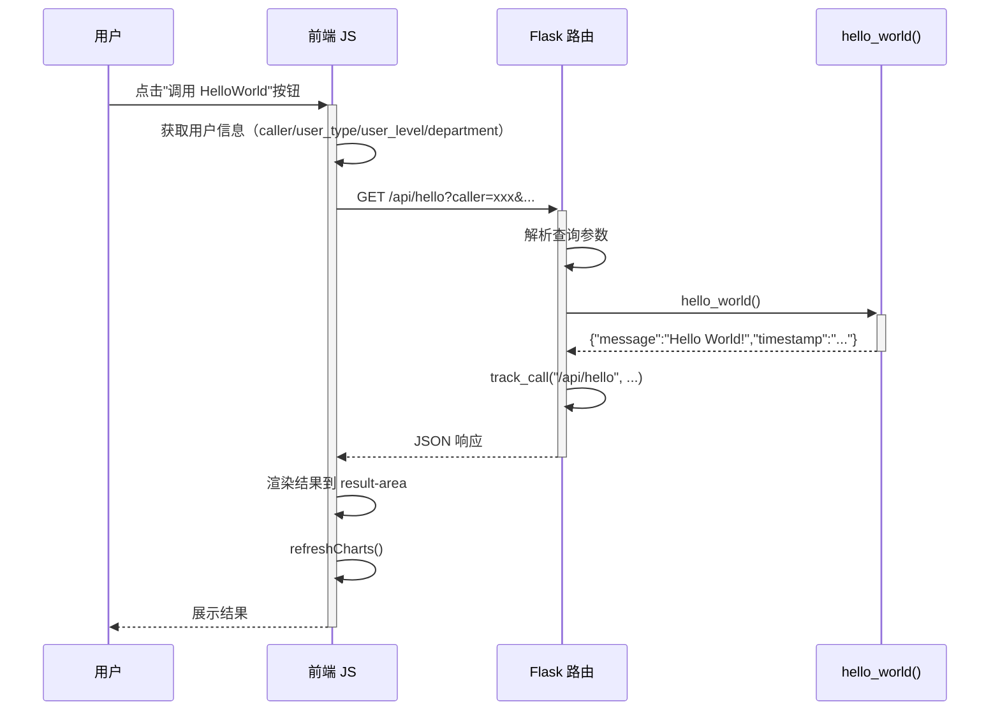

**异常场景：**

| 异常场景 | 处理方式 |
|----------|----------|
| 服务内部异常 | 返回 500 错误码，code=HELLO_001 |

### 5.2 哈希算法模块

#### 5.2.1 表结构设计

本模块不涉及数据持久化，无表结构设计。

#### 5.2.2 接口详细设计

##### W02 哈希计算接口

- **URI**: POST `/api/hash`
- **描述**: 对输入文本进行哈希计算，支持 SHA256 和 MD5 算法
- **入参**:

| 参数名称 | 类型 | 是否必填 | 描述 |
|----------|------|----------|------|
| input | String | 是 | 待哈希的文本字符串 |
| algorithm | String | 否 | 哈希算法，可选 sha256/md5，默认 sha256 |
| caller | String | 否 | 调用人用户名 |
| user_type | String | 否 | 人员类型 |
| user_level | String | 否 | 人员层级 |
| department | String | 否 | 部门 |

- **出参**:

| 参数名称 | 类型 | 描述 |
|----------|------|------|
| code | String | 状态码 |
| msg | String | 提示信息 |
| data | Object | 业务数据 |
| data.input | String | 原始输入文本 |
| data.algorithm | String | 使用的哈希算法 |
| data.hash | String | 哈希值（十六进制字符串） |

- **错误码**:

| 错误码 | 说明 |
|--------|------|
| HASH_001 | 不支持的哈希算法 |
| HASH_002 | 缺少输入参数 |

- **业务规则**:
  - 支持的算法：sha256、md5
  - 输入文本为空字符串时也返回有效哈希值（符合算法规范）

- **请求示例**:
```json
{
  "input": "hello",
  "algorithm": "sha256",
  "caller": "lisi",
  "user_type": "tester",
  "user_level": "mid",
  "department": "qa"
}
```

- **响应示例**:
```json
{
  "code": "OK",
  "msg": "SUCCESS",
  "data": {
    "input": "hello",
    "algorithm": "sha256",
    "hash": "2cf24dba5fb0a30e26e83b2ac5b9e29e1b161e5c1fa7425e73043362938b9824"
  }
}
```

#### 5.2.3 子功能详细设计

##### 处理时序图

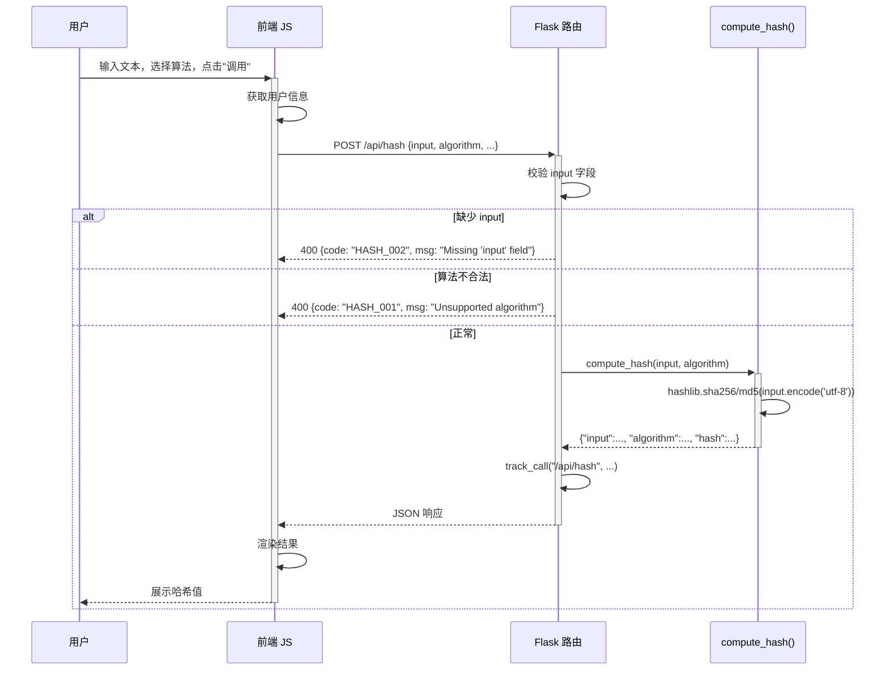

**业务规则：**

| 规则编号 | 规则描述 | 校验时机 | 不满足时的处理 |
|----------|----------|----------|--------------|
| R01 | input 字段必填 | 请求时 | 返回 HASH_002 |
| R02 | algorithm 必须为 sha256 或 md5 | 请求时 | 返回 HASH_001 |

**异常场景：**

| 异常场景 | 处理方式 |
|----------|----------|
| 不支持的算法参数 | 返回 400，code=HASH_001 |
| 缺少 input 参数 | 返回 400，code=HASH_002 |
| 请求体非 JSON | 返回 400 |

### 5.3 冒泡排序模块

#### 5.3.1 表结构设计

本模块不涉及数据持久化，无表结构设计。

#### 5.3.2 接口详细设计

##### W03 冒泡排序接口

- **URI**: POST `/api/sort`
- **描述**: 对输入数组执行冒泡排序，复用已有 bubble_sort.py 中的 bubble_sort 函数
- **入参**:

| 参数名称 | 类型 | 是否必填 | 描述 |
|----------|------|----------|------|
| data | Array | 是 | 待排序的数值数组 |
| caller | String | 否 | 调用人用户名 |
| user_type | String | 否 | 人员类型 |
| user_level | String | 否 | 人员层级 |
| department | String | 否 | 部门 |

- **出参**:

| 参数名称 | 类型 | 描述 |
|----------|------|------|
| code | String | 状态码 |
| msg | String | 提示信息 |
| data | Object | 业务数据 |
| data.original | Array | 原始数组 |
| data.sorted | Array | 排序后数组 |
| data.algorithm | String | 算法标识 "bubble_sort" |

- **错误码**:

| 错误码 | 说明 |
|--------|------|
| SORT_001 | 缺少 data 参数 |
| SORT_002 | data 参数必须为数组 |

- **业务规则**:
  - 输入数组元素类型不限（复用 bubble_sort 泛型实现）
  - 排序为升序（使用 bubble_sort 标准版）

- **请求示例**:
```json
{
  "data": [5, 3, 8, 4, 2],
  "caller": "wangwu",
  "user_type": "manager",
  "user_level": "senior",
  "department": "product"
}
```

- **响应示例**:
```json
{
  "code": "OK",
  "msg": "SUCCESS",
  "data": {
    "original": [5, 3, 8, 4, 2],
    "sorted": [2, 3, 4, 5, 8],
    "algorithm": "bubble_sort"
  }
}
```

#### 5.3.3 子功能详细设计

##### 处理时序图

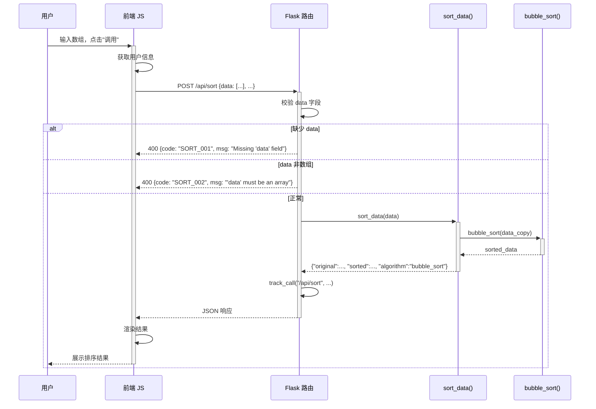

**业务规则：**

| 规则编号 | 规则描述 | 校验时机 | 不满足时的处理 |
|----------|----------|----------|--------------|
| R01 | data 字段必填 | 请求时 | 返回 SORT_001 |
| R02 | data 必须是数组 | 请求时 | 返回 SORT_002 |

**异常场景：**

| 异常场景 | 处理方式 |
|----------|----------|
| 缺少 data 参数 | 返回 400，code=SORT_001 |
| data 非数组 | 返回 400，code=SORT_002 |
| 请求体非 JSON | 返回 400 |

### 5.4 埋点统计模块

#### 5.4.1 表结构设计

##### TrackingRecord（内存存储）

| 字段名 | 数据类型 | 约束 | 默认值 | 说明 |
|--------|----------|------|--------|------|
| id | String(UUID) | 唯一 | - | 记录唯一标识 |
| timestamp | String(ISO8601) | - | 当前UTC时间 | 调用时间戳 |
| api | String | - | - | 调用的API路径 |
| caller | String | - | anonymous | 调用人用户名 |
| user_type | String | - | developer | 人员类型 |
| user_level | String | - | mid | 人员层级 |
| department | String | - | engineering | 人员部门 |

**存储方式：** Python 全局列表 `_tracking_records: list[dict]`

##### 枚举与常量定义

| 枚举名称 | 取值 | 含义 | 关联字段 |
|----------|------|------|----------|
| 人员类型 | developer / manager / tester / admin | 用户角色分类 | user_type |
| 人员层级 | junior / mid / senior / principal | 用户职级 | user_level |
| 部门 | engineering / product / qa / operations | 用户所属部门 | department |
| 图表类型 | pie / line / bar | 图表展示形式 | chart_type |
| 维度 | user_type / user_level / department | 统计维度 | dimension |

#### 5.4.2 接口详细设计

##### W04 手动埋点接口

- **URI**: POST `/api/track`
- **描述**: 手动记录一条调用埋点
- **入参**:

| 参数名称 | 类型 | 是否必填 | 描述 |
|----------|------|----------|------|
| api | String | 是 | 调用的 API 路径 |
| caller | String | 否 | 调用人，默认 anonymous |
| user_type | String | 否 | 人员类型，默认 developer |
| user_level | String | 否 | 人员层级，默认 mid |
| department | String | 否 | 部门，默认 engineering |

- **出参**:

| 参数名称 | 类型 | 描述 |
|----------|------|------|
| code | String | 状态码 |
| msg | String | 提示信息 |
| data | Object | 业务数据 |
| data.status | String | 状态 "ok" |
| data.id | String | 埋点记录 ID |

- **错误码**: 无特定错误码

- **请求示例**:
```json
{
  "api": "/api/hello",
  "caller": "zhangsan",
  "user_type": "developer",
  "user_level": "senior",
  "department": "engineering"
}
```

- **响应示例**:
```json
{
  "code": "OK",
  "msg": "SUCCESS",
  "data": {
    "status": "ok",
    "id": "a1b2c3d4-e5f6-7890-abcd-ef1234567890"
  }
}
```

##### W05 统计概览接口

- **URI**: GET `/api/stats/overview`
- **描述**: 获取统计数据概览
- **入参**: 无

- **出参**:

| 参数名称 | 类型 | 描述 |
|----------|------|------|
| code | String | 状态码 |
| msg | String | 提示信息 |
| data | Object | 业务数据 |
| data.total_calls | Integer | 总调用次数 |
| data.by_api | Object | 按 API 路径统计的调用次数 |
| data.by_user | Object | 按调用人统计的调用次数 |

- **响应示例**:
```json
{
  "code": "OK",
  "msg": "SUCCESS",
  "data": {
    "total_calls": 10,
    "by_api": {"/api/hello": 5, "/api/hash": 3, "/api/sort": 2},
    "by_user": {"zhangsan": 4, "lisi": 3, "wangwu": 3}
  }
}
```

##### W06 图表数据接口

- **URI**: GET `/api/stats/chart?dimension=user_type&chart_type=pie`
- **描述**: 按维度获取图表展示数据
- **查询参数**:

| 参数名称 | 类型 | 是否必填 | 描述 |
|----------|------|----------|------|
| dimension | String | 否 | 维度: user_type/user_level/department，默认 user_type |
| chart_type | String | 否 | 图表类型: pie/line/bar，默认 pie |

- **出参**:

| 参数名称 | 类型 | 描述 |
|----------|------|------|
| code | String | 状态码 |
| msg | String | 提示信息 |
| data | Object | 业务数据 |
| data.labels | Array[String] | 维度取值列表 |
| data.values | Array[Integer] | 对应维度的计数 |
| data.dimension | String | 当前维度 |
| data.chart_type | String | 当前图表类型 |

- **错误码**:

| 错误码 | 说明 |
|--------|------|
| TRACK_002 | 不支持的维度参数 |
| TRACK_003 | 不支持的图表类型 |

- **请求示例**: `GET /api/stats/chart?dimension=user_type&chart_type=pie`

- **响应示例**:
```json
{
  "code": "OK",
  "msg": "SUCCESS",
  "data": {
    "labels": ["developer", "manager", "tester"],
    "values": [5, 3, 2],
    "dimension": "user_type",
    "chart_type": "pie"
  }
}
```

#### 5.4.3 子功能详细设计

##### 埋点记录流程

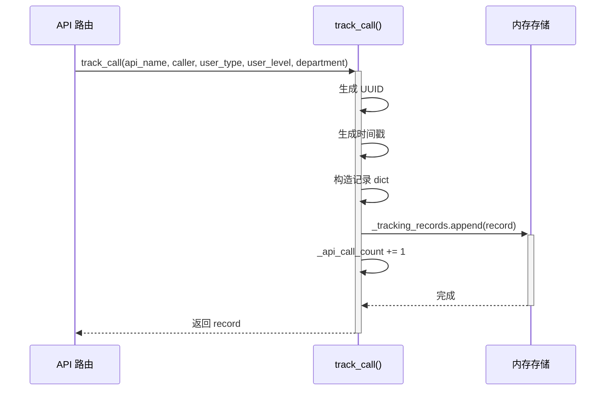

##### 统计查询流程

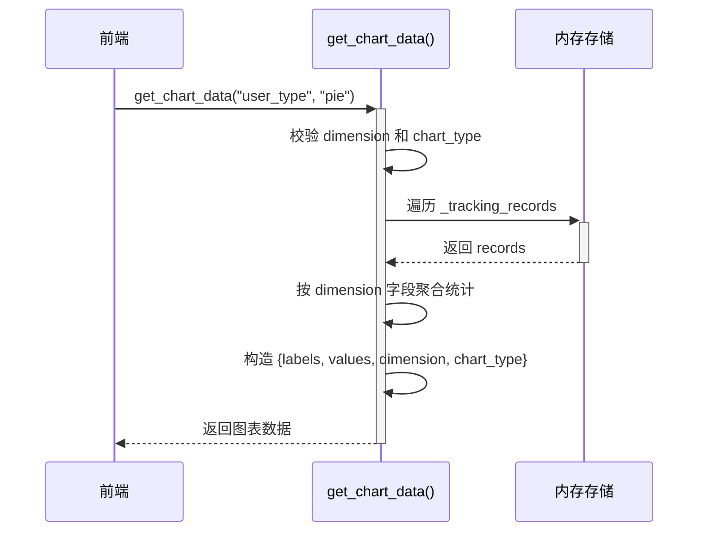

**业务规则：**

| 规则编号 | 规则描述 | 校验时机 | 不满足时的处理 |
|----------|----------|----------|--------------|
| R01 | API 调用时自动埋点 | 每次 API 调用 | 不影响业务返回，埋点失败不阻塞业务 |
| R02 | dimension 必须为 user_type/user_level/department | 查询时 | 返回 TRACK_002 |
| R03 | chart_type 必须为 pie/line/bar | 查询时 | 返回 TRACK_003 |

**并发控制：**
- 并发场景：多线程同时调用 API 时同时写入 _tracking_records
- 控制策略：Python list 的 append 操作是线程安全的（CPython GIL），无并发风险

### 5.5 导出模块

#### 5.5.1 表结构设计

本模块不涉及数据持久化，无表结构设计。

#### 5.5.2 接口详细设计

##### W07 导出埋点数据接口

- **URI**: GET `/api/export?tab=hello`
- **描述**: 导出指定 Tab 的埋点统计数据为 CSV 格式文件
- **查询参数**:

| 参数名称 | 类型 | 是否必填 | 描述 |
|----------|------|----------|------|
| tab | String | 否 | 导出范围: hello/hash/sort/all，默认 all |

- **出参**: CSV 文件（Content-Type: text/csv）
  - 表头: id, timestamp, api, caller, user_type, user_level, department
  - 文件名: `tracking_{tab}.csv`

- **错误码**:

| 错误码 | 说明 |
|--------|------|
| EXPORT_001 | 无数据可导出 |

- **请求示例**: `GET /api/export?tab=hello`

- **响应示例** (CSV):
```
id,timestamp,api,caller,user_type,user_level,department
a1b2c3d4,2026-09-01T12:00:00Z,/api/hello,zhangsan,developer,senior,engineering
```

#### 5.5.3 子功能详细设计

##### 导出流程

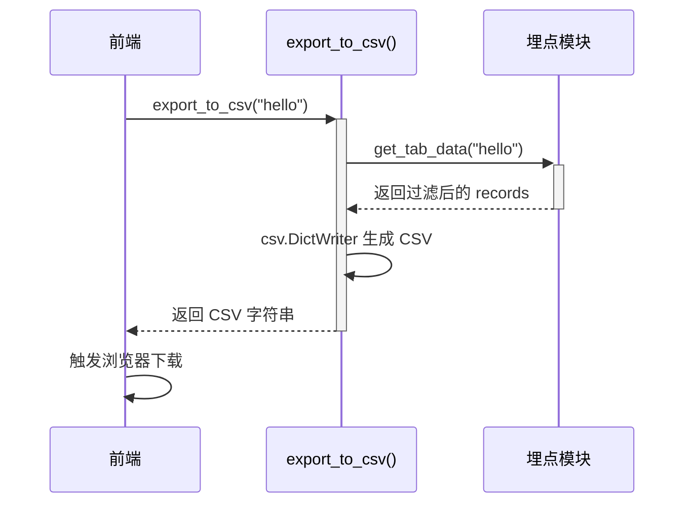

**业务规则：**

| 规则编号 | 规则描述 | 校验时机 | 不满足时的处理 |
|----------|----------|----------|--------------|
| R01 | tab 参数为空时导出全部 | 请求时 | 遍历所有记录导出 |
| R02 | 无数据时返回 EXPORT_001 | 请求时 | 返回 404 错误 |

**异常场景：**

| 异常场景 | 处理方式 |
|----------|----------|
| 无数据可导出 | 返回 404，code=EXPORT_001 |
| tab 参数值无效 | 视为导出全部 |

### 5.6 前端页面模块

#### 5.6.1 表结构设计

本模块不涉及数据持久化，无表结构设计。

#### 5.6.2 接口详细设计

前端页面消费的所有接口已在 W01~W07 中定义，此处不再重复。

#### 5.6.3 子功能详细设计

##### 页面布局

```
┌──────────────────────────────────────────────────────────────┐
│                  三接口演示平台                                │
├──────────────────────────────────────────────────────────────┤
│  调用人: [____] 类型: [▼] 层级: [▼] 部门: [▼]               │
├──────────────────────────────────────────────────────────────┤
│  [HelloWorld]  [哈希算法]  [冒泡排序]          [导出CSV ▼]   │
├──────────────────────────────────────────────────────────────┤
│                                                               │
│  Tab 内容区域                                                  │
│  ┌─ HelloWorld: 点击按钮调用 → 展示结果 JSON                │
│  ├─ 哈希算法: 输入文本 → 选择算法 → 调用 → 展示哈希值 JSON  │
│  └─ 冒泡排序: 输入数组 → 调用 → 展示排序结果 JSON           │
│                                                               │
├──────────────────────────────────────────────────────────────┤
│  导出: [全部/HelloWorld/哈希/排序 ▼] [导出埋点CSV]           │
│                          [导出当前结果CSV]                    │
├──────────────────────────────────────────────────────────────┤
│  📊 调用统计报表                                              │
│  维度: [人员类型 ▼] [刷新图表]                                │
│  ┌───────────────┬───────────────┬───────────────┐           │
│  │  折线图(趋势)  │  饼图(分布)   │ 柱状图(对比)  │           │
│  │  [ECharts]    │  [ECharts]   │  [ECharts]   │           │
│  └───────────────┴───────────────┴───────────────┘           │
└──────────────────────────────────────────────────────────────┘
```

##### Tab 功能说明

| Tab | 输入控件 | 操作 | 展示内容 |
|-----|----------|------|----------|
| HelloWorld | 无输入（点击按钮即调用） | GET /api/hello (带用户信息参数) | JSON 格式化输出 |
| 哈希算法 | 文本输入框 + 算法下拉选择(SHA256/MD5) | POST /api/hash | JSON 格式化输出 |
| 冒泡排序 | 文本输入框(JSON 数组格式) | POST /api/sort | JSON 格式化输出 |

##### 用户信息栏

| 字段 | 控件类型 | 可选值 |
|------|----------|--------|
| 调用人 | text input | 自由输入，默认 zhangsan |
| 人员类型 | select | 开发者/管理者/测试人员/管理员 |
| 人员层级 | select | 初级/中级/高级/资深 |
| 人员部门 | select | 研发部/产品部/测试部/运维部 |

##### 图表渲染流程

```mermaid
sequenceDiagram
    participant U as 用户
    participant JS as 前端 JS
    participant API as 后端 API
    participant EC as ECharts

    U->>+JS: 页面加载 / 点击刷新图表
    JS->>JS: 获取当前选中的维度
    JS->>+API: 并行请求 /api/stats/chart?dimension=X&chart_type=line
    JS->>+API: 并行请求 /api/stats/chart?dimension=X&chart_type=pie
    JS->>+API: 并行请求 /api/stats/chart?dimension=X&chart_type=bar
    API-->>-JS: {labels, values, dimension, chart_type}
    API-->>-JS: {labels, values, dimension, chart_type}
    API-->>-JS: {labels, values, dimension, chart_type}
    JS->>EC: lineChart.setOption({...})
    JS->>EC: pieChart.setOption({...})
    JS->>EC: barChart.setOption({...})
    EC-->>-U: 渲染图表
```

##### 前端导出流程

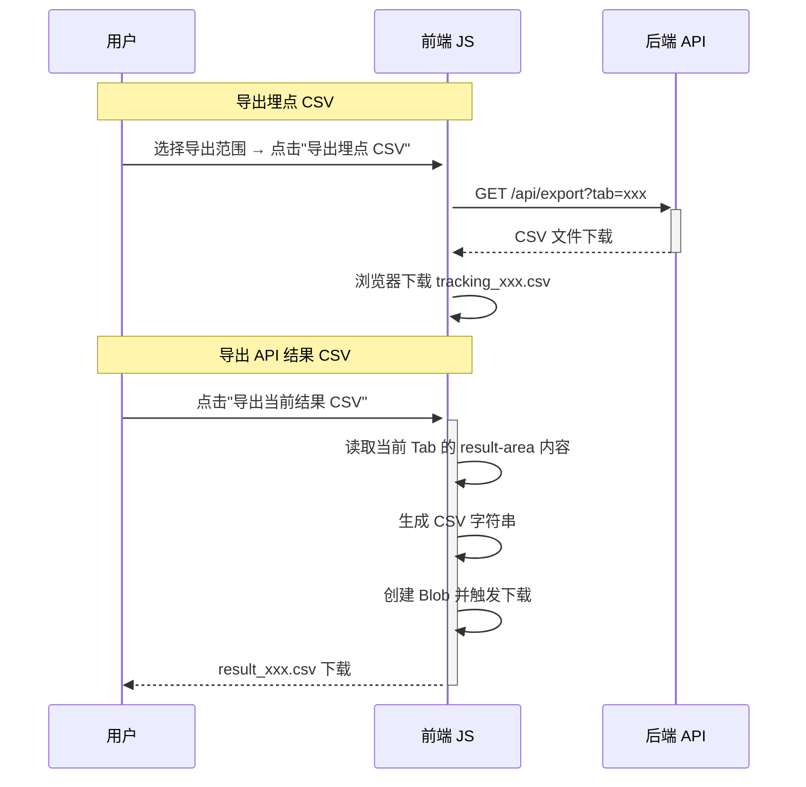

**技术选型方案对比：**

| 方案 | 优点 | 缺点 | 推荐 |
|------|------|------|------|
| ECharts CDN | 功能全面、中文文档丰富、社区活跃 | 依赖 CDN 可用性 | ✅ 推荐 |
| Chart.js | 轻量、API 简洁 | 功能不如 ECharts 全面 | |
| 手写 Canvas | 零依赖 | 开发工作量大、效果差 | |

## 6. 非功能性需求设计

### 6.1 高可用性

本项不适用，原因：系统为开发验证用途的单实例 Flask 应用，无需高可用保障。

### 6.2 可扩展性

- **水平扩展**：Flask 应用可部署多实例，前端为静态文件可通过 CDN 分发
- **垂直扩展**：单实例可通过增加资源（CPU/内存）提升性能
- 当前内存存储方案不支持多实例共享，如需扩展需引入共享存储（如 Redis）

### 6.3 稳定性/可靠性

- 内存存储方式下重启后数据丢失，属于已知限制
- API 接口参数校验完善，非法输入返回明确错误码
- 冒泡排序模块依赖已有 bubble_sort.py，该模块已通过测试验证

### 6.4 安全性设计

#### 6.4.1 账户系统方案

本项不适用，原因：系统无登录认证需求，调用人由前端页面输入用户名识别。

#### 6.4.2 授权与访问控制

本项不适用，原因：系统为开发演示用途，无权限控制需求。

#### 6.4.3 数据防护方案

本项不适用，原因：系统不涉及敏感数据存储。埋点数据仅包含用户名和角色信息，不涉及身份证、手机号等敏感信息。

### 6.5 监控/统计/日志/告警

- **服务日志**：Flask 默认日志输出到控制台，可记录请求信息和错误堆栈
- **API 调用埋点**：通过 tracking 模块记录每次 API 调用的时间戳、调用人、维度信息
- **统计查询**：通过 `/api/stats/overview` 和 `/api/stats/chart` 接口提供实时统计

## 7. 变更三板斧

### 7.1 可监控

- **服务埋点**：每个 API 接口调用时自动记录 `track_call()` 埋点，包含 API 名称、调用人、时间戳、人员维度信息
- **统计查询**：提供 `/api/stats/overview` 和 `/api/stats/chart` 接口实时查询调用统计
- **前端可视化**：ECharts 图表实时展示调用统计，按人员类型/层级/部门维度切换

### 7.2 可灰度

本项不适用，原因：系统为开发演示用途，无需灰度发布能力。

### 7.3 可应急

- **开关控制**：Flask debug 模式支持热加载代码修改，修改代码后无需重启
- **回滚方案**：代码回滚通过 Git 回退到上一版本，重新部署即可
- **数据兼容**：内存存储无持久化，回滚后无需考虑数据兼容性问题