> **文档元信息**
>
> | 项目 | 内容 |
> |------|------|
> | 文档版本 | v1.0 |
> | 作者 | AiWork |
> | 创建日期 | 2026-09-01 |
> | 需求来源 | 分别写三个接口helloworld、哈希算法以及冒泡排序；前端新增页面+导出+埋点可视化 |
> | 评审状态 | 待评审 |

# 三接口演示 + 埋点可视化 系分设计

## 1. 需求与范围

### 背景与目标

构建一个演示平台，后端提供三个计算接口（helloworld、SHA256 哈希算法、冒泡排序），前端提供三 Tab 页面展示执行结果，支持 CSV 导出下载和调用埋点可视化报表。

**目标用户**：内部演示/测试人员，用于验证跨仓协作开发流程。

### 核心功能

1. 三个计算接口：helloworld（返回问候消息）、SHA256 哈希（文本哈希计算）、冒泡排序（数字数组排序）
2. 前端三 Tab 页面展示各接口执行结果
3. 导出按钮，后台提供 CSV 导出接口，按接口类型导出历史调用记录
4. 埋点记录：记录每次计算接口的调用人和调用次数
5. 前端可视化报表：按维度（人员类型、人员层级、人员部门）聚合展示调用次数，支持折线图、饼图、柱状图三种展示形式

### 约束与非功能要求

- 后端：Python 3 + FastAPI，端口 8000
- 前端：原生 HTML/JS + ECharts 5.x CDN
- 存储：SQLite（tracking.db 本地文件）
- 用户身份：通过自定义 HTTP Header（X-User-*）透传
- 冒泡排序复用现有 `bubble_sort.py`，不修改原文件
- CORS 允许所有来源

### 排除范围

- 不涉及真实用户认证系统
- 不涉及生产级部署（高可用、多副本）
- 不涉及数据库迁移/升级策略
- 不涉及国际化

### 需求功能清单与优先级

| 编号 | 功能点 | 优先级 | PRD 原始描述 | 备注 |
|------|--------|--------|-------------|------|
| F01 | helloworld 接口 | P0 | 分别写三个接口helloworld | 返回 greeting 消息 + 时间戳 |
| F02 | 哈希算法接口 | P0 | 哈希算法 | SHA256 |
| F03 | 冒泡排序接口 | P0 | 冒泡排序 | 复用现有 bubble_sort.py |
| F04 | 前端三 Tab 页面 | P0 | 前端新增一个页面，有三个tab分别展示不同的执行结果 | helloworld/哈希/排序 |
| F05 | 导出按钮及接口 | P1 | 新增导出按钮，后台提供导出接口 | CSV 格式 |
| F06 | 埋点中间件 | P1 | 后端再做个埋点，获取调用次数和调用人 | 异步写入 SQLite |
| F07 | 可视化报表 | P1 | 前端在当前页面上可视化出来一个报表查看调用情况 | 折线图/饼图/柱状图 |
| F08 | 维度聚合 | P1 | 根据不同的维度：人员类型、人员层级、人员部门等 | dept/level/user_type |
| F09 | 用户模拟 | P2 | 前端用户模拟区 | 预设用户快速切换 |

### 假设与待确认项

| 编号 | 假设/待确认内容 | 当前假设 | 确认状态 |
|------|-----------------|----------|----------|
| A01 | 用户身份认证方式 | 通过自定义 Header（X-User-*）透传，无需真实认证 | 待确认 |
| A02 | 埋点数据保留周期 | 不自动清理，保留全部历史 | 待确认 |
| A03 | 导出格式 | CSV，列包含 caller_name/dept/level/user_type/api_name/timestamp | 待确认 |
| A04 | 前端技术栈 | 原生 HTML/JS + ECharts CDN，无框架依赖 | 已由实施计划确定 |

---

## 2. 架构与模块

### 功能架构

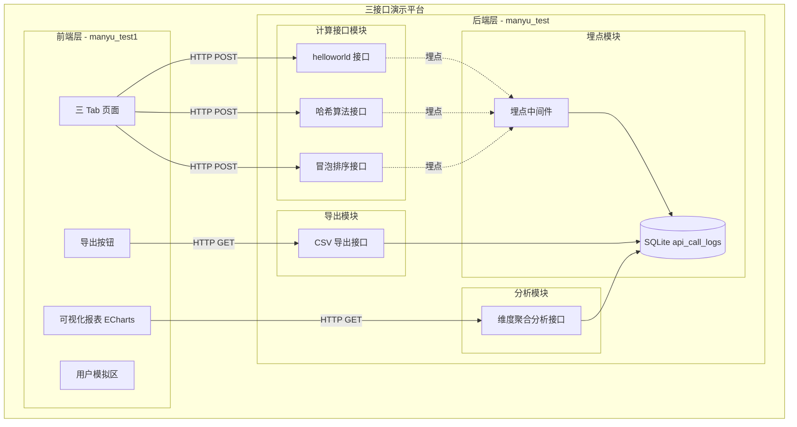

- **交互层**：前端 manyu_test1，原生 HTML/JS 页面，通过 fetch 调用后端 API
- **核心服务层**：后端 manyu_test，FastAPI 单体服务，包含计算接口、埋点、导出、分析四个模块
- **扩展/集成层**：ECharts 通过 CDN 加载，无外部系统集成

**模块清单：**

| 模块 | 职责 | 依赖 |
|------|------|------|
| 计算接口模块 | 提供 helloworld、哈希、冒泡排序三个计算 API | 冒泡排序依赖现有 bubble_sort.py |
| 埋点模块 | 拦截计算接口请求，异步写入调用日志 | 依赖 SQLite 数据模型 |
| 导出模块 | 按类型查询调用日志，生成 CSV 文件返回 | 依赖 SQLite 数据模型 |
| 分析模块 | 按维度聚合查询调用次数，返回结构化数据 | 依赖 SQLite 数据模型 |
| 前端页面模块 | 三 Tab 交互、API 调用、导出下载、图表渲染 | 依赖后端所有 API |

### 应用集成架构

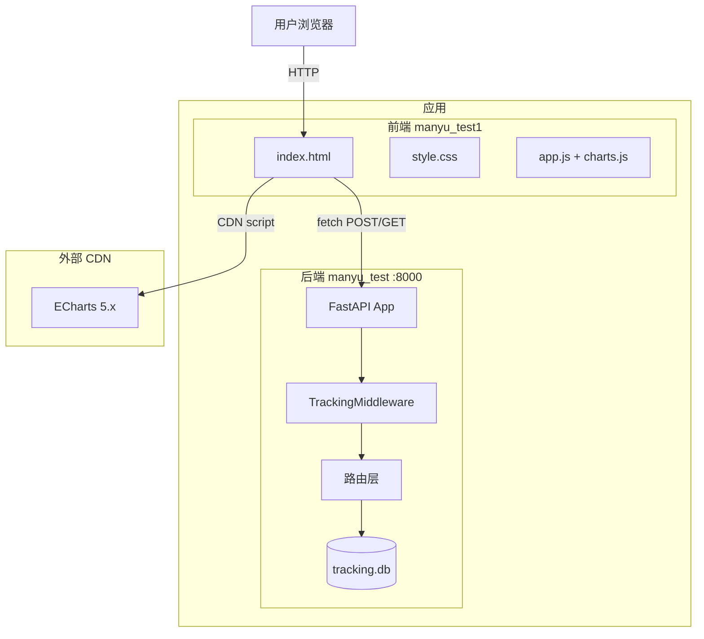

**集成关系说明：**

| 调用方 | 被调用方 | 协议 | 接口类型 | 说明 |
|--------|----------|------|----------|------|
| 用户浏览器 | 前端 index.html | HTTP | 静态页面 | 直接访问 |
| 前端 JS | 后端 FastAPI | HTTP | REST API | fetch 跨域请求 |
| 前端 HTML | ECharts CDN | HTTPS | CDN 脚本 | 图表库加载 |
| FastAPI 路由 | SQLite | 本地文件 | sqlite3 | 埋点日志读写 |

### 部署架构

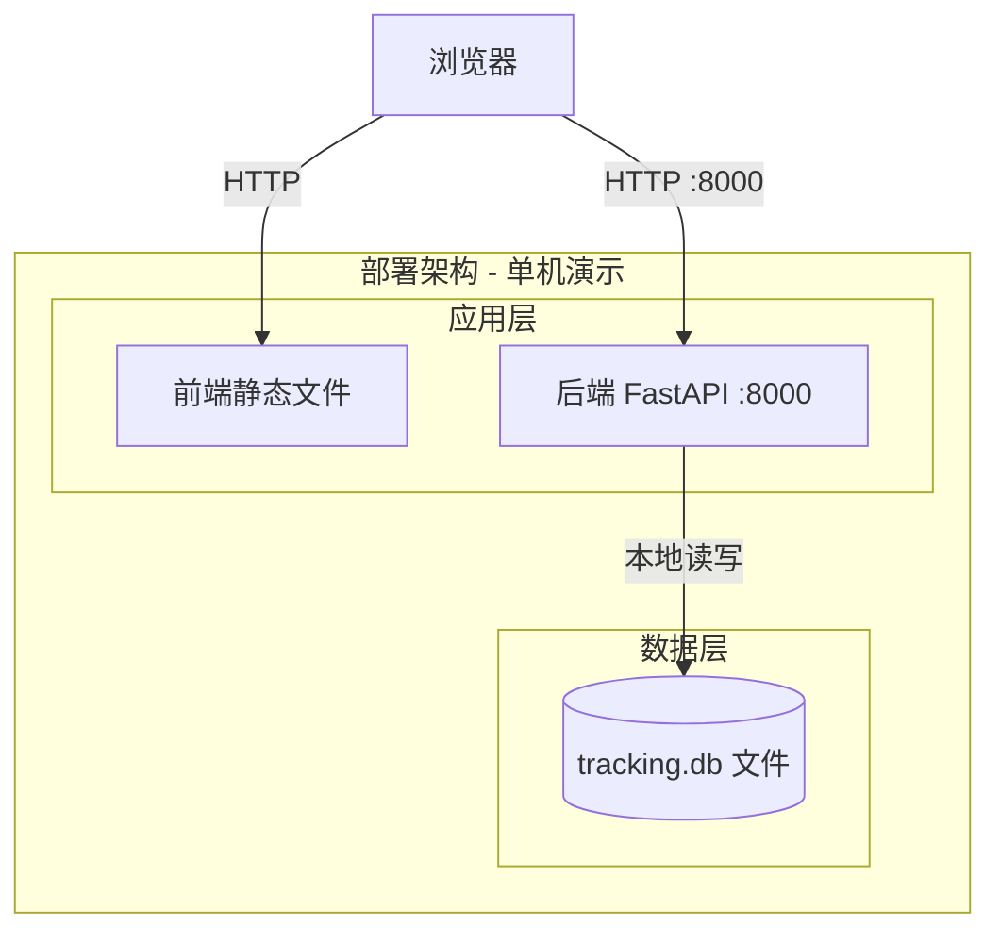

**部署说明：**
- **负载均衡层**：本项不适用，单机演示无负载均衡
- **应用层**：单实例部署，前端静态文件由任意 HTTP Server 提供，后端 FastAPI 通过 uvicorn 启动
- **数据层**：SQLite 本地文件存储，无需独立数据库服务

---

## 3. 数据模型与存储

### 实体清单

| 实体名称 | 实体说明 | 所属模块 | 与其他实体的关系 |
|----------|----------|----------|-----------------|
| api_call_logs | 接口调用埋点日志，记录每次计算接口的调用人和调用时间 | 埋点模块 | 无关联实体（独立日志表） |

> 本需求仅涉及一个实体，无复杂实体关系。

### 实体关系图

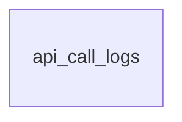

### 模型说明

- **api_call_logs**：每次调用 helloworld/hash/bubble-sort 三个计算接口时，由埋点中间件异步写入一条记录
- 记录字段：api_name（接口名）、caller_id（调用人ID）、caller_name（调用人姓名）、dept（部门）、level（层级）、user_type（人员类型）、called_at（调用时间戳）
- 无租户隔离需求（演示场景）
- 无缓存/MQ 需求

### 存储方案

- **数据库**：SQLite（文件路径：`manyu_test/tracking.db`）
- **选型理由**：演示场景无需独立数据库服务，SQLite 零配置、轻量、适合单机部署

---

## 4. 接口设计

### 4.1 oneapi（Web 控制台接口）

| 编号 | 接口名称 | 方法 | 路径 | 模块 |
|------|----------|------|------|------|
| W01 | helloworld | POST | /api/helloworld | 计算接口模块 |
| W02 | 哈希算法 | POST | /api/hash | 计算接口模块 |
| W03 | 冒泡排序 | POST | /api/bubble-sort | 计算接口模块 |
| W04 | CSV 导出 | GET | /api/export/{type} | 导出模块 |
| W05 | 维度分析 | GET | /api/analytics | 分析模块 |

### 4.2 OpenAPI（对外接口）

本项不适用，原因：演示场景无对外 OpenAPI 需求。

### 4.3 内部接口（Service 层）

| 编号 | 接口名称 | 类 | 方法签名 |
|------|----------|------|----------|
| S01 | 数据库初始化 | models/tracking.py | init_db(db_path: str) -> None |
| S02 | 插入埋点日志 | models/tracking.py | insert_log(db_path, api_name, caller_id, caller_name, dept, level, user_type) -> None |
| S03 | 获取数据库路径 | models/tracking.py | get_db_path() -> str |
| S04 | 冒泡排序算法 | bubble_sort.py | bubble_sort(arr: List[T]) -> List[T] |

### 4.4 集成接口（Integration 层）

本项不适用，原因：无外部系统集成。

---

## 5. 功能模块设计

### 5.1 计算接口模块

> 对应 F01 (helloworld), F02 (哈希算法), F03 (冒泡排序)

#### 5.1.1 表结构设计

本模块无数据库表，三个接口均为纯计算逻辑，不直接读写数据。

#### 5.1.2 枚举与常量定义

| 枚举名称 | 取值 | 含义 | 关联字段 |
|----------|------|------|----------|
| 接口名称 | helloworld / hash / bubble-sort | 三个计算接口标识 | api_name（埋点表） |
| 哈希算法 | SHA256 | 固定使用 SHA256 | 响应字段 algorithm |

#### 5.1.3 接口详细设计

##### W01 helloworld

- **URI**: POST /api/helloworld
- **描述**: 返回 "Hello, World!" 问候消息及当前时间戳
- **入参**: 无（空请求体）

- **出参**:

| 参数名称 | 类型 | 描述 |
|----------|------|------|
| message | String | 固定值 "Hello, World!" |
| timestamp | String | UTC 时间戳，ISO 8601 格式 |

- **错误码**: 无，始终返回 200

- **请求示例**:
```json
{}
```

- **响应示例**:
```json
{
  "message": "Hello, World!",
  "timestamp": "2026-09-01T12:00:00.000000+00:00"
}
```

##### W02 哈希算法

- **URI**: POST /api/hash
- **描述**: 对输入文本计算 SHA256 哈希值
- **入参**:

| 参数名称 | 类型 | 是否必填 | 描述 |
|----------|------|----------|------|
| text | String | 是 | 待哈希的文本，最小长度 1 |

- **出参**:

| 参数名称 | 类型 | 描述 |
|----------|------|------|
| algorithm | String | 固定值 "SHA256" |
| input | String | 原始输入文本 |
| hash | String | SHA256 十六进制哈希值（64位） |

- **错误码**:

| 错误码 | 说明 |
|--------|------|
| 422 | text 为空或缺失 |

- **请求示例**:
```json
{
  "text": "abc"
}
```

- **响应示例**:
```json
{
  "algorithm": "SHA256",
  "input": "abc",
  "hash": "ba7816bf8f01cfea414140de5dae2223b00361a396177a9cb410ff61f20015ad"
}
```

##### W03 冒泡排序

- **URI**: POST /api/bubble-sort
- **描述**: 对输入数字数组执行冒泡排序
- **入参**:

| 参数名称 | 类型 | 是否必填 | 描述 |
|----------|------|----------|------|
| numbers | Array[Number] | 是 | 待排序数字数组，最小长度 1 |

- **出参**:

| 参数名称 | 类型 | 描述 |
|----------|------|------|
| original | Array[Number] | 原始输入数组 |
| sorted | Array[Number] | 升序排序后数组 |
| algorithm | String | 固定值 "bubble_sort" |

- **错误码**:

| 错误码 | 说明 |
|--------|------|
| 422 | numbers 为空数组或缺失 |

- **请求示例**:
```json
{
  "numbers": [5, 3, 8, 4, 2]
}
```

- **响应示例**:
```json
{
  "original": [5, 3, 8, 4, 2],
  "sorted": [2, 3, 4, 5, 8],
  "algorithm": "bubble_sort"
}
```

#### 5.1.4 子功能详细设计

##### 5.1.4.1 helloworld 执行（F01）

- 处理时序图

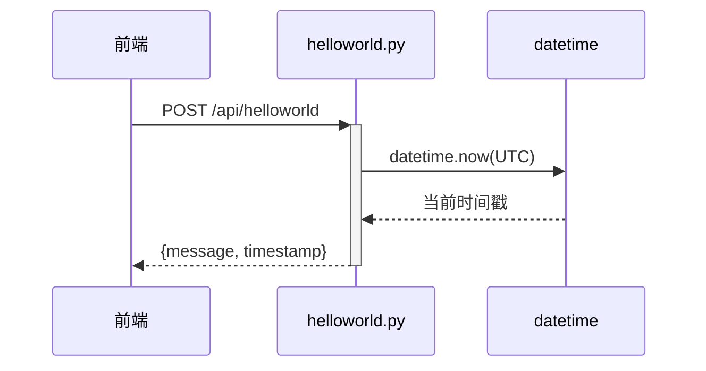

**业务规则：** 无特殊业务规则。

**异常场景：** 无异常场景，仅返回固定字符串和时间戳。

**并发控制：** 无并发风险，纯读操作，不涉及数据写入。

##### 5.1.4.2 哈希计算（F02）

- 处理时序图

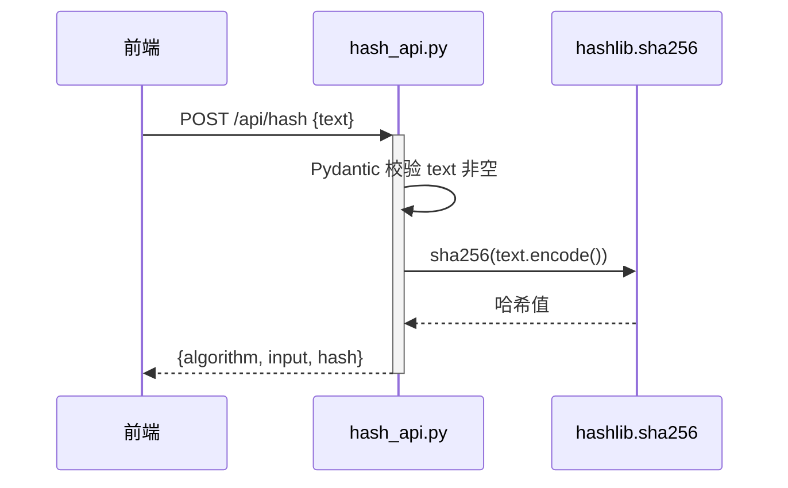

**业务规则：**

| 规则编号 | 规则描述 | 校验时机 | 不满足时的处理 |
|----------|----------|----------|--------------|
| R01 | text 不得为空字符串 | 请求时（Pydantic 校验） | 返回 422 |

**异常场景：**

| 异常场景 | 处理方式 |
|----------|----------|
| text 为空字符串 | FastAPI 自动返回 422 |
| text 缺失 | FastAPI 自动返回 422 |

**并发控制：** 无并发风险，纯计算操作。

##### 5.1.4.3 冒泡排序（F03）

- 处理时序图

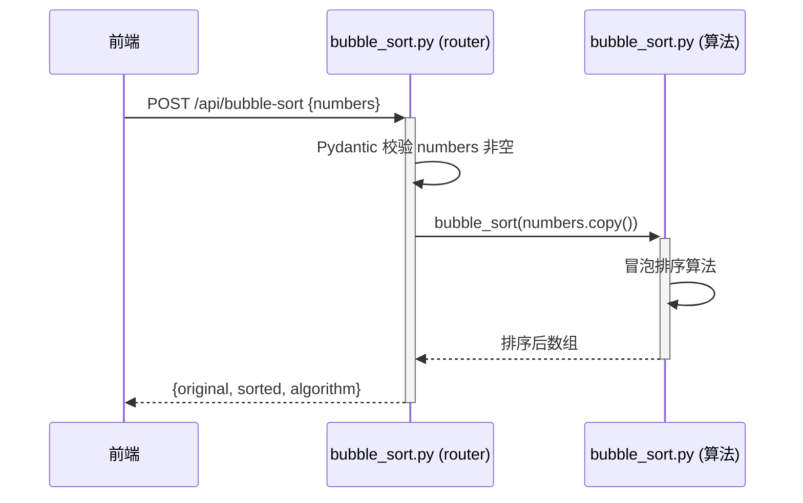

**业务规则：**

| 规则编号 | 规则描述 | 校验时机 | 不满足时的处理 |
|----------|----------|----------|--------------|
| R01 | numbers 非空数组 | 请求时（Pydantic 校验） | 返回 422 |
| R02 | 数组元素均为数字 | 请求时（Pydantic 校验） | 返回 422 |

**异常场景：**

| 异常场景 | 处理方式 |
|----------|----------|
| numbers 为空数组 | FastAPI 自动返回 422 |
| numbers 包含非数字 | FastAPI 自动返回 422 |
| 大数组（如 10000 元素） | 正常处理，O(n²) 时间复杂度 |

**并发控制：** 无并发风险，纯计算操作，输入数组拷贝后排序，不影响原数据。

#### 5.1.5 技术选型

| 方案 | 哈希算法 | 排序算法 | 优劣 |
|------|----------|----------|------|
| 方案 A（推荐） | Python hashlib SHA256 | 复用现有 bubble_sort.py | 零额外依赖，代码复用 |
| 方案 B | 自行实现 SHA256 | 使用 Python sorted() | 自行实现哈希复杂且易错；sorted() 不是冒泡排序 |

**推荐方案 A**：复用现有代码，hashlib 标准库可靠，SHA256 是主流安全哈希算法。

---

### 5.2 埋点模块

> 对应 F06 (埋点中间件)

#### 5.2.1 表结构设计

##### 5.2.1.1 api_call_logs

| 字段名 | 数据类型 | 约束 | 默认值 | 说明 |
|--------|----------|------|--------|------|
| id | INTEGER | PK, 自增 | - | 系统自增主键 |
| api_name | TEXT | NOT NULL | - | 接口名称（helloworld/hash/bubble-sort） |
| caller_id | TEXT | - | NULL | 调用人唯一标识 |
| caller_name | TEXT | - | NULL | 调用人姓名 |
| dept | TEXT | - | NULL | 部门 |
| level | TEXT | - | NULL | 层级 |
| user_type | TEXT | - | NULL | 人员类型 |
| called_at | DATETIME | NOT NULL | CURRENT_TIMESTAMP | 调用时间 |

**索引：**
- PK: `pk_api_call_logs` (id)
- IDX: `idx_api_call_logs_api_name` (api_name)
- IDX: `idx_api_call_logs_dept` (dept)
- IDX: `idx_api_call_logs_level` (level)
- IDX: `idx_api_call_logs_user_type` (user_type)

##### 5.2.1.2 枚举与常量定义

| 枚举名称 | 取值 | 含义 | 关联字段 |
|----------|------|------|----------|
| API 名称 | helloworld, hash, bubble-sort | 被追踪的接口 | api_call_logs.api_name |
| 追踪路径 | /api/helloworld, /api/hash, /api/bubble-sort | 中间件拦截的路径 | 中间件配置 |

#### 5.2.2 子功能详细设计

##### 5.2.2.1 埋点拦截与写入（F06）

- 处理时序图

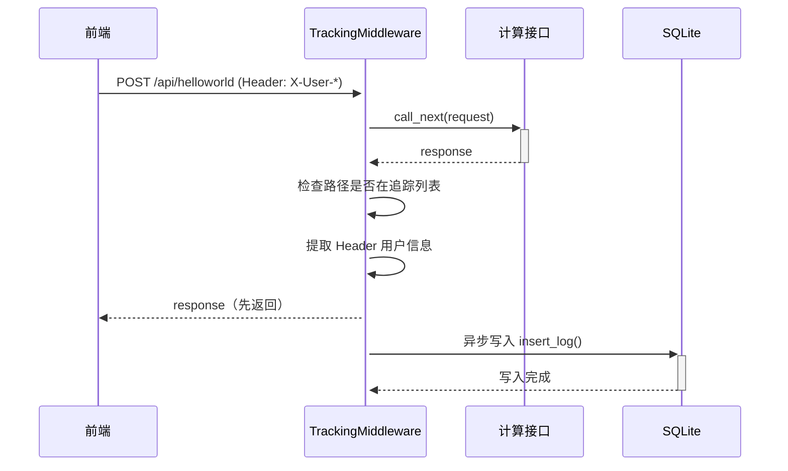

**业务规则：**

| 规则编号 | 规则描述 | 校验时机 | 不满足时的处理 |
|----------|----------|----------|--------------|
| R01 | 仅追踪 /api/helloworld、/api/hash、/api/bubble-sort 三个路径 | 响应后检查 | 非追踪路径不写入日志 |
| R02 | 导出和 analytics 接口自身不计入埋点 | 响应后检查 | 路径不在追踪列表，不写入 |
| R03 | Header 缺失时字段为 NULL | 写入时 | 不拒绝请求，正常写入 NULL |

**异常场景：**

| 异常场景 | 处理方式 |
|----------|----------|
| SQLite 写入失败 | 异步线程静默失败，不影响 API 响应 |
| tracking.db 文件不存在 | 启动时自动调用 init_db() 初始化 |

**并发控制：**
- 并发场景：多个请求同时调用计算接口，SQLite 并发写入
- 控制策略：SQLite 默认串行化写入，使用多线程异步写入（daemon 线程），不阻塞 API 响应。无额外并发控制，日志丢失容忍度较高。

#### 5.2.3 技术选型

| 方案 | 埋点实现 | 优劣 |
|------|----------|------|
| 方案 A（推荐） | FastAPI BaseHTTPMiddleware + threading.Thread 异步写入 | 简单直接，异步不阻塞响应 |
| 方案 B | ASGI 原生中间件 + asyncio | 更复杂，SQLite 写入本身不支持真异步 |
| 方案 C | 后台队列（如 asyncio.Queue） | 过度设计，演示场景不需要 |

**推荐方案 A**：FastAPI 中间件标准模式，代码量少，演示场景性能足够。

---

### 5.3 导出模块

> 对应 F05 (导出按钮及接口)

#### 5.3.1 表结构设计

本模块无新增表，读取 api_call_logs 表（定义见 5.2.1.1）。

#### 5.3.2 枚举与常量定义

| 枚举名称 | 取值 | 含义 | 关联字段 |
|----------|------|------|----------|
| 导出类型 | helloworld, hash, bubble-sort | 支持的导出类型 | URL 路径参数 type |
| CSV 列 | caller_name, dept, level, user_type, api_name, timestamp | CSV 输出列 | 导出文件表头 |

#### 5.3.3 接口详细设计

##### W04 CSV 导出

- **URI**: GET /api/export/{type}
- **描述**: 按接口类型导出调用日志为 CSV 文件
- **入参**:

| 参数名称 | 类型 | 是否必填 | 描述 |
|----------|------|----------|------|
| type | String（路径参数） | 是 | 导出类型，取值：helloworld / hash / bubble-sort |

- **出参**:

| 参数名称 | 类型 | 描述 |
|----------|------|------|
| Content-Type | text/csv | CSV 文件 MIME 类型 |
| Content-Disposition | attachment; filename="{type}_export.csv" | 触发浏览器下载 |
| Body | CSV 文本 | 调用日志 CSV 内容 |

- **错误码**:

| 错误码 | 说明 |
|--------|------|
| 400 | 非法导出类型 |

- **请求示例**:
```
GET /api/export/helloworld
```

- **响应示例**:
```
caller_name,dept,level,user_type,api_name,timestamp
张三,技术部,P6,正式员工,helloworld,2026-09-01 12:00:00
```

#### 5.3.4 子功能详细设计

##### 5.3.4.1 CSV 导出（F05）

- 处理时序图

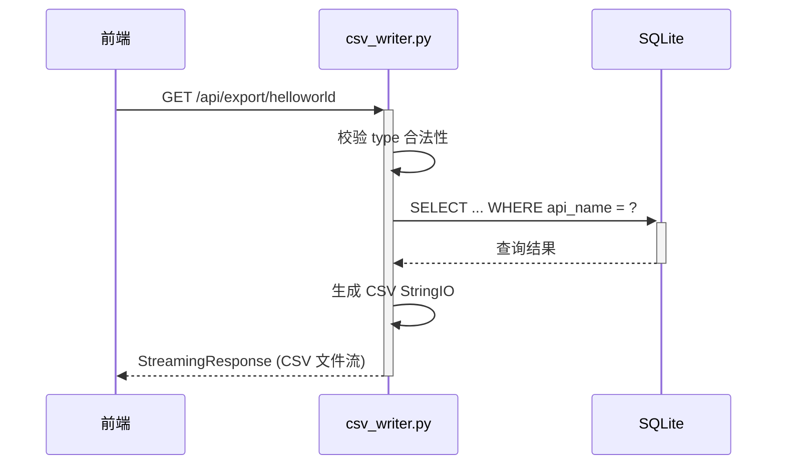

**业务规则：**

| 规则编号 | 规则描述 | 校验时机 | 不满足时的处理 |
|----------|----------|----------|--------------|
| R01 | type 必须为 helloworld/hash/bubble-sort | 请求时 | 返回 400 |
| R02 | 查询结果为空时返回仅含表头的 CSV | 生成 CSV 时 | 不报错，正常返回空数据 CSV |

**异常场景：**

| 异常场景 | 处理方式 |
|----------|----------|
| 非法 type 参数 | 返回 400 |
| tracking.db 无数据 | 返回仅含表头的空 CSV |
| 数据库读取失败 | 返回 500 |

**并发控制：** 无并发风险，纯读操作。

#### 5.3.5 技术选型

| 方案 | 导出实现 | 优劣 |
|------|----------|------|
| 方案 A（推荐） | Python csv 模块 + io.StringIO + StreamingResponse | 标准库，零依赖，流式返回 |
| 方案 B | pandas DataFrame.to_csv() | 过度引入重量级依赖 |
| 方案 C | 手动拼接 CSV 字符串 | 易出错，不处理特殊字符转义 |

**推荐方案 A**：csv 模块标准库，自动处理转义和引号，StreamingResponse 支持流式下载。

---

### 5.4 分析模块

> 对应 F07 (可视化报表), F08 (维度聚合)

#### 5.4.1 表结构设计

本模块无新增表，读取 api_call_logs 表（定义见 5.2.1.1）。

#### 5.4.2 枚举与常量定义

| 枚举名称 | 取值 | 含义 | 关联字段 |
|----------|------|------|----------|
| 分析维度 | dept, level, user_type | 聚合维度 | URL 查询参数 dimension |
| 接口名称 | helloworld, hash, bubble-sort | 可选过滤参数 | URL 查询参数 api_name |

#### 5.4.3 接口详细设计

##### W05 维度分析

- **URI**: GET /api/analytics
- **描述**: 按指定维度聚合查询调用次数
- **入参**:

| 参数名称 | 类型 | 是否必填 | 描述 |
|----------|------|----------|------|
| dimension | String（Query） | 是 | 聚合维度：dept / level / user_type |
| api_name | String（Query） | 否 | 可选，筛选特定接口 |

- **出参**:

| 参数名称 | 类型 | 描述 |
|----------|------|------|
| dimension | String | 当前聚合维度 |
| data | Array[Object] | 聚合结果数组，每项含 label（维度值）和 count（调用次数） |

- **错误码**:

| 错误码 | 说明 |
|--------|------|
| 400 | 非法 dimension 参数 |
| 400 | 非法 api_name 参数 |

- **请求示例**:
```
GET /api/analytics?dimension=dept
```

- **响应示例**:
```json
{
  "dimension": "dept",
  "data": [
    {"label": "技术部", "count": 42},
    {"label": "产品部", "count": 18},
    {"label": "(未设置)", "count": 5}
  ]
}
```

#### 5.4.4 子功能详细设计

##### 5.4.4.1 维度聚合查询（F08）

- 处理时序图

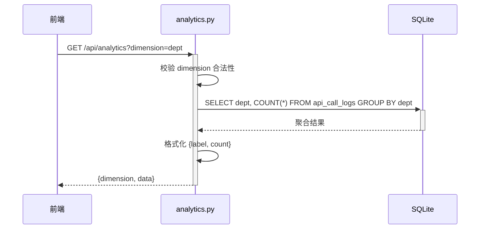

**业务规则：**

| 规则编号 | 规则描述 | 校验时机 | 不满足时的处理 |
|----------|----------|----------|--------------|
| R01 | dimension 必须为 dept/level/user_type | 请求时 | 返回 400 |
| R02 | api_name 可选，若提供必须合法 | 请求时 | 返回 400 |
| R03 | NULL 维度值显示为 "(未设置)" | 格式化时 | 不报错，统一显示标签 |

**异常场景：**

| 异常场景 | 处理方式 |
|----------|----------|
| 非法 dimension | 返回 400 |
| 非法 api_name | 返回 400 |
| 数据库无数据 | 返回空 data 数组 |
| 数据库读取失败 | 返回 500 |

**并发控制：** 无并发风险，纯读操作。

##### 5.4.4.2 前端可视化渲染（F07）

- 处理时序图

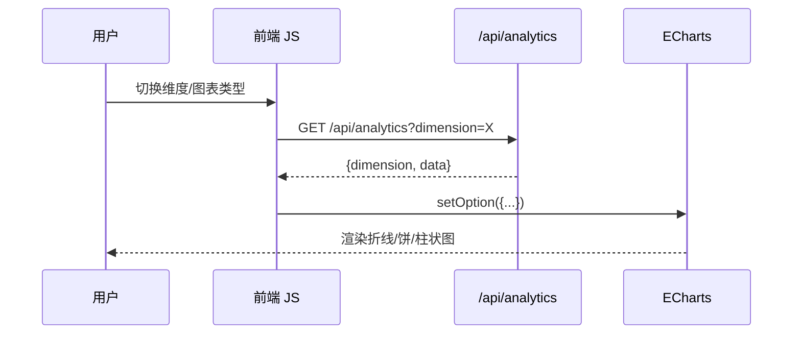

**ECharts 配置要点：**

| 图表类型 | series.type | 特殊配置 |
|----------|-------------|----------|
| 折线图 | line | xAxis: category, yAxis: value |
| 饼图 | pie | radius: ['30%','65%'], 无 xAxis/yAxis |
| 柱状图 | bar | xAxis: category, yAxis: value, itemStyle borderRadius |

#### 5.4.5 技术选型

| 方案 | 报表实现 | 优劣 |
|------|----------|------|
| 方案 A（推荐） | 后端 SQL 聚合 + 前端 ECharts 渲染 | 前后端分离，后端轻量，前端图表灵活 |
| 方案 B | 后端生成图表图片 | 后端重，ECharts 优势无法发挥 |
| 方案 C | 全前端聚合（拉全部数据） | 数据量大时性能差 |

**推荐方案 A**：后端只做 SQL 聚合返回结构化数据，前端 ECharts 负责可视化，职责清晰。

---

### 5.5 前端页面模块

> 对应 F04 (三 Tab 页面), F09 (用户模拟)

#### 5.5.1 表结构设计

本模块为纯前端，无数据库表。

#### 5.5.2 枚举与常量定义

| 枚举名称 | 取值 | 含义 | 关联字段 |
|----------|------|------|----------|
| Tab 标识 | helloworld, hash, bubble-sort | 三个 Tab 页 | HTML data-tab 属性 |
| 图表类型 | line, pie, bar | 折线图/饼图/柱状图 | HTML data-chart 属性 |
| 维度 | dept, level, user_type | 报表维度 | HTML data-dim 属性 |
| 用户 Header | X-User-Id, X-User-Name, X-User-Dept, X-User-Level, X-User-Type | 自定义请求头 | fetch headers |

#### 5.5.3 与后端 API 交互

| 前端动作 | 调用的后端接口 | 方法 | 说明 |
|----------|---------------|------|------|
| 执行 helloworld | /api/helloworld | POST | 返回 greeting 消息 |
| 计算哈希 | /api/hash | POST | 传 text，返回 hash |
| 冒泡排序 | /api/bubble-sort | POST | 传 numbers，返回 sorted |
| 导出 CSV | /api/export/{type} | GET | 触发浏览器下载 |
| 加载报表 | /api/analytics?dimension=X | GET | 返回聚合数据 |

#### 5.5.4 子功能详细设计

##### 5.5.4.1 Tab 切换与 API 调用（F04）

- 处理时序图

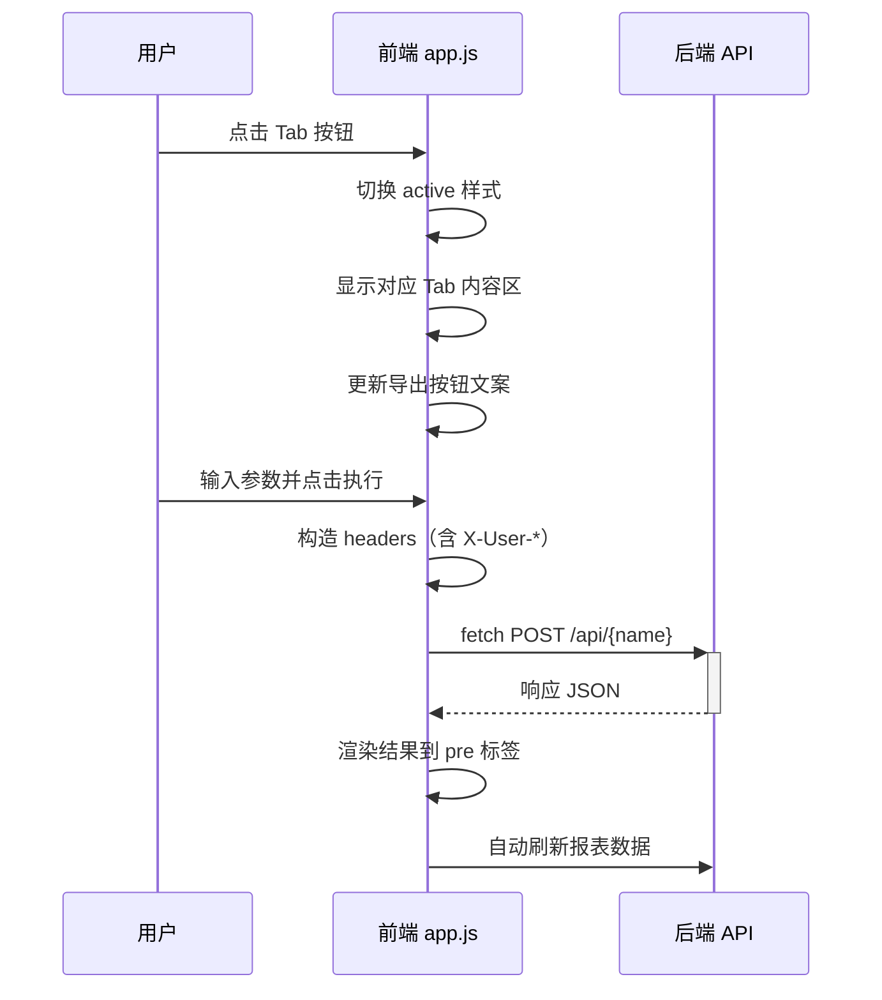

**业务规则：**

| 规则编号 | 规则描述 | 校验时机 | 不满足时的处理 |
|----------|----------|----------|--------------|
| R01 | 哈希输入不得为空 | 提交前（前端校验） | 显示错误提示，不发起请求 |
| R02 | 排序输入必须为逗号分隔数字 | 提交前（前端校验） | 显示错误提示 |
| R03 | 每次 API 调用后自动刷新报表 | 调用成功后 | 静默失败不影响主体功能 |

**异常场景：**

| 异常场景 | 处理方式 |
|----------|----------|
| 后端返回非 200 | 显示红色错误信息，内容为 detail 字段 |
| 网络不通 | 显示"网络连接失败" |
| 后端返回格式异常 | 显示"数据格式异常" |

**并发控制：** 无并发控制需求。用户串行操作，每次操作独立。

##### 5.5.4.2 导出下载（F05-前端）

- 处理时序图

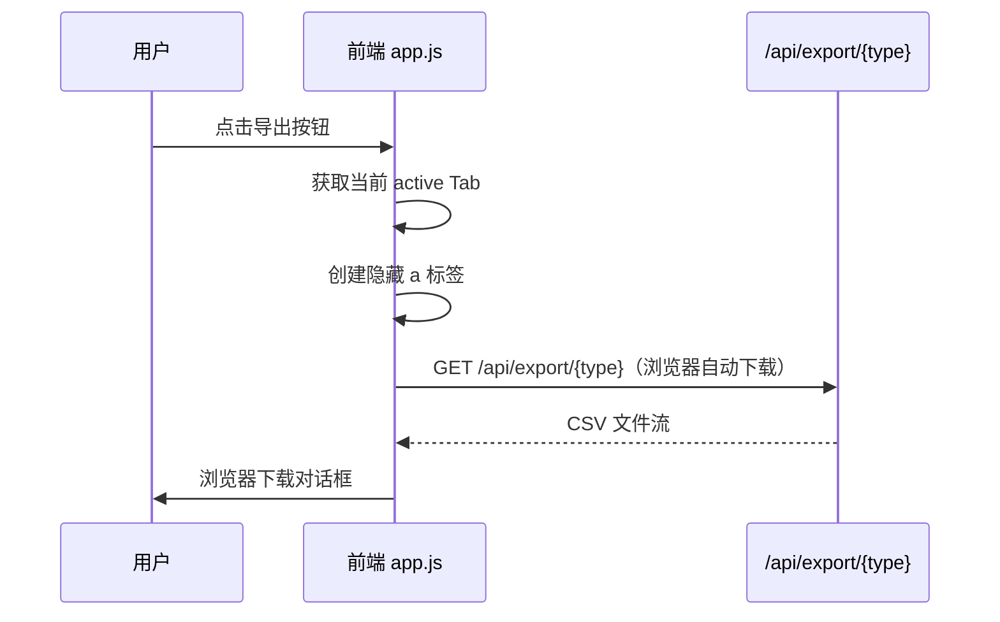

**业务规则：** 导出按钮文字随 Tab 切换自动更新。

##### 5.5.4.3 用户模拟（F09）

- 处理时序图

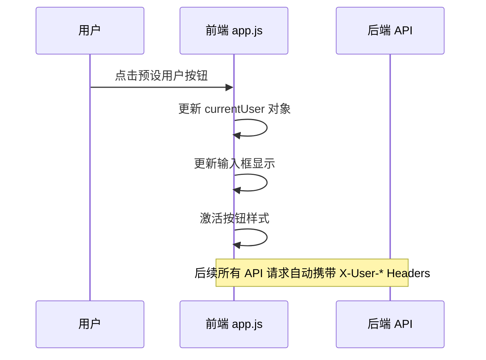

**预设用户数据：**

| 用户 | 部门 | 层级 | 类型 |
|------|------|------|------|
| 张三 | 技术部 | P6 | 正式员工 |
| 李四 | 产品部 | P7 | 正式员工 |
| 王五 | 技术部 | P5 | 外包 |
| 赵六 | 设计部 | P6 | 实习生 |

#### 5.5.5 技术选型

| 方案 | 前端技术 | 优劣 |
|------|----------|------|
| 方案 A（推荐） | 原生 HTML/JS + ECharts CDN | 零构建工具，零依赖安装，直接浏览器打开 |
| 方案 B | React/Vue + ECharts 组件 | 引入框架和构建工具链，演示场景过度 |
| 方案 C | 纯 Canvas 手绘图表 | 开发成本高，ECharts 开箱即用 |

**推荐方案 A**：演示场景无需框架，原生 JS 足够，ECharts CDN 一行 script 即可使用。

---

## 6. 非功能性需求设计

### 6.1 高可用性

本项不适用，原因：演示场景单机部署，无高可用要求。后端 FastAPI 单实例启动，前端静态文件直接访问。若需扩展，可用 uvicorn 多 worker 模式。

### 6.2 可扩展性

- **水平扩展**：后端可部署多个 uvicorn worker（`--workers N`），前端静态文件可托管任意 HTTP Server
- **垂直扩展**：SQLite 替换为 PostgreSQL/MySQL 即可支持更高并发
- **架构扩展性**：当前模块拆分清晰，后续可独立拆分为微服务
- **依赖扩展**：前端 ECharts 通过 CDN 加载，版本升级仅需修改 script 标签 URL

### 6.3 稳定性/可靠性

- **边界场景**：大数组排序（10000+ 元素）O(n²) 时间复杂度可能导致响应缓慢，建议前端限制输入数组长度
- **SQLite 并发**：SQLite 写入串行化，高并发下可能出现写入延迟，演示场景可接受
- **异常恢复**：服务重启后 tracking.db 数据不丢失，SQLite 保证 ACID
- **内存泄漏**：无状态计算接口，不持有会话数据，无内存泄漏风险

### 6.4 安全性设计

#### 6.4.1 账户系统方案

本项不适用，原因：演示场景无真实用户认证，通过自定义 Header 模拟用户身份，无登录/注册/找回密码需求。

#### 6.4.2 授权与访问控制

##### 6.4.2.1 是否实现水平权限检查

不涉及数据库查询或为公共数据查询。所有接口为公共数据，无用户间数据隔离需求。

##### 6.4.2.2 是否实现垂直权限检查

不涉及数据库查询或为公共数据查询。无角色权限区分需求。

##### 6.4.2.3 是否检查登录态

全局无登录态检查。CORS 允许所有来源，无认证拦截器。演示场景可接受。

#### 6.4.3 数据防护方案

##### 6.4.3.1 是否对敏感数据加密存储

不涉及敏感数据。埋点日志仅存储用户姓名、部门、层级等非敏感信息。

##### 6.4.3.2 是否对敏感数据展示进行脱敏

不涉及敏感数据展示。展示内容为接口调用计数和用户基础信息。

### 6.5 监控/统计/日志/告警

- **应用日志**：FastAPI 默认日志输出，uvicorn 提供访问日志
- **埋点监控**：通过 api_call_logs 表可监控接口调用情况，前端可视化报表提供实时查看
- **告警**：演示场景无告警需求，生产环境可接入 Prometheus + Grafana

---

## 7. 变更三板斧

### 7.1 可监控

**服务埋点设计：**

| 监控点 | 监控内容 | 实现方式 | 数据存储 |
|--------|----------|----------|----------|
| 计算接口调用 | 调用人、部门、层级、类型、调用时间 | TrackingMiddleware 中间件 | SQLite api_call_logs |
| 接口调用次数 | 按维度聚合 | /api/analytics 接口 | SQLite 聚合查询 |
| 调用趋势 | 时间序列调用量 | 前端 ECharts 折线图 | 前端从 analytics 数据渲染 |

**埋点覆盖范围：**
- `/api/helloworld` — 追踪 ✅
- `/api/hash` — 追踪 ✅
- `/api/bubble-sort` — 追踪 ✅
- `/api/export/{type}` — 不追踪 ✅
- `/api/analytics` — 不追踪 ✅

**三方服务埋点：** 本项不适用，原因：无外部三方服务依赖。

### 7.2 可灰度

本项不适用，原因：演示场景无多租户、无生产流量，无需灰度策略。当前为全量模式。若后续需要灰度，可按租户尾号灰度引流。

### 7.3 可应急

**应急方案设计：**

| 应急场景 | 应急措施 | 回滚方案 |
|----------|----------|----------|
| 计算接口异常 | 前端展示错误提示，不影响其他 Tab | 代码回滚到上一版本 |
| 埋点中间件异常 | 中间件静默失败，不影响 API 响应 | 移除中间件注册 |
| 导出接口异常 | 前端展示错误提示 | 代码回滚 |
| SQLite 文件损坏 | 删除 tracking.db 重新初始化 | 无历史数据需保留 |

**开关设计：** 本项不适用，原因：演示场景无需开关控制。

**回滚关注点：**
- 上下游兼容性：前后端 API 契约变更时，需同步回滚前后端
- 数据库：tracking.db 表结构变更需兼容旧数据

---

## 8. 仓间对齐清单

| 对齐项 | manyu_test (后端) | manyu_test1 (前端) | 状态 |
|--------|-------------------|---------------------|------|
| 用户身份 | 从 Header 读取 X-User-* | 前端模拟区写入 Header | ✅ |
| API 契约 | 严格按 §4.1 和 §5 定义 | 按契约调用，处理错误 | ✅ |
| 导出格式 | CSV，Content-Disposition 触发下载 | 通过 a 标签下载 | ✅ |
| 维度枚举 | dept, level, user_type | 前端用相同枚举值 | ✅ |
| CORS | 后端配置允许所有来源 | 前端 fetch 跨域请求 | ✅ |
| 端口 | 8000 | BASE_URL 指向 8000 | ✅ |
| 图表类型 | 返回聚合数据 | 折线/饼/柱状图 | ✅ |

---

## 9. 错误处理策略

| 场景 | 后端行为 | 前端行为 |
|------|----------|----------|
| 参数校验失败 | 返回 422 + detail | 显示红色错误提示 |
| 接口不存在 | 返回 404 | 显示"接口未找到" |
| 服务内部错误 | 返回 500 | 显示"服务异常，请稍后重试" |
| 网络不通 | - | 显示"网络连接失败" |
| Header 缺失 | 埋点字段为 NULL | 不影响 API 调用 |

---

## 10. 测试策略

### 后端

- **单元测试**：三个计算接口独立测试（pytest + FastAPI TestClient）
- **集成测试**：模拟 Header 请求，验证埋点写入
- **冒烟测试**：启动服务，curl 调用三个接口，检查 SQLite 记录

### 前端

- **功能测试**：手动验证 Tab 切换、API 调用、导出下载、图表渲染
- **边界测试**：空输入、非法输入、大数组排序