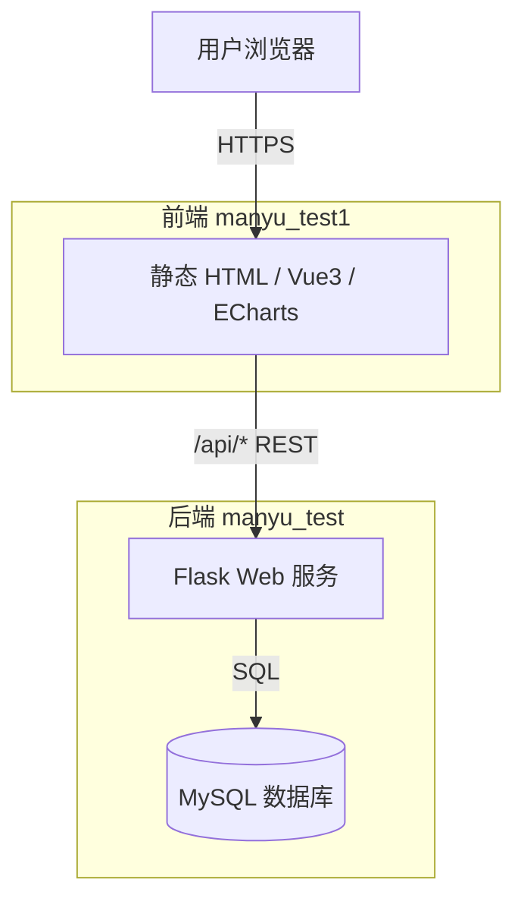
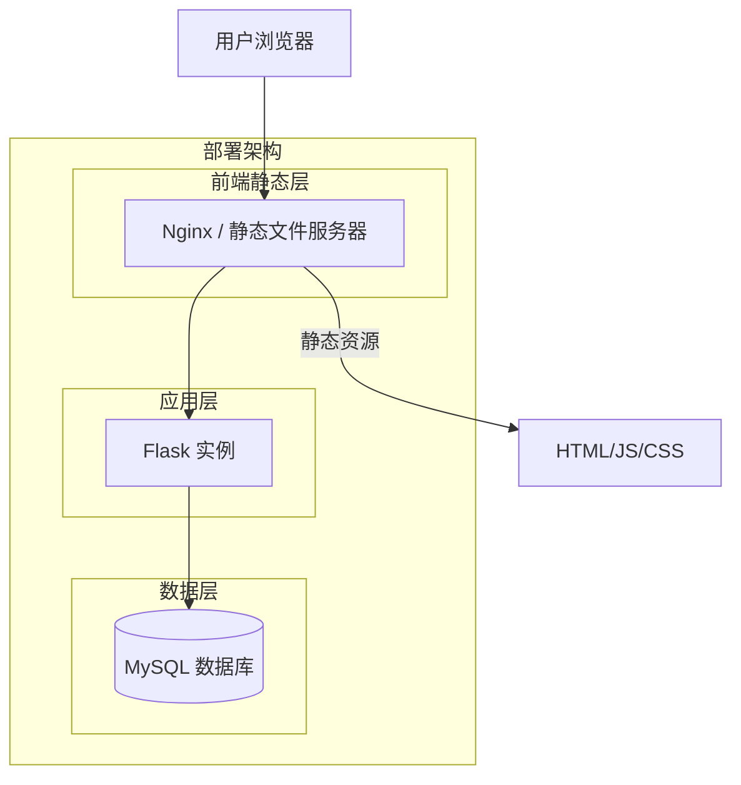
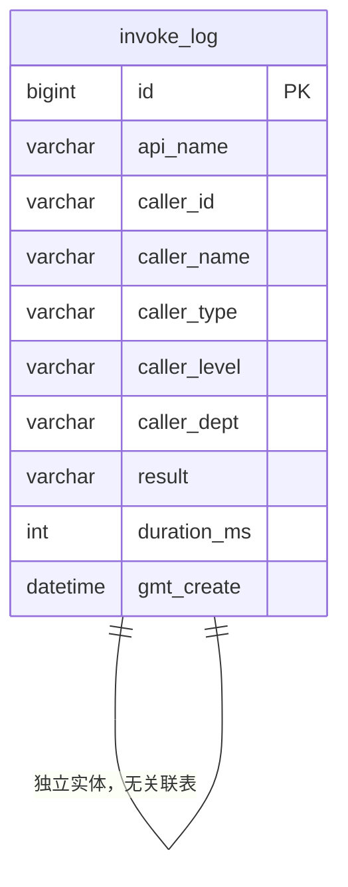
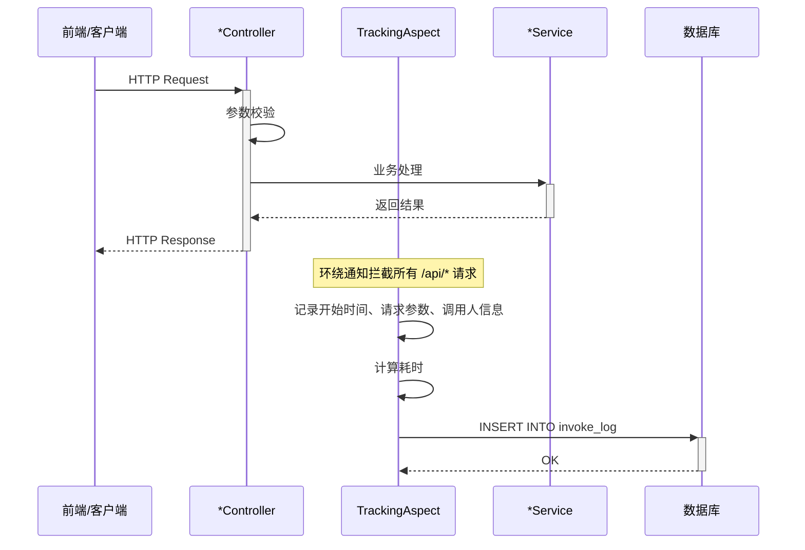
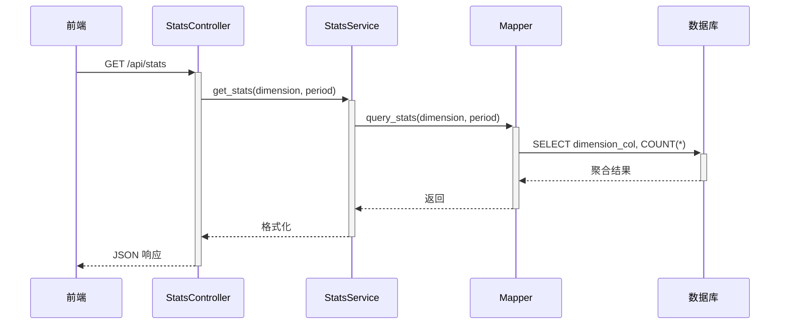
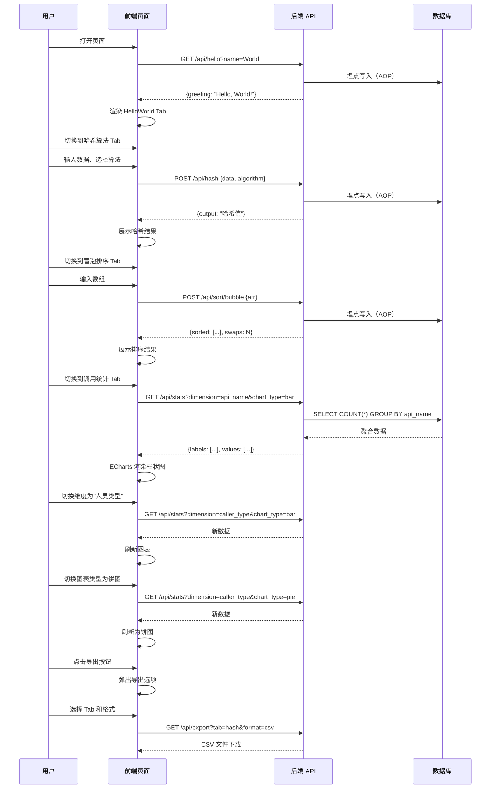

> **文档元信息**
>
> | 项目 | 内容 |
> |------|------|
> | 文档版本 | v1.0 |
> | 作者 | AiWork 系分设计 |
> | 创建日期 | 2026-09-08 |
> | 需求来源 | 用户需求描述 |
> | 评审状态 | 待评审 |

# 多接口演示与监控系统 系分设计

## 1. 需求与范围
### 背景与目标
构建一个多接口演示与监控系统，包含后端三个算法/功能接口（HelloWorld、哈希算法、冒泡排序），前端以 Tab 页展示各接口执行结果，支持导出及调用埋点数据可视化报表。

### 核心功能
1. **三个后端接口**：HelloWorld（返回问候语）、哈希算法（哈希计算）、冒泡排序（数组排序）
2. **前端 Tab 页展示**：三个 Tab 分别展示各接口调用结果
3. **导出功能**：前端导出按钮 + 后端导出接口，支持导出各页面展示结果
4. **后端埋点**：记录每次接口调用的调用人、调用时间等
5. **可视化报表**：前端展示调用统计，包含折线图、饼图、柱状图；支持按人员类型、人员层级、人员部门等维度筛选

### 约束与非功能要求
- 跨仓开发：后端在 manyu_test 仓，前端在 manyu_test1 仓
- 后端基于 Python Flask，前端原生 HTML + Vue 3 + ECharts

### 排除范围
- 用户登录/注册系统（埋点调用人通过请求头传入，不做完整认证）
- 国际化（i18n）
- 单元测试/集成测试

### 需求功能清单与优先级

| 编号 | 功能点 | 优先级 | PRD 原始描述 | 备注 |
|------|--------|--------|-------------|------|
| F01 | HelloWorld 接口 | P0 | 写一个helloword接口 | GET /api/hello |
| F02 | 哈希算法接口 | P0 | 写一个哈希算法接口 | GET/POST /api/hash |
| F03 | 冒泡排序接口 | P0 | 写一个冒泡排序接口 | GET/POST /api/sort/bubble |
| F04 | 前端 Tab 页展示 | P0 | 有三个tab分别展示不同的执行结果 | HTML 页面三个 Tab |
| F05 | 导出按钮 + 后端导出接口 | P0 | 新增导出按钮，后台提供导出接口 | 支持导出 CSV/JSON |
| F06 | 后端埋点（调用次数、调用人） | P0 | 后台做个埋点，获取调用次数和调用人 | AOP 拦截记录 |
| F07 | 前端可视化报表 | P0 | 报表查看调用情况，折线图、饼图、柱状图 | ECharts 实现 |
| F08 | 多维过滤 | P1 | 按人员类型、人员层级、人员部门等维度 | 折线图/饼图/柱状图不同展示形式 |

### 假设与待确认项

| 编号 | 假设/待确认内容 | 当前假设 | 确认状态 |
|------|-----------------|----------|----------|
| A01 | 调用人信息通过请求头 `X-User-Id` 和 `X-User-Name` 传入 | 前端硬编码 demo 用户传递 | 待确认 |
| A02 | 人员类型/层级/部门作为埋点附加字段，通过请求头传入 | 设计为 `X-User-Type`、`X-User-Level`、`X-User-Dept` | 待确认 |
| A03 | 导出格式默认 CSV | 可选 CSV/JSON | 待确认 |
| A04 | 冒泡排序输入通过 POST JSON body 传入数组 | 数组格式 `{"arr": [3,1,4,1,5]}` | 待确认 |

## 2. 架构与模块
### 功能架构
```mermaid
graph TB
    subgraph Frontend[前端 manyu_test1]
        web[Web 页面]
        subgraph tabs[Tab 展示]
            tab1[HelloWorld Tab]
            tab2[哈希算法 Tab]
            tab3[冒泡排序 Tab]
        end
        exportBtn[导出按钮]
        chartPanel[可视化报表面板]
    end

    subgraph Backend[后端 manyu_test]
        subgraph apiLayer[API 层]
            helloAPI[/api/hello]
            hashAPI[/api/hash]
            sortAPI[/api/sort/bubble]
            exportAPI[/api/export]
            statsAPI[/api/stats]
        end
        subgraph serviceLayer[服务层]
            helloSvc[HelloService]
            hashSvc[HashService]
            sortSvc[SortService]
            exportSvc[ExportService]
            statsSvc[StatsService]
        end
        subgraph daoLayer[数据层]
            invokeLog[invoke_log 表]
        end
        subgraph aspectLayer[切面层]
            trackingAOP[调用埋点切面]
        end
    end

    web --> tabs
    tabs --> apiLayer
    exportBtn --> |/api/export| exportAPI
    chartPanel --> |/api/stats| statsAPI
    apiLayer --> serviceLayer
    serviceLayer --> daoLayer
    trackingAOP -.->|环绕通知| apiLayer
    trackingAOP -.->|写入| invokeLog
```

**模块清单**

| 模块 | 职责 | 依赖 |
|------|------|------|
| API 层 | 对外暴露 RESTful 接口，接收请求并响应 | 服务层 |
| 服务层 | 业务逻辑实现 | 数据层 |
| 数据层 | 数据库读写操作 | MySQL |
| 切面层（埋点） | AOP 拦截接口调用，记录调用日志 | 数据层 |
| 前端展示 | Tab 切换、结果渲染、导出、图表 | 后端 API |

### 应用集成架构


**集成关系说明**

| 调用方 | 被调用方 | 协议 | 接口类型 | 说明 |
|--------|----------|------|----------|------|
| 用户浏览器 | 前端静态页面 | HTTPS | HTTP | 加载 HTML/JS/CSS |
| 前端页面 | 后端 Flask | HTTPS | REST JSON | 调用各业务接口 |
| Flask 服务 | MySQL | TCP | SQL | 埋点数据读写 |

### 部署架构


**部署说明**
- 前端静态文件由 Nginx 或直接由 Flask 托管
- Flask 单实例运行，开发阶段可 Flask 内置服务器
- MySQL 数据库存储埋点日志

## 3. 数据模型与存储
### 实体清单

| 实体名称 | 实体说明 | 所属模块 | 与其他实体的关系 |
|----------|----------|----------|-----------------|
| invoke_log | 接口调用埋点日志，记录每次 API 调用的调用人、时间、调用接口、结果等 | 数据层（埋点模块） | 无关联实体 |

### 实体关系图


**模型说明**
- `invoke_log` 是唯一的业务数据表，用于存储埋点记录
- 该表无外键关联，独立存储所有 API 调用日志
- 按 `gmt_create` 和 `api_name` 建立索引以支持时间范围查询和报表聚合

## 4. 接口设计

### 4.1 oneapi（Web 控制台接口）

| 编号 | 接口名称 | 方法 | 路径 | 模块 |
|------|----------|------|------|------|
| W01 | HelloWorld | GET | /api/hello | API 层 |
| W02 | 哈希算法 | POST | /api/hash | API 层 |
| W03 | 冒泡排序 | POST | /api/sort/bubble | API 层 |
| W04 | 导出数据 | GET | /api/export | API 层 |
| W05 | 统计报表 | GET | /api/stats | API 层 |

### 4.2 OpenAPI（对外接口）

无对外 OpenAPI 接口。

### 4.3 内部接口（Service 层）

| 编号 | 接口名称 | 类 | 方法签名 |
|------|----------|------|----------|
| S01 | HelloService | HelloService | hello(name: str) -> dict |
| S02 | HashService | HashService | hash(algorithm: str, data: str) -> dict |
| S03 | SortService | SortService | bubble_sort(arr: list) -> dict |
| S04 | ExportService | ExportService | export_data(format: str, tab: str) -> str |
| S05 | StatsService | StatsService | get_stats(dimension: str, period: str) -> dict |

### 4.4 集成接口（Integration 层）

无外部系统集成接口。

## 5. 功能模块设计

### 5.1 API 层模块

#### 5.1.1 表结构设计

API 层无独立表结构，涉及数据存储的实体为 `invoke_log`，归属数据层模块。

#### 5.1.2 接口详细设计

##### W01 HelloWorld 接口

- **URI**: GET /api/hello
- **描述**: 返回问候语，支持可选参数 name
- **入参**:

| 参数名称 | 类型 | 是否必填 | 描述 |
|----------|------|----------|------|
| name | string | 否 | 被问候者姓名，默认 "World" |

- **出参**:

| 参数名称 | 类型 | 描述 |
|----------|------|------|
| code | int | 状态码 |
| msg | string | 提示信息 |
| data | object | 业务数据 |
| data.greeting | string | 问候语内容 |

- **错误码**: 200 成功；400 参数错误
- **业务规则**: 无特殊规则
- **请求示例**: `GET /api/hello?name=Alice`
- **响应示例**:
```json
{
  "code": 200,
  "msg": "SUCCESS",
  "data": { "greeting": "Hello, Alice!" }
}
```

##### W02 哈希算法接口

- **URI**: POST /api/hash
- **描述**: 对输入数据进行哈希计算
- **入参**:

| 参数名称 | 类型 | 是否必填 | 描述 |
|----------|------|----------|------|
| data | string | 是 | 待哈希的原始数据 |
| algorithm | string | 否 | 哈希算法，默认 "sha256"，可选：md5/sha1/sha256/sha512 |

- **出参**:

| 参数名称 | 类型 | 描述 |
|----------|------|------|
| code | int | 状态码 |
| msg | string | 提示信息 |
| data | object | 业务数据 |
| data.algorithm | string | 使用的哈希算法 |
| data.input | string | 原始输入 |
| data.output | string | 哈希计算结果 |

- **错误码**: 200 成功；400 参数错误（如不支持的算法）；500 服务错误
- **业务规则**: 仅支持 md5/sha1/sha256/sha512 四种算法
- **请求示例**:
```json
{ "data": "hello", "algorithm": "sha256" }
```
- **响应示例**:
```json
{
  "code": 200,
  "msg": "SUCCESS",
  "data": {
    "algorithm": "sha256",
    "input": "hello",
    "output": "2cf24dba5fb0a30e26e83b2ac5b9e29e1b161e5c1fa7425e73043362938b9824"
  }
}
```

##### W03 冒泡排序接口

- **URI**: POST /api/sort/bubble
- **描述**: 对输入数组执行冒泡排序
- **入参**:

| 参数名称 | 类型 | 是否必填 | 描述 |
|----------|------|----------|------|
| arr | array[number] | 是 | 待排序的整数数组 |
| order | string | 否 | 排序顺序，默认 "asc"，可选：asc/desc |

- **出参**:

| 参数名称 | 类型 | 描述 |
|----------|------|------|
| code | int | 状态码 |
| msg | string | 提示信息 |
| data | object | 业务数据 |
| data.original | array | 原始数组 |
| data.sorted | array | 排序后的数组 |
| data.order | string | 排序顺序 |
| data.swaps | int | 交换次数 |
| data.duration_ms | int | 排序耗时(毫秒) |

- **错误码**: 200 成功；400 参数错误；500 服务错误
- **业务规则**: 输入数组最大长度不超过 10000
- **请求示例**:
```json
{ "arr": [3, 1, 4, 1, 5, 9, 2, 6], "order": "asc" }
```
- **响应示例**:
```json
{
  "code": 200,
  "msg": "SUCCESS",
  "data": {
    "original": [3, 1, 4, 1, 5, 9, 2, 6],
    "sorted": [1, 1, 2, 3, 4, 5, 6, 9],
    "order": "asc",
    "swaps": 12,
    "duration_ms": 0
  }
}
```

##### W04 导出接口

- **URI**: GET /api/export
- **描述**: 导出指定 Tab 页的展示结果数据
- **入参**:

| 参数名称 | 类型 | 是否必填 | 描述 |
|----------|------|----------|------|
| tab | string | 是 | 导出目标 Tab：hello/hash/sort/stats |
| format | string | 否 | 导出格式，默认 "csv"，可选：csv/json |

- **出参**: 文件流下载（Content-Type: text/csv 或 application/json）
- **错误码**: 200 成功；400 参数错误；404 无数据
- **业务规则**: 导出统计数据时，可通过附加参数过滤
- **请求示例**: `GET /api/export?tab=hash&format=csv`
- **响应示例**: 返回 CSV 文件下载

##### W05 统计报表接口

- **URI**: GET /api/stats
- **描述**: 获取调用统计报表数据，支持多维度过滤，返回适用多种图表的数据格式
- **入参**:

| 参数名称 | 类型 | 是否必填 | 描述 |
|----------|------|----------|------|
| dimension | string | 否 | 统计维度，默认 "api_name"；可选：api_name/caller_type/caller_level/caller_dept |
| period | string | 否 | 时间范围，默认 "7d"；可选：24h/7d/30d/all |
| chart_type | string | 否 | 图表类型，默认 "bar"；可选：line/pie/bar |

- **出参**:

| 参数名称 | 类型 | 描述 |
|----------|------|------|
| code | int | 状态码 |
| msg | string | 提示信息 |
| data | object | 业务数据 |
| data.dimension | string | 统计维度 |
| data.chart_type | string | 图表类型 |
| data.labels | array | 标签列表 |
| data.values | array | 数值列表 |
| data.total | int | 总数 |

- **错误码**: 200 成功；400 参数错误
- **业务规则**: 根据 chart_type 返回适合该图表的数据结构
- **请求示例**: `GET /api/stats?dimension=caller_type&chart_type=pie`
- **响应示例**:
```json
{
  "code": 200,
  "msg": "SUCCESS",
  "data": {
    "dimension": "caller_type",
    "chart_type": "pie",
    "labels": ["开发人员", "测试人员", "运维人员"],
    "values": [120, 80, 45],
    "total": 245
  }
}
```

#### 5.1.3 子功能详细设计

##### 调用埋点时序（通用）



**业务规则**: 无
**异常场景**: 埋点写入失败不影响主流程，打印日志后吞掉异常
**并发控制**: 无并发风险（埋点为 append-only 写入）

### 5.2 数据层模块

#### 5.2.1 表结构设计

##### invoke_log（接口调用日志表）

| 字段名 | 数据类型 | 约束 | 默认值 | 说明 |
|--------|----------|------|--------|------|
| id | bigint | PK, 自增 | - | 系统自增主键 |
| api_name | varchar(128) | NOT NULL | - | 调用的接口名称，如 /api/hello |
| caller_id | varchar(64) | NOT NULL | - | 调用人 ID |
| caller_name | varchar(128) | NOT NULL | - | 调用人姓名 |
| caller_type | varchar(32) | NULL | - | 调用人类型，如：开发/测试/运维 |
| caller_level | varchar(32) | NULL | - | 调用人层级，如：初级/中级/高级 |
| caller_dept | varchar(128) | NULL | - | 调用人部门，如：技术部/产品部 |
| request_params | text | NULL | - | 请求参数（JSON 格式） |
| response_code | int | NOT NULL | - | 接口响应状态码 |
| result | varchar(32) | NOT NULL | "SUCCESS" | 调用结果：SUCCESS/FAIL |
| duration_ms | int | NOT NULL | 0 | 处理耗时（毫秒） |
| gmt_create | datetime | NOT NULL | CURRENT_TIMESTAMP | 创建时间 |

**索引：**
- PK: `id`
- IDX: `idx_invoke_log_api_name` (api_name) — 按接口统计
- IDX: `idx_invoke_log_gmt_create` (gmt_create) — 按时间范围统计
- IDX: `idx_invoke_log_caller_type` (caller_type) — 按人员类型统计
- IDX: `idx_invoke_log_caller_dept` (caller_dept) — 按部门统计

##### 枚举与常量定义

| 枚举名称 | 取值 | 含义 | 关联字段 |
|----------|------|------|----------|
| 调用结果 | SUCCESS | 成功 | invoke_log.result |
| 调用结果 | FAIL | 失败 | invoke_log.result |

#### 5.2.2 接口详细设计

数据层通过 ORM（Flask-SQLAlchemy）提供以下操作接口：

| 接口名称 | 方法签名 | 描述 |
|----------|----------|------|
| insert_log | (log: InvokeLog) -> int | 写入一条日志记录 |
| query_stats | (dimension, period, ...) -> list | 按维度统计接口调用数据 |
| export_data | (tab, format) -> str | 导出指定 Tab 数据 |

#### 5.2.3 子功能详细设计

##### 统计查询时序



**业务规则：**
- 统计查询仅查询 invoke_log 表
- period 过滤基于 gmt_create 字段
- 所有聚合查询使用 GROUP BY + COUNT(*)

**异常场景：**
| 异常场景 | 处理方式 |
|----------|----------|
| 查询超时 | 返回空数据，记录日志 |
| 无数据 | 返回空 labels 和 values 数组 |

**并发控制：** 无并发风险（统计查询为只读操作）

### 5.3 埋点切面模块

#### 5.3.1 表结构设计

本模块无独立表结构，使用 invoke_log 表。

#### 5.3.2 接口详细设计

本模块无对外接口，以 AOP 切面方式工作。

#### 5.3.3 子功能详细设计

##### 调用埋点切面

**实现方式：** Flask 的 before_request / after_request 钩子或装饰器模式

**切面拦截范围：** 所有 /api/* 路径的请求

**处理逻辑：**
1. 请求到达时记录开始时间
2. 从请求头中提取调用人信息：
   - `X-User-Id` → caller_id
   - `X-User-Name` → caller_name
   - `X-User-Type` → caller_type（人员类型）
   - `X-User-Level` → caller_level（人员层级）
   - `X-User-Dept` → caller_dept（人员部门）
3. 请求处理完成后计算耗时
4. 组装 InvokeLog 对象写入数据库
5. 埋点写入失败时捕获异常并记录日志，不影响主流程

**业务规则：**
| 规则编号 | 规则描述 | 校验时机 | 不满足时的处理 |
|----------|----------|----------|--------------|
| R01 | 调用人信息缺失时使用默认值 | 请求处理时 | caller_id 默认为 "anonymous"，caller_name 默认为 "Unknown" |
| R02 | 埋点写入失败不应影响主流程 | 写入时 | 打印错误日志，不抛出异常 |

**异常场景：**
| 异常场景 | 处理方式 |
|----------|----------|
| 数据库连接失败 | 记录 error 日志，主流程正常返回 |
| 请求头信息解析异常 | 使用默认值填充 |

**并发控制：** 无并发风险，埋点为 append-only 写入模式

### 5.4 前端模块

#### 5.4.1 表结构设计

本模块不涉及数据表。

#### 5.4.2 接口详细设计

前端无独立接口，通过 HTTP 调用后端 API。

#### 5.4.3 子功能详细设计

##### Tab 页面展示

**页面布局：**
- 顶部：标题 + 操作按钮区（导出按钮）
- 中间：Tab 导航栏（三个 Tab + 报表 Tab）
- 内容区：根据选中 Tab 展示对应内容

**Tab 定义：**
| Tab 名称 | 对应后端接口 | 展示内容 |
|----------|-------------|----------|
| HelloWorld | GET /api/hello?name=xxx | 调用结果和问候语展示 |
| 哈希算法 | POST /api/hash | 输入数据、算法选择、哈希结果展示 |
| 冒泡排序 | POST /api/sort/bubble | 输入数组、排序结果、交换次数、耗时展示 |
| 调用统计 | GET /api/stats | 图表展示（折线图/饼图/柱状图） |

##### 导出功能

**触发方式：** 页面顶部「导出」按钮
**交互流程：**
1. 用户点击导出按钮
2. 弹窗选择导出目标 Tab（hello/hash/sort/stats）和格式（CSV/JSON）
3. 确认后浏览器下载文件

##### 可视化报表

**图表类型与维度对照：**

| 维度 | 折线图（line） | 饼图（pie） | 柱状图（bar） |
|------|---------------|------------|--------------|
| 接口名称（api_name） | 各接口调用趋势 | 各接口占比 | 各接口调用量对比 |
| 人员类型（caller_type） | 各类人员调用趋势 | 各类人员占比 | 各类人员调用量对比 |
| 人员层级（caller_level） | 各层级调用趋势 | 各层级占比 | 各层级调用量对比 |
| 人员部门（caller_dept） | 各部门调用趋势 | 各部门占比 | 各部门调用量对比 |

**默认展示：** 首次加载显示柱状图，按接口名称统计
**维度切换：** 用户通过下拉选择器选择维度，图表自动刷新
**图表类型切换：** 用户通过按钮组切换折线图/饼图/柱状图

**前端技术方案对比：**

| 方案 | 优势 | 劣势 | 推荐 |
|------|------|------|------|
| ECharts CDN | 社区成熟、图表类型丰富、无需构建 | 加载 CDN 依赖 | ✅ 推荐 |
| Chart.js CDN | 轻量、API 简洁 | 高级图表支持弱 | |
| 原生 Canvas | 无外部依赖 | 开发工作量大 | |

**推荐方案：ECharts CDN — 理由：** 原生支持折线图/饼图/柱状图，API 文档完善，社区活跃，适合快速开发

##### 完整用户流程时序图



**业务规则：**
| 规则编号 | 规则描述 | 校验时机 | 不满足时的处理 |
|----------|----------|----------|--------------|
| R01 | 首次加载默认选中 HelloWorld Tab | 页面加载时 | 默认选中第一个 Tab |
| R02 | 图表数据为空时显示"暂无数据"提示 | 数据加载后 | 图表区域显示占位文字 |
| R03 | API 调用失败时显示错误提示 | 请求完成后 | 弹窗或 Toast 提示 |

**异常场景：**
| 异常场景 | 处理方式 |
|----------|----------|
| 后端 API 不可用 | 显示"服务暂不可用"提示 |
| 图表数据为空 | 显示"暂无数据"占位 |
| 导出时无数据 | 提示"无数据可导出" |

## 6. 非功能性需求设计
### 6.1 高可用性
本项不适用，原因：本系统为演示/开发环境使用，单实例部署即可满足需求。高可用不在本次需求范围内。

### 6.2 可扩展性
- **水平扩展**：Flask 应用可通过 Gunicorn + Nginx 实现多进程/多实例部署
- **垂直扩展**：单实例可通过增加线程数或升级硬件资源提升性能
- **架构可扩展**：新增接口只需新增 Controller + Service 类，无需修改现有代码

### 6.3 稳定性/可靠性
- 前端请求失败时显示友好提示，不崩溃
- 后端埋点写入失败不影响主业务流程
- 所有 API 返回统一错误码格式

### 6.4 安全性设计
#### 6.4.1 账户系统方案
本项不适用，原因：本系统不涉及用户注册/登录认证。调用人信息通过请求头传入，仅用于埋点统计。

#### 6.4.2 授权&访问控制
##### 6.4.2.1 是否实现水平权限检查
本项不适用，原因：不涉及数据库查询中的资源隔离，调用统计数据为公共数据。
##### 6.4.2.2 是否实现垂直权限检查
本项不适用，原因：无角色权限体系，所有接口公开可调用。
##### 6.4.2.3 是否检查登录态
本项不适用，原因：本系统为开发演示环境，无登录态检查。

#### 6.4.3 数据防护方案
##### 6.4.3.1 是否对敏感数据加密存储
本项不适用，原因：invoke_log 表仅存储接口调用日志，不包含敏感个人信息。
##### 6.4.3.2 是否对敏感数据展示进行脱敏
本项不适用，原因：不涉及敏感数据展示。

### 6.5 监控/统计/日志/告警
- **应用日志**：Flask 标准日志输出，记录请求路径、状态码、耗时
- **埋点数据**：写入 invoke_log 表，提供 /api/stats 接口查询
- **告警**：本项不适用，演示环境无需告警配置

## 7. 变更三板斧
### 7.1 可监控
- **服务埋点**：所有 API 调用通过 AOP 切面自动记录到 invoke_log 表
- **埋点字段**：接口名称、调用人信息、结果、耗时、请求参数
- **查询接口**：/api/stats 提供按维度聚合的统计数据
- **日志**：Flask 标准日志输出请求信息

### 7.2 可灰度
本项不适用，原因：本系统为单实例演示应用，无多租户分流需求，不具备灰度条件。

### 7.3 可应急
- **开关控制**：可在 Flask 配置中增加 `ENABLE_TRACKING` 开关，关闭后切面不执行埋点写入
- **回滚方案**：发布包回滚兜底，新接口与旧接口兼容（新增接口不影响已有功能）
- **上下游兼容**：前端向后端 API 发请求，前端更新后仍兼容旧版后端 API；后端新增接口对前端无依赖