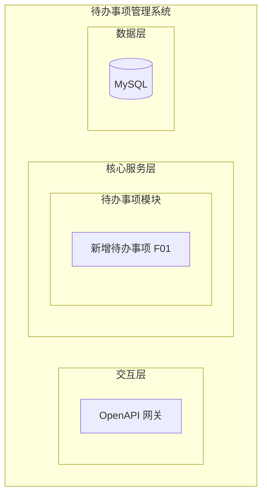
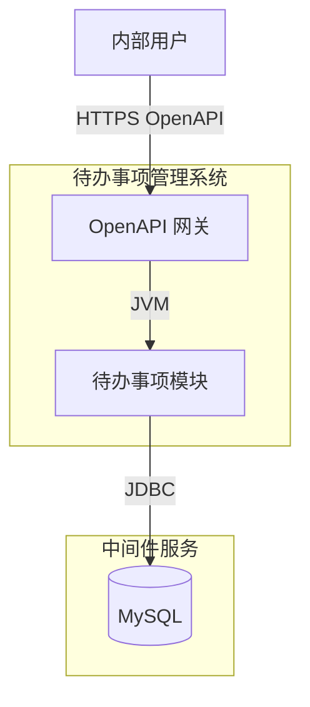
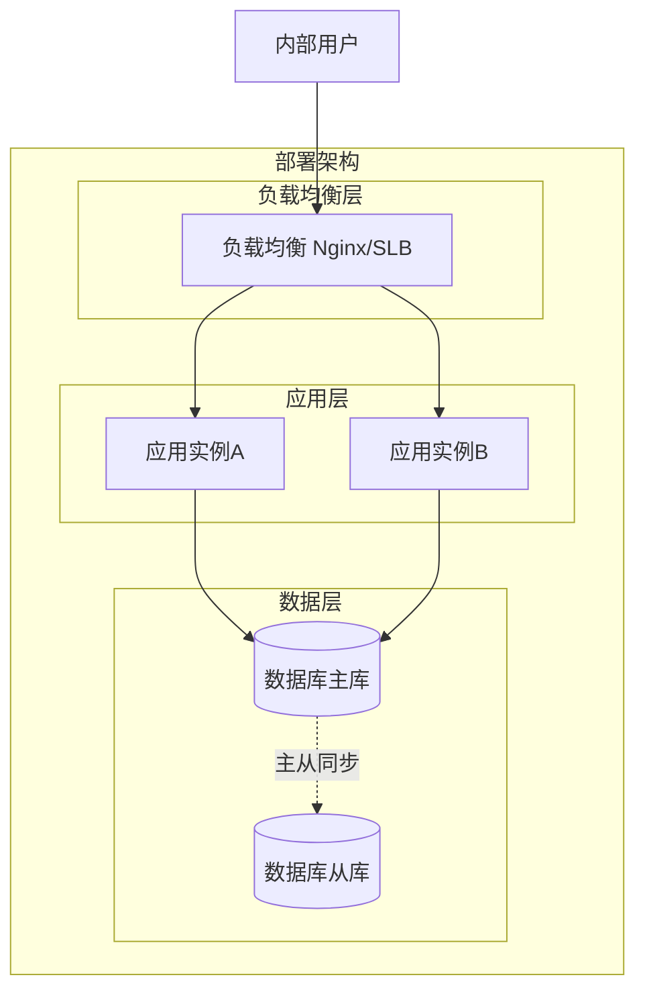
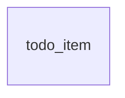
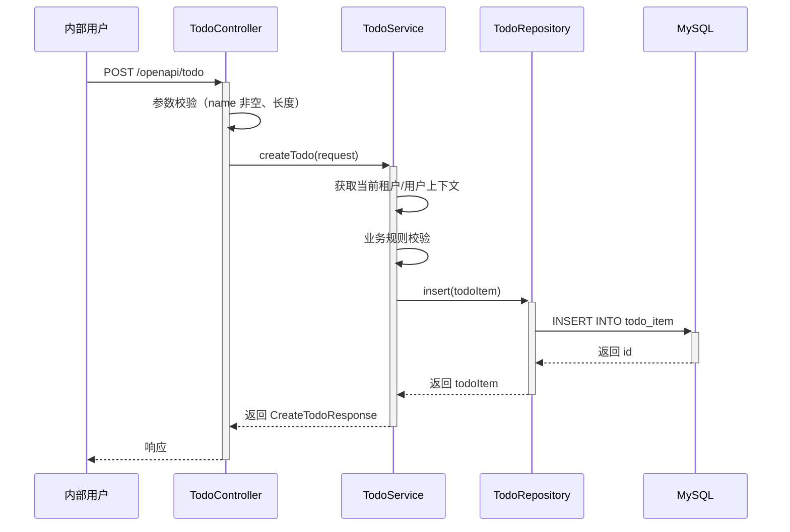

> **文档元信息**
>
> | 项目 | 内容 |
> |------|------|
> | 文档版本 | v1.0 |
> | 作者 | AiWork |
> | 创建日期 | 2026-09-08 |
> | 需求来源 | 任务输入：帮助用户记录日常待办事项，核心功能：新增待办事项 |
> | 评审状态 | 待评审 |

# 待办事项管理系统 系分设计

## 1. 需求与范围

### 背景与目标
- **背景**：内部用户需要记录日常待办事项，当前缺乏统一的任务记录工具。
- **目标**：构建一个待办事项管理系统，提供待办事项的创建能力，帮助用户记录日常任务。
- **目标用户**：内部用户。

### 核心功能
1. **新增待办事项**：用户可创建一条待办事项，包含事项名称和描述。

### 约束与非功能要求
- 技术栈：Spring Boot + DtazziBoot 体系
- 数据库：MySQL
- 接口风格：RESTful (OpenAPI)
- 租户隔离：默认 tenant_id 隔离
- 审计字段：创建时间、修改时间

### 排除范围
- 不包含待办事项的编辑、删除、查询列表、状态变更等功能（仅创建）
- 不包含用户登录/注册/权限体系（内部用户，假设已有认证体系）
- 不包含消息通知、提醒、定时任务等功能
- 不包含待办事项分类/标签/优先级等功能

### 需求功能清单与优先级

| 编号 | 功能点 | 优先级 | 需求原始描述 | 备注 |
|------|--------|--------|-------------|------|
| F01 | 新增待办事项 | P0 | 新增待办事项，包含事项名称和描述 | 最小闭环核心功能 |

### 假设与待确认项

| 编号 | 假设/待确认内容 | 当前假设 | 确认状态 |
|------|-----------------|----------|----------|
| A01 | 内部用户认证方式 | 假设已有统一认证体系（如 SSO），本系统通过拦截器获取当前用户身份 | 待确认 |
| A02 | 租户隔离粒度 | 默认按 tenant_id 隔离，创建时从当前上下文获取租户信息 | 待确认 |
| A03 | 待办事项名称最大长度 | 假设 200 字符 | 待确认 |
| A04 | 待办事项描述最大长度 | 假设 2000 字符（TEXT 类型） | 待确认 |
| A05 | 接口前缀格式 | 使用 OpenAPI 格式 /openapi/todo | 待确认 |

## 2. 架构与模块

### 功能架构



- **交互层说明**：对外提供 OpenAPI RESTful 接口，内部用户通过 HTTPS 调用。
- **核心服务层说明**：待办事项模块负责待办事项的创建，包含 Controller → Service → Repository 三层。
- **数据层说明**：MySQL 数据库存储待办事项数据。

### 模块清单

| 模块 | 职责 | 依赖 |
|------|------|------|
| 待办事项模块 (todo) | 待办事项的创建 | MySQL |

### 应用集成架构



### 集成关系说明

| 调用方 | 被调用方 | 协议 | 接口类型 | 说明 |
|--------|----------|------|----------|------|
| 内部用户 | OpenAPI 网关 | HTTPS | OpenAPI REST | 创建待办事项 |
| 待办事项模块 | MySQL | JDBC | SQL | 持久化待办事项数据 |

### 部署架构



**部署说明：**
- **负载均衡层**：Nginx/SLB 实现负载均衡，无单点。
- **应用层**：双实例部署，支持横向扩展。
- **数据层**：MySQL 主从架构，主库负责写入，从库可扩展读。

## 3. 数据模型与存储

### 实体清单

| 实体名称 | 实体说明 | 所属模块 | 与其他实体的关系 |
|----------|----------|----------|-----------------|
| 待办事项 (todo_item) | 用户创建的待办事项记录 | 待办事项模块 | 无关联实体（当前仅创建，无用户/分类等关联） |

### 实体关系图



**模型说明：**
- 当前最小闭环仅涉及待办事项实体，无其他实体关联。
- 采用 tenant_id 进行租户隔离。
- 实体命名遵循 db.md 规范：表名全部小写、下划线分隔、以字母开头。

## 4. 接口设计

### 4.1 OpenAPI（对外接口）

| 编号 | 接口名称 | 方法 | 路径 | 模块 |
|------|----------|------|------|------|
| O01 | 新增待办事项 | POST | /openapi/todo | 待办事项模块 |

### 4.2 内部接口（Service 层）

| 编号 | 接口名称 | 类 | 方法签名 |
|------|----------|------|----------|
| S01 | 创建待办事项 | TodoService | createTodo(CreateTodoRequest request) |

### 4.3 集成接口（Integration 层）

无外部系统集成，本项不适用。

## 5. 功能模块设计

### 5.1 待办事项模块 (todo)

#### 5.1.1 表结构设计

##### 5.1.1.1 todo_item（待办事项表）

| 字段名 | 数据类型 | 约束 | 默认值 | 说明 |
|--------|----------|------|--------|------|
| id | bigint | PK, 自增, NOT NULL | - | 系统自增主键 |
| tenant_id | varchar(64) | NOT NULL | - | 租户ID |
| name | varchar(200) | NOT NULL | '' | 事项名称 |
| description | text | NULL | NULL | 事项描述 |
| creator_id | varchar(64) | NOT NULL | '' | 创建人ID |
| creator_name | varchar(64) | NOT NULL | '' | 创建人名称 |
| gmt_create | datetime | NOT NULL | CURRENT_TIMESTAMP | 创建时间 |
| gmt_modified | datetime | NOT NULL | CURRENT_TIMESTAMP | 修改时间 |

**索引：**
- PK: `pk_todo_item` (id)
- IDX: `idx_todo_item_tenant_id` (tenant_id)
- IDX: `idx_todo_item_creator_id` (creator_id)
- IDX: `idx_todo_item_gmt_create` (gmt_create)

##### 5.1.1.2 枚举与常量定义

本模块当前无枚举/常量定义（仅创建功能，无状态字段）。

#### 5.1.2 接口详细设计

##### O01 新增待办事项

- **URI**: POST /openapi/todo
- **描述**: 创建一条新的待办事项
- **入参**:

| 参数名称 | 类型 | 是否必填 | 描述 |
|----------|------|----------|------|
| name | String | 是 | 事项名称，最大 200 字符 |
| description | String | 否 | 事项描述，最大 2000 字符 |

- **出参**:

| 参数名称 | 类型 | 描述 |
|----------|------|------|
| code | String | 结果码 |
| msg | String | 提示信息 |
| data | Object | 业务数据，包含新建的待办事项信息 |

data 字段：

| 参数名称 | 类型 | 描述 |
|----------|------|------|
| id | Long | 待办事项ID |
| name | String | 事项名称 |
| description | String | 事项描述 |
| gmtCreate | String | 创建时间（ISO 8601） |

- **错误码**:

| 错误码 | 说明 |
|--------|------|
| TODO_001 | 事项名称不能为空 |
| TODO_002 | 事项名称长度超过限制（200字符） |
| TODO_003 | 系统内部错误 |

- **业务规则**:
  - 事项名称必填，不能为空或全空格
  - 事项名称最长 200 字符
  - 事项描述最长 2000 字符，可选
  - 创建时自动填充 tenant_id（从当前上下文获取）
  - 创建时自动填充 creator_id / creator_name（从当前上下文获取）

- **请求示例**:
```json
{
  "name": "完成周报",
  "description": "整理本周工作内容，提交周报"
}
```

- **响应示例**:
```json
{
  "code": "OK",
  "msg": "SUCCESS",
  "data": {
    "id": 1,
    "name": "完成周报",
    "description": "整理本周工作内容，提交周报",
    "gmtCreate": "2026-09-08T10:00:00Z"
  }
}
```

#### 5.1.3 子功能详细设计

##### 5.1.3.1 新增待办事项（F01）

- **处理时序图**



**业务规则：**

| 规则编号 | 规则描述 | 校验时机 | 不满足时的处理 |
|----------|----------|----------|--------------|
| R01 | 事项名称不能为空或全空格 | 创建时 | 返回错误码 TODO_001，提示"事项名称不能为空" |
| R02 | 事项名称长度不超过 200 字符 | 创建时 | 返回错误码 TODO_002，提示"事项名称长度超过限制" |
| R03 | 事项描述长度不超过 2000 字符 | 创建时 | 返回错误码 TODO_002，提示"事项描述长度超过限制" |

**异常场景：**

| 异常场景 | 处理方式 |
|----------|----------|
| 数据库连接失败 | 返回 TODO_003，提示"系统繁忙，请稍后重试"，记录 ERROR 日志 |
| 数据插入失败（重复/约束冲突） | 返回 TODO_003，提示"创建失败，请重试"，记录 ERROR 日志 |
| 请求参数格式错误（JSON 解析失败） | 返回 HTTP 400，提示"请求参数格式错误" |

**并发控制：**
- 并发场景：创建操作为独立新增，无并发冲突风险（每次创建独立记录，主键自增）。
- 控制策略：无并发风险，无需额外并发控制。

**状态机设计：**
当前最小闭环仅创建，无状态字段，不涉及状态机。本项不适用，原因：待办事项实体当前无状态字段，仅记录创建信息。

## 6. 非功能性需求设计

### 6.1 高可用性
- 应用双实例部署，通过 Nginx/SLB 负载均衡，单实例故障时自动切换。
- 数据库主从架构，主库故障时可切换从库提升为主库。
- 下游依赖：仅依赖 MySQL，MySQL 不可用时服务降级——返回友好错误提示，不阻塞请求超时。

### 6.2 可扩展性
- 应用层：无状态服务，支持水平扩展，增加实例即可扩容。
- 数据层：todo_item 表按 tenant_id 分库分表预留扩展空间（当前数据量小，暂不分表，但表结构已预留 tenant_id 字段）。
- 后续功能扩展：状态管理、编辑、删除、查询等可在当前模块内扩展，无需调整架构。

### 6.3 稳定性/可靠性
- 接口幂等：创建操作每次生成新记录，天然幂等（重复调用创建多条独立记录，符合业务语义）。
- 输入校验：Controller 层参数校验 + Service 层业务校验双重保障。
- 异常兜底：全局异常处理器统一捕获异常，返回标准错误响应。

### 6.4 安全性设计

#### 6.4.1 账户系统方案
假设已有统一认证体系（如 SSO/统一登录），本系统通过拦截器获取当前用户身份。不自行实现登录/注册/密码找回。

#### 6.4.2 授权与访问控制

##### 6.4.2.1 水平权限检查
当前仅创建操作，创建时自动绑定当前用户和租户，后续查询/编辑/删除时需增加 creator_id 和 tenant_id 校验。创建操作本身不涉及数据查询，暂无水平权限风险。

##### 6.4.2.2 垂直权限检查
假设已有统一认证体系，内部用户均有创建待办事项的权限。后续如需角色控制，可在统一认证体系中配置。

##### 6.4.2.3 登录态检查
通过全局拦截器校验登录态，未登录请求返回 401。

#### 6.4.3 数据防护方案

##### 6.4.3.1 敏感数据加密存储
待办事项的名称和描述为普通业务数据，非敏感数据，无需加密存储。

##### 6.4.3.2 敏感数据展示脱敏
待办事项的名称和描述为普通业务数据，无需脱敏。创建人信息如需展示，建议对 creator_id 做脱敏处理。

### 6.5 监控/统计/日志/告警
- 接口调用监控：记录每次 POST /openapi/todo 的调用次数、成功率、耗时。
- 错误日志：数据库异常、参数校验失败等场景记录 ERROR 级别日志。
- 业务日志：创建成功记录 INFO 级别日志，包含 tenant_id、creator_id、todo_id。
- 告警：接口成功率低于 99% 或 P99 耗时超过 500ms 触发告警。

## 7. 变更三板斧

### 7.1 可监控
- **服务埋点**：
  - 调用服务：POST /openapi/todo
  - 处理结果：成功/失败（含错误码）
  - 处理耗时：记录接口响应时间
- **三方服务埋点**：
  - MySQL 数据库调用：记录 SQL 执行耗时、成功率
- **监控指标**：
  - `todo_create_total`：创建请求总数
  - `todo_create_success`：创建成功数
  - `todo_create_fail`：创建失败数
  - `todo_create_duration`：创建耗时分布

### 7.2 可灰度
- 当前为全新功能，无存量逻辑，灰度策略不适用。
- 后续功能迭代时，可按 tenant_id 尾号灰度引流新功能。
- 本项不适用，原因：全新功能首次上线，无存量用户/逻辑需要灰度切换。

### 7.3 可应急
- **功能开关**：配置中心增加 `todo.create.enabled` 开关，紧急情况下可关闭创建功能。
- **回滚策略**：全新功能首次上线，回滚即整体下线该接口，关闭开关即可，无需考虑兼容性。
- **上下游兼容性**：当前无下游依赖，回滚无影响。后续如有其他服务调用本接口，需提前通知并协调回滚窗口。