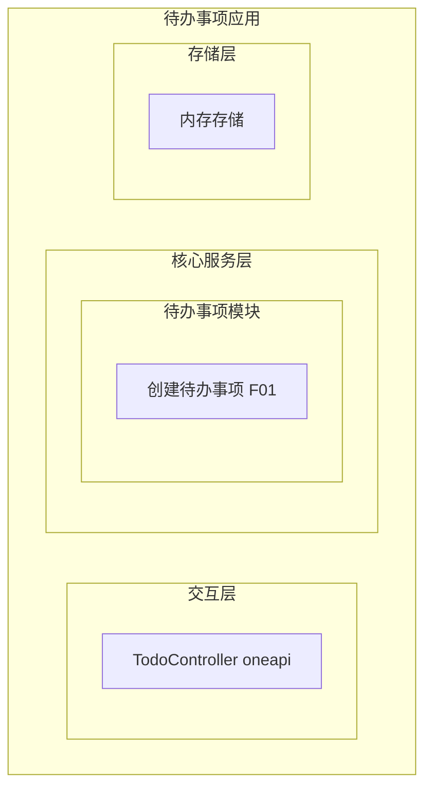
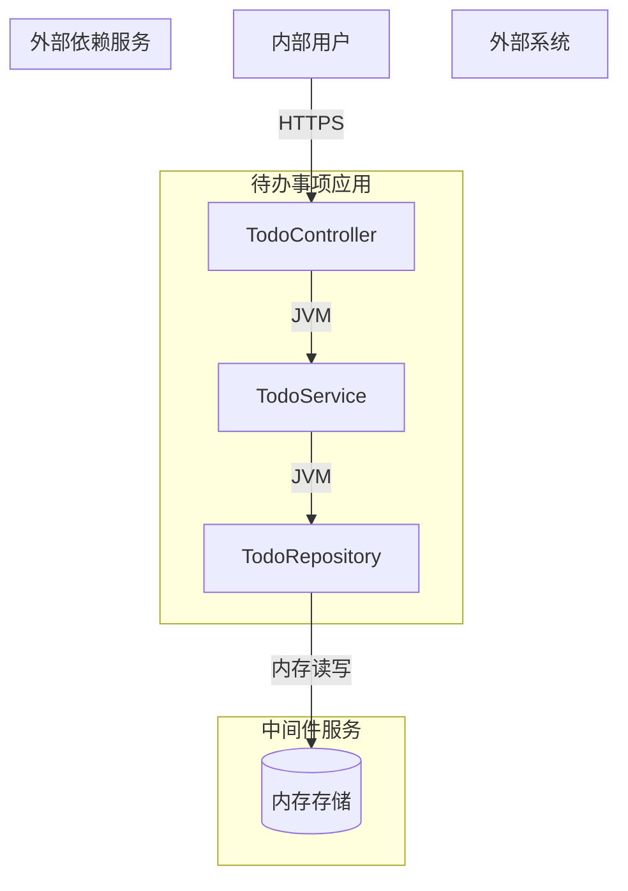
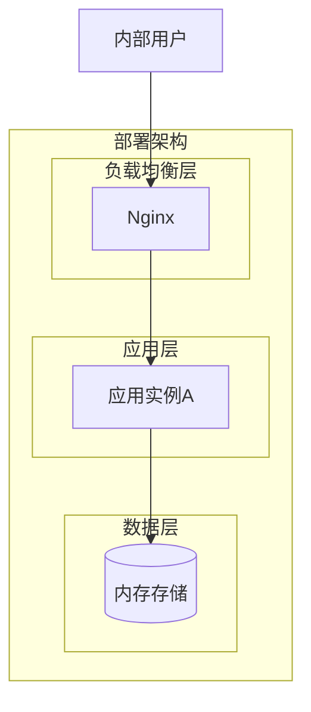
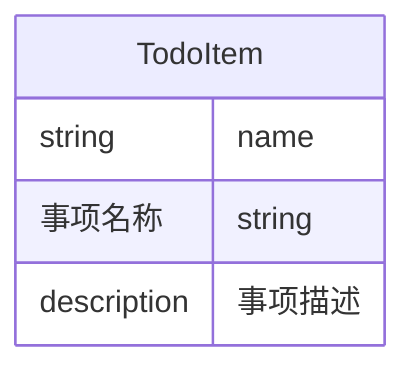
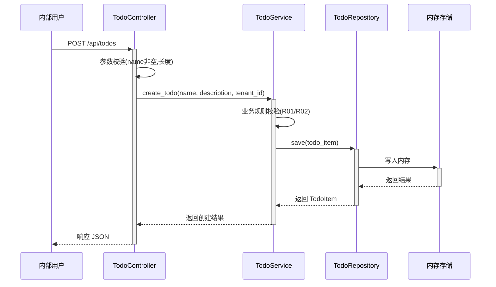

> **文档元信息**
>
> | 项目 | 内容 |
> |------|------|
> | 文档版本 | v1.0 |
> | 作者 | AiWork |
> | 创建日期 | 2026-09-09 |
> | 需求来源 | 任务描述：帮助用户记录日常待办事项，核心功能：新增待办事项 |
> | 评审状态 | 待评审 |


# 待办事项 系分设计

## 1. 需求与范围

### 背景与目标

**背景**：内部用户需要一种便捷的方式记录日常待办事项，以便跟踪工作进度和任务状态。当前仓库无现有的待办管理功能，需要从零构建最小闭环能力。

**目标**：实现待办事项的新增功能，使用户能够创建包含事项名称和描述的待办记录。

### 核心功能

- **新增待办事项**：用户可输入事项名称和描述，创建一个新的待办事项记录。

### 约束与非功能要求

- 最小闭环：仅实现创建功能，不包含编辑、删除、查询等后续操作。
- 目标用户：内部用户，无需对外暴露 OpenAPI。
- 交互方式：HTTP API（RESTful）。
- 数据持久化：使用轻量级存储（默认内存存储，后续可扩展至数据库）。

### 排除范围

- 待办事项列表查询
- 待办事项编辑/更新
- 待办事项删除
- 待办事项状态流转（如完成/取消）
- 用户认证与权限管理（内部用户，暂无 RBAC 需求）
- 通知与提醒

### 需求功能清单与优先级

| 编号 | 功能点 | 优先级 | PRD 原始描述/章节 | 备注 |
|------|--------|--------|-------------------|------|
| F01 | 新增待办事项 | P0 | 帮助用户记录日常待办事项，核心功能：新增待办事项，事项名称和描述 | 最小闭环唯一功能 |

### 假设与待确认项

| 编号 | 假设/待确认内容 | 当前假设 | 确认状态 |
|------|-----------------|----------|----------|
| A01 | 存储方式 | 使用内存存储（字典/List），无外部数据库 | 待确认 |
| A02 | 接口协议 | RESTful HTTP API，返回 JSON | 已确认 |
| A03 | 认证方式 | 内部用户，暂无认证要求 | 待确认 |
| A04 | 部署方式 | 单体部署，与现有 Python 项目结构一致 | 已确认 |
| A05 | 数据是否持久化 | 默认不持久化（内存），如需持久化则使用 SQLite | 待确认 |
| A06 | 待办事项 ID 生成方式 | 服务端自增整数 ID | 已确认 |

## 2. 架构与模块

### 功能架构



- **交互层说明**：提供 HTTP RESTful API 入口，接收用户请求并转发至核心服务层。
- **核心服务层说明**：待办事项模块，负责业务逻辑处理，包括参数校验、事项创建等。
- **存储层说明**：使用内存存储（字典结构），暂不引入外部数据库，适合内部用户最小闭环场景。

**模块清单**

| 模块 | 职责 | 依赖 |
|------|------|------|
| TodoController | 接收 HTTP 请求、参数校验、调用 Service 返回结果 | TodoService |
| TodoService | 待办事项业务逻辑处理（创建） | TodoRepository |
| TodoRepository | 数据持久化操作（内存存储） | 无 |

### 应用集成架构



**集成关系说明：**

| 调用方 | 被调用方 | 协议 | 接口类型 | 说明 |
|--------|----------|------|----------|------|
| 内部用户 | TodoController | HTTPS | oneapi REST | 用户通过 HTTP API 创建待办事项 |
| TodoController | TodoService | JVM | 内部调用 | 参数校验后调用业务逻辑 |
| TodoService | TodoRepository | JVM | 内部调用 | 委托数据持久化 |
| TodoRepository | 内存存储 | 内存 | 直接访问 | 使用字典结构存储待办事项 |

### 部署架构



**部署说明：**
- **负载均衡层**：Nginx 反向代理，内部用户访问入口。
- **应用层**：单实例部署（内部用户规模较小），后续可横向扩展。
- **数据层**：内存存储，无外部数据库依赖；数据随应用重启丢失（最小闭环场景可接受）。

## 3. 数据模型与存储

### 实体清单

| 实体名称 | 实体说明 | 所属模块 | 与其他实体的关系 |
|----------|----------|----------|-----------------|
| TodoItem | 待办事项记录，包含名称和描述 | 待办事项模块 | 无关联实体 |

### 实体关系图



### 模型说明

- 本系统仅包含一个实体 `TodoItem`，用于存储待办事项记录。
- 实体无关联其他实体（最小闭环，仅创建功能）。
- 存储方式：内存存储（字典结构），key 为自增 ID，value 为 TodoItem 对象。
- 租户隔离：采用 tenant_id 字段（默认值 `default`），支持后续多租户扩展。
- 命名规范遵循 db.md：表名小写、下划线分隔；字段名小写、下划线分隔。

## 4. 接口设计

### 4.1 oneapi（Web 控制台接口）

| 编号 | 接口名称 | 方法 | 路径 | 模块 |
|------|----------|------|------|------|
| W01 | 新增待办事项 | POST | /api/todos | 待办事项模块 |

### 4.2 OpenAPI（对外接口）

| 编号 | 接口名称 | 方法 | 路径 | 模块 |
|------|----------|------|------|------|
| O01 | 新增待办事项 | POST | /openapi/todos | 待办事项模块 |

### 4.3 内部接口（Service 层）

| 编号 | 接口名称 | 类 | 方法签名 |
|------|----------|------|----------|
| S01 | 创建待办事项 | TodoService | create_todo(name: str, description: str, tenant_id: str = "default") -> dict |

### 4.4 集成接口（Integration 层）

| 编号 | 接口名称 | 类 | 方法签名 | 说明 |
|------|----------|------|----------|------|
| I01 | 无 | - | - | 本模块无外部集成接口 |

## 全局约定

- **错误码格式**：{MODULE}_{SEQ}，如 TODO_001
- **通用出参结构**：{code, msg, data}
  - code: 字符串，错误码/成功码
  - msg: 字符串，提示信息
  - data: 对象，业务数据
- **模块映射表**：
  | 模块名 | 模块代码前缀 |
  |--------|-------------|
  | 待办事项模块 | TODO |

## 5. 功能模块设计

### 5.1 待办事项模块

#### 5.1.1 表结构设计

##### 5.1.1.1 todo_item

| 字段名 | 数据类型 | 约束 | 默认值 | 说明 |
|--------|----------|------|--------|------|
| id | bigint | PK, 自增 | - | 系统自增主键 |
| name | varchar(100) | NOT NULL | - | 事项名称 |
| description | varchar(500) | NULL | - | 事项描述 |
| tenant_id | varchar(50) | NOT NULL | default | 租户ID |
| gmt_create | datetime | NOT NULL | CURRENT_TIMESTAMP | 创建时间 |
| gmt_modified | datetime | NOT NULL | CURRENT_TIMESTAMP | 修改时间 |

**索引：**
- PK: `pk_todo_item` (id)

##### 5.1.1.2 枚举与常量定义

本模块无枚举/常量定义。

#### 5.1.2 接口详细设计

##### W01 新增待办事项

- **URI**: POST /api/todos
- **描述**: 创建一个新的待办事项记录
- **入参**:

| 参数名称 | 类型 | 是否必填 | 描述 |
|----------|------|----------|------|
| name | string | 是 | 事项名称，最大100字符 |
| description | string | 否 | 事项描述，最大500字符 |
| tenant_id | string | 否 | 租户ID，默认 "default" |

- **出参**:

| 参数名称 | 类型 | 描述 |
|----------|------|------|
| code | string | 结果码 |
| msg | string | 提示信息 |
| data | object | 业务数据，包含创建的待办事项ID |

- **错误码**:

| 错误码 | 说明 |
|--------|------|
| TODO_001 | 事项名称不能为空 |
| TODO_002 | 事项名称长度不能超过100字符 |
| TODO_003 | 事项描述长度不能超过500字符 |

- **业务规则**:
  - name 字段为必填项，不能为空字符串。
  - name 最大长度 100 字符。
  - description 最大长度 500 字符，可为空。
  - tenant_id 默认值为 "default"。

- **请求示例**:
```json
{
  "name": "完成日报",
  "description": "编写并提交每日工作日报"
}
```

- **响应示例**:
```json
{
  "code": "TODO_000",
  "msg": "SUCCESS",
  "data": {
    "id": 1,
    "name": "完成日报",
    "description": "编写并提交每日工作日报"
  }
}
```

#### 5.1.3 子功能详细设计

##### 5.1.3.1 创建待办事项（F01）

- 处理时序图


**业务规则：**

| 规则编号 | 规则描述 | 校验时机 | 不满足时的处理 |
|----------|----------|----------|----------------|
| R01 | 事项名称不能为空 | 创建时 | 返回 TODO_001，提示"事项名称不能为空" |
| R02 | 事项名称长度不超过100字符 | 创建时 | 返回 TODO_002，提示"事项名称长度不能超过100字符" |
| R03 | 事项描述长度不超过500字符 | 创建时 | 返回 TODO_003，提示"事项描述长度不能超过500字符" |

**异常场景：**

| 异常场景 | 处理方式 |
|----------|----------|
| name 参数缺失 | 返回 TODO_001，提示"事项名称不能为空" |
| name 超过最大长度 | 返回 TODO_002，提示"事项名称长度不能超过100字符" |
| description 超过最大长度 | 返回 TODO_003，提示"事项描述长度不能超过500字符" |
| 内存存储写入失败 | 返回系统错误，提示"系统异常，请稍后重试" |

**并发控制：**
- 并发场景：同一时刻多个请求创建待办事项。
- 控制策略：内存存储使用线程安全字典 + 自增 ID 锁，无并发冲突风险。

**状态机设计：**
本模块实体不含状态字段，无需状态机图。

## 6. 非功能性需求设计

### 6.1 高可用性

- 应用以单实例部署，内部用户规模较小，单实例即可满足需求。
- 内存存储无外部依赖，应用重启后数据丢失（最小闭环场景可接受）。
- 不涉及第三方服务依赖，无外部服务异常降级需求。
- 本项不适用原因：当前为内部用户最小闭环，无高可用要求。

### 6.2 可扩展性

- 水平扩展：应用无状态，可横向扩展多个实例，通过 Nginx 负载均衡。
- 存储扩展：内存存储可替换为 Redis 或数据库，接口层无需变更。
- 插件式依赖：存储层与业务逻辑解耦，便于后续替换为持久化存储。

### 6.3 稳定性/可靠性

- 内存存储无网络抖动风险，数据访问延迟极低。
- 无外部依赖，系统运行稳定可靠。
- 边界场景：内存不足时应用可能崩溃，需监控内存使用。

### 6.4 安全性设计

#### 6.4.1 账户系统方案

- 本模块为内部工具，暂无独立的账户体系，复用现有内部用户体系。
- 本项不适用原因：最小闭环，无独立认证需求。

#### 6.4.2 授权&访问控制

##### 6.4.2.1 是否实现水平权限检查

- 不涉及数据库查询的公共数据操作，无需水平权限检查。
- 本项不适用原因：待办事项为个人创建，无跨用户数据隔离需求。

##### 6.4.2.2 是否实现垂直权限检查

- 内部用户统一访问，无需角色区分。
- 本项不适用原因：最小闭环，无权限分级需求。

##### 6.4.2.3 是否检查登录态

- 内部用户场景，暂无登录态校验需求。
- 本项不适用原因：最小闭环，暂无认证要求。

#### 6.4.3 数据防护方案

##### 6.4.3.1 是否对敏感数据加密存储

- 待办事项名称和描述不包含敏感数据（身份证、银行卡等），无需加密存储。
- 本项不适用原因：数据内容为日常待办信息，不涉及敏感信息。

##### 6.4.3.2 是否对敏感数据展示进行脱敏

- 无敏感数据展示场景，无需脱敏。
- 本项不适用原因：数据内容非敏感。

### 6.5 监控/统计/日志/告警

- 服务埋点：记录接口调用次数、处理耗时。
- 关键监控点：API 响应时间、内存使用量、请求成功率。
- 告警：内存使用超阈值时告警。

## 7. 变更三板斧

### 7.1 可监控

- 服务埋点：在 TodoController 入口埋点，记录调用服务、处理结果、处理耗时。
- 监控指标：API 调用次数、响应时间 P50/P95/P99、错误率、内存使用量。
- 告警规则：内存使用超 80% 时触发告警；API 错误率超 5% 时触发告警。

### 7.2 可灰度

- 本模块为内部用户最小闭环功能，用户规模小，无需灰度发布。
- 原因：功能简单、仅创建操作、无状态变更影响面，灰度无实际收益。

### 7.3 可应急

- 关键功能开关：内存存储开关，支持切回至持久化存储（如 SQLite）。
- 发布包回滚：保留上一版本发布包，支持快速回滚。
- 回滚注意事项：回滚时需关注内存中数据丢失风险，建议在低峰期执行回滚。

