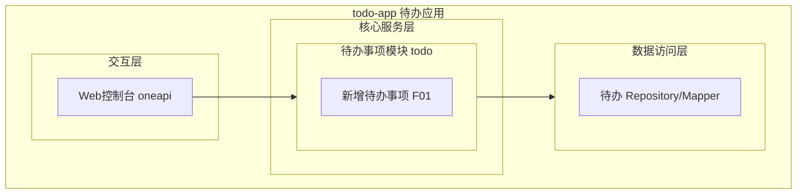
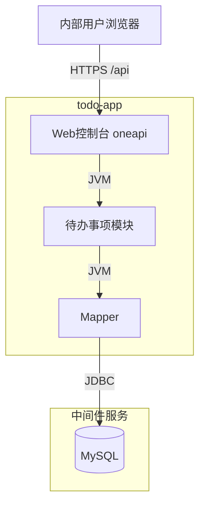
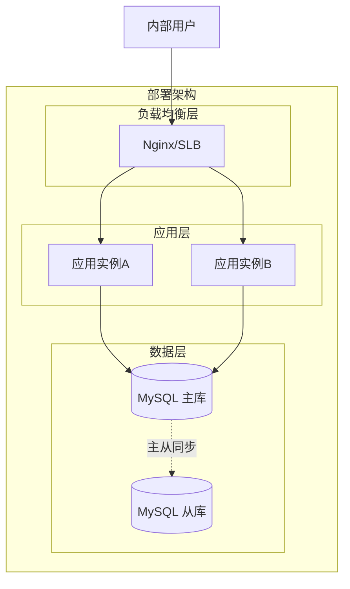
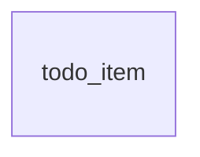
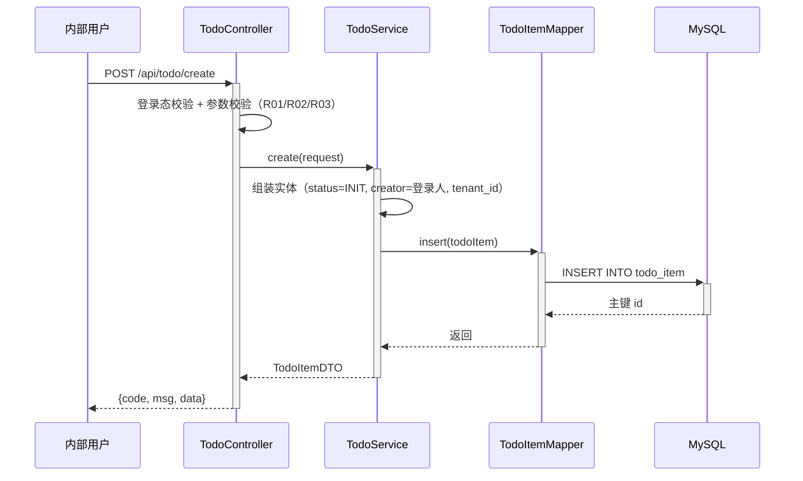
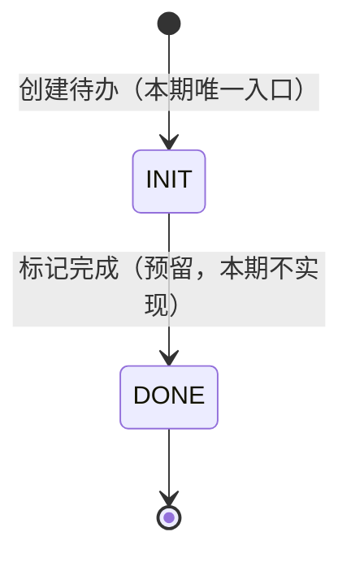

> **文档元信息**
>
> | 项目 | 内容 |
> |------|------|
> | 文档版本 | v1.0 |
> | 作者 | AiWork 系分设计 |
> | 创建日期 | 2026-09-09 |
> | 需求来源 | 任务需求描述（帮助用户记录日常待办事项-新增待办） |
> | 评审状态 | 待评审 |

# 待办事项（新增待办） 系分设计

## 1. 需求与范围

### 背景与目标
帮助内部用户记录日常待办事项，提供"新增待办事项"能力，将事项名称和描述持久化保存，形成最小可用的待办记录闭环（仅创建）。

### 核心功能
- 新增待办事项：用户提交事项名称与描述，系统校验后保存，并返回创建结果（含待办 ID、创建时间）。

### 约束与非功能要求
- 目标用户为内部用户，通过 Web 控制台页面使用，接口走 oneapi。
- 单实例内部工具量级即可，预留横向扩展能力。
- 接口统一返回 `{code, msg, data}` 结构；错误码格式 `TODO_{SEQ}`。

### 排除范围
- 待办事项的查询/列表/编辑/删除/完成状态流转（本期仅创建）。
- 提醒、通知、到期时间、优先级、标签、附件等扩展属性。
- 对外开放 OpenAPI（仅内部使用）。

### 需求功能清单与优先级

| 编号 | 功能点 | 优先级 | PRD 原始描述/章节 | 备注 |
|------|--------|--------|-------------------|------|
| F01 | 新增待办事项 | P0 | 核心功能：新增待办事项；任务信息：事项名称和描述 | 最小闭环 |

### 假设与待确认项

| 编号 | 假设/待确认内容 | 当前假设 | 确认状态 |
|------|-----------------|----------|----------|
| A01 | 是否需要登录态与用户标识 | 假设：内部系统已有统一登录，创建时记录 creator（创建人工号），无登录态时拒绝创建 | 待确认 |
| A02 | 是否需要租户隔离 | 假设：预留 tenant_id 字段，默认单租户 default | 待确认 |
| A03 | 事项名称/描述长度限制 | 假设：name 必填 ≤64 字符，description 选填 ≤512 字符 | 待确认 |
| A04 | 待办初始状态 | 假设：实体含 status 字段，创建后固定为 INIT（待处理），为未来状态流转预留 | 待确认 |
| A05 | 技术栈 | 假设：Java + Spring Boot + MyBatis + MySQL（dtazziboot 惯例）；仅作设计描述，不产出代码 | 待确认 |

## 2. 架构与模块

### 功能架构


- 交互层说明：oneapi 控制器，接收前端创建请求，做基础参数校验。
- 核心服务层说明：待办事项模块（todo）承载业务规则校验与创建编排。
- 数据访问层说明：Mapper/Repository 负责 todo_item 表的落库。

**模块清单**

| 模块 | 职责 | 依赖 |
|------|------|------|
| todo（待办事项模块） | 待办事项的创建与持久化、业务规则校验 | MySQL（todo_item 表）、登录上下文（creator） |

### 应用集成架构


**集成关系说明：**

| 调用方 | 被调用方 | 协议 | 接口类型 | 说明 |
|--------|----------|------|----------|------|
| 内部用户浏览器 | Web 控制台 | HTTPS | oneapi REST | 提交新增待办请求 |
| Web 控制台 | 待办事项模块 | JVM 内调用 | Service | 业务编排 |
| 待办事项模块 | MySQL | JDBC | SQL | 写入 todo_item |

无外部系统集成。

### 部署架构


**部署说明：**
- **负载均衡层**：Nginx/SLB，无单点。
- **应用层**：默认 2 实例无状态部署，可横向扩容；内部小流量场景亦可先单实例起步（假设：初期内部试用规模小）。
- **数据层**：MySQL 主从，应用只写主库。

## 3. 数据模型与存储

### 实体清单

| 实体名称 | 实体说明 | 所属模块 | 与其他实体的关系 |
|----------|----------|----------|-----------------|
| todo_item | 待办事项记录，包含名称、描述、状态、创建人 | todo | 无关联实体（单表） |

### 实体关系图


**模型说明：**
- 单实体无关联关系；字段级定义见 5.1。
- 无缓存/MQ：创建链路短、内部低并发，直接读写 MySQL。

## 4. 接口设计

### 4.1 oneapi（Web 控制台接口）

| 编号 | 接口名称 | 方法 | 路径 | 模块 |
|------|----------|------|------|------|
| W01 | 新增待办事项 | POST | /api/todo/create | todo |

### 4.2 OpenAPI（对外接口）
本项不适用，原因：目标用户为内部用户，仅 Web 控制台使用，本期不对外开放接口。

### 4.3 内部接口（Service 层）

| 编号 | 接口名称 | 类 | 方法签名 |
|------|----------|------|----------|
| S01 | 创建待办事项 | TodoService | TodoItemDTO create(TodoCreateRequest request) |

### 4.4 集成接口（Integration 层）
本项不适用，原因：无外部系统依赖。

## 5. 功能模块设计

**全局约定：**
- 通用出参结构：`{code, msg, data}`，成功 code=`OK`。
- 错误码格式：`TODO_{SEQ}`。
- 登录上下文：从统一登录拦截器获取当前用户工号作为 creator；未登录返回 `TODO_002`。

### 5.1 待办事项模块（todo）

#### 5.1.1 表结构设计
##### 5.1.1.1 todo_item（待办事项表）

| 字段名 | 数据类型 | 约束 | 默认值 | 说明 |
|--------|----------|------|--------|------|
| id | bigint | PK, 自增, NOT NULL | - | 系统自增主键 |
| tenant_id | varchar(32) | NOT NULL | 'default' | 租户标识，预留多租户隔离 |
| name | varchar(64) | NOT NULL | '' | 事项名称 |
| description | varchar(512) | NOT NULL | '' | 事项描述，可为空串 |
| status | varchar(16) | NOT NULL | 'INIT' | 待办状态，见枚举定义 |
| creator | varchar(64) | NOT NULL | '' | 创建人工号 |
| is_deleted | tinyint | NOT NULL | 0 | 逻辑删除标记：0 否 1 是（预留） |
| gmt_create | datetime | NOT NULL | CURRENT_TIMESTAMP | 创建时间 |
| gmt_modified | datetime | NOT NULL | CURRENT_TIMESTAMP | 修改时间 |

**索引：**
- PK: `pk_todo_item` (id)
- IDX: `idx_todo_item_tenant_creator` (tenant_id, creator) —— 预留给后续"我的待办列表"查询

说明：表名/字段名小写下划线、长度均小于 26 字符；无保留字；无 timestamp/float/enum 类型；主键为整型单列自增，符合数据库设计规范。

##### 5.1.1.x 枚举与常量定义

| 枚举名称 | 取值 | 含义 | 关联字段 |
|----------|------|------|----------|
| TodoStatus | INIT | 待处理（创建后初始状态） | todo_item.status |
| TodoStatus | DONE | 已完成（预留，本期无流转入口） | todo_item.status |
| IsDeleted | 0 / 1 | 未删除 / 已删除 | todo_item.is_deleted |
| 常量 | NAME_MAX_LEN=64 | 名称最大长度 | 入参校验 |
| 常量 | DESC_MAX_LEN=512 | 描述最大长度 | 入参校验 |

#### 5.1.2 接口详细设计
##### W01 新增待办事项

- **URI**: POST /api/todo/create
- **描述**: 创建一条待办事项记录，返回创建结果。
- **入参**:

| 参数名称 | 类型 | 是否必填 | 描述 |
|----------|------|----------|------|
| name | String | 是 | 事项名称，去除首尾空白后非空，长度 ≤64 |
| description | String | 否 | 事项描述，长度 ≤512，缺省为空串 |

- **出参**:

| 参数名称 | 类型 | 描述 |
|----------|------|------|
| code | String | 结果 code，成功为 OK |
| msg | String | 提示信息 |
| data | Object | 业务数据 |
| data.id | Long | 待办事项 ID |
| data.name | String | 事项名称 |
| data.description | String | 事项描述 |
| data.status | String | 状态，固定 INIT |
| data.creator | String | 创建人工号 |
| data.gmtCreate | String | 创建时间（yyyy-MM-dd HH:mm:ss） |

- **错误码**:

| 错误码 | 说明 |
|--------|------|
| TODO_001 | 参数校验失败（name 为空/超长，description 超长） |
| TODO_002 | 未登录或登录态失效 |
| TODO_003 | 系统异常（数据库写入失败等） |

- **业务规则**: name 为必填核心字段；创建后状态固定 INIT；creator 取自登录上下文，不接受前端传参。

- **请求示例**:
```json
{
  "name": "准备周报",
  "description": "整理本周项目进展与风险点"
}
```

- **响应示例**:
```json
{
  "code": "OK",
  "msg": "SUCCESS",
  "data": {
    "id": 1001,
    "name": "准备周报",
    "description": "整理本周项目进展与风险点",
    "status": "INIT",
    "creator": "zhangsan",
    "gmtCreate": "2026-09-09 12:00:00"
  }
}
```

#### 5.1.3 子功能详细设计
##### 5.1.3.1 新增待办事项（F01）

- 处理时序图


**业务规则：**

| 规则编号 | 规则描述 | 校验时机 | 不满足时的处理 |
|----------|----------|----------|--------------|
| R01 | name 去除首尾空白后非空且 ≤64 字符 | 创建时 | 返回 TODO_001，提示"事项名称必填且不超过64字" |
| R02 | description ≤512 字符，缺省按空串处理 | 创建时 | 返回 TODO_001，提示"事项描述不超过512字" |
| R03 | 必须处于登录态，creator 取登录人工号 | 创建时 | 返回 TODO_002，提示"请先登录" |
| R04 | 创建后 status 固定 INIT，is_deleted=0 | 创建时 | 系统默认赋值，无需用户感知 |

**异常场景：**

| 异常场景 | 处理方式 |
|----------|----------|
| 数据库写入失败（连接异常/超时） | 事务回滚（单条插入天然原子），返回 TODO_003 并记录错误日志与监控埋点 |
| 重复提交（用户双击/重试） | 依赖前端按钮防重 + 后端不做幂等去重（假设：允许同名待办存在，名称不做唯一约束） |
| 入参 JSON 格式非法 | 框架层统一拦截，返回 TODO_001 |

**并发控制：**
- 并发场景：同一用户可能同时提交多条待办；不同待办之间无共享数据竞争。
- 控制策略：无并发风险，原因：创建为纯 INSERT 操作，各自生成独立主键，无读改写冲突；无需加锁。

**状态机设计（实体含 status 字段）：**


**状态流转规则：**

| 当前状态 | 目标状态 | 流转条件 | 前置校验 | 触发动作 |
|----------|----------|----------|----------|----------|
| （无） | INIT | 新增待办成功 | R01~R03 | 写入 todo_item |
| INIT | DONE | 用户标记完成（预留） | 存在且未删除 | 更新 status、gmt_modified |

**模块自检：**
- 完备性对账：F01 → W01/S01/todo_item 表全覆盖，无遗漏。
- 过度设计检查：未引入缓存/MQ/分布式锁/分表，与"仅创建"最小闭环匹配；is_deleted、DONE 状态为低成本预留，保留。

## 6. 非功能性需求设计

### 6.1 高可用性
应用双实例 + Nginx/SLB，单实例故障不影响创建链路；无第三方依赖，MySQL 主库故障时创建功能不可用，依赖 DBA 主从切换兜底，应用侧不做降级写入（防止数据不一致）。

### 6.2 可扩展性
应用无状态，支持水平扩容；todo_item 数据量按内部用户规模预估两年内远低于 500w，单表即可；后续扩展编辑/完成/列表功能时，模块内新增接口即可，表结构已预留 status/is_deleted。

### 6.3 稳定性/可靠性
创建接口为单次 INSERT，耗时 <50ms；数据库异常统一捕获返回 TODO_003，避免 5xx 裸奔；通过应用侧限流（如单机 QPS 阈值）防止恶意刷接口。

### 6.4 安全性设计
#### 6.4.1 账户系统方案
假设：复用内部统一登录体系（办公网 SSO），不自实现登录/注册。

#### 6.4.2 授权&访问控制
##### 6.4.2.1 是否实现水平权限检查
本期仅创建接口，创建时 creator 强制取登录上下文而非入参，天然避免越权伪造他人数据；后续查询/编辑接口需按 creator + tenant_id 做水平权限校验。
##### 6.4.2.2 是否实现垂直权限检查
不涉及角色差异，所有登录内部用户均可创建待办。
##### 6.4.2.3 是否检查登录态
全局统一拦截器检查登录态，/api/todo/create 不在白名单内。

#### 6.4.3 数据防护方案
##### 6.4.3.1 是否对敏感数据加密存储
待办名称/描述为用户自述文本，可能包含敏感信息；暂按非敏感数据处理不加密（假设：内部工具，用户自行避免填写机密信息），日志中不打印 description 全文。
##### 6.4.3.2 是否对敏感数据展示进行脱敏
不涉及展示页面（本期无查询）；日志打印 creator 不做脱敏（内部工号）。

SQL 注入防护：MyBatis 参数化预编译，禁止拼接 SQL。

### 6.5 监控/统计/日志/告警
- 监控点：/api/todo/create 的 QPS、成功率、耗时（P99）；数据库写入失败计数。
- 告警点：创建成功率 5 分钟低于 99% 触发告警；DB 异常连续出现触发告警。

## 7. 变更三板斧

### 7.1 可监控
- 服务埋点：记录接口入参摘要（name 长度、是否有 description）、处理结果（code）、处理耗时。
- 存储埋点：INSERT 执行耗时与结果。
- 关键日志：创建成功打 INFO（id、creator），失败打 ERROR（错误码、堆栈），均不打印 description 全文。

### 7.2 可灰度
本期为全新功能、全新表，无旧逻辑可比对；按租户尾号灰度不适用（默认单租户）。灰度策略：通过内部用户白名单/分批通知放开使用即可，发布本身即灰度（功能新增，不影响存量功能）。

### 7.3 可应急
- 开关：提供功能开关（如配置中心 todo.create.enabled），异常时一键关闭创建入口，接口直接返回降级提示，无需回滚发布包。
- 回滚兜底：如需回滚，直接回滚应用版本即可；todo_item 为新增表，回滚后表保留不影响旧版本运行，无上下游兼容性问题。

---

## 附：方案检查（19 项 checklist）

| # | 检查项 | 结论 | 说明 |
|---|--------|------|------|
| 1 | 模块划分合理性 | 通过 | 单一 todo 模块，单一职责，无循环依赖 |
| 2 | 依赖关系合理性 | 通过 | 仅依赖 MySQL；DB 故障时功能不可用但不符合预期的降级写入会造成不一致，选择快速失败 |
| 3 | 单点问题（部署） | 通过 | 双实例 + SLB + MySQL 主从，无单点（初期允许单实例起步的假设已标注） |
| 4 | 表模型范式 | 通过 | 满足第三范式，无冗余字段 |
| 5 | 隐私安全检查 | 通过 | 出参不含敏感字段；description 日志不全文打印 |
| 6 | 兼容性（接口） | 不适用 | 全新接口，无旧调用方 |
| 7 | 兼容性（表） | 不适用 | 全新表，回滚不影响旧版本 |
| 8 | 数据迁移 | 通过 | 全新表，无历史数据迁移；无需初始化数据 |
| 9 | 一致性（功能点） | 通过 | F01 在 5.1.3.1 有完整设计 |
| 10 | 一致性（表） | 通过 | todo_item 在 5.1.1.1 有完整字段定义 |
| 11 | 一致性（接口） | 通过 | W01、S01 在 5.1.2 有详细定义 |
| 12 | 一致性（枚举） | 通过 | TodoStatus/IsDeleted 与表字段说明一致 |
| 13 | 状态机完整性 | 通过 | INIT/DONE 状态机完整，无孤岛状态；DONE 流转标注为预留 |
| 14 | 并发风险 | 通过 | 纯 INSERT 无读改写竞争；对比方案（分布式锁/唯一索引去重）评估为过度设计，推荐无锁方案 |
| 15 | 单点问题（定时任务） | 不适用 | 本期无定时任务 |
| 16 | 非功能设计可行性 | 通过 | 限流、监控、告警均为常规手段，可落地 |
| 17 | 三板斧-可监控 | 通过 | 埋点点位明确，基于常规 metrics/日志框架可实现 |
| 18 | 三板斧-可灰度 | 通过 | 全新功能发布即灰度；对比租户尾号灰度方案，单租户场景下推荐白名单分批放开 |
| 19 | 三板斧-可应急 | 通过 | 配置开关秒级关闭入口，优先于回滚；回滚无上下游兼容问题 |
