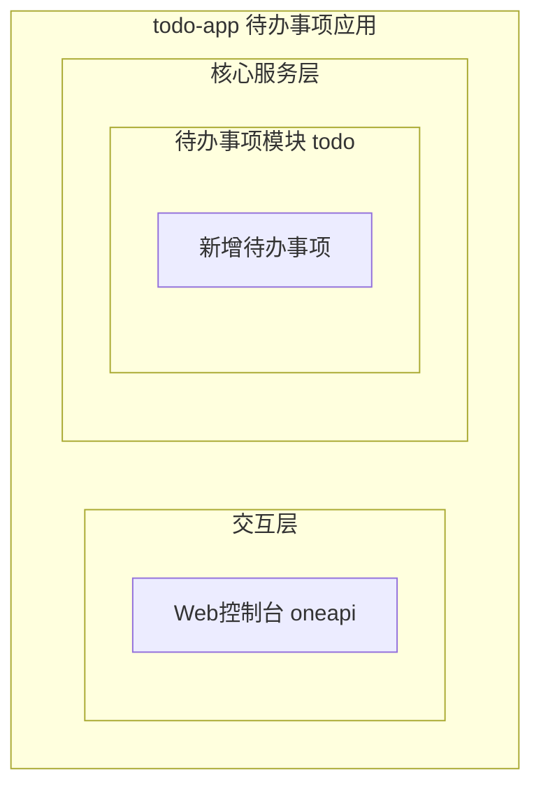
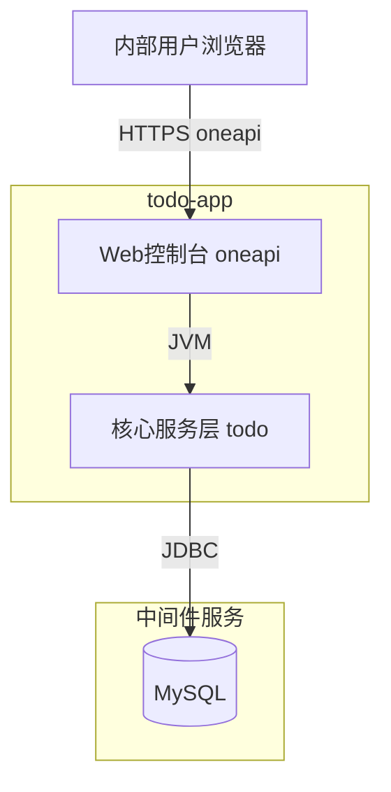
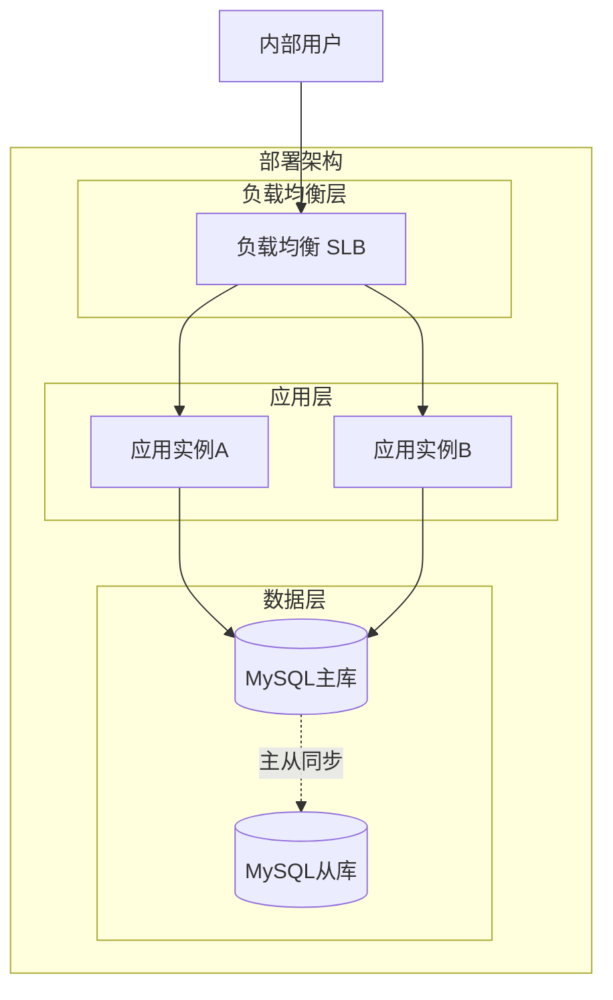
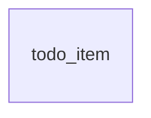
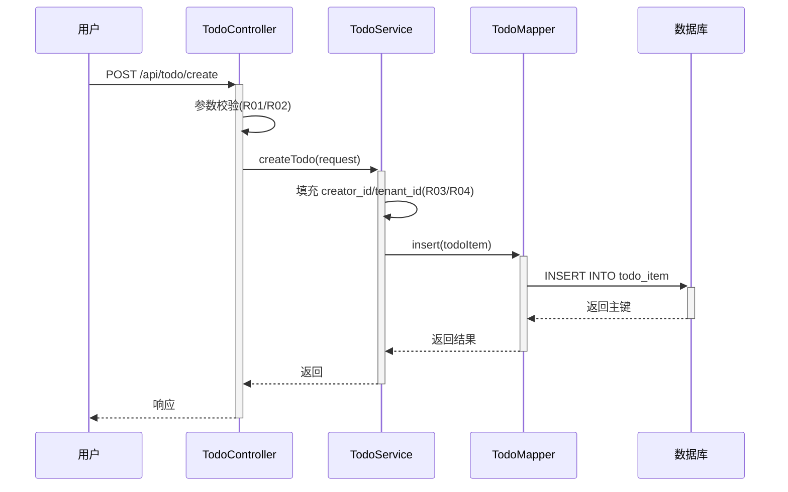
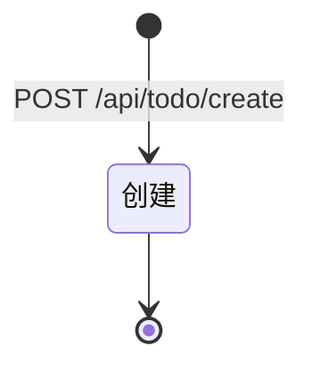

> **文档元信息**
>
> | 项目 | 内容 |
> |------|------|
> | 文档版本 | v1.0 |
> | 作者 | AiWork |
> | 创建日期 | 2026-09-09 |
> | 需求来源 | 任务输入：帮助用户记录日常待办事项 |
> | 评审状态 | 待评审 |

# 待办事项（todo）系分设计

## 1. 需求与范围

### 背景与目标
帮助内部用户记录日常待办事项，本期交付最小闭环：新增待办事项（事项名称 + 描述）。

### 核心功能
- F01 新增待办事项：用户提交事项名称与描述，系统持久化并返回创建结果。

### 约束与非功能要求
- 目标用户：内部用户（经内部统一登录态访问）。
- 数据需按租户/创建人隔离。
- 接口参数校验与 SQL 注入防护为基本要求。

### 排除范围
- 待办事项查询/列表、编辑、完成、删除、提醒通知均不在本期范围（后续迭代）。
- 对外 OpenAPI 不在本期范围。

### 需求功能清单与优先级
| 编号 | 功能点 | 优先级 | PRD 原始描述/章节 | 备注 |
|------|--------|--------|-------------------|------|
| F01 | 新增待办事项 | P0 | 「核心功能：新增待办事项」「任务信息：事项名称和描述」 | 最小闭环唯一功能 |

### 假设与待确认项
| 编号 | 假设/待确认内容 | 当前假设 | 确认状态 |
|------|-----------------|----------|----------|
| A01 | 技术栈未指定 | 采用 Java Spring Boot 单体 + MySQL | 待确认 |
| A02 | 内部用户身份来源 | 依赖内部统一登录态，创建人 ID 从登录上下文获取 | 待确认 |
| A03 | 是否需要事项状态 | 本期不引入状态字段，仅创建 | 待确认 |
| A04 | 名称/描述长度上限 | 名称 ≤128 字符，描述 ≤1024 字符 | 待确认 |
| A05 | board-knowledge-search | 环境中未注册该技能/工具，跳过检索 | 待确认 |

## 2. 架构与模块

### 功能架构


- 交互层说明：Web 控制台 oneapi，供内部用户通过浏览器访问。
- 核心服务层说明：待办事项模块（todo），职责为待办事项的创建、参数校验与持久化。
- 扩展/集成层说明：本期无扩展/集成层。

**模块清单**

| 模块 | 职责 | 依赖 |
|------|------|------|
| todo（待办事项模块） | 待办事项创建、参数校验、持久化 | MySQL |

### 应用集成架构


**集成关系说明：**

| 调用方 | 被调用方 | 协议 | 接口类型 | 说明 |
|--------|----------|------|----------|------|
| 内部用户浏览器 | todo-app Web控制台 | HTTPS | oneapi REST | 新增待办事项 |
| todo-app 核心服务层 | MySQL | JDBC | SQL | 待办事项持久化 |

### 部署架构


**部署说明：**
- **负载均衡层**：SLB 负载均衡
- **应用层**：双实例（同城双机房）无单点
- **数据层**：MySQL 主从，主库读写，从库容灾

## 3. 数据模型与存储

### 实体清单

| 实体名称 | 实体说明 | 所属模块 | 与其他实体的关系 |
|----------|----------|----------|-----------------|
| todo_item | 待办事项，记录事项名称与描述 | todo | 无（本期唯一实体） |

### 实体关系图


**模型说明：**
- 本期仅单一实体，无实体间关系。
- 无缓存/MQ。
- 租户隔离采用 tenant_id 字段。
- 命名遵循 db.md 规范：表名小写下划线、长度 <26、不使用复数。

## 4. 接口设计

### 4.1 oneapi（Web 控制台接口）
| 编号 | 接口名称 | 方法 | 路径 | 模块 |
|------|----------|------|------|------|
| W01 | 新增待办事项 | POST | /api/todo/create | todo |

### 4.2 OpenAPI（对外接口）
本期无对外接口。

### 4.3 内部接口（Service 层）
| 编号 | 接口名称 | 类 | 方法签名 |
|------|----------|------|----------|
| S01 | 新增待办事项 | TodoService | TodoCreateResult createTodo(TodoCreateRequest request) |

### 4.4 集成接口（Integration 层）
本期无外部系统集成接口。

## 5. 功能模块设计

### 全局约定
- 错误码格式：{MODULE}_{SEQ}，本系统模块码 TODO，如 TODO_001。
- 通用出参结构：{result, msg, data}（result=OK/FAIL，msg=提示信息，data=业务数据）。
- 模块映射表：todo → TODO。

### 5.1 待办事项模块（todo）

#### 5.1.1 表结构设计

##### 5.1.1.1 todo_item（待办事项表）

| 字段名 | 数据类型 | 约束 | 默认值 | 说明 |
|--------|----------|------|--------|------|
| id | bigint | PK, 自增 | - | 系统自增主键 |
| title | varchar(128) | NOT NULL | - | 事项名称 |
| description | varchar(1024) | NULL | NULL | 事项描述 |
| creator_id | varchar(64) | NOT NULL | - | 创建人 ID（来自登录上下文） |
| tenant_id | varchar(64) | NOT NULL | - | 租户 ID |
| gmt_create | datetime | NOT NULL | CURRENT_TIMESTAMP | 创建时间 |
| gmt_modified | datetime | NOT NULL | CURRENT_TIMESTAMP | 修改时间 |

**索引：**
- PK: `pk_todo_item` (id)
- IDX: `idx_todo_item_creator` (creator_id)
- IDX: `idx_todo_item_tenant` (tenant_id)

命名遵循 db.md：表名小写下划线、长度 <26、不使用复数；字段小写下划线；以字母开头；主键 pk_ 前缀；索引 idx_ 前缀。

#### 5.1.2 接口详细设计

##### W01 新增待办事项

- **URI**: POST /api/todo/create
- **描述**: 创建一条待办事项，记录名称与描述，返回创建结果。
- **入参**:

| 参数名称 | 类型 | 是否必填 | 描述 |
|----------|------|----------|------|
| title | String | 是 | 事项名称，最大 128 字符 |
| description | String | 否 | 事项描述，最大 1024 字符 |

- **出参**:

| 参数名称 | 类型 | 描述 |
|----------|------|------|
| result | String | 结果 code |
| msg | String | 提示信息 |
| data | Object | 业务数据 |

- **错误码**:

| 错误码 | 说明 |
|--------|------|
| TODO_001 | 标题不能为空 |
| TODO_002 | 标题长度超过 128 字符 |
| TODO_003 | 描述长度超过 1024 字符 |

- **业务规则**:
| 规则编号 | 规则描述 | 校验时机 | 不满足时的处理 |
|----------|----------|----------|----------------|
| R01 | title 不能为空且长度 ≤128 | 创建时 | 返回 TODO_001 或 TODO_002 |
| R02 | description 长度 ≤1024 | 创建时 | 返回 TODO_003 |
| R03 | creator_id 从登录上下文获取，不可为空 | 创建时 | 返回 TODO_001（未登录） |
| R04 | tenant_id 从登录上下文获取，不可为空 | 创建时 | 返回 TODO_001（未登录） |

- **请求示例**:
```json
{
  "title": "完成日报",
  "description": "编写并提交每日工作日报"
}
```

- **响应示例**:
```json
{
  "result": "OK",
  "msg": "SUCCESS",
  "data": {
    "id": 1,
    "title": "完成日报",
    "description": "编写并提交每日工作日报",
    "creatorId": "user_001",
    "tenantId": "tenant_a",
    "gmtCreate": "2026-09-09 10:00:00",
    "gmtModified": "2026-09-09 10:00:00"
  }
}
```

#### 5.1.3 子功能详细设计

##### 5.1.3.1 新增待办事项（F01）

**处理时序图**:


**业务规则**:
| 规则编号 | 规则描述 | 校验时机 | 不满足时的处理 |
|----------|----------|----------|----------------|
| R01 | title 不能为空且长度 ≤128 | 创建时 | 返回 TODO_001 或 TODO_002 |
| R02 | description 长度 ≤1024 | 创建时 | 返回 TODO_003 |
| R03 | creator_id 从登录上下文获取 | 创建时 | 返回 TODO_001 |
| R04 | tenant_id 从登录上下文获取 | 创建时 | 返回 TODO_001 |

**异常场景**:
| 异常场景 | 处理方式 |
|----------|----------|
| 数据库写入失败（连接异常/唯一约束冲突） | 返回 TODO_001，系统异常提示 |
| 参数校验失败 | 返回对应错误码及提示 |

**并发控制**:
- 并发场景：同一用户短时间内连续创建同名待办事项。
- 控制策略：无并发风险，原因：待办事项名称无需唯一约束，多条同名记录合法；写入操作为独立 INSERT，无冲突。

**状态机设计**:
本模块实体 todo_item 本期不包含状态字段，无需状态机图。


**状态流转规则**:
| 当前状态 | 目标状态 | 流转条件 | 前置校验 | 触发动作 |
|----------|----------|----------|----------|----------|
| - | 已创建 | 调用 POST /api/todo/create | 参数校验通过 | 写入数据库 |

#### 5.1.4 技术选型方案对比

| 方案 | 优势 | 劣势 |
|------|------|------|
| A. Java Spring Boot + MySQL + MyBatis | 分层规范成熟；db.md 规范契合；企业级生态完善 | 启动较慢、部署包较大 |
| B. Node.js + NestJS + MySQL | 启动快、开发效率高 | 内部工具系统无显著收益；团队 Java 惯例 |
| C. Python + FastAPI + MySQL | 开发快、轻量 | 内部工具系统无显著收益；团队 Java 惯例 |

**推荐方案**：A. Java Spring Boot + MySQL + MyBatis。理由：与 db.md 数据库规范天然契合；分层架构（Controller–Service–Repository）规范清晰；企业级内部工具首选。

#### 5.1.5 模块自检
- 完备性对账：F01 → W01/S01/todo_item 表结构 ✓；接口入参出参完整 ✓；错误码覆盖 ✓。
- 过度设计检查：无状态字段、无枚举、无外部集成，无多余设计 ✓。

## 6. 非功能性需求设计

### 6.1 高可用性
- 应用层双实例部署（同城双机房），单实例故障自动摘除。
- MySQL 主从架构，主库故障时从库可提升为新的主库。
- 应用无状态，支持快速扩容与故障转移。

### 6.2 可扩展性
- 应用层水平扩展：增加实例即可提升并发处理能力。
- 数据库层：单表数据量增长后可通过分库分表扩展（todo_item 表按 tenant_id 分片）。
- 模块设计独立，后续可拆分为独立服务。

### 6.3 稳定性/可靠性
- 参数校验在 Controller 层拦截无效请求，避免无效数据写入数据库。
- 数据库操作使用事务保证原子性。
- 异常场景均有错误码返回，不会导致系统不可用。

### 6.4 安全性设计

#### 6.4.1 账户系统方案
依赖内部统一登录态（antbuservice / IAM），不自行实现账号体系。

#### 6.4.2 授权 & 访问控制
- 水平权限检查：通过登录上下文获取 creator_id / tenant_id，创建时自动绑定。
- 垂直权限检查：内部系统白名单访问，无需额外角色控制。
- 是否检查登录态：是，所有 oneapi 接口统一拦截器校验登录态。

#### 6.4.3 数据防护方案
- 敏感数据加密存储：本期不涉及身份证、手机号等敏感数据，无需额外加密。
- 敏感数据展示脱敏：不适用（内部系统，数据量小）。
- 日志脱敏：creator_id / tenant_id 不在日志中明文输出。

### 6.5 监控/统计/日志/告警
- 服务埋点：记录接口调用次数、处理耗时、调用结果（成功/失败）。
- 关键监控点：POST /api/todo/create 的 QPS、响应时间、错误率。
- 日志：记录请求参数（脱敏后）、处理结果、异常堆栈。
- 告警：错误率超过阈值时触发告警。

## 7. 变更三板斧

### 7.1 可监控
- 服务埋点：在 TodoController 入口埋点，记录调用服务（todo/create）、处理结果（成功/失败）、处理耗时。
- 三方服务埋点：本系统无三方服务调用，无需额外埋点。
- 监控指标：QPS、平均响应时间、P99 响应时间、错误率（按错误码分类）。

### 7.2 可灰度
- 灰度策略：按租户尾号灰度引流（如 tenant_id 尾号 0-1 先放量 10%）。
- 灰度方式：通过配置中心动态调整灰度比例，无需发布新包。
- 本系统为内部工具系统，灰度范围小，优先全量发布。

### 7.3 可应急
- 开关控制：提供配置开关控制新增功能的可用性，关闭后请求直接返回降级提示。
- 出版包回滚：保留上一版本发布包，回滚时关注上下游兼容性（本期无上下游依赖，回滚无额外风险）。
- 应急优先级：开关 > 回滚兜底，简单快速。
