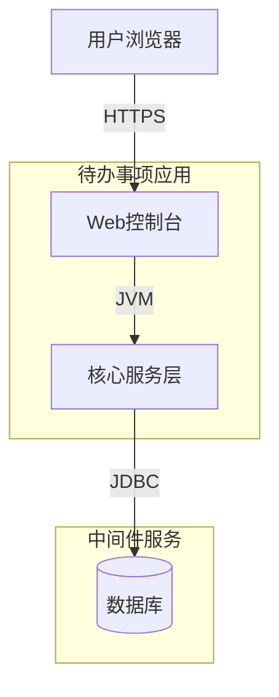
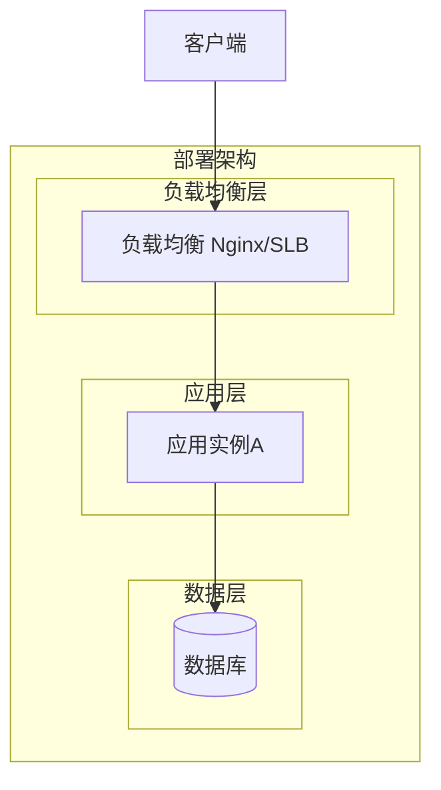
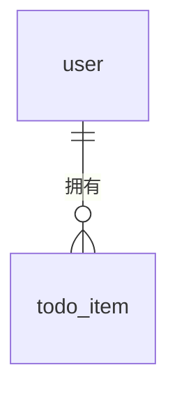
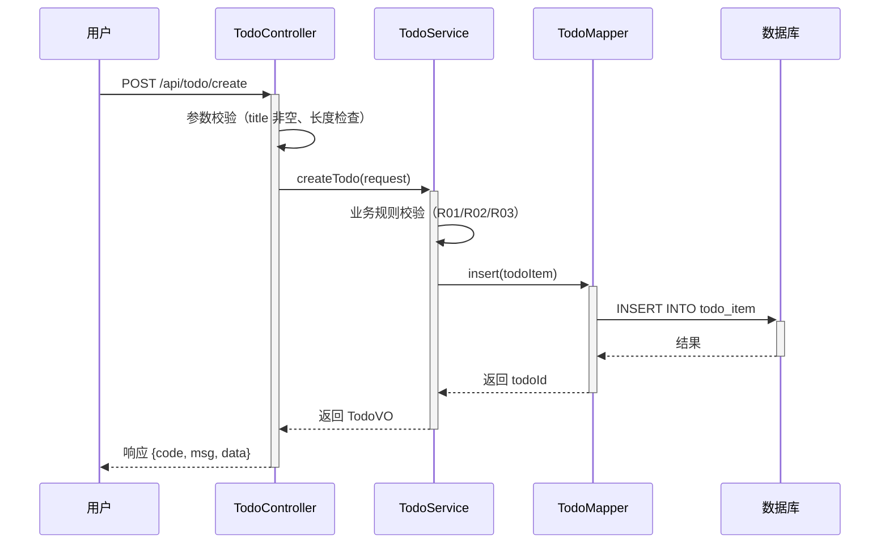

> **文档元信息**
>
> | 项目 | 内容 |
> |------|------|
> | 文档版本 | v1.0 |
> | 作者 | AiWork |
> | 创建日期 | 2026-09-09 |
> | 需求来源 | 用户需求：帮助用户记录日常待办事项 |
> | 评审状态 | 待评审 |

# 待办事项创建 系分设计

## 1. 需求与范围

### 背景与目标

帮助内部用户记录日常待办事项，提供最小闭环的待办事项创建能力。用户可以通过系统新增待办事项，填写事项名称和描述，实现日常任务的快速记录。

### 核心功能

1. **新增待办事项**：用户可创建一条新的待办事项，填写事项名称和描述。

### 约束与非功能要求

- 内部用户使用，无需公开暴露
- 最小闭环，仅支持创建操作
- 事项名称为必填字段
- 描述为可选字段

### 排除范围

- 待办事项列表查询
- 待办事项编辑/更新
- 待办事项删除
- 待办事项状态变更（如完成/未完成）
- 待办事项分类/标签
- 待办事项优先级
- 提醒/通知功能
- 批量操作

### 需求功能清单与优先级

| 编号 | 功能点 | 优先级 | PRD 原始描述/章节 | 备注 |
|------|--------|--------|-------------------|------|
| F01 | 新增待办事项 | P0 | 目标：帮助用户记录日常待办事项；核心功能：新增待办事项；任务信息：事项名称和描述 | 最小闭环，仅创建 |

### 假设与待确认项

| 编号 | 假设/待确认内容 | 当前假设 | 确认状态 |
|------|-----------------|----------|----------|
| A01 | 事项名称的最大长度 | 假设为 200 字符 | 待确认 |
| A02 | 描述的最大长度 | 假设为 2000 字符 | 待确认 |
| A03 | 是否需要唯一性约束（同名事项） | 假设允许同名事项存在 | 待确认 |
| A04 | 数据持久化方式 | 假设使用关系型数据库（MySQL） | 待确认 |
| A05 | 是否需要登录认证 | 假设内部系统默认需要登录 | 待确认 |

## 2. 架构与模块

### 功能架构

```mermaid
graph TB
    subgraph app[待办事项应用]
        subgraph interactionLayer[交互层]
            WebConsole[Web控制台 oneapi]
        end

        subgraph coreServiceLayer[核心服务层]
            subgraph todoModule[待办事项模块]
                CreateTodo[创建待办事项]
            end
        end
    end
end
```

- **交互层**：Web 控制台，通过 oneapi 提供 HTTP 接口
- **核心服务层**：待办事项模块，职责为接收创建请求、参数校验、业务规则处理、数据持久化
- **扩展/集成层**：本需求无外部系统集成

**模块清单**

| 模块 | 职责 | 依赖 |
|------|------|------|
| 待办事项模块 | 待办事项的创建、参数校验、数据持久化 | 无（独立模块） |

### 应用集成架构

本需求无外部系统集成，架构简化为单体应用内部调用。



**集成关系说明：**

| 调用方 | 被调用方 | 协议 | 接口类型 | 说明 |
|--------|----------|------|----------|------|
| 用户浏览器 | 应用 Web控制台 | HTTPS | oneapi REST | 用户通过浏览器访问待办事项创建页面 |
| 应用核心服务层 | 数据库 | JDBC | SQL | 待办事项数据持久化 |

### 部署架构



**部署说明：**
- **负载均衡层**：Nginx / SLB
- **应用层**：单实例部署（内部工具，流量低）
- **数据层**：MySQL 关系型数据库，主库单节点（内部系统，可后续扩展从库）

## 3. 数据模型与存储

### 实体清单

| 实体名称 | 实体说明 | 所属模块 | 与其他实体的关系 |
|----------|----------|----------|-----------------|
| todo_item | 待办事项，记录用户创建的任务条目 | 待办事项模块 | 一对多关联用户（todo_item.user_id → user.id） |
| user | 用户，使用系统的内部用户 | 用户模块 | 一对多关联待办事项（user.id ← todo_item.user_id） |

### 实体关系图



**模型说明：**
- 用户（user）为系统用户实体，每个待办事项归属于一个用户
- 待办事项（todo_item）包含事项名称和描述，通过 user_id 关联到用户
- 租户隔离：默认采用 tenant_id 字段（本需求为内部单租户，可省略 tenant_id）

## 4. 接口设计

### 4.1 oneapi（Web 控制台接口）

| 编号 | 接口名称 | 方法 | 路径 | 模块 |
|------|----------|------|------|------|
| W01 | 新增待办事项 | POST | /api/todo/create | 待办事项模块 |

### 4.2 OpenAPI（对外接口）

本需求为内部用户使用，不对外开放 OpenAPI 接口。

| 编号 | 接口名称 | 方法 | 路径 | 模块 |
|------|----------|------|------|------|
| — | — | — | — | 本项不适用 |

### 4.3 内部接口（Service 层）

| 编号 | 接口名称 | 类 | 方法签名 |
|------|----------|------|----------|
| S01 | 创建待办事项 | TodoService | createTodo(request: CreateTodoRequest): TodoVO |

### 4.4 集成接口（Integration 层）

本需求无外部系统集成。

| 编号 | 接口名称 | 类 | 方法签名 | 说明 |
|------|----------|------|----------|------|
| — | — | — | — | 本项不适用 |

## 5. 功能模块设计

### 5.1 待办事项模块

#### 5.1.1 表结构设计

##### 5.1.1.1 todo_item

| 字段名 | 数据类型 | 约束 | 默认值 | 说明 |
|--------|----------|------|--------|------|
| id | bigint | PK, 自增 | - | 系统自增主键 |
| title | varchar(200) | NOT NULL | - | 事项名称 |
| description | varchar(2000) | NULL | NULL | 事项描述 |
| user_id | bigint | NOT NULL | - | 创建用户ID |
| gmt_create | datetime | NOT NULL | CURRENT_TIMESTAMP | 创建时间 |
| gmt_modified | datetime | NOT NULL | CURRENT_TIMESTAMP | 修改时间 |

**索引：**
- PK: `pk_todo_item` (id)
- IDX: `idx_todo_item_user_id` (user_id)

#### 5.1.1 枚举与常量定义

本模块无枚举/常量定义。

#### 5.1.2 接口详细设计

##### W01 新增待办事项

- **URI**: POST /api/todo/create
- **描述**: 新增一条待办事项，包含事项名称和描述
- **入参**:

| 参数名称 | 类型 | 是否必填 | 描述 |
|----------|------|----------|------|
| title | String | 是 | 事项名称，最大200字符 |
| description | String | 否 | 事项描述，最大2000字符 |

- **出参**:

| 参数名称 | 类型 | 描述 |
|----------|------|------|
| code | String | 结果码 |
| msg | String | 提示信息 |
| data | Object | 业务数据，包含 todoId（新增事项的ID） |

- **错误码**:

| 错误码 | 说明 |
|--------|------|
| TODO_001 | 事项名称不能为空 |
| TODO_002 | 事项名称长度不能超过200字符 |
| TODO_003 | 事项描述长度不能超过2000字符 |
| TODO_004 | 系统异常，请稍后重试 |

- **业务规则**:

| 规则编号 | 规则描述 | 校验时机 | 不满足时的处理 |
|----------|----------|----------|----------------|
| R01 | 事项名称不能为空 | 创建时 | 返回错误码 TODO_001，提示"事项名称不能为空" |
| R02 | 事项名称长度不能超过200字符 | 创建时 | 返回错误码 TODO_002，提示"事项名称长度不能超过200字符" |
| R03 | 事项描述长度不能超过2000字符 | 创建时 | 返回错误码 TODO_003，提示"事项描述长度不能超过2000字符" |
| R04 | 事项名称允许重复 | 创建时 | 不做唯一性校验，允许同名事项存在 |

- **请求示例**:

```json
{
  "title": "完成日报",
  "description": "编写并提交每日工作日报"
}
```

- **响应示例**:

```json
{
  "code": "SUCCESS",
  "msg": "创建成功",
  "data": {
    "todoId": 1
  }
}
```

#### 5.1.3 子功能详细设计

##### 5.1.3.1 新增待办事项（F01）

**处理时序图**



**业务规则：**

| 规则编号 | 规则描述 | 校验时机 | 不满足时的处理 |
|----------|----------|----------|----------------|
| R01 | 事项名称不能为空 | 创建时 | 返回错误码 TODO_001，提示"事项名称不能为空" |
| R02 | 事项名称长度不能超过200字符 | 创建时 | 返回错误码 TODO_002，提示"事项名称长度不能超过200字符" |
| R03 | 事项描述长度不能超过2000字符 | 创建时 | 返回错误码 TODO_003，提示"事项描述长度不能超过2000字符" |
| R04 | 事项名称允许重复 | 创建时 | 不做唯一性校验，允许同名事项存在 |

**异常场景：**

| 异常场景 | 处理方式 |
|----------|----------|
| 数据库写入失败 | 返回错误码 TODO_004，提示"系统异常，请稍后重试" |
| 数据库连接异常 | 返回错误码 TODO_004，提示"系统异常，请稍后重试" |

**并发控制：**
- 并发场景：同一用户同时创建多条同名待办事项
- 控制策略：无并发风险，原因：创建操作不涉及更新已有数据，无需锁机制

**状态机设计：**
本模块实体不含状态字段，无需状态机设计。

## 6. 非功能性需求设计

### 6.1 高可用性

本系统为内部工具型应用，流量较低，单实例部署即可满足可用性要求。

- **突发流量**：内部用户使用，突发流量可控，无需限流降级
- **异常降级**：数据库不可用时返回系统异常提示，不影响用户操作体验
- **容错切换**：本项不适用，原因：单实例部署，无多副本切换需求

### 6.2 可扩展性

- **水平扩展**：当前为内部工具，暂不需要横向扩展；后续如需扩展，可采用容器化部署并增加实例
- **垂直扩展**：可通过增加单实例资源配置（CPU/内存）提升性能
- **插件式服务依赖**：本项不适用，原因：无外部服务依赖

### 6.3 稳定性/可靠性

- 核心功能为创建待办事项，逻辑简单，边界条件清晰
- 数据库操作包含事务保障，确保数据一致性
- 异常场景已在 Step 5 中定义处理方式

### 6.4 安全性设计

#### 6.4.1 账户系统方案

本项不适用，原因：内部系统，默认已有登录认证机制（由上层统一管控）。

#### 6.4.2 授权&访问控制

##### 6.4.2.1 是否实现水平权限检查

本项不适用，原因：内部用户场景，权限由统一认证框架控制，本模块不涉及数据级别的水平权限校验。

##### 6.4.2.2 是否实现垂直权限检查

本项不适用，原因：内部用户场景，权限由统一认证框架控制，本模块不涉及角色级别的垂直权限校验。

##### 6.4.2.3 是否检查登录态

本项不适用，原因：接口由上层统一拦截器校验登录态，本模块不重复实现。

#### 6.4.3 数据防护方案

##### 6.4.3.1 是否对敏感数据加密存储

本项不适用，原因：待办事项数据（名称、描述）不包含敏感信息，无需加密存储。

##### 6.4.3.2 是否对敏感数据展示进行脱敏

本项不适用，原因：待办事项数据不包含敏感信息，无需脱敏展示。

### 6.5 监控/统计/日志/告警

- **监控埋点**：记录创建接口的调用次数、处理结果、处理耗时
- **日志**：记录创建操作的入参和出参，便于排查问题
- **告警**：本项不适用，原因：内部工具，异常率可通过日志人工巡检

## 7. 变更三板斧

### 7.1 可监控

- **服务埋点**：对新增待办事项接口（POST /api/todo/create）进行埋点，记录：
  - 调用服务：TodoController.createTodo
  - 处理结果：成功/失败（按错误码区分）
  - 处理耗时：接口响应时间
- **三方服务埋点**：本项不适用，原因：无三方服务调用

### 7.2 可灰度

本项不适用，原因：内部用户场景，用户量小，无需灰度发布。

### 7.3 可应急

- **开关控制**：本项不适用，原因：创建操作无复杂逻辑，无需开关切回旧逻辑
- **发布包回滚**：如发布异常，可通过发布平台回滚至上一个稳定版本
- **回滚注意事项**：回滚时需关注数据库表结构兼容性，新增字段需设置默认值或允许为空，确保新版本代码回滚后仍能正常运行