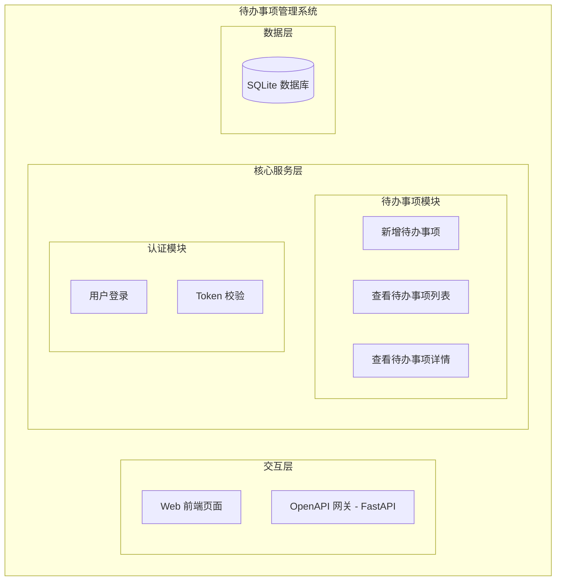
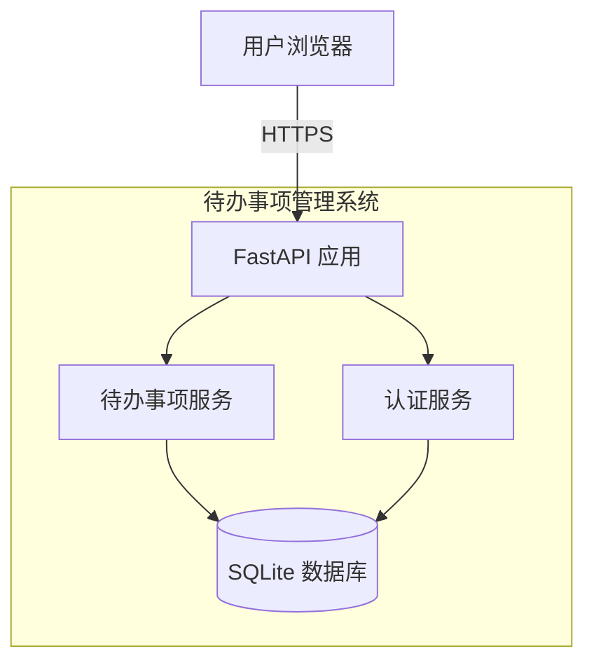
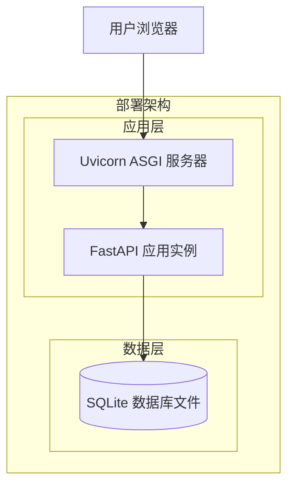
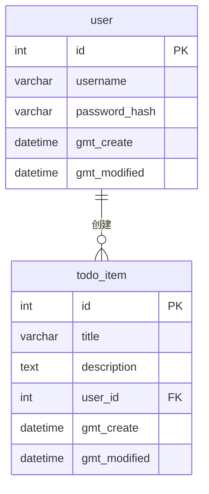
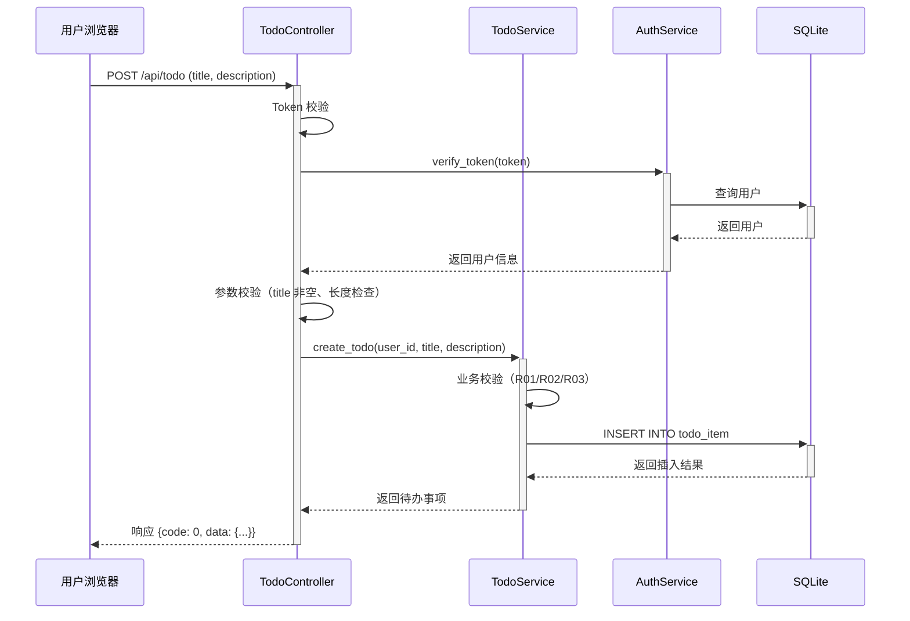
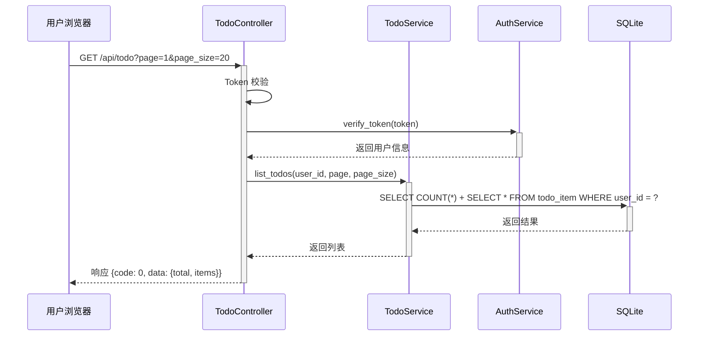
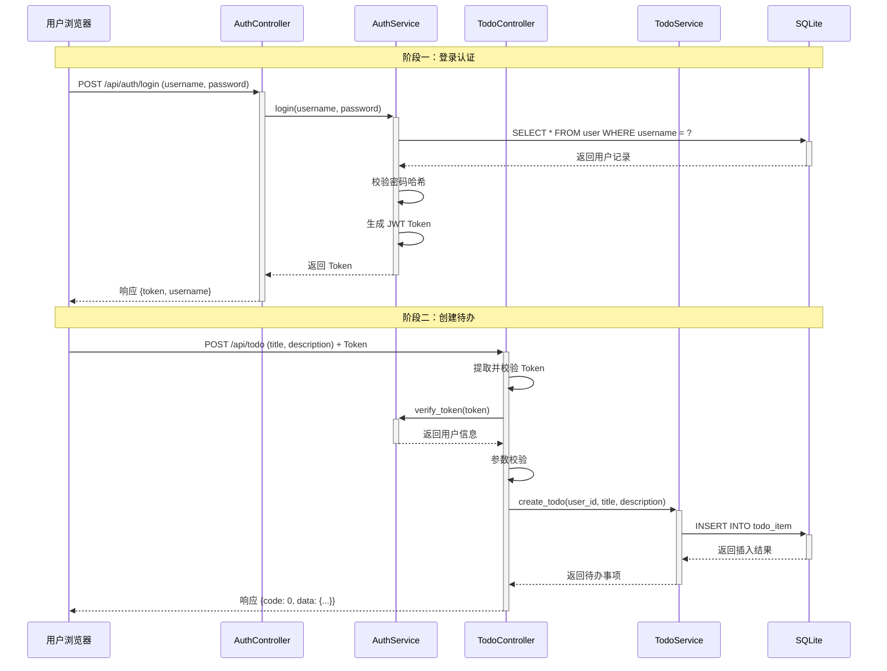

> **文档元信息**
>
> | 项目 | 内容 |
> |------|------|
> | 文档版本 | v1.0 |
> | 作者 | AiWork |
> | 创建日期 | 2026-09-09 |
> | 需求来源 | 内部需求 — 帮助用户记录日常待办事项 |
> | 评审状态 | 待评审 |

# 待办事项管理系统 系分设计

## 1. 需求与范围

### 背景与目标

**背景：** 内部用户在日常工作中需要一个轻量的工具来记录和管理个人待办事项，避免遗漏工作任务。当前缺乏统一的待办管理工具，用户依赖便签、即时通讯等非结构化方式管理任务，效率低且不易追踪。

**目标：** 构建一个面向内部用户的待办事项管理系统，支持用户快速新增待办事项（含事项名称和描述），实现任务的数字化记录，完成最小闭环。

### 核心功能

| 功能 | 说明 |
|------|------|
| 新增待办事项 | 用户填写事项名称（必填）和描述（选填），提交后创建待办事项 |
| 查看待办事项列表 | 用户可以查看自己创建的所有待办事项 |
| 查看待办事项详情 | 用户可以查看单条待办事项的详细信息 |

### 约束与非功能要求

| 类别 | 要求 | 说明 |
|------|------|------|
| 目标用户 | 内部用户 | 企业内部人员，非外部公众用户 |
| 访问方式 | Web 端 | 通过浏览器访问 |
| 可用性 | 单实例即可 | 内部使用，并发量低 |
| 数据安全 | 基础防护 | 内部系统，无敏感数据，需基本的身份认证 |
| 性能 | 普通响应即可 | 非高频操作场景 |

### 排除范围

| 排除项 | 原因 |
|--------|------|
| 编辑待办事项 | 最小闭环仅包含创建 |
| 删除待办事项 | 最小闭环仅包含创建 |
| 待办事项状态变更（完成/未完成） | 最小闭环仅包含创建 |
| 搜索/筛选/排序 | 最小闭环仅包含创建 |
| 待办提醒/通知 | 非核心功能 |
| 多用户协作 | 最小闭环仅包含个人待办 |
| 移动端适配 | 最小闭环仅 Web 端 |
| 数据导入/导出 | 非核心功能 |

### 需求功能清单与优先级

| 编号 | 功能点 | 优先级 | 原始描述/来源 | 备注 |
|------|--------|--------|---------------|------|
| F01 | 新增待办事项 | P0 | 需求描述"新增待办事项，事项名称和描述" | 核心功能，必做 |
| F02 | 查看待办事项列表 | P0 | 最小闭环隐含需求，创建后需能查看 | 展示所有待办事项 |
| F03 | 查看待办事项详情 | P1 | 最小闭环隐含需求 | 查看单条详情 |
| F04 | 基础身份认证 | P0 | 内部用户访问需认证 | 简单登录即可 |

### 假设与待确认项

| 编号 | 假设/待确认内容 | 当前假设 | 确认状态 |
|------|-----------------|----------|----------|
| A01 | 用户通过内部系统登录，无需独立账号体系 | 采用简单的用户名+密码登录，内部系统不对接外部 SSO | 待确认 |
| A02 | 待办事项仅创建者本人可见，无跨用户分享需求 | 单用户个人待办，无共享场景 | 待确认 |
| A03 | 待办事项名称长度限制为 200 字符，描述长度限制为 2000 字符 | 符合实际使用场景 | 待确认 |
| A04 | 数据持久化使用 SQLite，满足内部用户单实例场景 | 轻量部署，零外部依赖 | 待确认 |
| A05 | 不需要审计日志，创建时间由系统自动记录 | 内部系统最小闭环 | 待确认 |

---

## 2. 架构与模块

### 功能架构



- 交互层：Web 前端通过 HTTPS 调用 FastAPI 网关，负责路由分发和请求处理
- 核心服务层：待办事项模块负责增查操作；认证模块负责用户登录和 Token 校验
- 数据层：SQLite 内嵌数据库存储待办事项和用户数据

**模块清单**

| 模块 | 职责 | 依赖 |
|------|------|------|
| 待办事项模块（todo） | 新增待办事项、查看列表、查看详情 | SQLite 数据库、认证模块 |
| 认证模块（auth） | 用户登录、Token 生成与校验 | SQLite 数据库（用户表） |

### 应用集成架构



**集成关系说明：**

| 调用方 | 被调用方 | 协议 | 接口类型 | 说明 |
|--------|----------|------|----------|------|
| 用户浏览器 | FastAPI 应用 | HTTPS | REST API | 用户通过 Web 页面发起请求 |
| FastAPI 路由层 | 待办事项服务 | 内部调用 | Python 函数调用 | 路由层调用业务逻辑层 |
| FastAPI 路由层 | 认证服务 | 内部调用 | Python 函数调用 | 登录认证和 Token 校验 |
| 待办事项服务 | SQLite 数据库 | 内嵌连接 | SQLite API | 数据持久化 |
| 认证服务 | SQLite 数据库 | 内嵌连接 | SQLite API | 用户数据读取 |

### 部署架构



**部署说明：**
- **负载均衡层**：内部单实例场景，不需要负载均衡
- **应用层**：单实例部署，Uvicorn 作为 ASGI 服务器运行 FastAPI 应用
- **数据层**：SQLite 数据库文件存储于应用同目录下，无外部数据库依赖

### 技术栈总结

| 组件 | 技术选型 | 版本建议 |
|------|----------|----------|
| 编程语言 | Python | ≥ 3.9 |
| Web 框架 | FastAPI | ≥ 0.100 |
| ASGI 服务器 | Uvicorn | ≥ 0.23 |
| 数据库 | SQLite（内嵌） | Python 内置 |
| ORM | SQLAlchemy | ≥ 2.0 |
| 前端 | 单页 HTML + JavaScript（最小闭环） | - |
| 文档 | FastAPI 自动生成 OpenAPI | - |

---

## 3. 数据模型与存储

### 实体清单

| 实体名称 | 实体说明 | 所属模块 | 与其他实体的关系 |
|----------|----------|----------|-----------------|
| todo_item | 待办事项实体，记录用户的待办事项信息 | 待办事项模块 | 多对一关联 user |
| user | 用户实体，存储内部用户基本信息 | 认证模块 | 一对多关联 todo_item |

### 实体关系图



**模型说明：**
- user 与 todo_item 的关系：一个用户可以创建多个待办事项（一对多），每个待办事项属于一个用户（多对一）
- 数据存储：使用 SQLite 内嵌数据库，所有数据存储在单一数据库文件中
- 租户隔离：不涉及（单租户内部系统，通过 user_id 区分不同用户数据）
- 缓存：不涉及（内部用户并发量低，SQLite 单文件性能足够，无需引入 Redis 等缓存中间件）
- 消息队列：不涉及（最小闭环场景无异步处理需求）

---

## 4. 接口设计

### 4.1 oneapi（Web 控制台接口）

| 编号 | 接口名称 | 方法 | 路径 | 模块 |
|------|----------|------|------|------|
| W01 | 用户登录 | POST | /api/auth/login | 认证模块 |
| W02 | 获取当前用户信息 | GET | /api/auth/me | 认证模块 |
| W03 | 新增待办事项 | POST | /api/todo | 待办事项模块 |
| W04 | 查看待办事项列表 | GET | /api/todo | 待办事项模块 |
| W05 | 查看待办事项详情 | GET | /api/todo/{id} | 待办事项模块 |

### 4.2 OpenAPI（对外接口）

本项不适用。原因：最小闭环场景下，系统仅面向内部用户通过 Web 页面使用，暂无对外 OpenAPI 接口需求。

### 4.3 内部接口（Service 层）

| 编号 | 接口名称 | 类 | 方法签名 |
|------|----------|------|----------|
| S01 | 用户登录 | AuthService | login(username, password) -> TokenResponse |
| S02 | 校验 Token | AuthService | verify_token(token) -> User |
| S03 | 创建待办事项 | TodoService | create_todo(user_id, title, description) -> TodoItem |
| S04 | 查询待办事项列表 | TodoService | list_todos(user_id, page, page_size) -> TodoListResponse |
| S05 | 查询待办事项详情 | TodoService | get_todo_detail(todo_id, user_id) -> TodoItem |

### 4.4 集成接口（Integration 层）

本项不适用。原因：最小闭环场景下，系统无外部系统集成需求，所有数据自产自销。

---

## 5. 功能模块设计

### 5.1 全局约定

| 约定项 | 规则 |
|--------|------|
| 错误码格式 | TODO_{SEQ} / AUTH_{SEQ} |
| 通用出参结构 | {code: int, msg: string, data: object} |
| code=0 表示成功 | 非 0 为业务错误码 |
| 时间字段统一格式 | yyyy-MM-dd HH:mm:ss |
| 字符编码 | UTF-8 |

**模块映射表：**

| 模块 | 前缀 | 说明 |
|------|------|------|
| todo | TODO_ | 待办事项相关错误码 |
| auth | AUTH_ | 认证相关错误码 |

### 5.2 待办事项模块（todo）

#### 5.2.1 表结构设计

##### 5.2.1.1 todo_item 表

| 字段名 | 数据类型 | 约束 | 默认值 | 说明 |
|--------|----------|------|--------|------|
| id | INTEGER | PK, 自增, NOT NULL | - | 系统自增主键 |
| title | VARCHAR(200) | NOT NULL | - | 待办事项名称，最长 200 字符 |
| description | TEXT | NULL | NULL | 待办事项描述，最长 2000 字符 |
| user_id | INTEGER | NOT NULL | - | 创建者用户 ID，关联 user 表 |
| gmt_create | DATETIME | NOT NULL | CURRENT_TIMESTAMP | 创建时间 |
| gmt_modified | DATETIME | NOT NULL | CURRENT_TIMESTAMP | 修改时间 |

**索引：**
- PK: `pk_todo_item` (id)
- IDX: `idx_todo_item_user_id` (user_id)

##### 5.2.1.2 user 表

| 字段名 | 数据类型 | 约束 | 默认值 | 说明 |
|--------|----------|------|--------|------|
| id | INTEGER | PK, 自增, NOT NULL | - | 系统自增主键 |
| username | VARCHAR(50) | NOT NULL, UNIQUE | - | 用户名，唯一 |
| password_hash | VARCHAR(255) | NOT NULL | - | 密码哈希值（bcrypt） |
| gmt_create | DATETIME | NOT NULL | CURRENT_TIMESTAMP | 创建时间 |
| gmt_modified | DATETIME | NOT NULL | CURRENT_TIMESTAMP | 修改时间 |

**索引：**
- PK: `pk_user` (id)
- UK: `uk_user_username` (username)

##### 5.2.1.3 枚举与常量定义

本模块无枚举/常量定义。todo_item 无状态字段（最小闭环仅创建，不涉及状态变更）。

#### 5.2.2 接口详细设计

##### W01 用户登录

- **URI**: POST /api/auth/login
- **描述**: 用户输入用户名和密码进行登录，返回访问 Token
- **入参**:

| 参数名称 | 类型 | 是否必填 | 描述 |
|----------|------|----------|------|
| username | String | 是 | 用户名 |
| password | String | 是 | 密码 |

- **出参**:

| 参数名称 | 类型 | 描述 |
|----------|------|------|
| code | Integer | 业务状态码，0 表示成功 |
| msg | String | 提示信息 |
| data | Object | 业务数据 |
| data.token | String | 访问令牌 |
| data.username | String | 用户名 |

- **错误码**:

| 错误码 | 说明 |
|--------|------|
| AUTH_001 | 用户名或密码错误 |

- **业务规则**: 用户名和密码校验通过后生成 JWT Token，有效期 24 小时
- **请求示例**:
```json
{
  "username": "zhangsan",
  "password": "123456"
}
```
- **响应示例**:
```json
{
  "code": 0,
  "msg": "success",
  "data": {
    "token": "eyJhbGciOiJIUzI1NiJ9...",
    "username": "zhangsan"
  }
}
```

##### W03 新增待办事项

- **URI**: POST /api/todo
- **描述**: 创建一条新的待办事项
- **入参**:

| 参数名称 | 类型 | 是否必填 | 描述 |
|----------|------|----------|------|
| title | String | 是 | 待办事项名称，最大 200 字符 |
| description | String | 否 | 待办事项描述，最大 2000 字符 |

- **出参**:

| 参数名称 | 类型 | 描述 |
|----------|------|------|
| code | Integer | 业务状态码，0 表示成功 |
| msg | String | 提示信息 |
| data | Object | 业务数据 |
| data.id | Integer | 待办事项 ID |
| data.title | String | 待办事项名称 |
| data.description | String | 待办事项描述 |
| data.gmt_create | String | 创建时间 |

- **错误码**:

| 错误码 | 说明 |
|--------|------|
| TODO_001 | 事项名称不能为空 |
| TODO_002 | 事项名称超过 200 字符 |
| TODO_003 | 事项描述超过 2000 字符 |
| AUTH_002 | 未登录或 Token 已过期 |

- **业务规则**: 事项名称必填、不超过 200 字符；描述选填、不超过 2000 字符；需携带有效 Token
- **请求示例**:
```json
{
  "title": "完成项目设计文档",
  "description": "编写系统分析设计文档并提交评审"
}
```
- **响应示例**:
```json
{
  "code": 0,
  "msg": "success",
  "data": {
    "id": 1,
    "title": "完成项目设计文档",
    "description": "编写系统分析设计文档并提交评审",
    "gmt_create": "2026-09-09 20:00:00"
  }
}
```

##### W04 查看待办事项列表

- **URI**: GET /api/todo
- **描述**: 分页查询当前用户的所有待办事项
- **入参**:

| 参数名称 | 类型 | 是否必填 | 描述 |
|----------|------|----------|------|
| page | Integer | 否 | 页码，默认 1 |
| page_size | Integer | 否 | 每页条数，默认 20，最大 100 |

- **出参**:

| 参数名称 | 类型 | 描述 |
|----------|------|------|
| code | Integer | 业务状态码 |
| msg | String | 提示信息 |
| data.total | Integer | 总条数 |
| data.items | Array | 待办事项列表 |
| data.items[].id | Integer | 待办事项 ID |
| data.items[].title | String | 待办事项名称 |
| data.items[].description | String | 待办事项描述 |
| data.items[].gmt_create | String | 创建时间 |

- **错误码**:

| 错误码 | 说明 |
|--------|------|
| AUTH_002 | 未登录或 Token 已过期 |

- **业务规则**: 仅返回当前用户创建的待办事项，按创建时间倒序排列
- **请求示例**: GET /api/todo?page=1&page_size=10
- **响应示例**:
```json
{
  "code": 0,
  "msg": "success",
  "data": {
    "total": 1,
    "items": [
      {
        "id": 1,
        "title": "完成项目设计文档",
        "description": "编写系统分析设计文档并提交评审",
        "gmt_create": "2026-09-09 20:00:00"
      }
    ]
  }
}
```

##### W05 查看待办事项详情

- **URI**: GET /api/todo/{id}
- **描述**: 根据 ID 查询单条待办事项详情
- **入参**:

| 参数名称 | 类型 | 是否必填 | 描述 |
|----------|------|----------|------|
| id | Integer | 是 | 待办事项 ID（路径参数） |

- **出参**:

| 参数名称 | 类型 | 描述 |
|----------|------|------|
| code | Integer | 业务状态码 |
| msg | String | 提示信息 |
| data.id | Integer | 待办事项 ID |
| data.title | String | 待办事项名称 |
| data.description | String | 待办事项描述 |
| data.gmt_create | String | 创建时间 |
| data.gmt_modified | String | 修改时间 |

- **错误码**:

| 错误码 | 说明 |
|--------|------|
| TODO_004 | 待办事项不存在 |
| TODO_005 | 无权限查看该待办事项 |
| AUTH_002 | 未登录或 Token 已过期 |

- **业务规则**: 仅允许查看自己创建的待办事项，查看他人待办返回无权限
- **请求示例**: GET /api/todo/1
- **响应示例**:
```json
{
  "code": 0,
  "msg": "success",
  "data": {
    "id": 1,
    "title": "完成项目设计文档",
    "description": "编写系统分析设计文档并提交评审",
    "gmt_create": "2026-09-09 20:00:00",
    "gmt_modified": "2026-09-09 20:00:00"
  }
}
```

#### 5.2.3 子功能详细设计

##### 5.2.3.1 新增待办事项（F01）

- **处理时序图**



**业务规则：**

| 规则编号 | 规则描述 | 校验时机 | 不满足时的处理 |
|----------|----------|----------|--------------|
| R01 | 事项名称不能为空或纯空格 | 创建时 | 返回 TODO_001 |
| R02 | 事项名称长度不超过 200 字符 | 创建时 | 返回 TODO_002 |
| R03 | 事项描述长度不超过 2000 字符 | 创建时 | 返回 TODO_003 |

**异常场景：**

| 异常场景 | 处理方式 |
|----------|----------|
| Token 无效或过期 | 返回 AUTH_002 |
| 数据库写入失败 | 返回通用错误码 |
| title 超长 | 返回 TODO_002 |
| description 超长 | 返回 TODO_003 |

**并发控制：**
- 无并发风险。原因：待办事项创建为独立操作，每个用户创建自己的待办，不存在同一条记录的并发竞争。

##### 5.2.3.2 查看待办事项列表（F02）

- **处理时序图**



**业务规则：**

| 规则编号 | 规则描述 | 校验时机 | 不满足时的处理 |
|----------|----------|----------|--------------|
| R04 | 仅返回当前用户创建的待办事项 | 查询时 | 通过 user_id 过滤 |
| R05 | 按创建时间倒序排列 | 查询时 | SQL ORDER BY gmt_create DESC |
| R06 | 分页参数默认值：page=1, page_size=20 | 查询时 | 使用默认值 |
| R07 | page_size 最大 100 | 查询时 | 超过 100 自动修正为 100 |

**异常场景：**

| 异常场景 | 处理方式 |
|----------|----------|
| Token 无效或过期 | 返回 AUTH_002 |
| 无待办事项 | 返回空列表 |

**并发控制：**
- 无并发风险。原因：只读操作，不涉及数据写入。

##### 5.2.3.3 查看待办事项详情（F03）

- **处理时序图**

```mermaid
sequenceDiagram
    participant C as 用户浏览器
    participant Ctrl as TodoController
    participant Svc as TodoService
    participant AuthSvc as AuthService
    participant DB as SQLite

    C->>+Ctrl: GET /api/todo/{id}
    Ctrl->>Ctrl: Token 校验
    Ctrl->>+AuthSvc: verify_token(token)
    AuthSvc-->>-Ctrl: 返回用户信息
    Ctrl->>+Svc: get_todo_detail(todo_id, user_id)
    Svc->>+DB: SELECT * FROM todo_item WHERE id = ? AND user_id = ?
    DB-->>-Svc: 返回结果
    alt 找到记录
        Svc-->>-Ctrl: 返回待办事项详情
        Ctrl-->>-C: 响应 {code: 0, data: {...}}
    else 未找到记录
        Svc-->>-Ctrl: 返回空
        Ctrl-->>-C: 响应 {code: TODO_004, msg: "待办事项不存在"}
    end
```

**业务规则：**

| 规则编号 | 规则描述 | 校验时机 | 不满足时的处理 |
|----------|----------|----------|--------------|
| R08 | 查询时同时匹配 id 和 user_id | 查询时 | 防止越权查看他人待办 |

**异常场景：**

| 异常场景 | 处理方式 |
|----------|----------|
| 待办事项不存在 | 返回 TODO_004 |
| 查看他人待办 | TODO_004（统一返回不存在） |
| Token 无效或过期 | 返回 AUTH_002 |

**并发控制：**
- 无并发风险。原因：只读操作。

**状态机设计：**
- 本项不适用。原因：最小闭环仅包含创建操作，todo_item 无状态字段，不涉及状态流转。

#### 5.2.4 跨模块时序图



---

## 6. 非功能性需求设计

### 6.1 高可用性

本系统面向内部用户，单实例部署即可满足需求。

| 场景 | 策略 |
|------|------|
| 应用进程异常退出 | 使用 systemd 或 Docker restart policy 自动重启 |
| SQLite 数据库文件损坏 | 定期备份数据库文件（每日自动备份），损坏时从备份恢复 |
| 第三方依赖故障 | 本系统无第三方外部依赖，不存在此风险 |

### 6.2 可扩展性

| 维度 | 设计 |
|------|------|
| 水平扩展 | 当前单实例部署，如未来用户量增长，可迁移至 MySQL/PostgreSQL 并支持多实例部署 |
| 垂直扩展 | FastAPI 基于 ASGI 协议，可通过增加 Uvicorn worker 数量利用多核 CPU |
| 功能扩展 | 模块化架构（todo 模块、auth 模块），新增功能只需新增模块 |

### 6.3 稳定性/可靠性

| 场景 | 策略 |
|------|------|
| 并发写入 SQLite | 内部用户并发量极低，SQLite 默认 WAL 模式可支持基本并发读写 |
| 大量数据查询 | 分页查询，单次最多返回 100 条，避免内存溢出 |
| 异常输入 | 全局异常处理器捕获未预期异常，返回友好错误信息 |

### 6.4 安全性设计

#### 6.4.1 账户系统方案

本系统自实现简单的用户名+密码登录认证。原因：内部工具场景，用户量小，对接外部 SSO 成本过高，自实现最简方案即可。

#### 6.4.2 授权&访问控制

##### 6.4.2.1 是否实现水平权限检查

通过查询条件中绑定 user_id 实现：所有数据查询 SQL 均包含 `WHERE user_id = ?` 条件，确保用户只能访问自己的数据。

##### 6.4.2.2 是否实现垂直权限检查

本项不适用。原因：内部单租户系统，所有用户角色一致，无分级权限需求。

##### 6.4.2.3 是否检查登录态

通过 FastAPI 依赖注入实现全局 Token 校验：所有 `/api/todo` 接口需要携带有效的 JWT Token；`/api/auth/login` 接口免 Token（登录入口）。

#### 6.4.3 数据防护方案

##### 6.4.3.1 是否对敏感数据加密存储

用户密码使用 bcrypt 算法进行哈希存储，数据库中不保存明文密码。

##### 6.4.3.2 是否对敏感数据展示进行脱敏

本项不适用。原因：系统不展示敏感个人信息（身份证、手机号等），无需脱敏处理。日志中不打印密码和 Token 明文。

### 6.5 监控/统计/日志/告警

| 类型 | 设计 |
|------|------|
| 应用日志 | 使用 Python logging 模块，记录请求日志和异常日志 |
| 错误日志 | 异常发生时记录完整堆栈信息，包含请求路径、参数、错误码 |
| 关键操作日志 | 记录待办事项创建操作的日志（操作人、操作时间） |
| 告警 | 当前最小闭环暂不实现告警，如未来需要可集成 Sentry 等监控平台 |

---

## 7. 变更三板斧

### 7.1 可监控

| 监控点 | 监控内容 | 实现方式 |
|--------|----------|----------|
| 接口调用监控 | 记录每个接口的调用次数、调用耗时、返回状态 | Python logging，请求开始和结束时分别记录 |
| 异常监控 | 记录所有异常信息，包含异常类型、堆栈、上下文 | 全局异常处理器捕获并记录 |
| 业务操作监控 | 记录待办事项的创建操作（操作人、操作时间、结果） | TodoService 层日志记录 |
| 性能监控 | 监控慢查询（SQLite 查询耗时 > 1s） | Service 层记录 SQL 执行耗时 |

### 7.2 可灰度

| 维度 | 设计 |
|------|------|
| 是否需要灰度 | 最小闭环阶段暂不需要灰度发布。内部工具单实例部署，功能简单，直接全量发布即可 |
| 未来灰度方案 | 如后续功能迭代引入风险变更，可按用户名尾号进行灰度引流 |

### 7.3 可应急

| 维度 | 设计 |
|------|------|
| 快速回滚 | 部署时保留上一版本代码包，紧急情况下切换至上一版本并重启服务 |
| 数据库应急 | SQLite 数据库文件可直接备份恢复，无外部数据库依赖 |
| 服务降级 | 本系统无外部依赖，不存在降级场景 |
| 应急方案 | 直接回滚至上一版本发布包，重启 Uvicorn 服务即可恢复，无上下游兼容性问题 |
