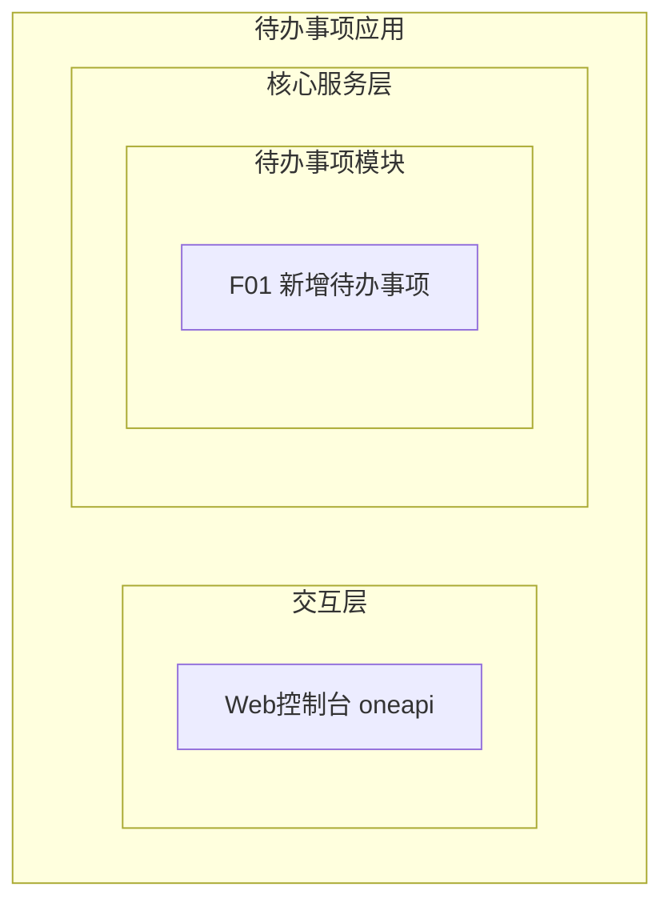
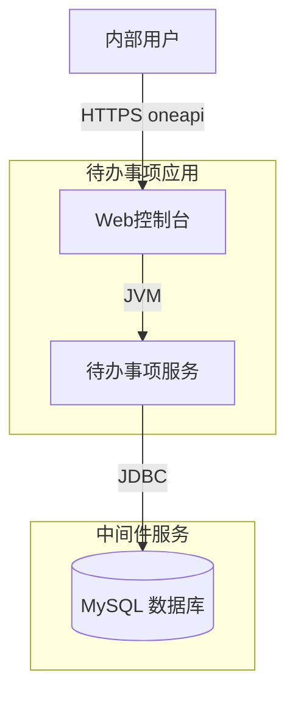
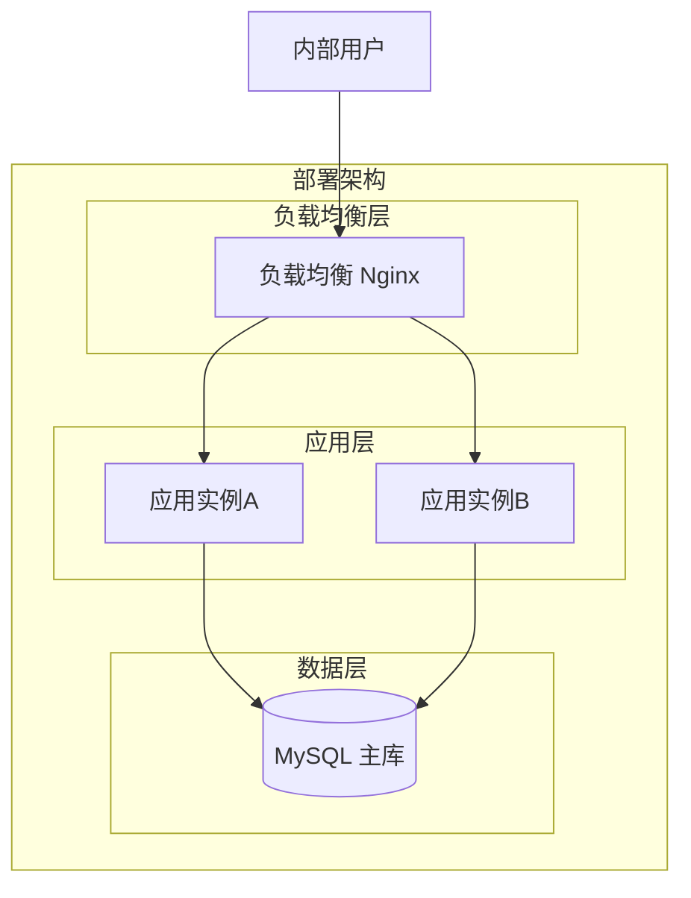
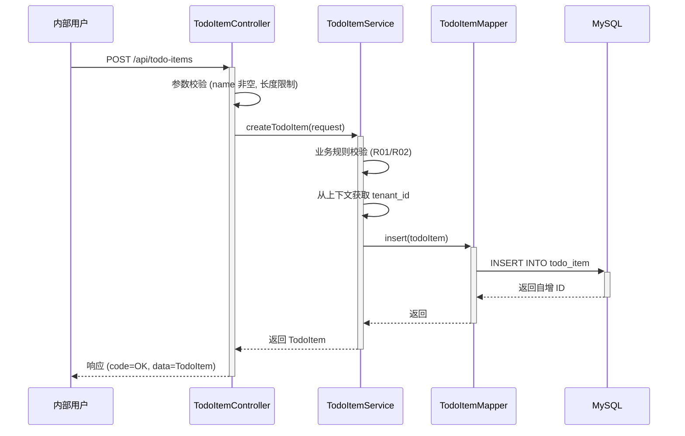

> **文档元信息**
>
> | 项目 | 内容 |
> |------|------|
> | 文档版本 | v1.0 |
> | 作者 | AiWork |
> | 创建日期 | 2026-09-09 |
> | 需求来源 | 任务描述：帮助用户记录日常待办事项 |
> | 评审状态 | 待评审 |

# 待办事项记录 系分设计

## 1. 需求与范围

### 背景与目标
内部用户需要一个轻量级的待办事项记录工具，用于快速记录日常待办任务。当前最小闭环仅支持创建待办事项，后续可扩展查询、编辑、删除等功能。

### 核心功能
- **F01 新增待办事项**：录入事项名称和描述，持久化存储

### 约束与非功能要求
- 目标用户：内部用户
- 最小闭环：仅创建操作
- 假设：采用内部统一认证体系，无需单独实现登录注册
- 假设：部署于内部网络环境，无外部公网暴露需求

### 排除范围
- 待办事项的编辑、删除、查询、标记完成
- 待办事项的分类/标签
- 待办事项的提醒/通知
- 待办事项的协作/共享
- 移动端适配

### 需求功能清单与优先级

| 编号 | 功能点 | 优先级 | 原始描述 | 备注 |
|------|--------|--------|----------|------|
| F01 | 新增待办事项 | P0 | 新增待办事项，事项名称和描述 | 核心闭环功能 |

### 假设与待确认项

| 编号 | 假设/待确认内容 | 当前假设 | 确认状态 |
|------|-----------------|----------|----------|
| A01 | 是否需要用户身份区分 | 需要，采用 tenant_id 区分租户/用户 | 待确认 |
| A02 | 事项名称长度限制 | 不超过 200 字符 | 待确认 |
| A03 | 事项描述长度限制 | 不超过 2000 字符 | 待确认 |
| A04 | 是否需要待办事项状态 | 当前仅创建，暂不设计状态字段 | 待确认 |
| A05 | 认证方式 | 复用现有内部认证体系，通过拦截器统一校验登录态 | 待确认 |

## 2. 架构与模块

### 功能架构



- **交互层**：Web 控制台，内部用户通过 oneapi REST 接口访问
- **核心服务层**：待办事项模块，负责待办事项的创建和持久化

### 模块清单

| 模块 | 职责 | 依赖 |
|------|------|------|
| 待办事项模块 (todo-item) | 待办事项的创建、数据持久化 | 数据库 |

### 应用集成架构



**集成关系说明：**

| 调用方 | 被调用方 | 协议 | 接口类型 | 说明 |
|--------|----------|------|----------|------|
| 内部用户 | 应用 Web控制台 | HTTPS | oneapi REST | 待办事项创建 |
| 应用待办事项服务 | MySQL 数据库 | JDBC | SQL | 待办事项持久化 |

### 部署架构



**部署说明：**
- **负载均衡层**：Nginx 反向代理，分发请求
- **应用层**：双实例部署，无状态，支持水平扩展
- **数据层**：MySQL 单主库，后续可扩展主从读写分离。当前单主库存在单点风险，建议上线前至少配置主从+自动故障切换（如 MHA/Orchestrator），或接入内部 DBA 托管的高可用 MySQL 集群

## 3. 数据模型与存储

### 实体清单

| 实体名称 | 实体说明 | 所属模块 | 与其他实体的关系 |
|----------|----------|----------|-----------------|
| TodoItem | 待办事项记录，存储事项名称和描述 | 待办事项模块 (todo-item) | 无关联实体 |

### 实体关系图


当前仅一个独立实体，无关联关系。

**模型说明：**
- TodoItem 为独立实体，每条记录代表一个待办事项
- 通过 tenant_id 字段实现租户/用户隔离
- 当前最小闭环仅创建，不涉及状态流转

### 缓存/存储说明
本项不适用，原因：当前最小闭环阶段仅直接读写 MySQL，不涉及缓存或 MQ。

## 4. 接口设计

### 4.1 oneapi（Web 控制台接口）

| 编号 | 接口名称 | 方法 | 路径 | 模块 |
|------|----------|------|------|------|
| W01 | 新增待办事项 | POST | /api/todo-items | 待办事项模块 (todo-item) |

### 4.2 OpenAPI（对外接口）
本项不适用，原因：当前需求仅面向内部用户，无需对外暴露 OpenAPI。

### 4.3 内部接口（Service 层）

| 编号 | 接口名称 | 类 | 方法签名 |
|------|----------|------|----------|
| S01 | 创建待办事项 | TodoItemService | TodoItem createTodoItem(CreateTodoItemRequest request) |

### 4.4 集成接口（Integration 层）
本项不适用，原因：当前无外部系统集成需求。

## 5. 功能模块设计

### 5.1 待办事项模块 (todo-item)

#### 5.1.1 表结构设计

##### 5.1.1.1 todo_item（待办事项表）

| 字段名 | 数据类型 | 约束 | 默认值 | 说明 |
|--------|----------|------|--------|------|
| id | bigint | PK, 自增 | - | 系统自增主键 |
| tenant_id | varchar(64) | NOT NULL | - | 租户/用户标识，用于数据隔离 |
| name | varchar(200) | NOT NULL | - | 待办事项名称 |
| description | varchar(2000) | NULL | NULL | 待办事项描述 |
| gmt_create | datetime | NOT NULL | CURRENT_TIMESTAMP | 创建时间 |
| gmt_modified | datetime | NOT NULL | CURRENT_TIMESTAMP | 修改时间 |

**索引：**
- PK: `pk_todo_item` (id)
- IDX: `idx_todo_item_tenant_id` (tenant_id)
- IDX: `idx_todo_item_gmt_create` (gmt_create)

##### 5.1.1.2 枚举与常量定义
本模块无枚举/常量定义。原因：当前最小闭环仅创建待办事项，不涉及状态/类型等有限取值字段。

#### 5.1.2 接口详细设计

##### W01 新增待办事项

- **URI**: POST /api/todo-items
- **描述**: 创建一个新的待办事项，记录事项名称和描述
- **入参**:

| 参数名称 | 类型 | 是否必填 | 描述 |
|----------|------|----------|------|
| name | String | 是 | 待办事项名称，最大 200 字符 |
| description | String | 否 | 待办事项描述，最大 2000 字符 |

- **出参**:

| 参数名称 | 类型 | 描述 |
|----------|------|------|
| code | String | 结果码，成功为 "OK" |
| msg | String | 提示信息 |
| data | Object | 返回创建的待办事项对象 |
| data.id | Long | 待办事项 ID |
| data.name | String | 事项名称 |
| data.description | String | 事项描述 |
| data.gmtCreate | String | 创建时间 (yyyy-MM-dd HH:mm:ss) |

- **错误码**:

| 错误码 | 说明 |
|--------|------|
| TODO_001 | 事项名称为空 |
| TODO_002 | 事项名称长度超过 200 字符 |
| TODO_003 | 事项描述长度超过 2000 字符 |
| TODO_004 | 系统内部错误 |

- **业务规则**: 事项名称必填且不超过 200 字符；描述非必填但不超过 2000 字符。

- **请求示例**:
```json
{
  "name": "完成周报",
  "description": "整理本周工作内容并提交周报"
}
```

- **响应示例**:
```json
{
  "code": "OK",
  "msg": "SUCCESS",
  "data": {
    "id": 1,
    "name": "完成周报",
    "description": "整理本周工作内容并提交周报",
    "gmtCreate": "2026-09-09 10:30:00"
  }
}
```

#### 5.1.3 子功能详细设计

##### 5.1.3.1 新增待办事项（F01）

- 处理时序图



**业务规则：**

| 规则编号 | 规则描述 | 校验时机 | 不满足时的处理 |
|----------|----------|----------|--------------|
| R01 | 事项名称不能为空 | 创建时 | 返回错误码 TODO_001，提示"事项名称不能为空" |
| R02 | 事项名称长度不超过 200 字符 | 创建时 | 返回错误码 TODO_002，提示"事项名称长度不能超过 200 字符" |
| R03 | 事项描述长度不超过 2000 字符 | 创建时 | 返回错误码 TODO_003，提示"事项描述长度不能超过 2000 字符" |

**异常场景：**

| 异常场景 | 处理方式 |
|----------|----------|
| 数据库连接异常 | 返回错误码 TODO_004，提示"系统繁忙，请稍后重试"，记录 error 日志 |
| 并发创建同一事项 | 无冲突风险，每条记录独立创建，通过自增主键保证唯一性 |
| tenant_id 缺失 | 认证拦截器层面拦截，返回 401 未授权 |

**并发控制：**
- 并发场景：无并发冲突风险。原因：创建操作各记录独立，不涉及共享资源竞争，通过自增主键保证唯一性。

**状态机设计：**
本项不适用，原因：当前最小闭环仅创建操作，待办事项实体不包含状态字段，无状态流转需求。

#### 5.1.4 技术选型方案对比

| 方案 | 持久层框架 | 优点 | 缺点 | 推荐 |
|------|-----------|------|------|------|
| 方案A | MyBatis | 灵活 SQL 控制，与现有内部系统一致 | 需手写 XML | ✅ 推荐 |
| 方案B | JPA/Hibernate | 自动建表，开发效率高 | 复杂查询不够灵活，学习成本高 | ❌ |

**推荐方案 A（MyBatis）**，理由：与内部系统技术栈一致，简单 CRUD 场景下 MyBatis 足够且灵活。

#### 5.1.5 模块自检

**完备性对账表：**

| 检查项 | 状态 | 说明 |
|--------|------|------|
| F01 功能点覆盖 | ✅ | 新增待办事项完整设计 |
| 接口 W01 定义 | ✅ | 入参/出参/错误码/示例完整 |
| 表结构定义 | ✅ | todo_item 表完整定义 |
| 业务规则 | ✅ | R01-R03 覆盖核心校验 |
| 异常场景 | ✅ | 数据库异常、并发、认证异常覆盖 |

**过度设计检查：**

| 检查项 | 状态 | 说明 |
|--------|------|------|
| 超出需求范围 | ✅ 无 | 未引入状态/分类/标签等未要求功能 |
| 不必要的复杂度 | ✅ 无 | 简单 CRUD，未引入不必要的中间层 |

## 6. 非功能性需求设计

### 6.1 高可用性
- 应用层双实例部署，通过 Nginx 负载均衡，单实例故障时自动切换
- MySQL 异常时创建操作直接失败返回错误，不降级（创建操作为核心功能，降级无意义）
- 本项不涉及第三方外部服务依赖，无外部降级场景

### 6.2 可扩展性
- 应用无状态设计，支持水平扩展（增加实例数即可）
- 表结构预留扩展空间：后续可增加 status、priority、category 等字段
- 接口设计遵循 RESTful 规范，后续扩展查询/编辑/删除接口时路径一致

### 6.3 稳定性/可靠性
- 边界场景：name 为空字符串或全空格时，校验拦截并返回错误
- 极端场景：大量并发创建时，数据库连接池需合理配置（默认 20 连接）
- 幂等性：当前版本不保证幂等，每次请求创建一条新记录（需求未要求幂等）

### 6.4 安全性设计

#### 6.4.1 账户系统方案
复用现有内部认证体系，假设已存在统一登录认证服务。待办事项模块不单独实现登录/注册。

#### 6.4.2 授权&访问控制

##### 6.4.2.1 是否实现水平权限检查
是。通过全局拦截器从请求上下文获取 tenant_id，确保用户只能操作自己的待办事项。创建操作时自动注入当前用户的 tenant_id。

##### 6.4.2.2 是否实现垂直权限检查
不涉及。当前仅有创建操作，所有内部用户均有权创建待办事项，无需角色区分。

##### 6.4.2.3 是否检查登录态
是。通过全局统一拦截器校验登录态，未登录请求返回 401。

#### 6.4.3 数据防护方案

##### 6.4.3.1 是否对敏感数据加密存储
本项不适用，原因：待办事项名称和描述为普通业务数据，不属于敏感信息。

##### 6.4.3.2 是否对敏感数据展示进行脱敏
本项不适用，原因：待办事项数据不涉及敏感信息。

### 6.5 监控/统计/日志/告警
- 接口调用日志：记录每次创建请求的 tenant_id、请求参数、响应结果、耗时
- 错误日志：数据库异常时记录完整堆栈
- 监控指标：创建接口 QPS、响应时间 P99、错误率
- 告警：错误率超过阈值（如 1%）时触发告警

## 7. 变更三板斧

### 7.1 可监控
- 服务埋点：创建待办事项接口记录调用方（tenant_id）、处理结果（成功/失败/错误码）、处理耗时
- 数据库埋点：慢 SQL 监控（阈值 200ms）
- 关键指标看板：创建接口 QPS、成功率、P99 延迟

### 7.2 可灰度
本项不适用，原因：当前为全新功能首次上线，无旧逻辑可对比。且功能简单（仅创建），建议全量发布。若后续上线编辑/删除等复杂功能，可考虑按 tenant_id 尾号灰度引流。

### 7.3 可应急
- 功能开关：在配置中心（如 Apollo/Nacos）设置 `todo.create.enabled` 开关，紧急情况下可关闭创建接口，返回友好提示"功能维护中"
- 回滚方案：发布包回滚至上一版本，因当前首次上线，回滚即为下线功能
- 上下游兼容性：当前无下游依赖方，回滚不影响其他服务