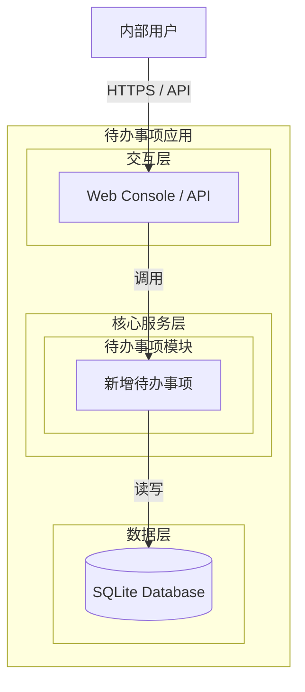
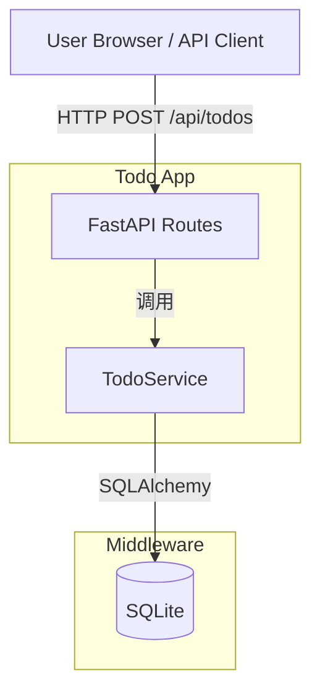
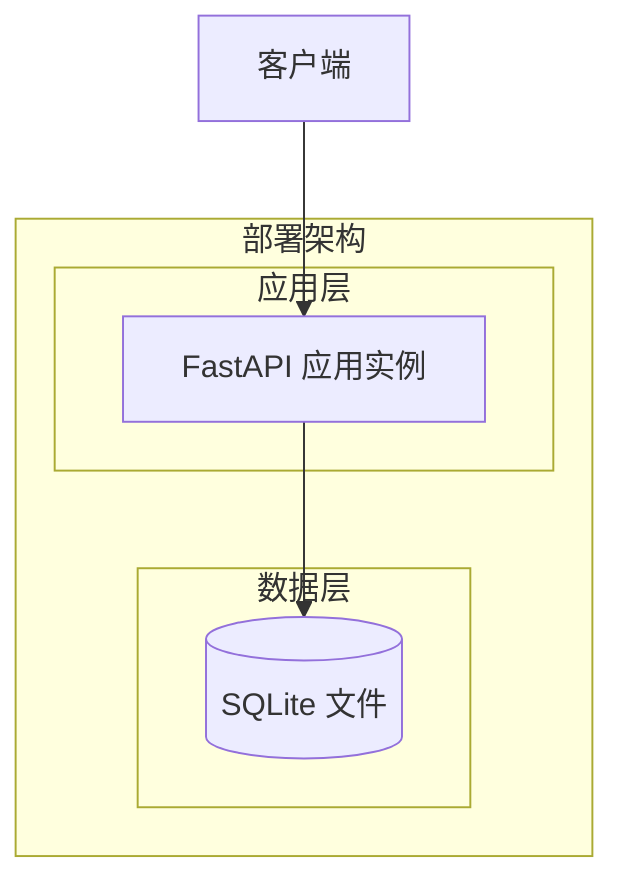
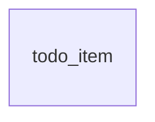
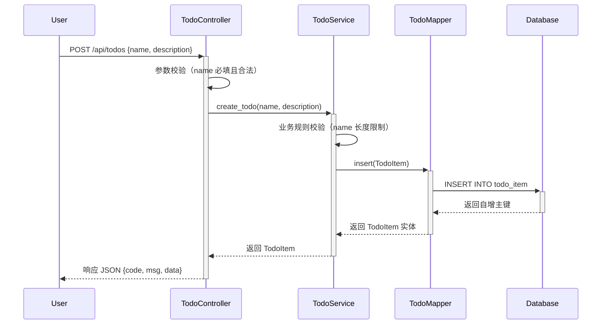

> **Document Metadata**
>
> | Item | Content |
> |------|------|
> | Document Version | v1.0 |
> | Author | AiWork |
> | Creation Date | 2026-09-14 |
> | Requirement Source | 用户任务输入：帮助用户记录日常待办事项（新增待办事项） |
> | Review Status | Pending Review |
> | Process Instance ID | 20260914-todo-xyz |

# 待办事项管理（Todo）系统分析设计

## 1. Requirement and Scope

### 1.1 Background and Objectives

为内部用户提供一套轻量级的待办事项记录功能，使用户能够快速创建日常待办事项，降低任务管理的心智负担。本次设计聚焦最小闭环：仅实现"新增待办事项"核心能力。

### 1.2 Core Features

- **新增待办事项**：用户可输入事项名称和描述，创建一条待办记录。

### 1.3 Constraints and Non-functional Requirements

- **目标用户**：内部用户
- **最小闭环**：仅创建，不包含查询、编辑、删除、状态变更
- **技术栈约束**：与现有项目（Python + FastAPI + SQLAlchemy + SQLite）保持一致

### 1.4 Excluded Scope

- 待办事项的分组、标签、分类
- 待办事项的查询、编辑、删除
- 待办事项的状态流转（待办→已完成等）
- 提醒、通知、定时任务
- 多租户、多用户权限隔离（本次最小闭环暂不涉及，仅预留字段）

### 1.5 Requirement Feature List and Priority

| ID | Feature Point | Priority | PRD Original Description/Section | Remarks |
|------|--------|--------|-------------------|------|
| F01 | 新增待办事项 | P0 | 核心功能：新增待办事项 | 事项名称和描述必填 |

### 1.6 Assumptions and Items to Confirm

| ID | Assumption/Item to Confirm | Current Assumption | Confirmation Status |
|------|-----------------|----------|----------|
| A01 | 是否使用 SQLite 作为数据存储 | 是，沿用项目现有 SQLite | Pending |
| A02 | 是否需要用户认证鉴权 | 最小闭环暂不涉及，接口层预留扩展点 | Pending |
| A03 | 事项名称长度限制 | 暂定 1~255 字符 | Pending |
| A04 | 描述字段是否允许为空 | 允许为空，最长 2000 字符 | Pending |

---

## 2. Architecture and Modules

### 2.1 Functional Architecture



### 2.2 Module List

| Module | Responsibility | Dependencies |
|------|------|------|
| 待办事项模块 (Todo) | 负责待办事项的创建、存储 | 数据层 SQLite |
| 数据层 | 提供数据持久化能力 | 无外部依赖 |

### 2.3 Application Integration Architecture



**Integration Relationship Description:**

| Caller | Callee | Protocol | Interface Type | Description |
|--------|----------|------|----------|------|
| 用户浏览器 / API 客户端 | FastAPI Routes | HTTPS | REST | 接收新增待办请求 |
| FastAPI Routes | TodoService | Python 方法调用 | 内部接口 | 业务逻辑处理 |
| TodoService | SQLite | SQLAlchemy ORM | SQL | 数据持久化 |

### 2.4 Deployment Architecture



**Deployment Notes:**
- **应用层**：单实例 FastAPI 应用，适合内部轻量使用
- **数据层**：SQLite 文件存储，无需单独部署数据库服务

---

## 3. Data Model and Storage

### 3.1 Entity List

| Entity Name | Entity Description | Owning Module | Relationship with Other Entities |
|----------|----------|----------|-----------------|
| todo_item | 待办事项实体 | 待办事项模块 | 无其他关联实体（最小闭环） |

### 3.2 Entity Relationship Diagram



> 注：当前最小闭环下仅存在 todo_item 单一实体，无其他关联实体。

**Model Notes:**
- `todo_item` 为当前唯一实体，未来可扩展与用户、分类、标签等实体的关联关系。

---

## 4. Interface Design

### 4.1 oneapi (Web Console Interfaces)

| ID | Interface Name | Method | Path | Module |
|------|----------|------|------|------|
| W01 | 新增待办事项 | POST | /api/todos | 待办事项模块 |

### 4.2 OpenAPI (External Interfaces)

> 不适用。当前为内部系统，无对外 OpenAPI。

### 4.3 Internal Interfaces (Service Layer)

| ID | Interface Name | Class | Method Signature |
|------|----------|------|----------|
| S01 | 创建待办事项 | TodoService | create_todo(name: str, description: str | None) -> TodoItem |

### 4.4 Integration Interfaces (Integration Layer)

> 不适用。当前无外部系统依赖。

---

## 5. Feature Module Design

### 5.1 待办事项模块 (Todo Module)

#### 5.1.1 Table Structure Design

##### 5.1.1.1 todo_item

| Field Name | Data Type | Constraint | Default Value | Description |
|--------|----------|------|--------|------|
| id | bigint | PK, Auto-increment | - | 主键，自增 |
| name | varchar(255) | NOT NULL | - | 事项名称 |
| description | text | NULL | NULL | 事项描述 |
| is_deleted | tinyint(1) | NOT NULL, DEFAULT 0 | 0 | 软删除标记（0=未删除, 1=已删除） |
| gmt_create | datetime | NOT NULL | CURRENT_TIMESTAMP | 创建时间 |
| gmt_modified | datetime | NOT NULL | CURRENT_TIMESTAMP | 修改时间 |

**Indexes:**
- PK: `pk_todo_item_id` (id)
- IDX: `idx_todo_item_gmt_create` (gmt_create)

##### 5.1.1.2 Enum and Constant Definitions

> 本模块无枚举/常量定义（最小闭环）。

#### 5.1.2 Interface Detailed Design

##### W01 新增待办事项

- **URI**: POST /api/todos
- **Description**: 创建一条新的待办事项记录
- **Input Parameters**:

| Parameter Name | Type | Required | Description |
|----------|------|----------|------|
| name | String | Yes | 事项名称，1~255 字符 |
| description | String | No | 事项描述，最长 2000 字符 |

- **Output Parameters**:

| Parameter Name | Type | Description |
|----------|------|------|
| code | String | 结果码，成功为 "OK" |
| msg | String | 提示信息 |
| data | Object | 业务数据，包含创建的待办事项信息 |
| data.id | Integer | 待办事项 ID |
| data.name | String | 事项名称 |
| data.description | String | 事项描述 |
| data.gmt_create | String | 创建时间 (ISO 8601) |

- **Error Codes**:

| Error Code | Description |
|--------|------|
| TODO_001 | 事项名称为空或超出长度限制 |
| TODO_002 | 描述超出长度限制 |
| TODO_500 | 系统内部错误 |

- **Business Rules**: 事项名称必填，长度 1~255 字符；描述可选，最长 2000 字符。

- **Request Example**:
```json
{
  "name": "完成季度报告",
  "description": "整理Q3数据并撰写总结"
}
```

- **Response Example**:
```json
{
  "code": "OK",
  "msg": "SUCCESS",
  "data": {
    "id": 1,
    "name": "完成季度报告",
    "description": "整理Q3数据并撰写总结",
    "gmt_create": "2026-09-14T10:00:00"
  }
}
```

#### 5.1.3 Sub-feature Detailed Design

##### 5.1.3.1 新增待办事项 (F01)

**Processing Sequence Diagram:**



**Business Rules:**

| Rule ID | Rule Description | Validation Timing | Handling When Not Satisfied |
|----------|----------|----------|--------------|
| R01 | 事项名称不能为空，长度 1~255 字符 | 参数校验阶段 | 返回 TODO_001 错误码 |
| R02 | 描述长度不超过 2000 字符 | 参数校验阶段 | 返回 TODO_002 错误码 |

**Exception Scenarios:**

| Exception Scenario | Handling |
|----------|----------|
| 数据库连接失败 | 返回 TODO_500，提示系统内部错误 |
| 参数格式非法（如 name 为非字符串） | FastAPI/Pydantic 自动校验，返回 422 |

**Concurrency Control:**
- 并发场景：内部使用场景并发量低，当前最小闭环无需特殊并发控制。
- 控制策略：无并发风险。原因：单条 INSERT 操作，无共享资源竞争。

**State Machine Design:**
> 不适用。当前最小闭环不涉及状态流转。

---

## 6. Non-Functional Requirement Design

### 6.1 High Availability

> 不适用。当前为内部轻量应用，单实例部署即可满足需求。如需扩展，可通过容器化多实例 + 负载均衡实现。

### 6.2 Extensibility

- **水平扩展**：FastAPI 应用可容器化部署，支持多实例水平扩展。
- **架构扩展**：当前为单体应用，未来若功能增加（查询、编辑、删除、状态管理），可平滑拆分为独立的 Todo Service。

### 6.3 Stability/Reliability

- **边界条件**：事项名称为空、超长、包含特殊字符时均有参数校验兜底。
- **数据库异常**：SQLAlchemy 会话异常时统一捕获并返回友好错误信息。

### 6.4 Security Design

#### 6.4.1 Account System Solution

> 不适用。最小闭环暂不涉及用户认证。

#### 6.4.2 Authorization & Access Control

> 不适用。最小闭环暂不涉及权限控制。

#### 6.4.3 Data Protection Solution

- **敏感数据**：当前模块不涉及敏感数据存储。
- **输入校验**：对用户输入的 name 和 description 进行长度和类型校验，防止 SQL 注入（SQLAlchemy ORM 已天然防护）。

### 6.5 Monitoring/Statistics/Logging/Alerting

- **接口监控**：记录 POST /api/todos 的请求量、成功率、响应时长。
- **日志记录**：记录每次创建待办事项的入参和响应结果，便于问题排查。

---

## 7. Change Management Triad

### 7.1 Monitorable

- **接口监控**：对 POST /api/todos 接口埋点，监控 QPS、成功率、P99 延迟。
- **数据库监控**：监控 SQLite 文件大小、读写性能。
- **日志追踪**：统一日志格式，包含 trace_id，便于链路追踪。

### 7.2 Gradual Rollout

- 当前为最小闭环功能，不涉及复杂灰度发布。
- 假设：若后续集成到已有 FastAPI 应用，可通过 feature flag 控制接口开关，逐步开放给内部用户。

### 7.3 Emergency Response

- **开关控制**：可通过环境变量或配置文件控制待办事项接口的启用/禁用，实现快速降级。
- **回滚策略**：若功能异常，可回滚到上一版本部署包。回滚时需注意数据库表结构兼容性（当前新增表对旧版本无影响）。

---

## 8. Decisions Record

| Decision Item | Decision Result | Alternative Options | Decision Rationale |
|------|------|------|------|
| 输出文件路径 | `.agents/20260914-目标_帮助用户记录日常待办事项_核心功能/design.md` | - | 按任务要求指定 |
| 设计模式 | 全量模式（Full Mode） | 增量模式 | 该模块为首次设计，无历史文档 |
| 数据存储 | SQLite（沿用现有） | MySQL / PostgreSQL | 与项目现有技术栈保持一致 |
| 最小闭环范围 | 仅新增待办事项 | 包含查询/编辑/删除 | 按需求明确最小闭环 |
| 用户认证 | 暂不涉及 | JWT / Session 认证 | 最小闭环要求，预留扩展点 |
| 软删除 | 支持（is_deleted） | 物理删除 | 预留扩展性，避免误删后无法恢复 |
