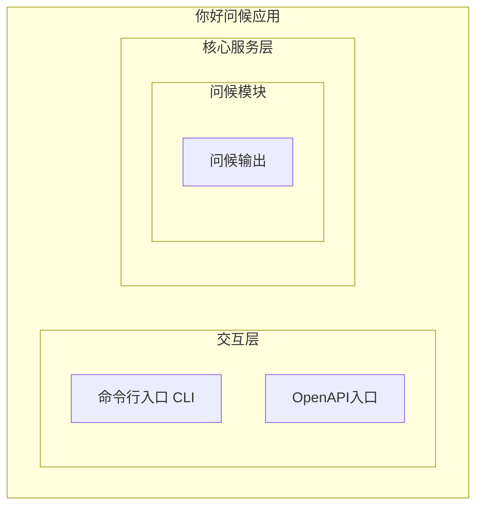
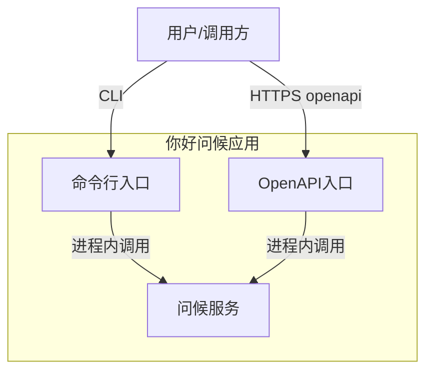
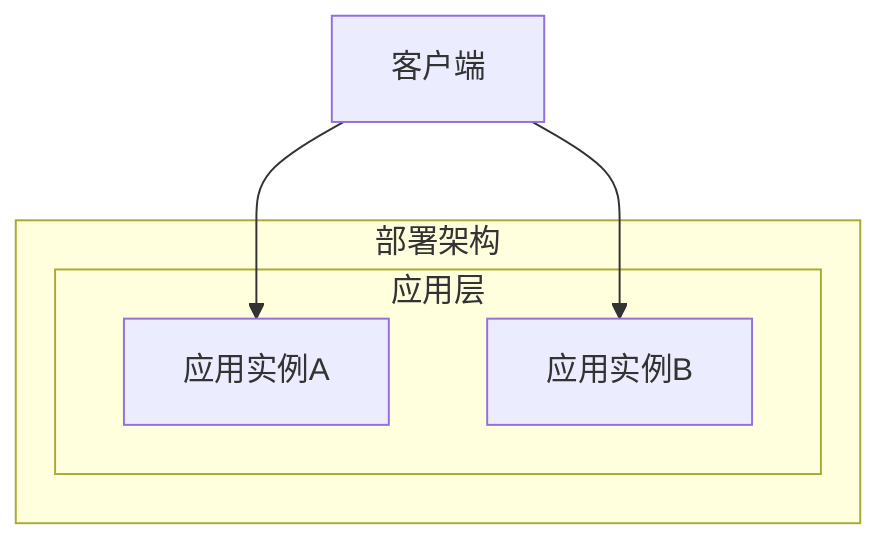
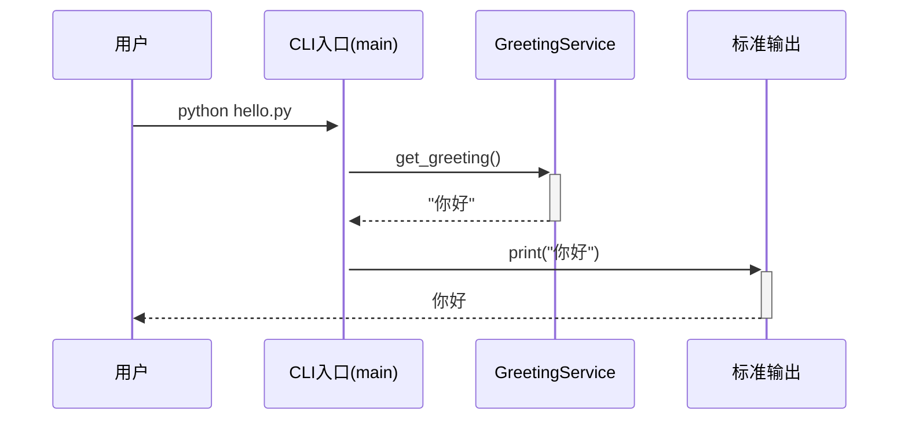
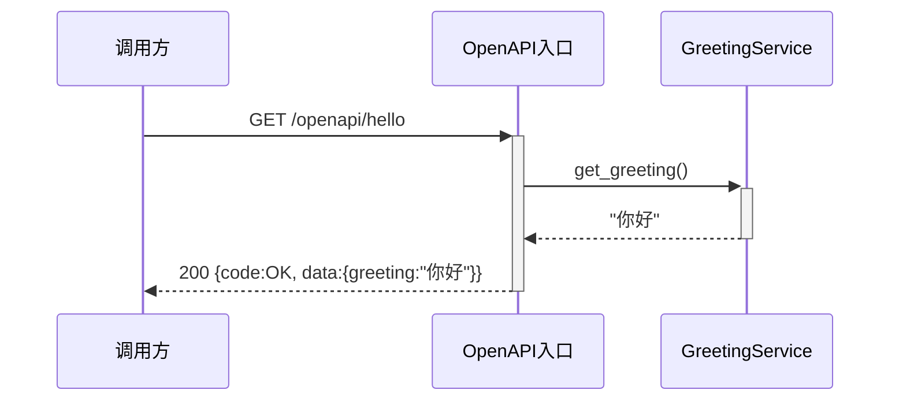

> **文档元信息**
>
> | 项目 | 内容 |
> |------|------|
> | 文档版本 | v1.0 |
> | 作者 | AiWork |
> | 创建日期 | 2026-09-17 |
> | 需求来源 | 用户需求"写一个你好" |
> | 评审状态 | 待评审 |

# 你好问候功能 系分设计

## 1. 需求与范围
- 背景与目标
- 核心功能
- 约束与非功能要求
- 排除范围

### 背景与目标
用户提出"写一个你好"，意图为构建一个问候功能，向用户输出"你好"。目标是用最小、清晰的方式提供问候能力，既支持本地命令行调用，也支持通过 HTTP 接口供其他系统调用。

### 核心功能
- G01 问候输出：调用后返回固定问候语"你好"。

### 约束与非功能要求
- 语言：Python 3
- 响应时间：本地 CLI 即时输出；HTTP 接口 P99 < 50ms
- 可用性：单进程即可，HTTP 接口需支持多实例部署
- 无外部依赖

### 排除范围
- 不涉及用户管理、登录鉴权
- 不涉及数据库持久化
- 不涉及多语言/多问候模板切换（仅固定"你好"）

### 需求功能清单与优先级

| 编号 | 功能点 | 优先级 | PRD 原始描述/章节 | 备注 |
|------|--------|--------|-------------------|------|
| F01 | 问候输出（CLI） | P0 | "写一个你好" | 命令行直接输出"你好" |
| F02 | 问候输出（HTTP OpenAPI） | P1 | "写一个你好" | 提供 GET /openapi/hello 返回"你好" |

### 假设与待确认项

| 编号 | 假设/待确认内容 | 当前假设 | 确认状态 |
|------|-----------------|----------|----------|
| A01 | 需求"写一个你好"是否仅指命令行输出 | 假设需同时提供 CLI 与 HTTP 接口，理由：提供可扩展性 | 待确认 |
| A02 | 问候语是否固定为"你好" | 假设固定"你好"，需求原文如此 | 待确认 |
| A03 | 是否需要可配置问候语 | 假设不需要，仅固定"你好"，保持最小实现 | 待确认 |

## 2. 架构与模块
### 功能架构


- 交互层说明：CLI 提供本地命令行调用入口；OpenAPI 入口提供 HTTP GET 接口供外部系统调用。
- 核心服务层说明：问候模块负责生成并返回固定问候语"你好"。
- 扩展/集成层说明：本项不适用，原因：无外部系统集成需求。

**模块清单**

| 模块 | 职责 | 依赖 |
|------|------|------|
| 问候模块 | 接收调用，返回问候语"你好" | 无 |


### 应用集成架构


**集成关系说明：**

| 调用方 | 被调用方 | 协议 | 接口类型 | 说明 |
|--------|----------|------|----------|------|
| 用户/调用方 | 应用 CLI | 本地进程 | CLI | 直接运行脚本输出问候语 |
| 用户/调用方 | 应用 OpenAPI 入口 | HTTPS | openapi REST | GET /openapi/hello 返回问候语 |

### 部署架构


**部署说明：**
- **负载均衡层**：HTTP 模式下由前置 Nginx/SLB 负载均衡，CLI 模式不涉及。
- **应用层**：无状态，可多实例水平扩展，实例数量按 QPS 弹性配置。
- **数据层**：本项不适用，原因：问候内容为静态字符串，无数据持久化需求。

## 3. 数据模型与存储
### 实体清单

本项不适用，原因：问候功能输出为固定静态字符串"你好"，不涉及任何业务实体的创建、查询或持久化，无需设计数据模型与存储。

### 实体关系图

本项不适用，原因：无实体，无实体关系。

**模型说明：**
- 无缓存/MQ 需求：问候语为内存常量，无需缓存或消息队列。
- 租户隔离：本项不适用，原因：无数据存储，无多租户隔离需求。

## 4. 接口设计

### 4.1 oneapi（Web 控制台接口）

本项不适用，原因：问候功能无需 Web 控制台管理界面。

### 4.2 OpenAPI（对外接口）

| 编号 | 接口名称 | 方法 | 路径 | 模块 |
|------|----------|------|------|------|
| O01 | 问候接口 | GET | /openapi/hello | 问候模块 |

### 4.3 内部接口（Service 层）

| 编号 | 接口名称 | 类 | 方法签名 |
|------|----------|------|----------|
| S01 | 获取问候语 | GreetingService | get_greeting() -> str |

### 4.4 集成接口（Integration 层）

本项不适用，原因：不涉及外部系统集成。

## 5. 功能模块设计

### 全局约定

**错误码格式**：`{MODULE}_{SEQ}`

**模块前缀映射：**

| 模块 | 前缀 | 说明 |
|------|------|------|
| 问候模块 | GREETING | 问候相关错误 |

**通用出参结构：**

| 参数名称 | 类型 | 描述 |
|----------|------|------|
| code | String | 结果 code，"OK" 表示成功 |
| msg | String | 提示信息 |
| data | Object | 业务数据 |

### 5.1 问候模块
#### 5.1.1 表结构设计

本模块无表结构设计，原因：问候内容为固定静态字符串"你好"，无数据持久化需求。

##### 枚举与常量定义

| 枚举名称 | 取值 | 含义 | 关联字段 |
|----------|------|------|----------|
| GREETING_TEXT | "你好" | 固定问候语 | GreetingService 内部常量 |

#### 5.1.2 接口详细设计
##### O01 问候接口

- **URI**: GET /openapi/hello
- **描述**: 调用后返回固定问候语"你好"。
- **入参**: 无

- **出参**:

| 参数名称 | 类型 | 描述 |
|----------|------|------|
| code | String | 结果 code |
| msg | String | 提示信息 |
| data | Object | 业务数据 |
| data.greeting | String | 问候语内容，固定"你好" |

- **错误码**:

| 错误码 | 说明 |
|--------|------|
| GREETING_001 | 服务内部异常 |

- **业务规则**: 调用即返回固定问候语"你好"，无前置条件。

- **请求示例**:
```json
GET /openapi/hello
```

- **响应示例**:
```json
{
  "code": "OK",
  "msg": "SUCCESS",
  "data": {
    "greeting": "你好"
  }
}
```

##### S01 获取问候语（内部接口）

- **类**: GreetingService
- **方法签名**: get_greeting() -> str
- **描述**: 返回固定问候语"你好"，供 CLI 与 OpenAPI 共用。
- **入参**: 无
- **出参**: str，值为"你好"
- **业务规则**: 直接返回常量"你好"。

#### 5.1.3 子功能详细设计
##### 5.1.3.1 CLI 问候输出（F01）

- 处理时序图


**业务规则：**
| 规则编号 | 规则描述 | 校验时机 | 不满足时的处理 |
|----------|----------|----------|--------------|
| R01 | 无前置条件，直接返回问候语 | 始终 | 不适用 |

**异常场景：**
| 异常场景 | 处理方式 |
|----------|----------|
| Python 运行环境缺失 | 提示用户安装 Python 3 |

**并发控制（如涉及数据写入）：**
- 并发场景：无
- 控制策略：无并发风险，原因：CLI 为单进程本地执行，无共享状态写入。

**状态机设计：** 本项不适用，原因：无状态字段实体。

##### 5.1.3.2 HTTP 问候输出（F02）

- 处理时序图


**业务规则：**
| 规则编号 | 规则描述 | 校验时机 | 不满足时的处理 |
|----------|----------|----------|--------------|
| R01 | 无前置条件，直接返回问候语 | 始终 | 不适用 |

**异常场景：**
| 异常场景 | 处理方式 |
|----------|----------|
| 服务进程未启动 | 返回连接拒绝，调用方重试 |
| 内部异常 | 返回 code=GREETING_001，msg=服务内部异常 |

**并发控制（如涉及数据写入）：**
- 并发场景：多请求并发调用 GET /openapi/hello
- 控制策略：无并发风险，原因：服务无状态、无写入，多请求并发读取同一常量不会冲突。

**状态机设计：** 本项不适用，原因：无状态字段实体。

### 跨模块时序图

本项不适用，原因：仅一个模块，无跨模块调用。

## 6. 非功能性需求设计
### 6.1 高可用性
HTTP 模式下服务无状态，支持多实例部署，单实例故障由前置负载均衡剔除，不影响整体可用。CLI 模式为本地执行，不涉及服务可用性。

### 6.2 可扩展性
水平扩缩容：HTTP 模式无状态，可通过增加实例横向扩展，QPS 随实例数线性增长。垂直扩缩容：单实例资源消耗极低（仅返回常量字符串）。

### 6.3 稳定性/可靠性
问候语为固定常量，无外部依赖、无 IO、无计算复杂度，边界场景下结果稳定一致。

### 6.4 安全性设计
#### 6.4.1 账户系统方案
本项不适用，原因：问候接口为公开接口，无需登录鉴权。

#### 6.4.2 授权&访问控制
##### 6.4.2.1 是否实现水平权限检查
不涉及，原因：无数据查询，公开接口返回固定内容。

##### 6.4.2.2 是否实现垂直权限检查
不涉及，原因：无角色区分需求。

##### 6.4.2.3 是否检查登录态
不涉及，原因：公开问候接口，无需登录态。

#### 6.4.3 数据防护方案
##### 6.4.3.1 是否对敏感数据加密存储
本项不适用，原因：无数据存储。

##### 6.4.3.2 是否对敏感数据展示进行脱敏
本项不适用，原因：问候语"你好"非敏感数据。

### 6.5 监控/统计/日志/告警
HTTP 接口记录请求量、响应耗时、错误率；CLI 不单独埋点。无特殊告警阈值需求。

## 7. 变更三板斧
### 7.1 可监控
- HTTP 接口埋点：请求量、响应耗时、HTTP 状态码分布、GREETING_001 错误计数。
- CLI 无埋点需求。

### 7.2 可灰度
本功能为新增独立功能，无旧逻辑需灰度切换，首次发布即全量上线。若后续扩展可配置问候语，可按请求头或租户尾号灰度新问候模板。

### 7.3 可应急
- HTTP 接口：因功能极简，无需功能开关；如出现异常可通过回滚发布包快速恢复。
- CLI：如脚本异常，回退至上一版本脚本即可。
- 回滚无上下游依赖风险，原因：无数据存储、无外部集成。

## 8. 方案检查

| 检查项 | 结果 | 说明 |
|------|------|------|
| 模块划分合理性检查 | 通过 | 单一问候模块，职责单一，无循环依赖 |
| 依赖关系合理性 | 通过 | 无外部依赖，下游异常不影响本系统 |
| 单点问题检查（部署层面） | 通过 | HTTP 模式多实例无单点，CLI 本地执行 |
| 表模型设计范式检查 | 不适用 | 无表，无数据存储 |
| 隐私安全检查 | 不适用 | 无敏感信息 |
| 兼容性检查（接口） | 通过 | 新增接口，无旧调用方兼容问题 |
| 兼容性检查（表） | 不适用 | 无表变更 |
| 数据迁移检查 | 不适用 | 无数据存储 |
| 一致性检查（功能点） | 通过 | F01、F02 在 5.1.3 中均有设计 |
| 一致性检查（表） | 不适用 | 无实体 |
| 一致性检查（接口） | 通过 | O01、S01 在 5.1.2 中均有详细定义 |
| 一致性检查（枚举） | 通过 | GREETING_TEXT 与常量定义一致 |
| 状态机完整性检查 | 不适用 | 无状态字段实体 |
| 并发风险检查 | 通过 | 无写入、无状态，无并发风险 |
| 单点问题检查（定时任务层面） | 不适用 | 无定时任务 |
| 非功能性设计可行性检查 | 通过 | 无状态多实例方案可行 |
| 变更三板斧设计可行性检查（可监控） | 通过 | HTTP 埋点设计可行 |
| 变更三板斧设计可行性检查（可灰度） | 通过 | 新增功能首版全量，后续可灰度扩展 |
| 变更三板斧设计可行性检查（可应急） | 通过 | 回滚发布包即可，无上下游依赖 |
