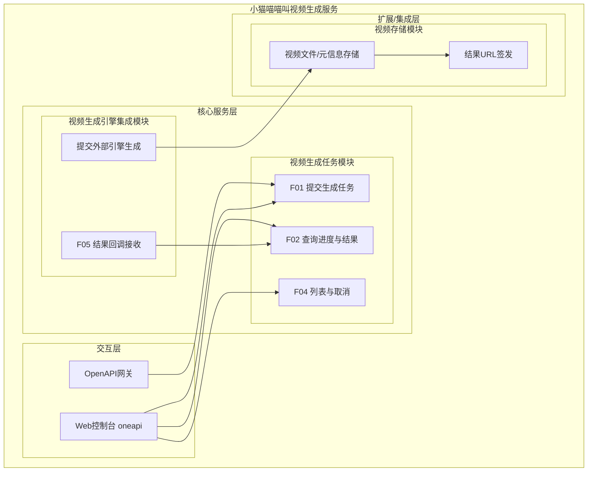
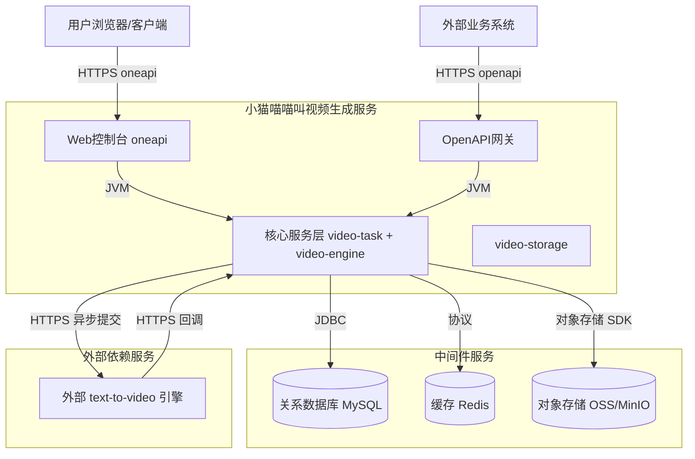
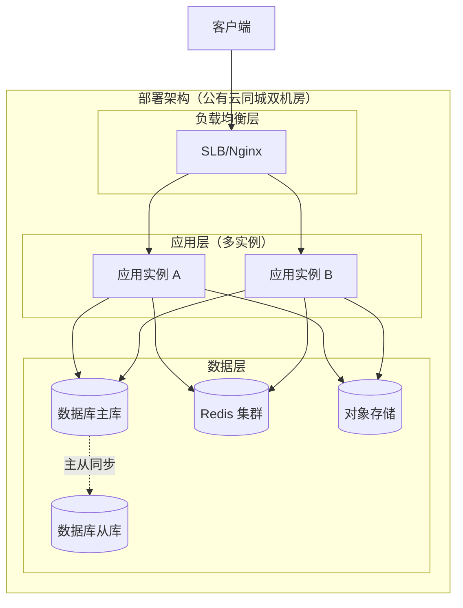
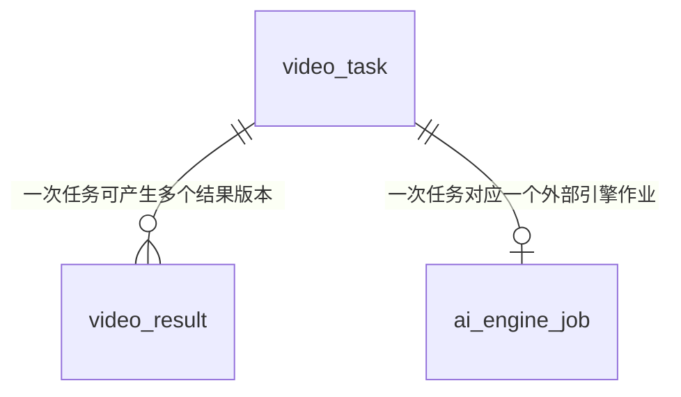
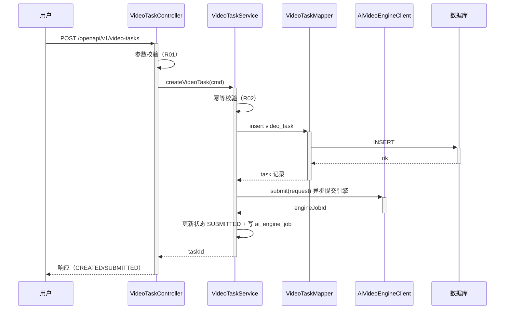
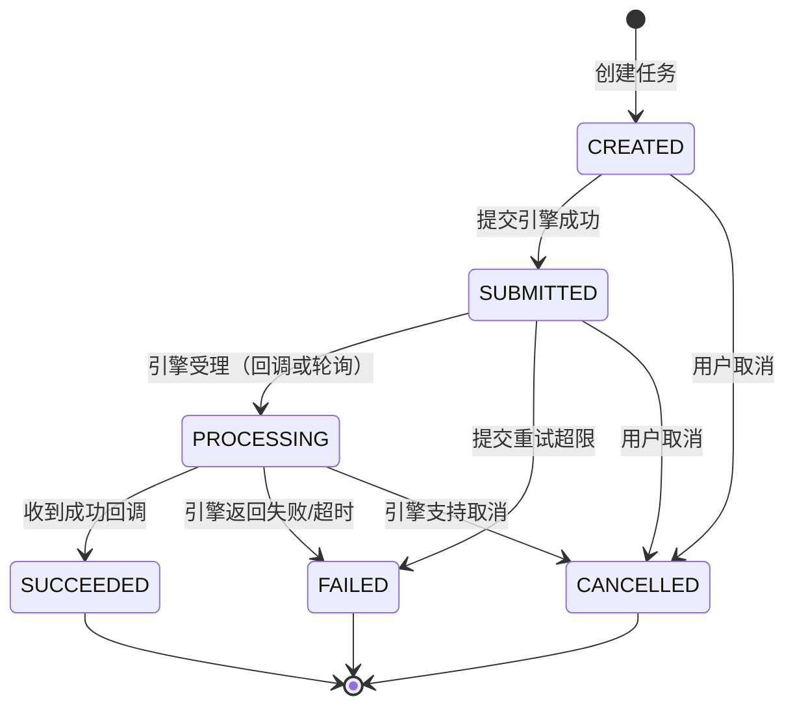
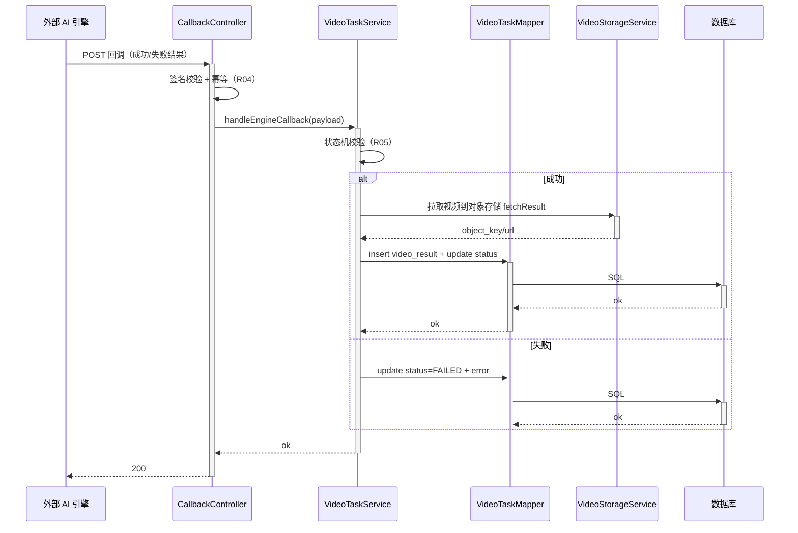
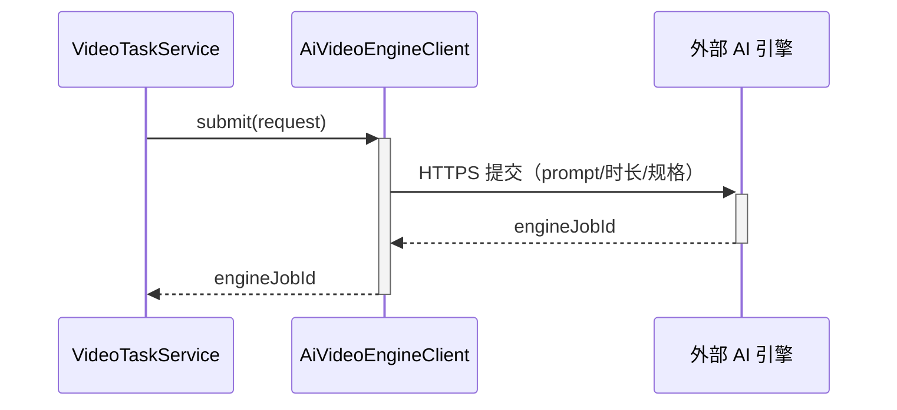
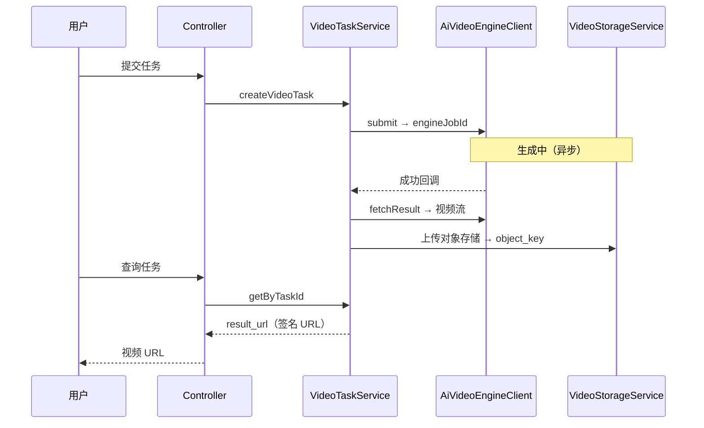

> **文档元信息**
>
> | 项目 | 内容 |
> |------|------|
> | 文档版本 | v1.0 |
> | 作者 | AiWork（系分自动生成） |
> | 创建日期 | 2026-09-17 |
> | 需求来源 | 任务需求："生成一个 3 秒视频，内容是'小猫喵喵叫'" |
> | 评审状态 | 待评审 |

# "小猫喵喵叫"文生视频服务 系分设计

## 1. 需求与范围

### 背景与目标
- 背景：用户希望快速生成一段短视频，文本描述为"小猫喵喵叫"，时长 3 秒。
- 目标：提供一个"文本描述 → 3 秒视频"的生成能力，用户提交生成请求后可异步等待并获取视频结果，可查询任务进度、下载/预览视频。

### 核心功能
1. 提交视频生成任务（输入文本描述与可选规格，系统创建异步任务）。
2. 任务查询（按任务 ID 查询生成进度与结果）。
3. 任务列表与取消（管理视角：查看、取消进行中的任务）。
4. 生成结果获取（返回可访问的视频 URL 与元信息）。
5. 生成引擎回调（外部 AI 引擎异步回传生成结果，触发状态推进与结果持久化）。

### 约束与非功能要求
- 时长：视频 3 秒。
- 内容：小猫喵喵叫（画面为小猫 + 喵喵叫的音频）。
- 异步高可用：生成耗时可能较长，必须异步，任务可重试、去重。
- 安全：接口鉴权、租户隔离、结果 URL 防越权访问。
- 性能：提交接口低延迟（任务入队即可返回）；查询接口命中缓存。

### 排除范围
- 视频二次编辑（剪辑、拼接、字幕、特效）不在本期。
- 自研视频生成模型训练/推理不在本期（复用第三方引擎）。
- 用户账号注册/登录体系（假设由公共账户体系提供，不在本期新建）。
- 计费、配额与套餐体系不在本期。

### 需求功能清单与优先级

| 编号 | 功能点 | 优先级 | PRD 原始描述/章节 | 备注 |
|------|--------|--------|-------------------|------|
| F01 | 提交视频生成任务 | P0 | "生成一个 3 秒视频，内容是'小猫喵喵叫'" | 核心入口 |
| F02 | 查询生成任务进度与结果 | P0 | 同上，生成结果需可取回 | 异步任务的必备闭环 |
| F03 | 获取/预览生成视频 | P0 | 同上 | 结果交付 |
| F04 | 任务列表与取消 | P1 | — | 管理能力，由"任务"衍生 |
| F05 | 生成引擎结果回调 | P0 | 同上 | 异步引擎对接的必备链路 |
| F06 | 视频规格管理（时长/分辨率/格式） | P1 | "3 秒" | 支撑 F01 的可配置参数 |

### 假设与待确认项

| 编号 | 假设/待确认内容 | 当前假设 | 确认状态 |
|------|-----------------|----------|----------|
| A01 | 视频分辨率/格式未明确 | 720p / MP4 / 16:9 | 待确认 |
| A02 | 生成引擎厂商未指定 | 通用 text-to-video 外部异步引擎，抽象 Client 接口以可切换 | 待确认 |
| A03 | 视频是否包含音频 | 包含"喵喵叫"音频（text-to-video 引擎生成音画同步） | 待确认 |
| A04 | 使用者与鉴权体系 | 复用已有账户体系，按 tenant_id 隔离 | 待确认 |
| A05 | 服务部署形态 | 公有云、同城双机房、容器化、无单点 | 待确认 |
| A06 | 收敛性指标（生成时长 SLO） | 单任务生成 p95 小于 60s，超时告警 | 待确认 |

## 2. 架构与模块

### 功能架构



- 交互层说明：oneapi 面向内部控制台；OpenAPI 面向外部调用方，均 RESTful。
- 核心服务层说明：video-task 管理任务生命周期与状态机；video-engine 对接外部 AI 引擎的异步提交与回调。
- 扩展/集成层说明：video-storage 负责对象存储与结果 URL 签发，OSS 与 MinIO 插件式切换。

**模块清单**

| 模块 | 职责 | 依赖 |
|------|------|------|
| video-task（视频生成任务模块） | 任务创建、状态机、查询、列表、取消 | video-storage、video-engine |
| video-engine（视频生成引擎集成模块） | 调用外部 text-to-video 引擎提交生成并接收回调 | 外部 AI 引擎 |
| video-storage（视频存储模块） | 视频文件与元信息的对象存储，URL 签发 | 对象存储（OSS/MinIO） |
| video-callback（回调与通知模块，可并入 video-task） | 解析引擎回调、推进状态、结果落库 | video-task、video-storage |

### 应用集成架构



**集成关系说明：**

| 调用方 | 被调用方 | 协议 | 接口类型 | 说明 |
|--------|----------|------|----------|------|
| 用户浏览器 | Web控制台 | HTTPS | oneapi REST | 提交/查询/取消任务 |
| 外部业务系统 | OpenAPI网关 | HTTPS | openapi REST | 异步提交生成、查询结果 |
| 核心服务层 | 关系数据库 | JDBC | SQL | 任务与结果持久化 |
| 核心服务层 | 缓存 | RESP | KV | 查询结果缓存、任务状态 |
| 核心服务层 | 对象存储 | 对象存储 SDK | 文件读写 | 视频文件上传/下载 |
| 核心服务层 | 外部 AI 引擎 | HTTPS | 集成接口 | 提交生成请求 |
| 外部 AI 引擎 | 核心服务层 | HTTPS 回调 | 集成接口 | 回传生成结果 |

### 部署架构



**部署说明：**
- **负载均衡层**：SLB/Nginx，健康检查转发。
- **应用层**：≥2 副本，无状态设计，支持水平扩展；发布滚动升级。
- **数据层**：数据库主从、Redis 集群、对象存储多副本，消除单点。

**架构选型对比（单体分层 + 异步任务 vs 微服务拆分）：**

| 维度 | 方案 A：单体分层 + 异步任务 | 方案 B：微服务拆分 | 推荐 |
|------|------------------------------|--------------------|------|
| 复杂度 | 低，一套服务承载 | 高，需拆分视频生成/调度/存储等 | A |
| 团队与运维成本 | 低 | 高 | A |
| 扩展性 | 横向扩展实例即可 | 更细粒度扩展 | A（当前规模足够） |
| 演进空间 | 模块边界清晰可后续拆分 | 天然独立 | A |

推荐：方案 A。理由：单一视频生成场景、需求集中在"提交-查询-回调"闭环，模块边界清晰，单体+异步任务可在后续按需拆分为独立服务。

## 3. 数据模型与存储

### 实体清单

| 实体名称 | 实体说明 | 所属模块 | 与其他实体的关系 |
|----------|----------|----------|-----------------|
| video_task | 视频生成任务，记录一次文本到视频的生成请求及其状态 | video-task | 一对多 video_result |
| video_result | 视频生成结果，记录产出视频的存储位置与元信息 | video-storage | 多对一 video_task |
| ai_engine_job | 外部 AI 引擎作业映射，记录外部引擎作业标识与回调状态 | video-engine | 一对一 video_task |

### 实体关系图



**模型说明：**
- 一次 video_task 至少对应一个 ai_engine_job（外部引擎作业），生成成功后可落库一个 video_result，重试可追加多个结果版本。
- 缓存用途：任务查询结果写 Redis 缓存，TTL 与任务终态对齐，防缓存击穿（空值缓存）/雪崩（随机 TTL）。
- MQ 用途（可选）：任务提交与外部引擎回调的高吞吐下，采用 MQ 削峰解耦；本期规模小可不引入，标注为演进项。
- 租户隔离：所有表带 tenant_id，默认按租户隔离数据。

## 4. 接口设计

### 4.1 oneapi（Web 控制台接口）

| 编号 | 接口名称 | 方法 | 路径 | 模块 |
|------|----------|------|------|------|
| W01 | 提交视频生成任务 | POST | /api/v1/video-tasks | video-task |
| W02 | 查询任务详情 | GET | /api/v1/video-tasks/{taskId} | video-task |
| W03 | 任务列表 | GET | /api/v1/video-tasks | video-task |
| W04 | 取消生成任务 | POST | /api/v1/video-tasks/{taskId}/cancel | video-task |

### 4.2 OpenAPI（对外接口）

| 编号 | 接口名称 | 方法 | 路径 | 模块 |
|------|----------|------|------|------|
| O01 | 提交视频生成任务（异步） | POST | /openapi/v1/video-tasks | video-task |
| O02 | 查询任务详情 | GET | /openapi/v1/video-tasks/{taskId} | video-task |

### 4.3 内部接口（Service 层）

| 编号 | 接口名称 | 类 | 方法签名 |
|------|----------|------|----------|
| S01 | 创建视频生成任务 | VideoTaskService | Long createVideoTask(CreateVideoTaskCommand cmd) |
| S02 | 查询任务详情 | VideoTaskService | VideoTaskDTO getByTaskId(String taskId) |
| S03 | 取消任务 | VideoTaskService | void cancel(String taskId) |
| S04 | 处理引擎回调 | VideoTaskService | void handleEngineCallback(EngineCallbackPayload payload) |

### 4.4 集成接口（Integration 层）

| 编号 | 接口名称 | 类 | 方法签名 | 说明 |
|------|----------|------|----------|------|
| I01 | 提交文生视频生成 | AiVideoEngineClient | String submit(EngineGenerateRequest request) | 返回外部引擎作业 ID |
| I02 | 查询引擎作业状态 | AiVideoEngineClient | EngineJobStatus query(String engineJobId) | 主动查询兜底 |
| I03 | 下载生成结果 | AiVideoEngineClient | void fetchResult(String engineJobId, OutputTarget target) | 拉取视频到对象存储 |

## 5. 功能模块设计

### 5.1 video-task（视频生成任务模块）

#### 5.1.1 表结构设计

##### 5.1.1.1 video_task（视频生成任务表）

| 字段名 | 数据类型 | 约束 | 默认值 | 说明 |
|--------|----------|------|--------|------|
| id | bigint | PK, 自增 | - | 系统自增主键 |
| tenant_id | varchar(32) | NOT NULL | - | 租户 ID |
| task_no | varchar(64) | NOT NULL | - | 任务编号（对外） |
| prompt | varchar(1024) | NOT NULL | - | 文生视频提示词，如"小猫喵喵叫" |
| duration_sec | int | NOT NULL | 3 | 视频时长（秒） |
| resolution | varchar(16) | NOT NULL | 720p | 分辨率 |
| format | varchar(16) | NOT NULL | mp4 | 视频格式 |
| aspect_ratio | varchar(16) | NOT NULL | 16:9 | 画面比例 |
| status | varchar(16) | NOT NULL | CREATED | 任务状态 |
| engine_job_id | varchar(64) | NULL | NULL | 外部引擎作业 ID |
| error_code | varchar(32) | NULL | NULL | 失败错误码 |
| error_msg | varchar(512) | NULL | NULL | 失败原因 |
| idempotency_key | varchar(64) | NULL | NULL | 幂等键 |
| gmt_create | datetime | NOT NULL | CURRENT_TIMESTAMP | 创建时间 |
| gmt_modified | datetime | NOT NULL | CURRENT_TIMESTAMP | 修改时间 |

**索引：**
- UK: `uk_video_task_task_no` (task_no)
- UK: `uk_video_task_idem` (tenant_id, idempotency_key)
- IDX: `idx_video_task_tenant_status` (tenant_id, status, gmt_create)

##### 5.1.1.2 video_result（视频生成结果表）

| 字段名 | 数据类型 | 约束 | 默认值 | 说明 |
|--------|----------|------|--------|------|
| id | bigint | PK, 自增 | - | 系统自增主键 |
| tenant_id | varchar(32) | NOT NULL | - | 租户 ID |
| task_id | bigint | NOT NULL | - | 关联 video_task.id |
| result_url | varchar(512) | NOT NULL | - | 视频访问 URL（签发后） |
| object_key | varchar(256) | NOT NULL | - | 对象存储 key |
| file_size | bigint | NULL | NULL | 文件大小（字节） |
| duration_sec | int | NOT NULL | 3 | 实际时长 |
| checksum | varchar(64) | NULL | NULL | 文件校验 |
| gmt_create | datetime | NOT NULL | CURRENT_TIMESTAMP | 创建时间 |
| gmt_modified | datetime | NOT NULL | CURRENT_TIMESTAMP | 修改时间 |

**索引：**
- IDX: `idx_video_result_task` (task_id)
- UK: `uk_video_result_task_obj` (task_id, object_key)

##### 5.1.1.3 ai_engine_job（外部引擎作业映射表）

| 字段名 | 数据类型 | 约束 | 默认值 | 说明 |
|--------|----------|------|--------|------|
| id | bigint | PK, 自增 | - | 系统自增主键 |
| tenant_id | varchar(32) | NOT NULL | - | 租户 ID |
| task_id | bigint | NOT NULL | - | 关联 video_task.id |
| engine_job_id | varchar(64) | NOT NULL | - | 外部引擎作业 ID |
| engine_type | varchar(32) | NOT NULL | default | 引擎类型 |
| callback_status | varchar(16) | NOT NULL | PENDING | 回调状态 |
| raw_payload | text | NULL | NULL | 原始回调报文（审计） |
| gmt_create | datetime | NOT NULL | CURRENT_TIMESTAMP | 创建时间 |
| gmt_modified | datetime | NOT NULL | CURRENT_TIMESTAMP | 修改时间 |

**索引：**
- UK: `uk_ai_engine_job_task` (task_id, engine_type)
- IDX: `idx_ai_engine_job_eid` (engine_job_id)

##### 5.1.1.4 枚举与常量定义

| 枚举名称 | 取值 | 含义 | 关联字段 |
|----------|------|------|----------|
| TaskStatus | CREATED | 已创建 | video_task.status |
| TaskStatus | SUBMITTED | 已提交引擎 | video_task.status |
| TaskStatus | PROCESSING | 生成中 | video_task.status |
| TaskStatus | SUCCEEDED | 生成成功 | video_task.status |
| TaskStatus | FAILED | 生成失败 | video_task.status |
| TaskStatus | CANCELLED | 已取消 | video_task.status |
| CallbackStatus | PENDING | 等待回调 | ai_engine_job.callback_status |
| CallbackStatus | RECEIVED | 已接收回调 | ai_engine_job.callback_status |
| CallbackStatus | EXPIRED | 回调超时 | ai_engine_job.callback_status |
| Resolution | 720p | 分辨率（默认） | video_task.resolution |
| AspectRatio | 16:9 | 画面比例（默认） | video_task.aspect_ratio |
| Format | mp4 | 视频格式 | video_task.format |

#### 5.1.2 接口详细设计

##### W01/O01 提交视频生成任务

- **URI**: POST /api/v1/video-tasks（oneapi）；POST /openapi/v1/video-tasks（OpenAPI）
- **描述**: 提交文生视频任务，立即入队并返回任务标识，后续异步推进。
- **入参**:

| 参数名称 | 类型 | 是否必填 | 描述 |
|----------|------|----------|------|
| prompt | String | 是 | 文生视频提示词，如"小猫喵喵叫" |
| duration_sec | Integer | 否 | 时长，默认 3，范围 1~30 |
| resolution | String | 否 | 分辨率，默认 720p |
| aspect_ratio | String | 否 | 画面比例，默认 16:9 |
| format | String | 否 | 视频格式，默认 mp4 |
| idempotency_key | String | 否 | 幂等键，用于重试去重 |

- **出参**:

| 参数名称 | 类型 | 描述 |
|----------|------|------|
| code | String | 结果码 OK |
| msg | String | 提示信息 |
| data.task_id | String | 任务 ID |
| data.task_no | String | 任务编号 |
| data.status | String | 初始状态 CREATED |

- **错误码**:

| 错误码 | 说明 |
|--------|------|
| VT_001 | 参数非法（prompt 为空、时长超范围等） |
| VT_002 | 幂等键冲突 |
| VT_003 | 创建任务失败 |

- **业务规则**: 入参校验；幂等去重；创建后异步提交引擎。

- **请求示例**:
```json
{
  "prompt": "小猫喵喵叫",
  "duration_sec": 3,
  "resolution": "720p",
  "aspect_ratio": "16:9",
  "format": "mp4",
  "idempotency_key": "req-0001"
}
```

- **响应示例**:
```json
{
  "code": "OK",
  "msg": "SUCCESS",
  "data": {
    "task_id": "10001",
    "task_no": "VT202609170001",
    "status": "CREATED"
  }
}
```

##### W02/O02 查询任务详情

- **URI**: GET /api/v1/video-tasks/{taskId}；GET /openapi/v1/video-tasks/{taskId}
- **描述**: 按任务 ID 查询进度与结果。
- **入参**:

| 参数名称 | 类型 | 是否必填 | 描述 |
|----------|------|----------|------|
| taskId | String | 是 | 任务 ID |

- **出参**:

| 参数名称 | 类型 | 描述 |
|----------|------|------|
| code | String | 结果码 OK |
| msg | String | 提示信息 |
| data.task_id | String | 任务 ID |
| data.status | String | 任务状态 |
| data.prompt | String | 提示词 |
| data.result_url | String | 成功后的视频 URL，未生成时为空 |
| data.error_msg | String | 失败原因，成功时为空 |

- **错误码**:

| 错误码 | 说明 |
|--------|------|
| VT_004 | 任务不存在 |
| VT_005 | 无权访问该任务（租户越权） |

- **响应示例**:
```json
{
  "code": "OK",
  "msg": "SUCCESS",
  "data": {
    "task_id": "10001",
    "status": "SUCCEEDED",
    "prompt": "小猫喵喵叫",
    "result_url": "https://oss.example.com/video/10001.mp4",
    "error_msg": null
  }
}
```

##### W03 任务列表

- **URI**: GET /api/v1/video-tasks
- **描述**: 分页查询本租户任务列表。
- **入参**:

| 参数名称 | 类型 | 是否必填 | 描述 |
|----------|------|----------|------|
| status | String | 否 | 按状态过滤 |
| page_num | Integer | 否 | 页码，默认 1 |
| page_size | Integer | 否 | 每页条数，默认 20，上限 100 |

- **出参**:

| 参数名称 | 类型 | 描述 |
|----------|------|------|
| code | String | 结果码 OK |
| msg | String | 提示信息 |
| data.list | List | 任务列表 |
| data.total | Long | 总数 |

- **错误码**:

| 错误码 | 说明 |
|--------|------|
| VT_001 | 分页参数非法 |

##### W04 取消任务

- **URI**: POST /api/v1/video-tasks/{taskId}/cancel
- **描述**: 取消处于 CREATED/SUBMITTED/PROCESSING 状态的任务。
- **入参**:

| 参数名称 | 类型 | 是否必填 | 描述 |
|----------|------|----------|------|
| taskId | String | 是 | 任务 ID |

- **出参**:

| 参数名称 | 类型 | 描述 |
|----------|------|------|
| code | String | 结果码 OK |
| msg | String | 提示信息 |
| data | Object | 空 |

- **错误码**:

| 错误码 | 说明 |
|--------|------|
| VT_006 | 任务不可取消（已终态） |

#### 5.1.3 子功能详细设计

##### 5.1.3.1 提交视频生成任务（F01）



**业务规则：**
| 规则编号 | 规则描述 | 校验时机 | 不满足时的处理 |
|----------|----------|----------|--------------|
| R01 | prompt 非空，时长 1~30，格式枚举合法 | 创建时 | 返回 VT_001，提示参数非法 |
| R02 | idempotency_key 同租户唯一 | 创建时 | 已存在则返回原任务，不新建 |
| R03 | 提交引擎失败可重试（最多 3 次） | 提交时 | 超限置 FAILED，否则退避重试 |

**异常场景：**
| 异常场景 | 处理方式 |
|----------|----------|
| 参数缺失/非法 | 返回 VT_001 |
| 幂等键冲突 | 返回已存在任务 |
| 外部引擎提交失败 | 事务回滚本任务为 CREATED，按退避重试，超限置 FAILED |
| 数据库写入失败 | 事务回滚，返回 VT_003 |

**并发控制（如涉及数据写入）：**
- 并发场景：同一请求重试导致重复提交。
- 控制策略：幂等设计，idempotency_key + 唯一索引 uk_video_task_idem，防重复扣件。

**状态机设计（如实体存在状态字段）：**


**状态流转规则：**
| 当前状态 | 目标状态 | 流转条件 | 前置校验 | 触发动作 |
|----------|----------|----------|----------|----------|
| CREATED | SUBMITTED | 提交引擎成功 | 状态为 CREATED | 写 ai_engine_job |
| SUBMITTED | PROCESSING | 引擎受理 | 状态为 SUBMITTED | 更新 engine_job_id |
| PROCESSING | SUCCEEDED | 成功回调 | 回调签名/幂等校验 | 落 video_result、签发 URL |
| PROCESSING/SUBMITTED | FAILED | 失败/超时 | 无 | 写 error_code/msg |
| CREATED/SUBMITTED/PROCESSING | CANCELLED | 用户取消 | 非终态 | 通知引擎取消（尽力） |

##### 5.1.3.2 生成引擎结果回调（F05）



**业务规则：**
| 规则编号 | 规则描述 | 校验时机 | 不满足时的处理 |
|----------|----------|----------|--------------|
| R04 | 回调需验签，防伪造 | 回调时 | 验签失败丢弃并告警 |
| R05 | 仅 PROCESSING/SUBMITTED 状态可被回调推进 | 回调时 | 终态直接忽略（幂等） |

**异常场景：**
| 异常场景 | 处理方式 |
|----------|----------|
| 验签失败 | 丢弃并记安全告警 |
| 重复回调 | 按 CALLBACK_STATUS/状态幂等忽略 |
| 拉取视频失败 | 重试 3 次，仍失败置 FAILED |

**并发控制（如涉及数据写入）：**
- 并发场景：引擎重复回调导致重复推进状态。
- 控制策略：回调幂等（ai_engine_job.callback_status + uk 索引）；状态机迁移用乐观锁（status 条件更新）。

##### 5.1.3.3 查询任务详情（F02）

- 处理时序：请求 → 鉴权/租户校验 → 查缓存（命中直接返回）→ 查库 → 写回缓存 → 返回。
- 业务规则：

| 规则编号 | 规则描述 | 校验时机 | 不满足时的处理 |
|----------|----------|----------|--------------|
| R06 | 查询必须按 tenant_id 过滤，防越权 | 查询时 | 返回 VT_005 |

- 缓存：以 taskId 为 key；终态较长 TTL，进行中较短 TTL；空值缓存防击穿。

##### 5.1.3.4 任务列表与取消（F04）

- 列表：按 tenant_id + 可选 status + gmt_create 倒序分页。
- 取消：状态机校验非终态方可取消；尽力通知引擎取消，引擎不支持时本地标记 CANCELLED 并记录。

### 5.2 video-engine（视频生成引擎集成模块）

#### 5.2.1 表结构设计
本模块复用 video-task 模块的 ai_engine_job 表，不新增表。

#### 5.2.2 接口详细设计
本模块对外以内部接口 + 集成接口呈现（见第 4 章的 S04 / I01~I03），无新增 HTTP 接口。

#### 5.2.3 子功能详细设计

##### 5.2.3.1 提交外部引擎生成（F05 主链路）



**业务规则：**
| 规则编号 | 规则描述 | 校验时机 | 不满足时的处理 |
|----------|----------|----------|--------------|
| R07 | 引擎请求超时/异常按退避重试 | 提交时 | 超限置 FAILED |
| R08 | 记录 engine_type 与 engine_job_id 映射 | 提交时 | — |

**异常场景：**
| 异常场景 | 处理方式 |
|----------|----------|
| 引擎不可用 | 任务保持可重试，告警 |
| 引擎返回超时 | 退避重试 3 次 |

##### 5.2.3.2 查询引擎作业状态（兜底轮询）

- 用途：无回调时的状态对账兜底，定时轮询 PROCESSING 中任务。
- 处理：query(engineJobId) 拉取状态，映射回 video_task.status（R09 状态映射表）。

##### 5.2.3.3 下载生成结果（F05 结果拉取）

- 用途：回调成功时拉取视频到对象存储，校验时长/格式/校验和。
- 处理：fetchResult → 写对象存储 → 返回 object_key。

**技术选型方案对比（回调 vs 轮询）：**

| 维度 | 方案 A：HTTPS 异步回调 | 方案 B：轮询拉取 | 推荐 |
|------|------------------------|------------------|------|
| 实时性 | 高 | 低 | A |
| 实现复杂度 | 中（需验签/幂等） | 低 | A |
| 可靠性 | 依赖回调可达 | 主动可控 | A+B 组合 |

推荐：方案 A 为主 + 方案 B 兜底。理由：实时性与可靠性兼顾。

### 5.3 video-storage（视频存储模块）

#### 5.3.1 表结构设计
本模块复用 video-result 表，不新增表。

#### 5.3.2 接口详细设计
无新增 HTTP 接口；提供内部能力：上传视频、签发可访问 URL、下载。

#### 5.3.3 子功能详细设计

##### 5.3.3.1 结果 URL 签发（F03）

- 处理：成功回调后签发生效期有限的临时 URL（对象存储签名 URL），避免永久公开。
- 业务规则：

| 规则编号 | 规则描述 | 校验时机 | 不满足时的处理 |
|----------|----------|----------|--------------|
| R10 | URL 需鉴权且限定租户访问 | 访问时 | 越权返回 VT_005 |

##### 5.3.3.2 结果获取/预览（F03）

- 处理：客户端凭签名 URL 访问对象存储；服务端在查询时返回已签发 URL。

**技术选型方案对比（OSS vs 本地磁盘）：**

| 维度 | 方案 A：OSS + SDK（可切换 MinIO） | 方案 B：本地磁盘/NFS | 推荐 |
|------|-----------------------------------|----------------------|------|
| 扩展性 | 高，插件式 | 低 | A |
| 运维/成本 | 中 | 低 | A（符合部署架构） |
| 一致性/高可用 | 高 | 中 | A |

推荐：方案 A。理由：视频文件大、需横向扩展与异地高可用，插件式接口便于 OSS↔MinIO 切换。

### 5.4 跨模块时序图（提交→回调→查询闭环）



## 6. 非功能性需求设计

### 6.1 高可用性
- 应用多副本无状态，单实例故障流量自动摘除。
- 外部 AI 引擎异常时：任务保持可重试状态，采用退避重试 + 轮询兜底，避免用户请求失败。
- 结果 URL 由对象存储提供，服务短暂不可用时已生成的视频仍可访问。

### 6.2 可扩展性
- 应用水平扩展，无本地会话状态。
- 对象存储插件式（OSS↔MinIO），引擎 Client 抽象可切换多家厂商。
- 高吞吐场景可演进引入 MQ 削峰（本期不引入）。

### 6.3 稳定性/可靠性
- 异步任务幂等去重，防止重复生成。
- 回调幂等 + 状态机约束，防止重复推进/脏状态。
- 边界：时长范围为 1~30 秒，超范围拒绝；prompt 长度上限 1024。
- 超时对账：轮询兜底修复漏回调。

### 6.4 安全性设计
#### 6.4.1 账户系统方案
- 复用公共账户体系（办公网/BUC 或公网鉴权），本期不自实现登录注册（假设 A04）。
#### 6.4.2 授权&访问控制
##### 6.4.2.1 是否实现水平权限检查
- 查询/取消/结果均按 request 当前租户 tenant_id 过滤，防越权。
##### 6.4.2.2 是否实现垂直权限检查
- 控制台列表/取消需操作者具备相应角色；OpenAPI 提交需应用授权。
##### 6.4.2.3 是否检查登录态
- oneapi/OpenAPI 均要求登录态或签名鉴权，回调接口为白名单 + 验签。
#### 6.4.3 数据防护方案
##### 6.4.3.1 是否对敏感数据加密存储
- 外部引擎调用凭证（AK/SK）加密托管（KMS/密钥管理），不落明文库。
##### 6.4.3.2 是否对敏感数据展示进行脱敏
- 日志中回调报文、签名凭证脱敏；prompt 公开字段不脱敏。

### 6.5 监控/统计/日志/告警
- 埋点：提交量、生成成功率、生成耗时（p50/p95/p99）、回调延迟、失败错误码分布。
- 告警：生成失败率高、引擎超时、回调积压、结果拉取失败、验签失败（安全告警）。

## 7. 变更三板斧

### 7.1 可监控
- 服务埋点：提交、引擎提交、回调接收、结果拉取各阶段的调用结果与耗时。
- 三方引擎埋点：调用结果码、耗时、超时/失败计数。
- 指标经监控大盘聚合，按租户/引擎类型维度可下钻。

### 7.2 可灰度
- 按租户尾号灰度引流到新生成引擎或新规格参数。
- 新引擎提供 A/B 配置，灰度由配置中心控制，异常时一键切回。
- 若某个引擎厂商不可用，通过 engine_type 路由切回旧引擎。

### 7.3 可应急
- 功能开关：全局开关「视频生成服务降级」可快速关闭提交入口（返回可重试错误），避免引擎故障级联。
- 引擎切换开关：engine_type 路由配置切回备用引擎，不发布代码。
- 发布包回滚兜底：保留上一版本制品，异常时回滚；回滚关注接口兼容（新字段可空、旧版本可忽略未知字段）。
- 应急原则：优先开关/切换，尽量不回滚；确需回滚时确保无破坏下游依赖。

## 8. 方案检查结论（Step 9）

| 检查项 | 结果 |
|--------|------|
| 模块划分合理性检查 | 通过：4 模块职责单一，无循环依赖，无超 50% 功能点的模块 |
| 依赖关系合理性 | 通过：引擎异常时任务保持可重试 + 轮询兜底，生成服务不因此不可用 |
| 单点问题检查（部署层面） | 通过：应用多副本 + SLB；DB 主从、Redis 集群、OSS 多副本 |
| 表模型设计范式检查 | 通过：满足 3NF，video_result 冗余 result_url 为查询性能有意冗余（非频繁修改、非唯一索引） |
| 隐私安全检查 | 通过：AK/SK 加密托管，日志脱敏，回调报文审计脱敏 |
| 兼容性检查（接口） | 通过：新系统无旧调用方；预留新字段可空以便演进 |
| 兼容性检查（表） | 通过：新表，无存量兼容性问题 |
| 数据迁移检查 | 通过：新表无初始化数据，无需迁移 |
| 一致性检查（功能点） | 通过：F01~F06 均在 Step 5 有对应设计（F06 由 video_task 规格字段承载） |
| 一致性检查（表） | 通过：Step 3 三张实体均有完整表结构定义 |
| 一致性检查（接口） | 通过：Step 4 所有接口均有详细定义（W01~W04/内部 S/集成 I） |
| 一致性检查（枚举） | 通过：枚举定义与表字段说明一致 |
| 状态机完整性检查 | 通过：video_task 有状态机，各状态均有入边/出边或终态，无孤岛 |
| 并发风险检查 | 通过：幂等键 + 乐观锁 + 回调幂等三处治理 |
| 单点问题检查（定时任务层面） | 通过：轮询对账任务按分片/分布式锁执行，可水平扩容 |
| 非功能性设计可行性检查 | 通过：降级/缓存/插件式均落地 |
| 变更三板斧设计可行性检查（可监控） | 通过：埋点清单可落地 |
| 变更三板斧设计可行性检查（可灰度） | 通过：租户尾号灰度 + engine_type 路由，推荐该方案 |
| 变更三板斧设计可行性检查（可应急） | 通过：开关/切换优先，回滚兜底，速度快 |