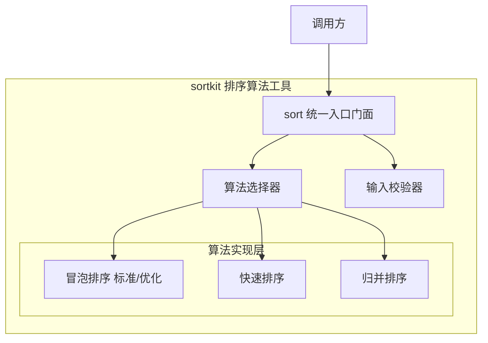
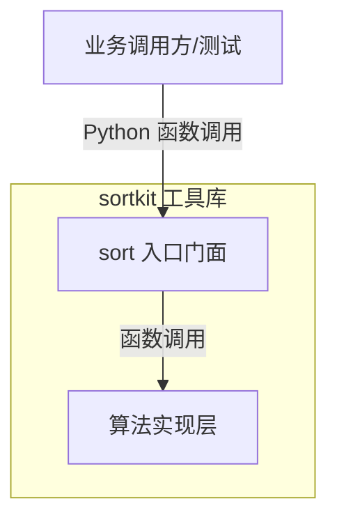
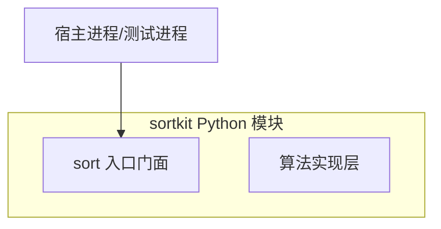
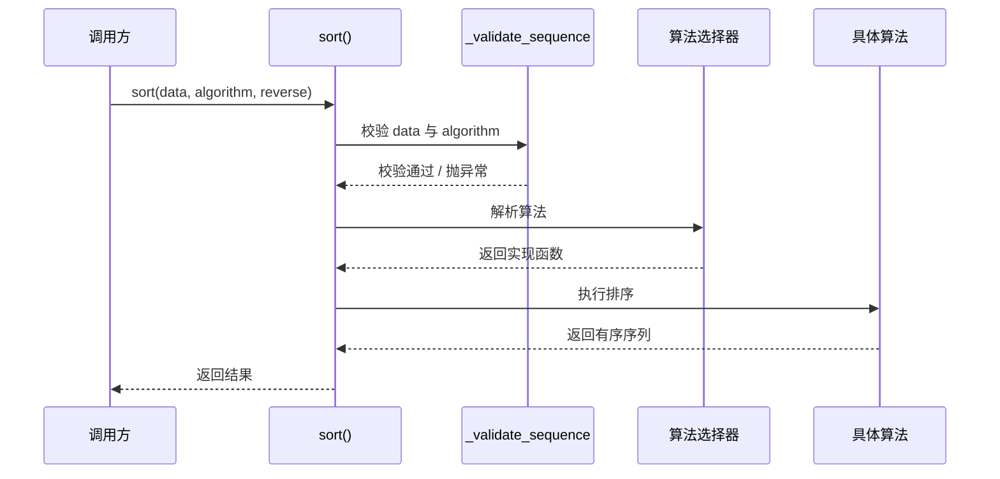
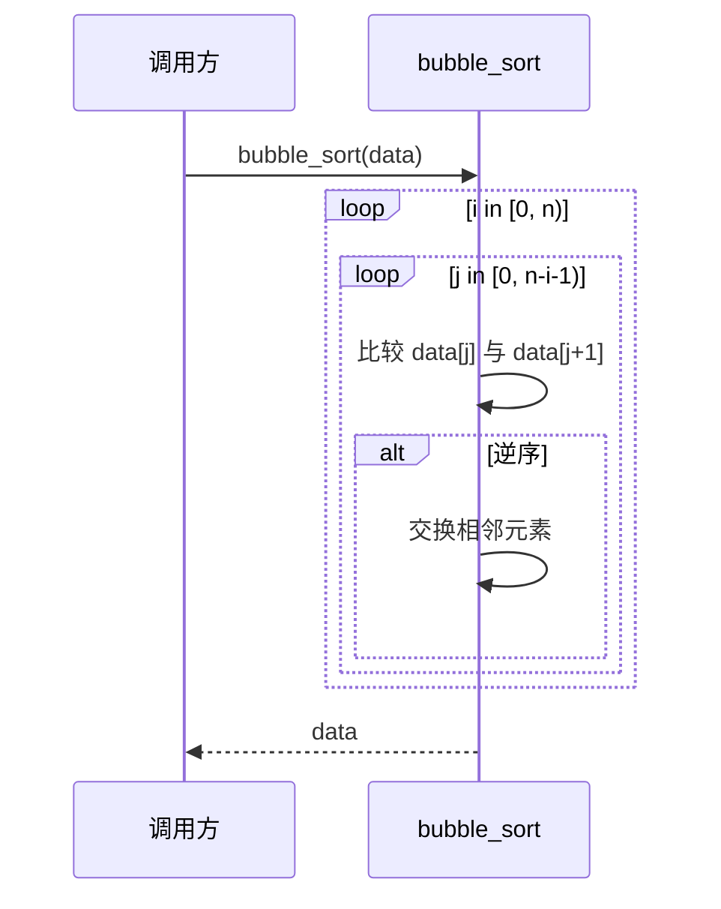
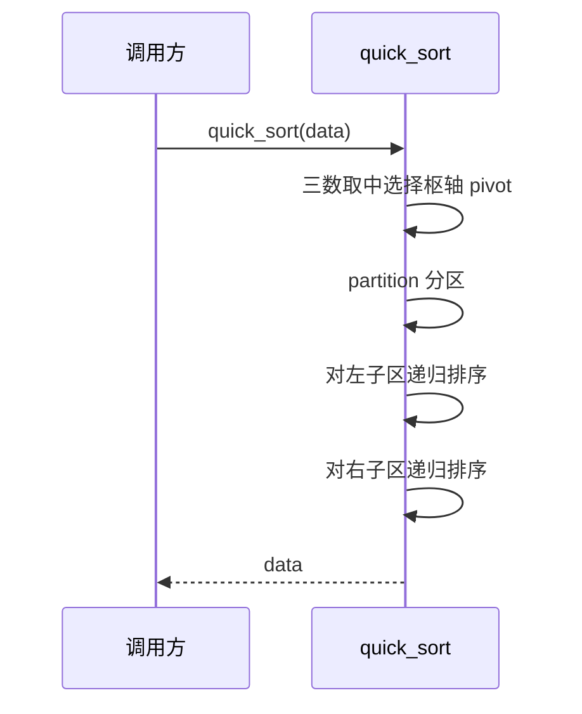
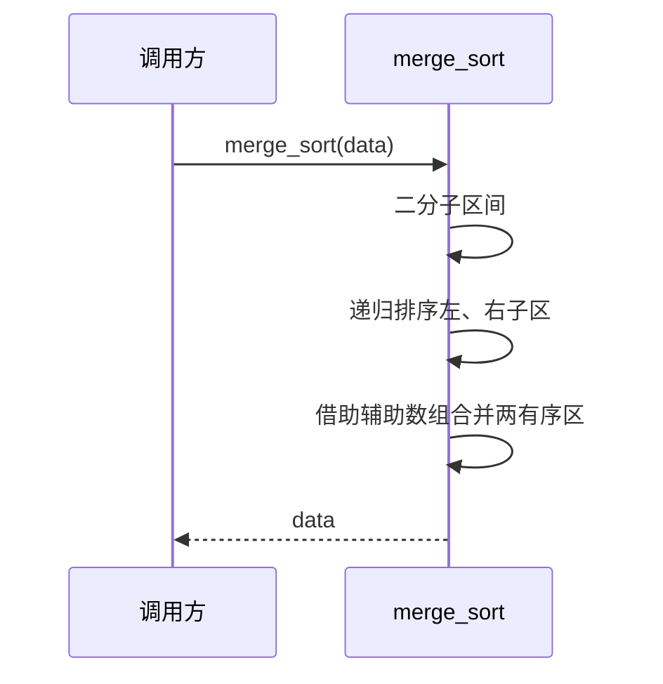

> **文档元信息**
>
> | 项目 | 内容 |
> |------|------|
> | 文档版本 | v1.0 |
> | 作者 | AiWork（系分生成） |
> | 创建日期 | 2026-09-22 |
> | 需求来源 | 需求描述「创建一个排序算法」 |
> | 评审状态 | 待评审 |

# 排序算法 系分设计

## 1. 需求与范围

### 1.1 背景与目标

用户需求为「创建一个排序算法」。当前仓库（`manyu_test`）已存在一份 Python 冒泡排序实现（`bubble_sort.py`），本系分在此基础上，设计一个职责单一、可复用、可测试、可扩展的排序算法能力，为下游「编码实现」阶段提供明确的模块划分、接口约定与算法选型依据。

**目标**：
- 提供对同类型可比较元素的通用排序能力，支持原地排序与返回有序结果。
- 支持多种排序算法（冒泡、插入、快速、归并），并提供统一的调用入口与算法选择能力。
- 边界与异常场景（空数组、单元素、重复元素、反向有序、大数据量）行为明确、结果稳定。

### 1.2 核心功能

1. 对可比较元素列表（整型、字符串等）执行升序排序。
2. 提供标准冒泡排序与优化冒泡排序（提前终止）。
3. 提供快速排序（默认算法）与归并排序（稳定排序选择）。
4. 提供统一排序入口 `sort(data, algorithm)`，支持算法名选择与默认算法协商。

### 1.3 约束与非功能要求

- 排序算法为纯内存计算，无外部依赖、无持久化、无 I/O。
- 时间复杂度需在文档中明示；默认算法（快速排序）平均 O(n log n)，最坏 O(n²)（通过随机化/三数取中优化）。
- 空间复杂度：原地算法 O(1)（冒泡/插入/快速），归并排序 O(n) 辅助空间。
- 稳定性要求：当元素存在相等键且需保持相对顺序时，需提供稳定排序（插入/归并）。

### 1.4 排除范围

- 不涉及分布式排序、外部归并排序（MR/Spark 等大数据场景）。
- 不涉及对对象按多字段/自定义比较器的复杂排序（首版仅支持自然序比较，可扩展点为后续迭代）。
- 不涉及 UI、接口服务、数据库与消息队列。

### 1.5 需求功能清单与优先级

| 编号 | 功能点 | 优先级 | PRD 原始描述/章节 | 备注 |
|------|--------|--------|-------------------|------|
| F01 | 通用排序能力（统一入口，默认算法） | P0 | 「创建一个排序算法」 | 统一入口满足通用排序诉求 |
| F02 | 冒泡排序（标准 + 优化） | P0 | 「创建一个排序算法」 | 延续仓库既有实现，保持兼容 |
| F03 | 快速排序（默认） | P1 | 「创建一个排序算法」 | 大数据量性能兜底 |
| F04 | 归并排序（稳定排序） | P1 | 「创建一个排序算法」 | 稳定排序诉求 |
| F05 | 边界与异常处理 | P0 | 「创建一个排序算法」 | 空/单元素/重复元素处理 |

### 1.6 假设与待确认项

| 编号 | 假设/待确认内容 | 当前假设 | 确认状态 |
|------|-----------------|----------|----------|
| A01 | 目标实现语言 | Python 3（仓库既有 `bubble_sort.py` 为 Python，保持技术栈一致） | 待确认 |
| A02 | 排序方向 | 默认升序 | 待确认 |
| A03 | 比较范围 | 仅支持自然序可比较类型（int/str 等） | 待确认 |
| A04 | 排序语义 | 原地排序并返回同一列表引用（与既有 `bubble_sort` 一致） | 待确认 |
| A05 | 默认算法 | 快速排序；未显式指定时使用 | 待确认 |

## 2. 架构与模块

### 2.1 功能架构

本项目为轻量工具库形态，采用「入口门面 + 算法实现」两层结构，无服务分层。



- 入口门面层：统一外部调用契约，负责输入校验、默认算法协商、算法分发与统一返回。
- 算法实现层：每个算法独立函数实现，互不依赖，可单独调用、单独测试。

**模块清单**

| 模块 | 职责 | 依赖 |
|------|------|------|
| sort 入口门面 `sort()` | 统一入口、参数校验、算法选择、返回结果 | 算法选择器、输入校验器 |
| 算法选择器 | 根据 algorithm 参数映射到具体实现，处理未知算法名 | 无 |
| 冒泡排序模块 `bubble_sort` / `bubble_sort_optimized` | 标准与优化冒泡排序 | 无 |
| 快速排序模块 `quick_sort` | 默认排序算法，分区 + 递归 | 无 |
| 归并排序模块 `merge_sort` | 稳定排序算法 | 无 |
| 输入校验器 | 校验入参类型（可迭代、元素可比较） | 无 |

### 2.2 应用集成架构

本能力为纯内存算法工具，无外部系统、无中间件集成。



**集成关系说明：**

| 调用方 | 被调用方 | 协议 | 接口类型 | 说明 |
|--------|----------|------|----------|------|
| 业务调用方 | sortkit 入口门面 | Python 函数调用（进程内） | 内部方法（S01） | 无网络、无 I/O |
| 入口门面 | 算法实现层 | Python 函数调用（进程内） | 内部方法 | 分发到具体算法 |

### 2.3 部署架构

本能力无独立部署形态：作为 Python 模块随宿主进程运行，无网络、无存储、无单点问题。



- 部署说明：以 Python 包/模块形式随可执行单元（脚本、服务、测试）加载，占用内存随入参规模线性增长，无单点。

## 3. 数据模型与存储

本能力为纯内存计算，**不涉及持久化存储实体**。

- 本项不适用，原因：排序算法直接操作内存中的列表/序列，无数据库实体、无缓存、无 MQ。输入为运行时传入的序列，输出为原地重排后的序列（或有序副本），生命周期局限于函数调用栈。

虽无数据库实体，仍约定运行期数据形态：

| 数据形态 | 说明 |
|----------|------|
| 输入序列 | 可迭代、元素支持 `<` 比较的序列（list 等） |
| 输出序列 | 原地排序后的同一序列（返回引用）；归并排序内部使用长度为 n 的辅助数组 |

## 4. 接口设计

按仓库技术栈（Python 工具库）梳理接口列表，以「内部方法（函数签名）」形态描述。

### 4.1 oneapi（Web 控制台接口）

本项不适用，原因：无 Web 服务形态。

### 4.2 OpenAPI（对外接口）

本项不适用，原因：无对外网络接口。

### 4.3 内部接口（函数层）

| 编号 | 接口名称 | 类/模块 | 方法签名 |
|------|----------|---------|----------|
| S01 | 统一排序入口 | sortkit | `sort(data, algorithm='quick', reverse=False)` |
| S02 | 标准冒泡排序 | sortkit | `bubble_sort(data)` |
| S03 | 优化冒泡排序 | sortkit | `bubble_sort_optimized(data)` |
| S04 | 快速排序 | sortkit | `quick_sort(data)` |
| S05 | 归并排序 | sortkit | `merge_sort(data)` |
| S06 | 输入校验 | sortkit | `_validate_sequence(data)`（内部辅助） |

### 4.4 集成接口（Integration 层）

本项不适用，原因：无外部系统调用。

## 5. 功能模块设计

### 5.0 全局约定

- 错误码格式：因无服务形态，采用异常体系替代错误码；约定自定义异常 `SortError`，子类 `InvalidInputError`（非法入参）、`NotComparableError`（元素不可比较）。
- 通用出参结构：本项不适用（函数直接返回序列，无 code/msg/data 包装）。
- 命名：函数采用 `snake_case`（冒泡 `bubble_sort`、快速 `quick_sort`、归并 `merge_sort`），与仓库既有风格一致。

### 5.1 排序算法模块

#### 5.1.1 数据结构设计

本能力无持久化表结构。运行期核心数据为「输入序列」与「辅助数组」，约束如下：

| 数据结构 | 说明 | 约束 |
|----------|------|------|
| 输入序列 `data` | 待排序的可变序列 | 可迭代；元素相互可比较；允许空 |
| 辅助数组（归并） | 归并排序临时缓冲 | 长度 = n，函数栈/局部变量，用后释放 |

本模块无枚举/常量定义（算法名以字符串常量 `ALGORITHMS = ['bubble', 'bubble_optimized', 'quick', 'merge']` 注册）。

#### 5.1.2 接口详细设计

##### S01 统一排序入口

- **方法签名**: `sort(data, algorithm='quick', reverse=False)`
- **描述**: 统一排序入口，校验入参、解析算法、分发执行并返回结果。
- **入参**:

| 参数名称 | 类型 | 是否必填 | 描述 |
|----------|------|----------|------|
| data | Sequence[T] | 是 | 待排序序列（原地排序） |
| algorithm | str | 否 | 算法名：bubble / bubble_optimized / quick / merge，默认 quick |
| reverse | bool | 否 | 是否降序，默认 False（升序） |

- **出参**:

| 参数名称 | 类型 | 描述 |
|----------|------|------|
| result | Sequence[T] | 排序后的同一序列（原地排序，同时返回引用） |

- **错误码/异常**:

| 异常 | 说明 |
|------|------|
| InvalidInputError | data 非序列或算法名不在注册表 |
| NotComparableError | 元素间不做比较运算（比较时抛出 TypeError 包装） |

- **业务规则**: 未指定 algorithm 时默认 quick；reverse=True 时在算法选择前包装比较（比较结果取反）实现降序。
- **请求示例**:

```json
{ "data": [5, 1, 4, 2, 8], "algorithm": "quick", "reverse": false }
```

- **响应示例**:

```json
{ "result": [1, 2, 4, 5, 8] }
```

##### S02~S05 具体算法函数

| 接口 | 签名 | 时间复杂度（平均/最坏） | 空间复杂度 | 稳定性 |
|------|------|------------------------|-----------|--------|
| S02 | `bubble_sort(data)` | O(n²) / O(n²) | O(1) | 稳定 |
| S03 | `bubble_sort_optimized(data)` | O(n) 最好（已有序）/ O(n²) | O(1) | 稳定 |
| S04 | `quick_sort(data)` | O(n log n) / O(n²)（三数取中规避） | O(log n) 栈 | 不稳定 |
| S05 | `merge_sort(data)` | O(n log n) / O(n log n) | O(n) | 稳定 |

#### 5.1.3 子功能详细设计

##### 5.1.3.1 统一排序入口（F01）

- 处理时序图



**业务规则：**

| 规则编号 | 规则描述 | 校验时机 | 不满足时的处理 |
|----------|----------|----------|--------------|
| R01 | data 必须为可变序列（list 等） | 始终 | 抛 InvalidInputError |
| R02 | algorithm 若指定，必须在注册表 ALGORITHMS 内 | 始终 | 抛 InvalidInputError |
| R03 | 未指定 algorithm 时默认 quick | 始终 | 静默采用默认 |
| R04 | reverse=True 时结果降序 | 执行前 | 以取反比较实现 |

**异常场景：**

| 异常场景 | 处理方式 |
|----------|----------|
| data 为 None | 抛 InvalidInputError，提示「入参不能为空」 |
| 空序列 [] | 直接返回空序列，不进入循环 |
| 单元素序列 | 直接返回，无交换 |
| 元素类型不可比较（如 int 与 str 混排） | 比较时抛出 TypeError，包装为 NotComparableError |
| 算法名拼写错误 | 抛 InvalidInputError，提示合法取值 |

**并发控制：** 本能力为纯函数式内存计算，无共享可变状态、无写入，不涉及并发。

**状态机设计：** 本实体不存在状态字段，本项不适用。

##### 5.1.3.2 冒泡排序（F02）

- 处理时序图



**业务规则：**

| 规则编号 | 规则描述 | 校验时机 | 不满足时的处理 |
|----------|----------|----------|--------------|
| R05 | 每轮将最大元素「冒泡」至未排序区末尾 | 每轮遍历 | 天然满足 |
| R06 | 优化版维护 swapped 标志，某轮无交换则提前终止 | 每轮结束 | 无交换即 break |

**异常场景：**

| 异常场景 | 处理方式 |
|----------|----------|
| 空/单元素序列 | 内层循环不执行，直接返回 |
| 已有序序列（优化版） | 首轮无交换，提前终止，O(n) |

**并发控制：** 不涉及。

**状态机设计：** 不适用。

##### 5.1.3.3 快速排序（F03，默认）

- 处理时序图



**业务规则：**

| 规则编号 | 规则描述 | 校验时机 | 不满足时的处理 |
|----------|----------|----------|--------------|
| R07 | pivot 采用三数取中（首/中/尾），规避最坏退化 | 每次分区 | 降低已序/近序数据退化风险 |
| R08 | 子区长度 ≤ 阈值时切换插入排序优化小规模 | 递归前 | 减少递归开销 |

**异常场景：**

| 异常场景 | 处理方式 |
|----------|----------|
| 反向有序输入 | 三数取中避免了 O(n²) 最坏退化 |
| 大量重复元素 | 三路分区可选优化（注：首版采用两路分区，重复元素场景结果仍正确） |

**并发控制：** 不涉及。

**状态机设计：** 不适用。

##### 5.1.3.4 归并排序（F04，稳定）

- 处理时序图



**业务规则：**

| 规则编号 | 规则描述 | 校验时机 | 不满足时的处理 |
|----------|----------|----------|--------------|
| R09 | 合并时取左区元素优先，保证稳定性 | 合并 | 相等元素保持原相对顺序 |
| R10 | 辅助缓冲长度 = n，合并后内容回写 data | 合并阶段 | 结果落地到原序列 |

**异常场景：**

| 异常场景 | 处理方式 |
|----------|----------|
| 空/单元素序列 | 递归基准条件直接返回 |

**并发控制：** 不涉及。

**状态机设计：** 不适用。

#### 5.1.4 技术选型方案对比

| 方案 | 时间复杂度 | 空间复杂度 | 稳定性 | 优劣 |
|------|-----------|-----------|--------|------|
| 方案 A：快速排序（默认） | 平均 O(n log n) | O(log n) | 不稳定 | 优：平均性能最优、工业界最常用；劣：需三数取中规避最坏 |
| 方案 B：归并排序（稳定选择） | O(n log n) 稳定 | O(n) | 稳定 | 优：稳定、无最坏退化；劣：需 O(n) 辅助空间 |
| 方案 C：冒泡排序（教学/兼容） | O(n²) | O(1) | 稳定 | 优：实现简单、原地；劣：大规模性能差 |

**推荐方案**：以方案 A（快速排序）为默认，方案 B（归并排序）作为稳定排序补充，方案 C（冒泡）保持既有兼容与教学用途。

**推荐理由**：通用场景下快速排序平均性能最优且原地占用小；稳定性诉求由归并排序兜底；冒泡排序保留以满足仓库既有实现兼容与简单场景，形成「默认快 + 稳定可选 + 简单兼容」的完整能力矩阵。

#### 5.1.5 模块自检

**完备性对账表：**

| 功能点编号 | 是否有对应设计 | 设计位置 |
|-----------|--------------|----------|
| F01 | 是 | 5.1.3.1 |
| F02 | 是 | 5.1.3.2 |
| F03 | 是 | 5.1.3.3 |
| F04 | 是 | 5.1.3.4 |
| F05 | 是 | 5.1.2 异常场景 + 各子功能异常场景 |

**过度设计检查：** 不引入对象级比较器、不引入排序算法策略模式与 SPI 插件化，首版以注册表 + 字符串分发满足需求，避免过度抽象。

## 6. 非功能性需求设计

### 6.1 高可用性

本项不适用，原因：纯内存工具函数，无上下游服务、无外部依赖，不存在可用性降级场景。

### 6.2 可扩展性

- 算法扩展：新增算法仅需实现独立函数并在 `ALGORITHMS` 注册表登记，符合开闭原则。
- 入口稳定：`sort()` 契约不随算法新增而变化，调用方零改造。
- 比较扩展：后续如需对象多字段排序，可在 `sort()` 增加可选 `key` 参数，不影响既有自然序调用。

### 6.3 稳定性/可靠性

- 边界稳定性：空序列、单元素、重复元素、反向有序、大规模随机输入结果均正确。
- 算法确定性：同为不稳定算法下，输出仍为确定的有序结果（稳定性仅影响相等元素的相对顺序）。
- 数据规模：n 较大时默认快速排序避免 O(n²)；极大规模（如百万级）建议由上游评估改用外部排序，超出本能力范围（已在排除范围声明）。

### 6.4 安全性设计

- 6.4.1 账户系统方案：本项不适用，无账户体系。
- 6.4.2 授权&访问控制：本项不适用，无网络面、无数据库查询，为进程内公共算法。
- 6.4.3 数据防护：本项不适用，排序不存储、不展示、不传输敏感数据；不涉及加密/脱敏。

### 6.5 监控/统计/日志/告警

本项不适用，原因：工具函数无独立运行期，不产生日志与告警诉求；如有性能度量需求，由调用方在宿主进程中自行埋点（配合第 7 章可监控）。

## 7. 变更三板斧

### 7.1 可监控

- 若工具嵌入服务运行，可在 `sort()` 入口/出口埋点：记录 `algorithm`、`n`（入参规模）、处理耗时；异常路径记录异常类型。
- 建议阈值告警：单次排序耗时超过宿主 SLO 阈值时告警，用于发现输入规模异常或算法回退（如快速排序退化）迹象。

### 7.2 可灰度

本功能为确定性纯算法，可灰度性主要通过算法切换体现：`sort(data, algorithm=...)` 允许按调用方维度灰度切换算法（例如先对部分租户启用 quick，其余保持 bubble），并可通过配置中心下发默认算法名实现动态灰度，无需发版。

### 7.3 可应急

- 保留「算法开关」：默认算法名可由配置/入参覆盖，出现新算法性能问题时，可一键将默认算法回退至既有的冒泡排序实现，快速止血，无需回滚代码包。
- 回滚兜底：算法实现为纯新增函数，保持 `bubble_sort` 旧签名不变；新增能力部署后如需整体回滚，旧版调用方（仅使用 `bubble_sort`）不受影响，上下游兼容。

## 8. 方案检查

| 检查项 | 结果 | 说明 |
|------|------|------|
| 模块划分合理性检查 | 通过 | 入口门面/算法实现层职责单一，无循环依赖，无超 50% 功能点模块 |
| 依赖关系合理性 | 通过 | 算法层零外部依赖，无可用性风险 |
| 单点问题检查（部署层面） | 不适用 | 进程内模块，无部署单点 |
| 表模型设计范式检查 | 不适用 | 无持久化表 |
| 隐私安全检查 | 不适用 | 无敏感信息 |
| 兼容性检查（接口） | 通过 | 新增 `sort()`，既有 `bubble_sort`/`bubble_sort_optimized` 签名不变 |
| 兼容性检查（表） | 不适用 | 无表变更 |
| 数据迁移检查 | 不适用 | 无数据 |
| 一致性检查（功能点） | 通过 | F01~F05 均在设计中有对应 |
| 一致性检查（表） | 不适用 | Step 3 无实体 |
| 一致性检查（接口） | 通过 | Step 4 的 S01~S06 均在 5.1.2 有详细定义 |
| 一致性检查（枚举） | 通过 | ALGORITHMS 注册表与接口入参 algorithm 取值一致 |
| 状态机完整性检查 | 不适用 | 无状态实体 |
| 并发风险检查 | 通过 | 纯内存无共享状态，无并发风险 |
| 单点问题检查（定时任务层面） | 不适用 | 无定时任务 |
| 非功能性设计可行性检查 | 通过 | 排除不适用项，可扩展性/稳定性有落地 |
| 变更三板斧设计可行性检查（可监控） | 通过 | 埋点建议可行（由宿主进程承担） |
| 变更三板斧设计可行性检查（可灰度） | 通过 | 通过 `algorithm` 入参 + 配置下发切换算法灰度 |
| 变更三板斧设计可行性检查（可应急） | 通过 | 默认算法一键回退冒泡，旧签名兼容 |

## 9. 假设与待确认项汇总

详见 1.6 节：A01 语言选型（Python）、A02 升序、A03 自然序比较、A04 原地排序语义、A05 默认快速排序。以上均已按最合理解释在设计内直接采用并将继续推进。