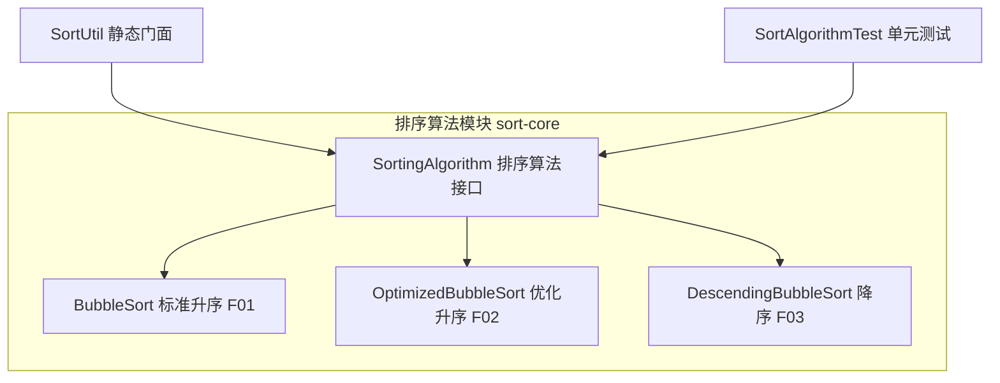
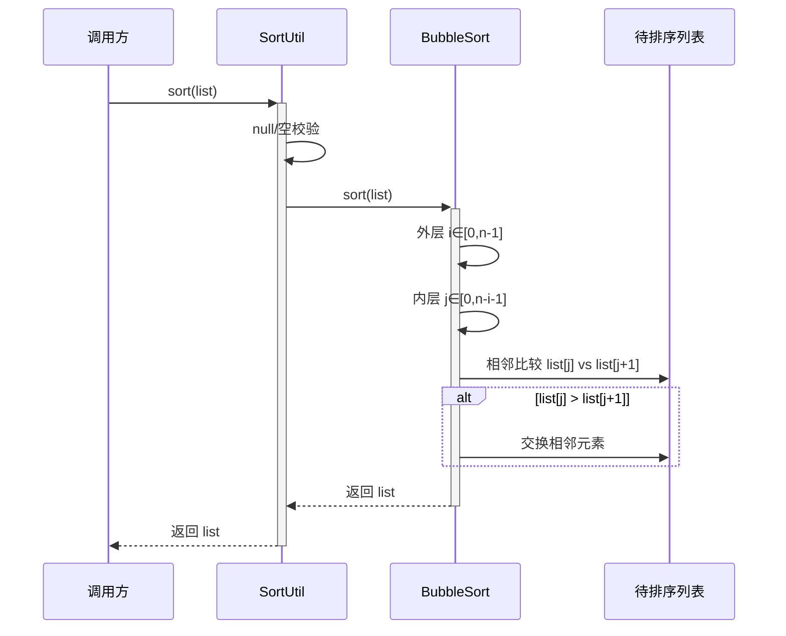

> **文档元信息**
>
> | 项目 | 内容 |
> |------|------|
> | 文档版本 | v1.0 |
> | 作者 | AiWork |
> | 创建日期 | 2026-09-22 |
> | 需求来源 | 任务需求「写一个排序算法」（close scenario：仓库已有基线 bubble_sort.py） |
> | 评审状态 | 待评审 |

# 排序算法 系分设计

## 1. 需求与范围

### 背景与目标
实现一个排序算法，对一组可比较元素进行升序/降序排序。仓库当前在 `main` 分支已存在一份 Python 冒泡排序基线实现（`bubble_sort.py`，提供标准版 `bubble_sort`、优化版 `bubble_sort_optimized`、降序版 `bubble_sort_descending`）。本设计以此为业务语义基准，完成算法功能的系统分析与设计。

### 核心功能
- 标准升序排序（P0）
- 优化版升序排序（无交换时提前终止，最优 O(n)）（P0）
- 降序排序（P1）

### 约束与非功能要求
- 正确性：对任意可比较输入产出有序结果。
- 稳定性：相等元素相对次序保持不变。
- 性能：最坏/平均 O(n²)，最优 O(n)（优化版）。
- 空间：O(1) 额外空间（原地排序）。
- 边界：空列表、单元素、有序、逆序、全等元素、含负数等场景结果稳定可靠。

### 排除范围
- 不提供 REST/OpenAPI 网络接口、不涉及数据库/缓存/消息队列。
- 不支持分布式/并行排序、不支持外部 Comparator 注入、不做持久化。

### 需求功能清单与优先级

| 编号 | 功能点 | 优先级 | 原始描述/来源 | 备注 |
|------|--------|--------|---------------|------|
| F01 | 标准升序排序（冒泡） | P0 | 「写一个排序算法」→ 基础升序 | 与仓库 bubble_sort 对齐 |
| F02 | 优化版升序排序（无交换提前终止） | P0 | 与仓库 bubble_sort_optimized 对齐 | 最优 O(n) |
| F03 | 降序排序（冒泡） | P1 | 与仓库 bubble_sort_descending 对齐 | 比较条件取反 |

### 假设与待确认项

| 编号 | 假设/待确认内容 | 当前假设 | 确认状态 |
|------|-----------------|----------|----------|
| A01 | 实现语言 | Java（工作流为「Java 研发工作流」，编码/评审阶段均为 Java 技能） | 待确认 |
| A02 | 算法选型 | 冒泡排序三变体（仓库已有 bubble_sort.py 作为基线语义） | 待确认 |
| A03 | 稳定性 / 空间复杂度 | 稳定排序、O(1) 额外空间 | 待确认 |
| A04 | 对外接口 | 不提供 Web/OpenAPI 接口，纯内存工具模块 | 待确认 |
| A05 | 空输入策略 | 空列表/单元素直接原样返回，不视为错误 | 待确认 |
| A06 | 非法输入策略 | 无内层值可比较（ClassCastException）时推荐 throws/抛 IllegalArgumentException | 待确认 |

## 2. 架构与模块

### 功能架构

- **核心层说明**：`SortingAlgorithm` 定义统一排序接口；三个实现分别覆盖 F01/F02/F03，职责单一、互换无副作用。
- **门面层说明**：`SortUtil` 对外暴露静态方法（sort / sortOptimized / sortDescending），默认走优化版实现，屏蔽实现细节，便于后续替换算法。
- **交互层/集成层说明**：不适用，纯内存工具模块，无 Web 控制台与外部门面。

### 模块清单

| 模块 | 职责 | 依赖 |
|------|------|------|
| sort-core 排序核心 | 定义排序算法接口与三种冒泡实现 | 无 |
| sort-facade 排序门面 | 编排排序入口，默认优化版实现 | sort-core |
| 质量验证（单元测试） | 覆盖基准用例与边界，验证正确性/稳定性/复杂度行为 | sort-core、sort-facade |

### 应用集成架构

本项不适用，原因：无外部业务系统、数据库/缓存/MQ 集成，纯 JVM 进程内方法调用。

### 部署架构

本项不适用，原因：非独立部署服务，作为宿主 Java 应用内嵌代码随宿主一起发布（依赖 A04）。

**部署说明**（无图）：随宿主应用发布，无独立实例、无 DB。无单点问题。

## 3. 数据模型与存储

本项不适用，原因：排序算法为纯内存计算，不涉及持久化实体、数据库表、缓存或消息队列；无租户隔离与实体关系设计要求。

> 说明：无实体清单、无实体关系图。

## 4. 接口设计

### 4.1 oneapi（Web 控制台接口）

本项不适用，原因：不对外提供 Web 控制台接口。

### 4.2 OpenAPI（对外接口）

本项不适用，原因：不对外提供开放接口。

### 4.3 内部接口（工具方法签名）

| 编号 | 接口名称 | 类 | 方法签名 |
|------|----------|-----|----------|
| S01 | 标准升序排序 | SortUtil | `List<T> sort(List<T> list)` |
| S02 | 优化升序排序（提前终止） | SortUtil | `List<T> sortOptimized(List<T> list)` |
| S03 | 降序排序 | SortUtil | `List<T> sortDescending(List<T> list)` |

### 4.4 集成接口（Integration 层）

本项不适用，原因：无外部系统。

## 5. 功能模块设计

### 5.1 sort-core（排序算法核心）

#### 5.1.1 表结构设计

本项不适用，原因：纯内存算法，无数据库表。

#### 5.1.2 接口详细设计

##### S01 / S02 / S03 排序接口

- **URI**：本项不适用（内部方法）—— `List<T> sort(List<T> list)` / `sortOptimized` / `sortDescending`
- **描述**：对泛型 `List<T>`（`T extends Comparable<? super T>`）进行原地排序，返回原列表引用（便于链式调用）。
- **入参**：

| 参数名称 | 类型 | 是否必填 | 描述 |
|----------|------|----------|------|
| list | List&lt;T&gt;（T extends Comparable&lt;? super T&gt;） | 是 | 待排序列表；null 抛 IllegalArgumentException |

- **出参**：

| 参数名称 | 类型 | 描述 |
|----------|------|------|
| （返回值） | List&lt;T&gt; | 已排序的同一列表引用（原地排序） |

- **错误码**：本项不适用（无对外状态码；非法入参抛标准 Java 异常 `IllegalArgumentException`）。
- **业务规则**：空列表（size=0）与单元素列表直接返回，不进入循环；比较依赖 `Comparable.compareTo`。
- **请求示例**（伪调用，非 JSON 协议）：
  输入 `[5, 3, 8, 4, 2]` → `sort` 输出 `[2, 3, 4, 5, 8]`。
- **响应示例**：方法直接返回排序后列表，无 JSON 封装。

#### 5.1.3 子功能详细设计

##### 5.1.3.1 标准升序冒泡排序（F01）

- 处理时序图

**业务规则：**

| 规则编号 | 规则描述 | 校验时机 | 不满足时的处理 |
|----------|----------|----------|----------------|
| R01 | 空列表/单元素直接返回 | 入口 | 返回原列表 |
| R02 | 每轮内层比较相邻两元素，若前>后则交换 | 循环内 | 交换后继续 |
| R03 | 每完成一轮，末尾 i 个元素已有序 | 每轮结束 | 内层范围收窄 |

**异常场景：**

| 异常场景 | 处理方式 |
|----------|----------|
| list 为 null | 抛 IllegalArgumentException |
| 元素不可比较（compareTo 抛 ClassCastException） | 向上传播，由调用方处理 |

**并发控制（如涉及数据写入）：**
- 并发场景：同一列表被多线程同时排序/读取。
- 控制策略：无并发控制（工具方法无共享可变状态）；文档说明调用方需自行加锁或使用线程隔离副本。

**状态机设计（如实体存在状态字段）：** 本项不适用，原因：无状态字段实体，为无状态纯函数。

##### 5.1.3.2 优化版升序冒泡排序（F02）

- 处理时序图：与 F01 相同，仅增加每轮 `swapped` 标志；某轮无交换则提前 `break`（无交换说明已有序）。

**业务规则：**

| 规则编号 | 规则描述 | 校验时机 | 不满足时的处理 |
|----------|----------|----------|----------------|
| R04 | 每轮设置 swapped=false，发生交换置 true | 每轮开始/交换时 | 无交换则该轮结束 |
| R05 | 一轮无任何交换即提前终止 | 每轮结束 | 提前退出，最优 O(n) |

**异常场景：** 同 F01。

**并发控制：** 同 F01。

**状态机设计：** 本项不适用，原因：无状态字段。

##### 5.1.3.3 降序冒泡排序（F03）

- 处理时序图：与 F02 相同，仅比较条件取反（`list[j] < list[j+1]` 时交换），并保留 `swapped` 提前终止。

**业务规则：**

| 规则编号 | 规则描述 | 校验时机 | 不满足时的处理 |
|----------|----------|----------|----------------|
| R06 | 相邻元素若前<后则交换（降序） | 循环内 | 交换后继续 |
| R07 | 无交换提前终止 | 每轮结束 | 提前退出 |

**异常场景：** 同 F01。

**并发控制：** 同 F01。

**状态机设计：** 本项不适用，原因：无状态字段。

#### 5.1.4 枚举与常量定义

| 枚举名称 | 取值 | 含义 | 关联字段 |
|----------|------|------|----------|
| SortDirection | ASC | 升序 | 排序方向参数（预留，当前未强制使用） |
| SortDirection | DESC | 降序 | 排序方向参数（预留，当前未强制使用） |

#### 5.1.5 技术选型方案对比

| 方案 | 时间复杂度 | 空间 | 稳定性 | 优劣对比 |
|------|-----------|------|--------|----------|
| 冒泡排序（推荐） | O(n²)/O(n) | O(1) | 稳定 | 实现简单、原地、稳定；与仓库基线语义一致；规模大时效率低 |
| 插入排序 | O(n²)/O(n) | O(1) | 稳定 | 小规模/近乎有序优；但偏离仓库既有基线 |
| 快速排序/归并排序 | O(n log n) | O(log n)/O(n) | 快排不稳定，归并稳定 | 大规模更优，但实现复杂、偏离基线 |

**推荐方案：冒泡排序三变体。** 理由：需求未指定性能规模上限，仓库已有 Python 冒泡基线，改动最小、符合现有事实；对超大规模输入在文档中注明建议切换快速/归并并保留扩展接口。

#### 5.1.6 模块自检

完备性对账：F01/F02/F03 均有实现、时序、业务规则、异常场景设计；无遗漏。
过度设计检查：未引入数据库、缓存、网络层、状态机，符合「算法工具」定位；已通过最小集合满足需求。

### 5.2 跨模块调用链

本项不适用，原因：仅单模块（sort-core）+ 门面，无跨模块调用链。

## 6. 非功能性需求设计

### 6.1 高可用性
本项不适用，原因：无服务化部署与外部依赖，不存在上下游降级/容错切换场景；算法为纯内存同步方法。

### 6.2 可扩展性
- 通过 `SortingAlgorithm` 接口抽象可新增算法实现（如快速/归并）。
- 排序方向通过 `SortDirection` 枚举扩展。
- 门面默认实现可配置切换，无需改动调用方。

### 6.3 稳定性/可靠性
- 边界（空、单元素、有序、逆序、全等、含负数）结果稳定可靠。
- 优化版对已有序输入 O(n) 提前终止，保证确定性输出。
- 稳定排序：相等元素相对次序不变。

### 6.4 性能
- 最坏/平均 O(n²)，最优 O(n)；O(1) 额外空间。
- 大规模输入建议：n > 1000 时建议切换快速/归并排序（本设计保留接口扩展，不强制实现）。
- 缓存策略：本项不适用，原因：无缓存依赖，不存在缓存击穿/雪崩场景。

### 6.5 安全性设计
本项不适用，原因：无账户系统、无网络传输、无数据库查询、无敏感数据；为纯内存算法模块，无登录态/权限/数据加密脱敏需求。

### 6.6 监控/统计/日志/告警
- 门面入口可选埋点（DEGUG 级别）：排序规模 n、排序方向、耗时，供性能回归观察。
- 无第三方依赖，无需三方服务埋点。

## 7. 变更三板斧

### 7.1 可监控
- 门面调用埋点：排序规模、方向、耗时（Debug 级别日志）。
- 纯方法实现，无第三方调用点。

### 7.2 可灰度
- 通过接口抽象 + 配置开关指定默认实现，先小范围启用优化版（F02），验证后全量；无需租户级灰度（工具模块无租户概念）。

### 7.3 可应急
- 保留标准版实现（F01 最简基线），配置一键回切标准版；纯计算无上游持久化依赖，回切零数据兼容风险。
- 若未来引入高效算法，可配置切回冒泡基线，避免回滚衍生问题。

## 8. 假设与待确认项汇总

| 编号 | 假设/待确认内容 | 当前假设 | 确认状态 |
|------|-----------------|----------|----------|
| A01 | 实现语言 | Java | 待确认 |
| A02 | 算法选型 | 冒泡排序三变体 | 待确认 |
| A03 | 稳定性 / 空间 | 稳定、O(1) 额外空间 | 待确认 |
| A04 | 对外接口 | 无 Web/OpenAPI | 待确认 |
| A05 | 空输入策略 | 空/单元素原样返回 | 待确认 |
| A06 | 非法输入策略 | 抛 IllegalArgumentException / 传播 ClassCastException | 待确认 |

## 9. 方案检查结果（Step 9）

| 检查项 | 结果 |
|--------|------|
| 模块划分合理性检查 | 通过（单模块 + 门面，无循环依赖，无超 50% 功能点模块） |
| 依赖关系合理性 | 通过（无集成依赖） |
| 单点问题检查（部署层面） | 不适用（非独立部署服务） |
| 表模型设计范式检查 | 不适用（无表） |
| 隐私安全检查 | 不适用（无敏感数据） |
| 兼容性检查（接口） | 通过（新增接口，无旧调用方兼容负担） |
| 兼容性检查（表） | 不适用（无表） |
| 数据迁移检查 | 不适用（无表） |
| 一致性检查（功能点） | 通过（F01/F02/F03 均有 5.1.3 对应设计） |
| 一致性检查（表） | 不适用（Step 3 无实体） |
| 一致性检查（接口） | 通过（S01/S02/S03 均有 5.1.2 对应定义） |
| 一致性检查（枚举） | 通过（SortDirection 与字段说明一致） |
| 状态机完整性检查 | 不适用（无状态字段） |
| 并发风险检查 | 通过（无共享可变状态，说明调用方加锁） |
| 单点问题检查（定时任务层面） | 不适用（无定时任务） |
| 非功能性设计可行性检查 | 通过 |
| 变更三板斧设计可行性检查（可监控） | 通过（Debug 埋点） |
| 变更三板斧设计可行性检查（可灰度） | 通过（配置切换默认实现） |
| 变更三板斧设计可行性检查（可应急） | 通过（一键回切标准版基线） |