> **文档元信息**
>
> | 项目 | 内容 |
> |------|------|
> | 文档版本 | v1.0 |
> | 作者 | AiWork 系分引擎 |
> | 创建日期 | 2026-09-08 |
> | 需求来源 | 需求描述：分别写三个接口helloworld、哈希算法以及冒泡排序；前端新增页面展示；导出按钮；埋点统计；可视化报表 |
> | 评审状态 | 待评审 |

# 三接口前后端全链路系统设计

## 1. 需求与范围

### 背景与目标
构建一个三接口演示平台，包含后端三个 RESTful 接口（HelloWorld、哈希算法、冒泡排序）和前端可视化页面，支持数据导出、调用埋点统计及可视化报表。

### 核心功能
1. 提供三个后端接口：HelloWorld GET 接口、哈希算法 POST 接口（MD5/SHA256）、冒泡排序 POST 接口
2. 前端页面通过 Tab 切换展示三个接口的执行结果
3. 每个 Tab 页提供导出按钮（JSON/CSV 格式），后端提供统一导出接口
4. 后端埋点记录每次接口调用的调用人、人员类型、人员层级、人员部门等维度信息
5. 前端报表页面可视化展示调用统计（折线图、饼图、柱状图三种图表形式），支持按人员类型/层级/部门等维度切换

### 约束与非功能要求
- 所有接口返回 JSON 格式
- 跨域支持（Flask-CORS）
- 埋点数据存储：纯内存 dict（测试场景，无需数据库）
- 前端框架：React 18 + TypeScript + Vite
- 后端框架：Flask（Python 3）
- 图表库：ECharts

### 排除范围
- 不涉及用户认证/登录体系
- 不涉及数据库持久化
- 不涉及生产部署（仅开发环境验证）

### 需求功能清单与优先级

| 编号 | 功能点 | 优先级 | PRD 原始描述 | 备注 |
|------|--------|--------|-------------|------|
| F01 | HelloWorld 接口（GET /api/hello） | P0 | 分别写三个接口helloworld | 返回问候语和时间戳 |
| F02 | 哈希算法接口（POST /api/hash） | P0 | 哈希算法 | 支持 MD5 和 SHA256 |
| F03 | 冒泡排序接口（POST /api/bubble-sort） | P0 | 冒泡排序 | 包装已有 bubble_sort.py |
| F04 | 前端三 Tab 页面 | P0 | 前端新增一个页面，有三个tab分别展示不同的执行结果 | React 组件 |
| F05 | 导出按钮（前端） | P0 | 新增导出按钮 | 每个 Tab 页内置 |
| F06 | 后端导出接口（GET /api/export） | P0 | 后台提供导出接口，支持导出各个页面的展示结果 | JSON/CSV 格式 |
| F07 | 后端埋点中间件 | P0 | 后端再做个埋点，获取调用次数和调用人 | 装饰器模式 |
| F08 | 报表数据接口（GET /api/stats） | P0 | 可视化出来一个报表查看调用情况 | 按维度聚合 |
| F09 | 前端报表可视化 | P0 | 折线图以及饼图和柱状图不同展示形式 | ECharts 三种图表 |
| F10 | 维度切换（人员类型/层级/部门） | P0 | 根据不同的维度：人员类型、人员层级、人员部门等 | 前端维度选择器 |

### 假设与待确认项

| 编号 | 假设/待确认内容 | 当前假设 | 确认状态 |
|------|-----------------|----------|----------|
| A01 | 埋点维度信息通过 HTTP Header 传入 | 假设：X-Caller/X-Role/X-Level/X-Department 头 | 待确认 |
| A02 | 测试场景不需要持久化存储 | 假设：纯内存存储 | 待确认 |
| A03 | 前端与后端运行在同机开发环境 | 假设：Vite proxy 代理到 localhost:5000 | 待确认 |
| A04 | 冒泡排序使用优化版 `bubble_sort_optimized` | 基于已有 `bubble_sort.py` 中的实现 | 已确认 |
| A05 | 报表图表类型支持同时切换 | 假设：用户可分别选择维度 + 图表类型 | 待确认 |

## 2. 架构与模块

### 功能架构

```mermaid
graph TB
    subgraph 前端[manyu_test1 前端 React+Vite]
        Browser[用户浏览器]
        subgraph TabPages[Tab 页面]
            HelloTab[HelloWorld Tab]
            HashTab[哈希算法 Tab]
            SortTab[冒泡排序 Tab]
            StatsTab[报表统计 Tab]
        end
        ExportBtn[导出按钮]
        Charts[ECharts 可视化]
    end

    subgraph 后端[manyu_test 后端 Flask]
        subgraph APILayer[API 层]
            HelloAPI[/api/hello]
            HashAPI[/api/hash]
            SortAPI[/api/bubble-sort]
            ExportAPI[/api/export]
            StatsAPI[/api/stats]
        end
        subgraph Middleware[中间件层]
            Tracker[埋点追踪器]
        end
        subgraph Service[服务层]
            BubbleSort[冒泡排序 bubble_sort.py]
        end
        subgraph Data[数据层]
            MemoryStore[(内存 dict 埋点存储)]
        end
    end

    Browser -->|HTTP| HelloAPI
    Browser -->|HTTP| HashAPI
    Browser -->|HTTP| SortAPI
    Browser -->|HTTP| ExportAPI
    Browser -->|HTTP| StatsAPI

    HelloAPI --> Tracker
    HashAPI --> Tracker
    SortAPI --> Tracker
    ExportAPI --> Tracker
    SortAPI --> BubbleSort
    Tracker --> MemoryStore
    StatsAPI --> MemoryStore
```

### 模块清单

| 模块 | 职责 | 所属仓库 | 依赖 |
|------|------|----------|------|
| API 路由模块 | 提供 5 个 RESTful 接口 | manyu_test | Flask, middleware/tracker, bubble_sort |
| 埋点中间件模块 | 记录调用信息（调用人/角色/层级/部门/时间戳） | manyu_test | Flask request/g |
| 冒泡排序服务模块 | 提供冒泡排序算法实现（已有代码） | manyu_test | 无（纯算法） |
| 前端页面模块 | 三 Tab 页面展示 + 报表页面 | manyu_test1 | React, ECharts |
| 导出组件模块 | 导出按钮及下载逻辑 | manyu_test1 | API 导出接口 |
| API 调用模块 | 封装 Axios 请求 | manyu_test1 | Axios |
| 类型定义模块 | TypeScript 接口类型 | manyu_test1 | 无 |

### 应用集成架构

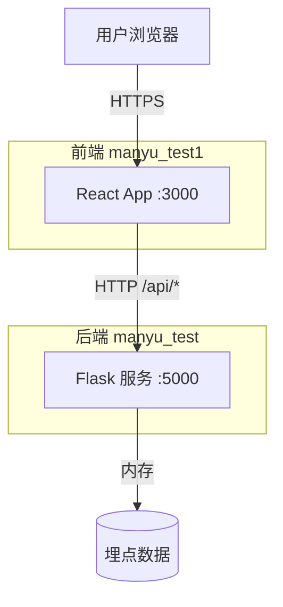

**集成关系说明：**

| 调用方 | 被调用方 | 协议 | 接口类型 | 说明 |
|--------|----------|------|----------|------|
| 用户浏览器 | 前端 React App | HTTP | 页面访问 | 访问 :3000 |
| 前端 React App | 后端 Flask 服务 | HTTP | REST API | Vite proxy 代理 /api/* 到 :5000 |
| 后端 API 路由 | 埋点中间件 | Python 调用 | 装饰器 | 记录调用信息 |
| 后端排序接口 | bubble_sort.py | Python 调用 | 函数调用 | 调用 bubble_sort_optimized |

### 部署架构

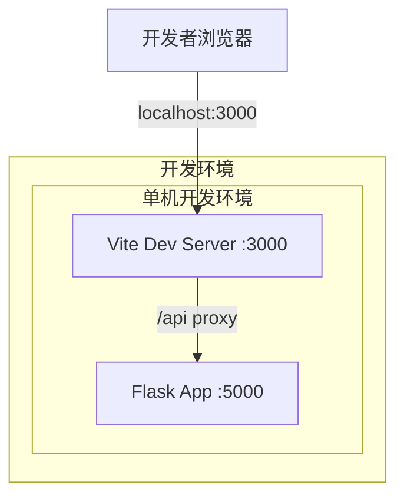

**部署说明：**
- 开发环境：单机部署，前端 Vite Dev Server 运行在 3000 端口，后端 Flask 运行在 5000 端口
- 前端通过 Vite proxy 代理 `/api` 请求到后端，避免跨域问题
- 生产环境暂不涉及（开发验证阶段）

## 3. 数据模型与存储

### 实体清单

| 实体名称 | 实体说明 | 所属模块 | 与其他实体的关系 |
|----------|----------|----------|-----------------|
| TrackingRecord | 接口调用追踪记录 | 埋点中间件模块 | 无（独立实体，非持久化） |
| StatsDimension | 统计维度聚合结果 | 报表统计模块 | 由 TrackingRecord 聚合产出 |

### 实体关系图

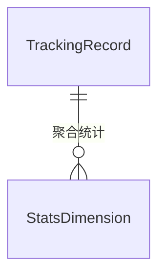

**模型说明：**
- TrackingRecord 是埋点中间件采集的原始调用记录，存储在内存列表 `_tracking_store` 中
- StatsDimension 是报表接口按维度聚合后的计算结果，非持久化，由查询时实时计算
- 本项目为纯内存数据模型，无需数据库表结构

### 存储说明

| 存储类型 | 用途 | 数据结构 | 生命周期 |
|----------|------|----------|----------|
| 内存列表 `_tracking_store` | 存储埋点追踪记录 | `List[Dict]` | 进程存活期间 |
| 无数据库 | 测试场景，无需持久化 | - | - |
| 无缓存/MQ | 不涉及 | - | - |

### 埋点数据记录结构

| 字段 | 类型 | 说明 |
|------|------|------|
| api | string | 请求路径 |
| method | string | HTTP 方法 |
| caller | string | 调用人（从 X-Caller Header 获取） |
| role | string | 人员类型（从 X-Role Header 获取） |
| level | string | 人员层级（从 X-Level Header 获取） |
| department | string | 人员部门（从 X-Department Header 获取） |
| timestamp | string | ISO 8601 时间戳 |
| ts_epoch | number | Unix 时间戳 |

### 报表数据聚合结构

| 字段 | 类型 | 说明 |
|------|------|------|
| dimension | string | 统计维度（role/level/department/caller） |
| data | Array<{name, value}> | 聚合结果，name 为维度值，value 为计数 |

## 4. 接口设计

### 4.1 oneapi（Web 控制台接口）

| 编号 | 接口名称 | 方法 | 路径 | 模块 |
|------|----------|------|------|------|
| W01 | HelloWorld 接口 | GET | /api/hello | API 路由模块 |
| W02 | 哈希算法接口 | POST | /api/hash | API 路由模块 |
| W03 | 冒泡排序接口 | POST | /api/bubble-sort | API 路由模块 |
| W04 | 导出接口 | GET | /api/export?page=hello\|hash\|sort&format=json\|csv | API 路由模块 |
| W05 | 报表统计接口 | GET | /api/stats?dimension=role\|level\|department\|caller | API 路由模块 |

### 4.2 OpenAPI（对外接口）
本项不适用，原因：当前项目为开发演示场景，无对外公开 API 需求。

### 4.3 内部接口（Service 层）

| 编号 | 接口名称 | 类/模块 | 方法签名 | 说明 |
|------|----------|---------|----------|------|
| S01 | 冒泡排序 | bubble_sort | bubble_sort_optimized(arr: List[T]) -> List[T] | 优化版冒泡排序 |
| S02 | 埋点追踪 | middleware/tracker | track_call(f) -> wrapper | 装饰器：记录调用信息 |
| S03 | 获取追踪数据 | middleware/tracker | get_tracking_store() -> List[Dict] | 获取埋点数据存储 |

### 4.4 集成接口（Integration 层）
本项不适用，原因：本项目不涉及外部系统集成。

## 5. 功能模块设计

### 5.1 埋点中间件模块

#### 5.1.1 表结构设计
本项不适用，原因：纯内存存储，无数据库表。

#### 5.1.2 接口详细设计

##### 内部接口 S02: track_call 装饰器

- **签名**: `track_call(f: Callable) -> Callable`
- **描述**: 装饰器，在目标函数执行前收集调用信息并记录到内存存储
- **出参（采集的数据结构）**:

| 参数名称 | 类型 | 来源 | 描述 |
|----------|------|------|------|
| api | string | request.path | 请求路径 |
| method | string | request.method | HTTP 方法 |
| caller | string | Header X-Caller | 调用人（默认 anonymous） |
| role | string | Header X-Role | 人员类型（默认 unknown） |
| level | string | Header X-Level | 人员层级（默认 unknown） |
| department | string | Header X-Department | 人员部门（默认 unknown） |
| timestamp | string | datetime.utcnow | ISO 8601 时间戳 |
| ts_epoch | float | time.time() | Unix 毫秒时间戳 |

##### 内部接口 S03: get_tracking_store

- **签名**: `get_tracking_store() -> List[Dict]`
- **描述**: 返回所有埋点追踪记录的引用
- **出参**: `List[Dict]` — 所有追踪记录列表

#### 5.1.3 子功能详细设计

##### 调用追踪流程

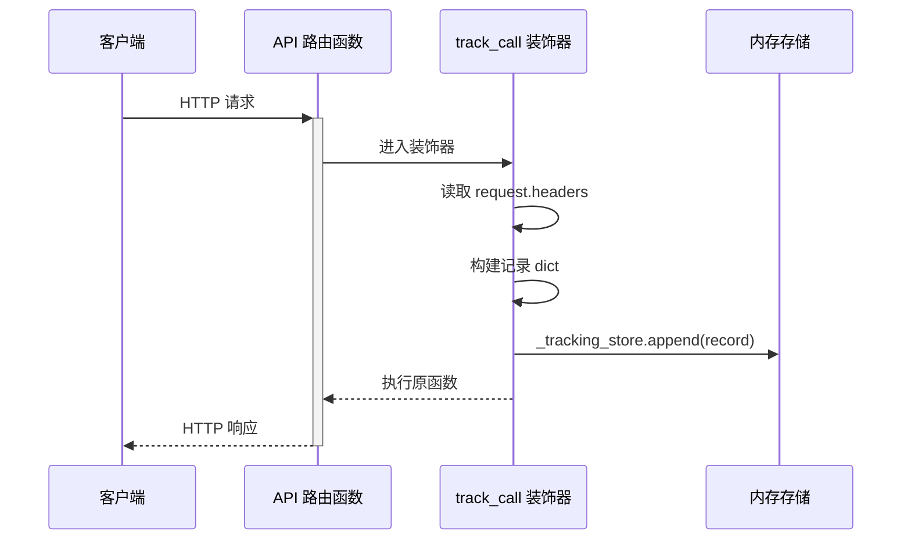

**业务规则：**

| 规则编号 | 规则描述 | 校验时机 | 不满足时的处理 |
|----------|----------|----------|--------------|
| R01 | 调用人信息缺失时使用默认值 "anonymous" | 每次请求 | 默认 anonymous |
| R02 | 维度信息缺失时使用默认值 "unknown" | 每次请求 | 默认 unknown |

**异常场景：**

| 异常场景 | 处理方式 |
|----------|----------|
| request.headers 读取异常 | 装饰器内部捕获异常，使用默认值，不阻塞原请求 |
| 内存存储溢出 | 测试场景数据量小，不考虑溢出 |

**并发控制：**
- 并发场景：多个请求同时写入 `_tracking_store`
- 控制策略：Python list.append 是线程安全的（GIL），单进程 Flask 开发模式下无并发风险

### 5.2 API 路由模块（HelloWorld / 哈希算法 / 冒泡排序）

#### 5.2.1 表结构设计
本项不适用，原因：无数据库表。

#### 5.2.2 接口详细设计

##### 接口 W01: HelloWorld 接口

- **URI**: GET /api/hello
- **描述**: 返回 Hello World 问候语和当前时间戳
- **入参**: 无
- **出参**:

| 参数名称 | 类型 | 描述 |
|----------|------|------|
| message | string | 问候语 "Hello World!" |
| timestamp | string | ISO 8601 格式时间戳 |

- **错误码**: 无（始终返回 200）
- **请求示例**:
```
GET /api/hello
```
- **响应示例**:
```json
{
  "message": "Hello World!",
  "timestamp": "2026-09-08T00:00:00Z"
}
```

##### 接口 W02: 哈希算法接口

- **URI**: POST /api/hash
- **描述**: 对输入文本进行 MD5 或 SHA256 哈希计算
- **入参**:

| 参数名称 | 类型 | 是否必填 | 描述 |
|----------|------|----------|------|
| text | string | 是 | 待哈希的文本 |
| algorithm | string | 否 | 算法类型：md5 / sha256，默认 md5 |

- **出参**:

| 参数名称 | 类型 | 描述 |
|----------|------|------|
| input | string | 原始输入文本 |
| algorithm | string | 使用的算法 |
| output | string | 哈希计算结果 |

- **错误码**:

| 错误码 | 说明 |
|--------|------|
| HASH_001 | 不支持的哈希算法 |

- **请求示例**:
```json
{
  "text": "hello",
  "algorithm": "md5"
}
```
- **响应示例**:
```json
{
  "input": "hello",
  "algorithm": "md5",
  "output": "5d41402abc4b2a76b9719d911017c592"
}
```

##### 接口 W03: 冒泡排序接口

- **URI**: POST /api/bubble-sort
- **描述**: 对输入数字数组进行冒泡排序（使用优化版算法）
- **入参**:

| 参数名称 | 类型 | 是否必填 | 描述 |
|----------|------|----------|------|
| array | number[] | 是 | 待排序的数字数组 |

- **出参**:

| 参数名称 | 类型 | 描述 |
|----------|------|------|
| original | number[] | 原始数组 |
| sorted | number[] | 排序后的数组 |
| length | number | 数组长度 |

- **错误码**:

| 错误码 | 说明 |
|--------|------|
| SORT_001 | 输入数组格式错误（非数组或元素非数字） |

- **请求示例**:
```json
{
  "array": [5, 3, 8, 4, 2]
}
```
- **响应示例**:
```json
{
  "original": [5, 3, 8, 4, 2],
  "sorted": [2, 3, 4, 5, 8],
  "length": 5
}
```

#### 5.2.3 子功能详细设计

##### HelloWorld 调用时序

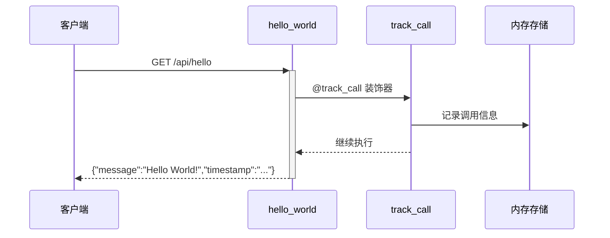

##### 哈希算法调用时序

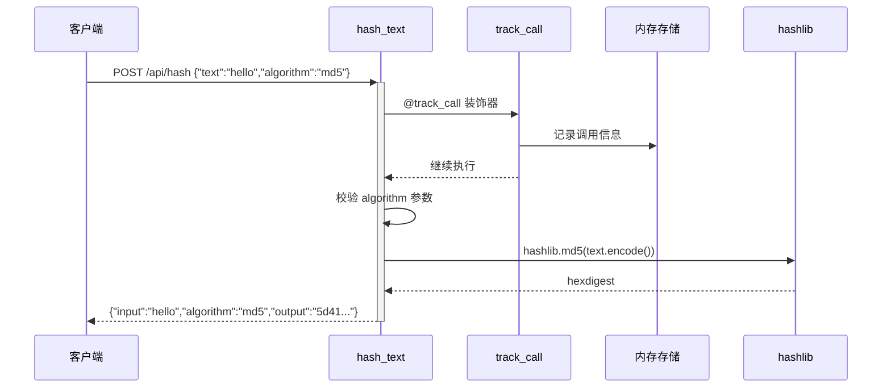

##### 冒泡排序调用时序

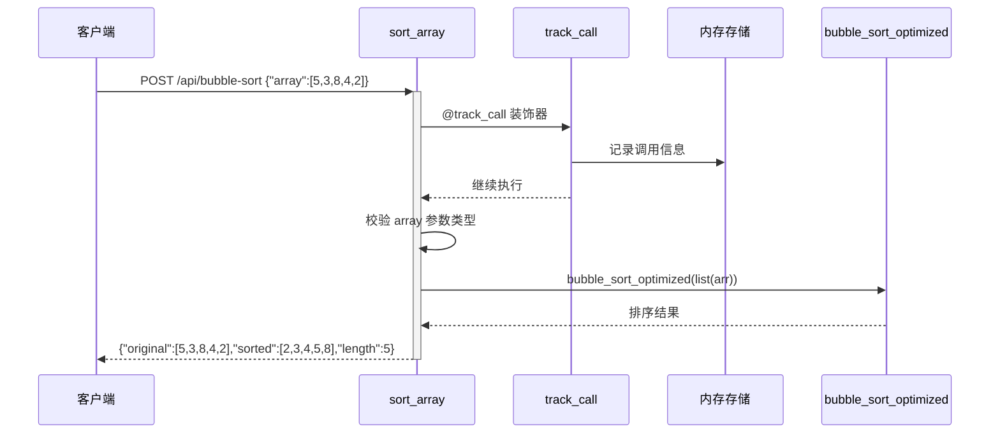

**业务规则：**

| 规则编号 | 规则描述 | 校验时机 | 不满足时的处理 |
|----------|----------|----------|--------------|
| R01 | algorithm 必须为 md5 或 sha256 | 哈希接口调用时 | 返回错误码 HASH_001 |
| R02 | array 必须为 List 类型 | 排序接口调用时 | 返回错误码 SORT_001 |
| R03 | array 元素必须为数字类型 | 排序接口调用时 | 返回错误码 SORT_001 |

**异常场景：**

| 异常场景 | 处理方式 |
|----------|----------|
| 请求体非合法 JSON | Flask 自动返回 400 Bad Request |
| 哈希算法参数为空 | 默认使用 md5 |
| 排序数组为空 | 返回空数组排序结果 [] |

**并发控制：**
- 并发场景：不涉及数据写入（仅读取已有 bubble_sort.py 纯函数）
- 控制策略：无并发风险，bubble_sort 为纯函数无副作用

### 5.3 导出接口模块

#### 5.3.1 表结构设计
本项不适用，原因：无数据库表，使用模拟数据。

#### 5.3.2 接口详细设计

##### 接口 W04: 导出接口

- **URI**: GET /api/export?page=hello|hash|sort&format=json|csv
- **描述**: 按页面导出演示数据，支持 JSON 和 CSV 两种格式
- **入参**:

| 参数名称 | 类型 | 是否必填 | 描述 |
|----------|------|----------|------|
| page | string | 是 | 页面类型：hello/hash/sort |
| format | string | 否 | 导出格式：json/csv，默认 json |

- **出参**（JSON 格式）: 根据 page 类型返回对应的数据
- **出参**（CSV 格式）: Content-Type: text/csv，Content-Disposition: attachment; filename={page}.csv

- **错误码**:

| 错误码 | 说明 |
|--------|------|
| EXPORT_001 | 未知的导出页面类型 |

- **请求示例**:
```
GET /api/export?page=hello&format=json
```
- **响应示例** (JSON):
```json
{
  "message": "Hello World!",
  "timestamp": "2026-09-08T00:00:00Z"
}
```

#### 5.3.3 子功能详细设计

**业务规则：**

| 规则编号 | 规则描述 | 校验时机 | 不满足时的处理 |
|----------|----------|----------|--------------|
| R01 | page 参数必须在 hello/hash/sort 范围内 | 每次请求 | 返回错误码 EXPORT_001 |
| R02 | CSV 格式对 dict 数据展平为 key-value 行 | 导出时 | 自动转换 |

**异常场景：**

| 异常场景 | 处理方式 |
|----------|----------|
| 不支持的 page 参数 | 返回 400 + 错误提示 |
| CSV 导出时数据格式异常 | 返回空 CSV 文件 |

**并发控制：** 本接口为只读导出，无并发风险

### 5.4 报表统计模块

#### 5.4.1 表结构设计
本项不适用，原因：无数据库表，从内存存储实时聚合。

#### 5.4.2 接口详细设计

##### 接口 W05: 报表统计接口

- **URI**: GET /api/stats?dimension=role|level|department|caller
- **描述**: 按指定维度统计接口调用次数
- **入参**:

| 参数名称 | 类型 | 是否必填 | 描述 |
|----------|------|----------|------|
| dimension | string | 否 | 统计维度：role/level/department/caller，默认 role |

- **出参**:

| 参数名称 | 类型 | 描述 |
|----------|------|------|
| dimension | string | 当前统计维度 |
| data | Array<{name: string, value: number}> | 聚合结果列表，按计数降序排列 |

- **请求示例**:
```
GET /api/stats?dimension=role
```
- **响应示例**:
```json
{
  "dimension": "role",
  "data": [
    {"name": "dev", "value": 5},
    {"name": "qa", "value": 3},
    {"name": "pm", "value": 2}
  ]
}
```

#### 5.4.3 子功能详细设计

**调用时序：**

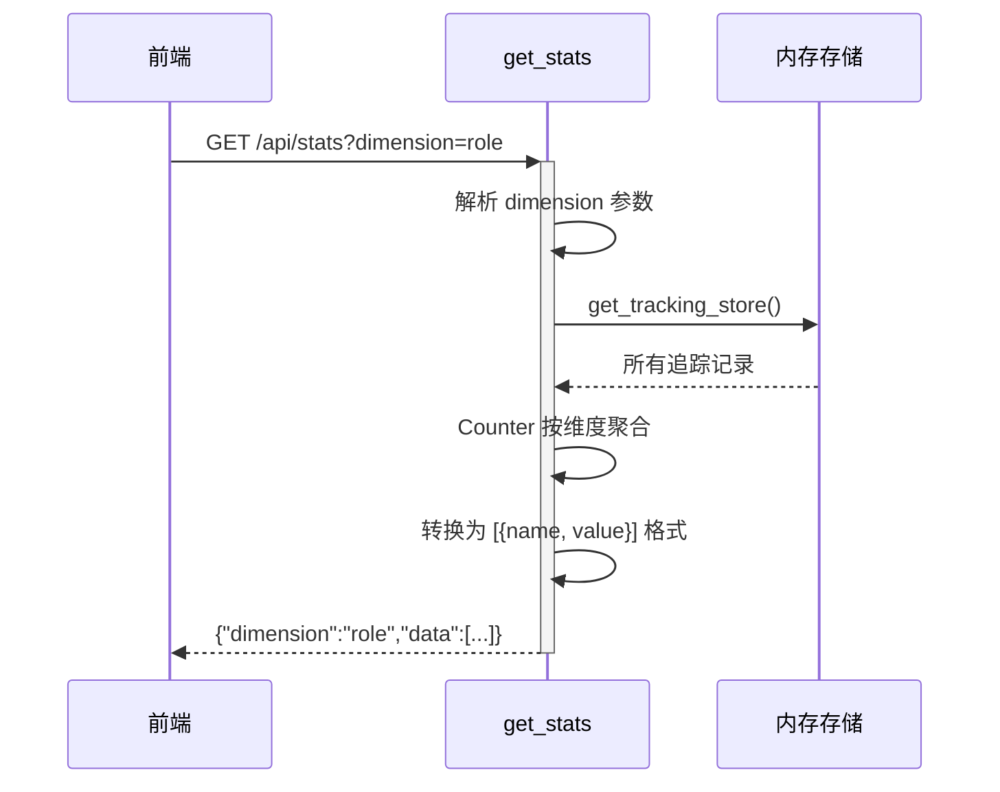

**业务规则：**

| 规则编号 | 规则描述 | 校验时机 | 不满足时的处理 |
|----------|----------|----------|--------------|
| R01 | dimension 映射到 tracking record 中的字段 | 每次查询 | 默认使用 role 维度 |
| R02 | 无数据时返回空列表 | 存储为空时 | 返回 {"dimension":"...", "data":[]} |

**异常场景：**

| 异常场景 | 处理方式 |
|----------|----------|
| 存储为空 | 返回空 data 数组 |
| 不支持的维度参数 | 默认回退到 role 维度 |

**并发控制：** 本接口为只读查询，无并发风险

### 5.5 前端模块

#### 5.5.1 表结构设计
本项不适用，原因：前端无数据库存储。

#### 5.5.2 接口详细设计

**ExportButton 组件**

| 参数 | 类型 | 必填 | 描述 |
|------|------|------|------|
| page | PageType ('hello'/'hash'/'sort') | 是 | 当前页面类型 |

**API 调用层**

| 函数 | 请求 | 响应类型 | 描述 |
|------|------|----------|------|
| fetchHello | GET /api/hello | HelloResponse | 获取 HelloWorld 数据 |
| fetchHash | POST /api/hash | HashResponse | 计算哈希 |
| fetchSort | POST /api/bubble-sort | SortResponse | 冒泡排序 |
| fetchExport | GET /api/export | Blob / JSON | 导出数据 |
| fetchStats | GET /api/stats | StatsResponse | 获取统计报表 |

**前端类型定义**

```typescript
interface HelloResponse { message: string; timestamp: string }
interface HashRequest { text: string; algorithm: 'md5' | 'sha256' }
interface HashResponse { input: string; algorithm: string; output: string }
interface SortRequest { array: number[] }
interface SortResponse { original: number[]; sorted: number[]; length: number }
interface StatsItem { name: string; value: number }
interface StatsResponse { dimension: string; data: StatsItem[] }
type PageType = 'hello' | 'hash' | 'sort'
type DimensionType = 'role' | 'level' | 'department' | 'caller'
```

#### 5.5.3 子功能详细设计

##### Tab 切换流程

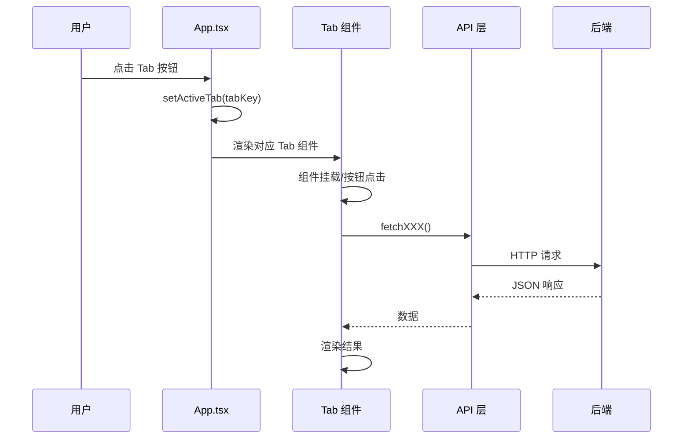

##### 导出流程

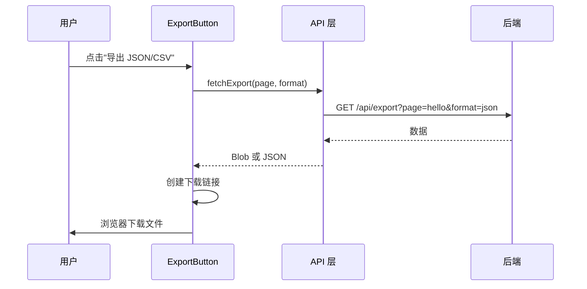

##### 报表可视化流程

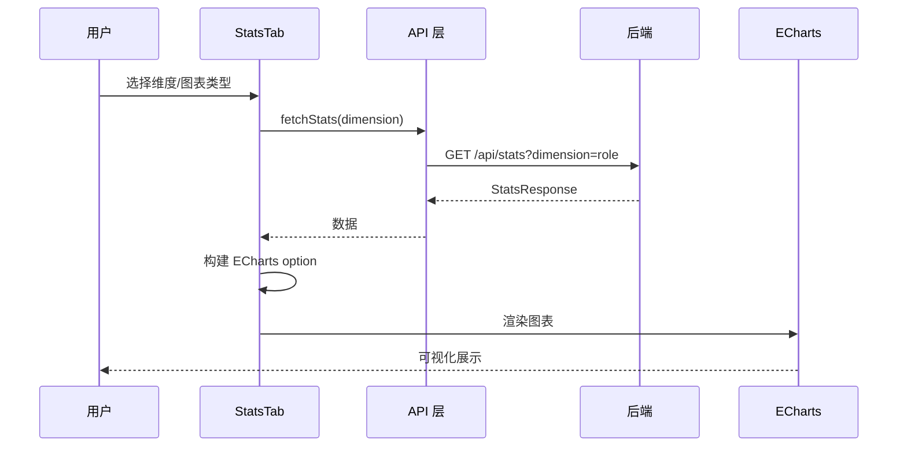

**业务规则：**

| 规则编号 | 规则描述 | 校验时机 | 不满足时的处理 |
|----------|----------|----------|--------------|
| R01 | API 请求失败时显示错误提示 | 每次请求 | 在 Tab 中展示红色错误信息 |
| R02 | 图表数据为空时显示提示 | 数据加载后 | 显示"暂无统计数据"提示 |
| R03 | 维度切换自动刷新报表 | 维度变更时 | 自动调用 fetchStats |
| R04 | 导出失败时弹出 alert | 导出请求后 | alert('导出失败') |

**异常场景：**

| 异常场景 | 处理方式 |
|----------|----------|
| 后端未启动 | 前端显示"请求失败"错误信息 |
| 网络超时 | Axios 10s 超时，显示错误 |
| 图表数据为空 | 显示"暂无统计数据"提示 |
| 导出文件下载失败 | alert 提示 |

**并发控制：** 不涉及数据写入，无需并发控制

**技术选型方案对比（ECharts 集成方式）：**

| 方案 | 优点 | 缺点 | 推荐 |
|------|------|------|------|
| echarts-for-react | 封装好，组件化使用，安装简单 | 版本更新可能滞后 | ✅ 推荐 |
| 原生 ECharts + useRef | 灵活可控 | 需手动管理生命周期和 resize | - |
| 自定义 Canvas 绘图 | 无依赖 | 开发量大，功能有限 | - |

**推荐方案：** echarts-for-react + echarts/core 按需导入
**理由：** 组件化集成，代码简洁，支持按需加载减小打包体积，echarts-for-react 自动处理图表 resize 和销毁

## 6. 非功能性需求设计

### 6.1 高可用性
本项不适用，原因：本项目为开发演示场景，单机运行，不涉及高可用架构。

### 6.2 可扩展性
- **水平扩展**：Flask 可通过 Gunicorn/WSGI 多 worker 扩展，前端 Vite 静态资源可部署到 CDN
- **垂直扩展**：单机资源充足时无需扩展
- **架构可扩展性**：新增接口只需在 `routes/` 下新增文件并注册到蓝图，无需修改核心框架

### 6.3 稳定性/可靠性
- 所有接口均有参数校验，异常输入返回明确错误信息
- 装饰器内部异常不会影响原请求处理（非侵入式设计）
- 前端 API 调用有 try-catch 兜底，错误信息展示给用户

### 6.4 安全性设计
本项不适用，原因：本项目为开发演示场景，不涉及用户认证、访问控制或敏感数据。

### 6.5 监控/统计/日志/告警
- **调用埋点**：已通过 `track_call` 装饰器实现完整的调用追踪（调用人、人员类型、层级、部门、时间戳）
- **前端可视化**：通过报表 Tab 页面以图表形式展示统计数据
- **日志输出**：Flask 开发模式默认输出访问日志到控制台
- **告警**：本开发场景不涉及告警配置

## 7. 变更三板斧

### 7.1 可监控
- **服务埋点**：已通过 `track_call` 装饰器对 HelloWorld、哈希算法、冒泡排序、导出接口实现调用追踪
- **监控指标**：接口调用次数（按维度聚合）、调用人分布、人员类型/层级/部门分布
- **可视化**：前端 StatsTab 通过 ECharts 折线图/饼图/柱状图展示
- **数据来源**：`middleware/tracker.py` 中的 `_tracking_store` 内存存储

### 7.2 可灰度
本项不适用，原因：本项目为开发演示场景，单用户本地验证，无需灰度发布。

### 7.3 可应急
- **回滚策略**：
  - 后端：保留 `bubble_sort.py` 原始代码不变，新增文件可通过 Git revert 恢复
  - 前端：所有新增文件，Git revert 即可恢复
- **兼容性**：
  - 所有新增接口均为全新开发，不修改已有接口，无兼容性问题
  - 不修改已有 `bubble_sort.py`，冒泡排序算法不受影响
- **开关控制**：本场景不涉及业务开关，无需设置